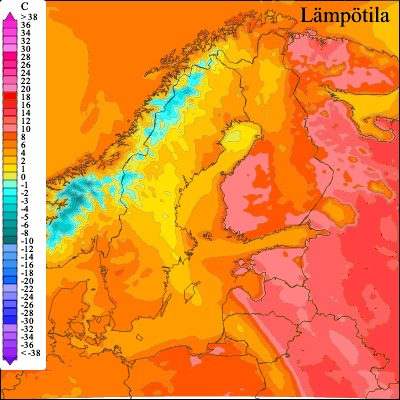
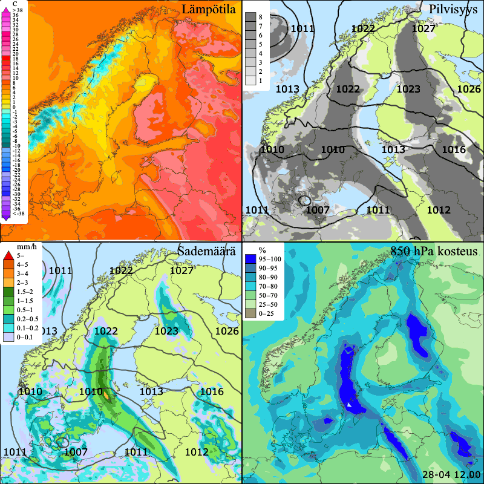
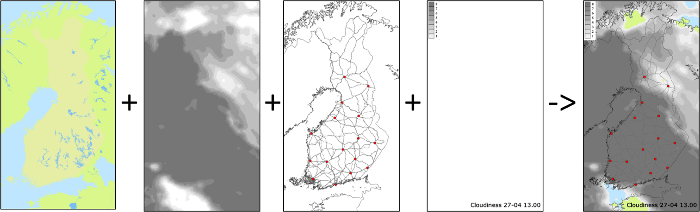
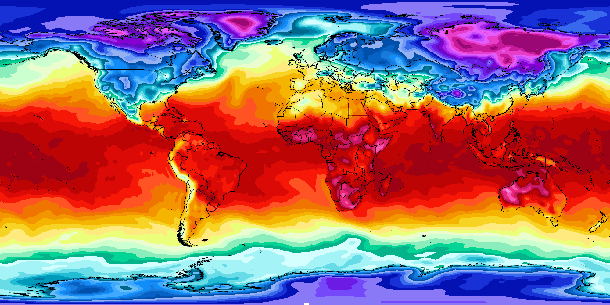
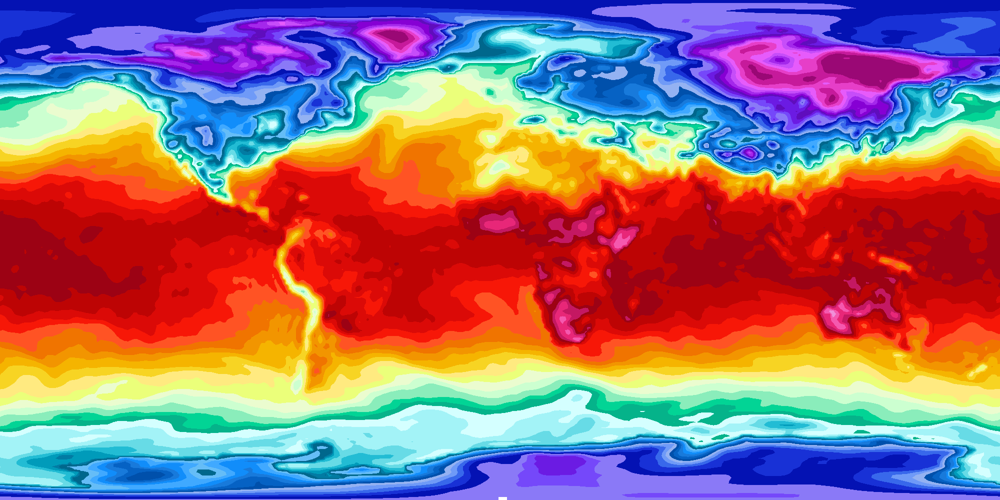

# SmartMet Server

[SmartMet Server](https://github.com/fmidev/smartmet-server) is a data and product server for MetOcean data. It
provides a high capacity and high availability data and product server
for MetOcean data. The server is written in C++, since 2008 it has
been in operational use by the Finnish Meteorological Institute FMI.

# Introduction
 
A Web Map Service (WMS) is a standard protocol developed by the <a
href="http://www.opengeospatial.org">Open Geospatial Consortium</a>
for serving georeferenced map images which a map server generates
using data from a Geographical Information System (GIS) database over
the Internet.


The WMS/Dali plugin offers a convenient way to fetch the
meteorological, climatological and geographical images over the Web
using the HTTP protocol. These images can be delivered in several
formats such as Scalable Vector Graphics(SVG), Portable Network
Graphics(PNG) and JPEG. As special cases GeoJSON and KML can be requested too, in which case all parts of the generated image apart from the actual geometries will be dropped from the response. The WMS/Dali plugin fetches the image data from the SmartMet Server engines such as QEngine, ObsEngine, GeoEngine, etc.

# WMS plugin 

The <a
href="http://docs.geoserver.org/stable/en/user/services/wms/">Web Map
Service (WMS)</a> specification defines an HTTP interface for
requesting georeferenced map images from WMS server(s).The usage of
the WMS interfaces is described in the <a
href="http://www.opengeospatial.org/standards/wms"> Web Map Server
specification</a>.  This plugin supports all proj.4 projections and
also supports time and other custom dimensions. The WMS pluginf
provides meteorologically specific visualizations such as wind barbs,
wind arrows, fronts, jets etc.  The user can also state some selection
criteria for the images based on thresholds. For example, draw
images where the temperature is between -2 and 2 degree Celsius. It
also provides the possibility to mask content based on other
parameters, for example, draw precipitation areas where wind gusts are
over 8 m/s.

# Dali plugin 

The Dali plugin implements the Web Map Server (WMS)
interface specified by the Open Geospatial Consortium. In addition, it
has own specific HTTP interface that enables more advanced requests
than the WMS interface.  Dali plugin has a richer but non-standard API
than WMS plugin.  It supports several views in one image, for example,
with Dali plugin, we can have several images of an area at different
times side by side. It supports all SVG effects. With Dali plugin it
is possible to specify a center location based on a location name, for
example, a user can request an image centered at Helsinki within a
radius of 200 kms.

In this document we concentrate on  describing the
usage of the Dali specific interface.

## Dali request

A typical Dali request contains the following parameters:

1.  Customer and product
2.  Data time 
3.  Response type (svg, png etc.) and response formatting parameters.

These parameters are delivered to the Dali plugin in the URL of the
HTTP request. For example, the following request fetches
forecasted temperature for northern Europe:

<pre><code>
http://data.fmi.fi/dali?customer=customerX&product=temperature&time=201605020900&type=png
</code></pre>




The request query starts with a “service location?” (here
http://data.fmi.fi/dali), and is followed by one or more parameters
given as name-value pairs separated by the ampersand (&)
character. The format of the parameters is similar to that of HTTP GET
request.

If the request processing fails for some reason then the Dali plugin
returns an HTTP error message such as “Bad Request”, “Wrong
parameters”, etc.  to the client.

## Customer and product


When requesting an image from the Dali plugin we are actually
requesting a product defined for a certain customer. The customer is
defined by the "customer" parameter in the HTTP request. Usually the
value of this parameter refers to a directory where the product
configuration files of the current customer are stored.

A product consists of one or multiple views which are merged into
single image. The figure below shows a product called
"scandinaviamosaic", which contains four different views (temperature,
cloudiness, rain amount, moisture).





A product can contain several views that are merged together into a single image / product. A view can contain several graphical layers that are merged together into a single view. The figure below shows how four different layers are merged into a  single view. 





The requested product is defined by the "product" parameter in the HTTP request. Usually the value of this parameter refers to a product file stored into the customer product directory.

# Product configuration

The [WMS and Dali reference](docs/reference.md) descibes how to
configure both products and the plugin itself.

# Tutorial



This tutorial explains how to generate various image products using SmartMet Server WMS plugin. The tutorial assumes that we have set up the following:

* A data producer configured and some data provided to  [SmartMet Server Querydata Engine]( https://github.com/fmidev/smartmet-engine-querydata/wiki/Smartmet-engine-querydata#configuration). One can verify data existence and necessary parameter information by using [SmartMet Server Admin Plugin](https://github.com/fmidev/smartmet-plugin-admin/wiki/Smartmet-plugin-admin). An example query could look like (assuming the server is running in localhost's port 8088):

`http://localhost:8088/admin?what=qengine&format=json`

```javascript
[
   {
      "MinTime": "1985-01-01 12:00:00",
      "Parameters" : "Temperature",
      "MaxTime" : "1985-01-02 12:00:00",
      "RI" : 30,
      "Projection" : "latlon:-180,-90,179,90",
      "Path" : "/smartmet/data/ecmwf_era15/2016-11-07T11:55:37_era15.sqd",
      "Aliases" : null,
      "OriginTime" : "1985-01-01 12:00:00",
      "Producer" : "ecmwf_era15"
   }
]
```
This tells us that we have data which
* Covers time interval between `1985-01-01 12:00:00` and `1985-01-02 12:00:00`
* Has latlon projection which covers almost the whole world (bottom left coordinates `-180,-90`,  top right coordinates `179,90`)
* Has one parameter, `Temperature`

This tutorial show how to configure the WMS plugin to visualize the given data.

## Plugin configuration

The WMS configuration root directory is defined in the plugin configuration. The WMS related parts are particularly
```
wms:
{
   url          = "/wms";
   root         = "/etc/smartmet/wms";

   versions     = "1.3.0";
   mapformats   = "image/svg+xml,image/png";
};
```
In `wms` block we define that SmartMet Server responds WMS queries at endpoint `/wms`. It also defines the root directory for WMS configuration at `/etc/smartmet/wms`. The directory structure is discussed at 

The WMS plugin uses extensive caching which is defined in `cache` block:
```
cache =
{
  memory_bytes            = 4294967296L; # 4 GB
  filesystem_bytes        = 2147483648L; # 2 GB
  directory               = "/var/smartmet/imagecache";
};
```

The example cache uses 4 GB of system memory and 2 GB of file cache at `/var/smartmet/imagecache`.

## Layer configuration and directory structure

The layer configuration uses JSON and CSS to define the appearance and properties of the layer. See the [full reference manual](https://github.com/fmidev/smartmet-plugin-wms/wiki/Smartmet-plugin-WMS-(Dali-&-WMS)) for all supported configuration options.

The example configuration directory tree is arranged as follows. The root directory is the same which was defined in the plugin configuration earlier, i.e. `/etc/smartmet/wms`.

```
.
└── customers
    └── ecmwf
        ├── layers
        │   └── era15
        │       └── temperature
        │           └── isobands
        │               ├── Temperature.css
        │               └── Temperature.json
        ├── markers
        ├── patterns
        ├── products
        │   └── era15
        │       └── temperature.json
        └── symbols
```

A very simple example layer configuration (`customers/ecmwf/products/era15/temperature.json`) is:
```javascript
{
    "title" : "Temperature",
    "abstract" : "Temperature from ECMWF ERA-15",
    "projection": {},
    "producer": "ecmwf_era15",
    "views": [{
        "layers": [{
            "qid": "l",
            "layer_type": "isoband",
            "isobands": "json:era15/temperature/isobands/Temperature.json",
            "css": "era15/temperature/isobands/Temperature.css",
            "parameter": "Temperature",
            "attributes": {
                "shape-rendering": "crispEdges"
            }
        }]
    }]
}
```

To keep the example straightforward, we are using only one view and layer which are defined in the product JSON in the `views->layers` section. Refer to [the manual](https://github.com/fmidev/smartmet-plugin-wms/wiki/Smartmet-plugin-WMS-(Dali-&-WMS)#views) to see all options for views. In our example we are using [isoband layer](https://github.com/fmidev/smartmet-plugin-wms/wiki/Smartmet-plugin-WMS-(Dali-&-WMS)#isobandlayer) to draw temperature contours from the data.

The temperature contour limits are defined in the JSON file defined by `isobands` keyword in the configuration file. Note that all paths in the layer configuration are relative to `customers/ecmwf/layers`. The contour limits are in the form

```javascript
[
    {
        "attributes": {
            "class": "Temperature_-50"
        },
        "hilimit": -50,
        "qid": "Temperature_-50"
    },
    {
        "attributes": {
            "class": "Temperature_-50_-48"
        },
        "hilimit": -48,
        "lolimit": -50,
        "qid": "Temperature_-50_-48"
    },
    ...
```
and the corresponding CSS file looks like
```css
.Temperature_-50	{ stroke: none; fill: rgba(154,8,117,1.00); }
.Temperature_-50_-48	{ stroke: none; fill: rgba(198,26,155,1.00); }
...
```
When the temperature values are contoured by the server, the temperature isoband which values are between `hilimit` and `lolimit` are assigned the matching CSS class. The CSS file is then used to for example fill the isoband in question by a certain color.

One can always use WMS plugin's *GetCapabilities* request to check which layers are available. The URL for the *GetCapabilities* request is `/wms?SERVICE=WMS&VERSION=1.3.0&REQUEST=GetCapabilities`. Our example temperature layer in the resulting XML contains the following information:
```xml
 <Layer queryable="0" opaque="1">
   <Name>ecmwf:era15:temperature</Name>
   <Title>Temperature</Title>
   <Abstract>Temperature from ECMWF ERA-15 model</Abstract>
   <CRS>EPSG:2393</CRS>
   <CRS>EPSG:3035</CRS>
   <CRS>EPSG:3047</CRS>
   <CRS>EPSG:3067</CRS>
   <CRS>EPSG:3857</CRS>
   <CRS>EPSG:4258</CRS>
   <CRS>EPSG:4326</CRS>
   <EX_GeographicBoundingBox>
	<westBoundLongitude>-180</westBoundLongitude>
	<eastBoundLongitude>179</eastBoundLongitude>
	<southBoundLatitude>-90</southBoundLatitude>
	<northBoundLatitude>90</northBoundLatitude>
   </EX_GeographicBoundingBox>
   <BoundingBox CRS="EPSG:4326" minx="-90" miny="-180" maxx="90" maxy="179" />
   <BoundingBox CRS="EPSG:2393" minx="3064557.214841" miny="6651895.287250" maxx="3674549.990250" maxy="7785726.697176" />
   <BoundingBox CRS="EPSG:3035" minx="1896628.617934" miny="1507846.054415" maxx="4656644.569976" maxy="6827128.019856" />
   <BoundingBox CRS="EPSG:3047" minx="330890.119264" miny="6615141.393455" maxx="534936.546571" maxy="9330120.055635" />
   <BoundingBox CRS="EPSG:3067" minx="43547.789322" miny="6549298.622001" maxx="674306.988933" maxy="7782478.683829" />
   <BoundingBox CRS="EPSG:3857" minx="-20037508.342789" miny="-20048966.104015" maxx="19926188.851996" maxy="20048966.104015" />
   <BoundingBox CRS="EPSG:4258" minx="-90.000000" miny="-180.000000" maxx="90.000000" maxy="179.000000" />
   <Dimension name="time" units="ISO8601"  multipleValues="0"  nearestValue="0"  current="1">1987-01-01T12:00:00Z/1987-01-02T12:00:00Z/PT24H</Dimension>
 </Layer>
```

By comparing the directory tree, the configuration file and the resulting `Layer` element in the GetCapabilities response, we can see that the configuration defines
* The `name` of the layer
* The `title` of the layer
* The `abstract` of the layer

On the other hand, the projection and time dimension information are parsed from the data by the server.

Finally we can make the actual WMS request to the server:

`/wms?&SERVICE=WMS&REQUEST=GetMap&VERSION=1.3.0&LAYERS=ecmwf:era15:temperature&STYLES=&FORMAT=image/png&TRANSPARENT=true&HEIGHT=1000&WIDTH=2000&TIME=1987-01-01T12:00:00Z&CRS=EPSG:4326&BBOX=-90,-180,90,179`

We are using WMS request *GetMap* for the layer `ecmwf:era15:temperature` which we just defined. We want to get the output as PNG image and we use bounding box for the whole data. We also must request a time which is valid in the data and define the image's pixel dimensions. The result is illustrated below.



## Map layers

WMS plugin is able to use shapefiles stored in a PostGIS database to draw for example country borders over an isoband layer. For database layers usage we need to have
* The PostGIS database which has the shape information.
* The database configured to the server's gis engine.

The layer configuration file looks like this when added the map layer configuration:
```javascript
{
   "title" : "Temperature",
   "abstract" : "Temperature from ECMWF ERA-15 model",
   "producer" : "ecmwf_era15",
   "views" : [
      {
         "layers" : [
            {
               "isobands" : "json:era15/temperature/isobands/Temperature.json",
               "css" : "era15/temperature/isobands/Temperature.css",
               "attributes" : {
                  "shape-rendering" : "crispEdges"
               },
               "parameter" : 167,
               "layer_type" : "isoband",
               "qid" : "l"
            },
            {
               "layer_type" : "map",
               "attributes" : {
                  "stroke" : "black",
                  "fill" : "none"
               },
               "qid" : "borders",
               "map" : {
                  "schema" : "natural_earth",
                  "table" : "admin_0_countries",
                  "lines" : true
               }
            }
         ]
      }
   ],
   "projection" : {}
}

```

The added map layer 
```javascript
            {
               "layer_type" : "map",
               "attributes" : {
                  "stroke" : "black",
                  "fill" : "none"
               },
               "qid" : "borders",
               "map" : {
                  "schema" : "natural_earth",
                  "table" : "admin_0_countries",
                  "lines" : true
               }
            }
```
is using `natural_earth` schema from gis engine's gis database. The country lines are drawn from the data in table `admin_0_countries`. The resulting image looks like

