# Dali Test Examples

The Dali tests exercise the `/dali` endpoint directly, bypassing the WMS/WMTS layers.  Test inputs are `.get` files in [`test/input/`](../../test/input/) and expected outputs in [`test/output/`](../../test/output/).  Product JSON configurations are under [`test/dali/customers/`](../../test/dali/customers/).

Each request URL is decomposed into a table showing every query parameter and its effect.  Layer-specific URL overrides follow the pattern `l.{qid}.{setting}` and view overrides follow `v{n}.{setting}`.

## Contents

- [Output Formats](#output-formats)
- [Isoband and Isoline](#isoband-and-isoline)
- [Pressure smoothing comparison](#pressure-smoothing-comparison)
- [TFP — Thermal-Front Parameter diagnostics](#tfp--thermal-front-parameter-diagnostics)
- [Isoband Labels](#isoband-labels)
- [Isolabel examples](#isolabel-examples)
- [Location Label Placement](#location-label-placement)
- [SVG Customisation](#svg-customisation)
- [Clipping to Geographic Boundaries](#clipping-to-geographic-boundaries)
- [Pressure Level and Elevation Selection](#pressure-level-and-elevation-selection)
- [Multiple Views and Side-by-Side Products](#multiple-views-and-side-by-side-products)
- [Time Layer and Timezone](#time-layer-and-timezone)
- [Observation Numbers](#observation-numbers)
- [Observation Positions and Keyword Selection](#observation-positions-and-keyword-selection)
- [Weather Symbols](#weather-symbols)
- [Flash and Lightning Symbols](#flash-and-lightning-symbols)
- [Wind Arrows](#wind-arrows)
- [Wind Barbs and Wind Roses](#wind-barbs-and-wind-roses)
- [WAFS Aviation Charts](#wafs-aviation-charts)
- [Observations with Wind and Temperature](#observations-with-wind-and-temperature)
- [Heatmap](#heatmap)
- [Hovmoeller Diagrams](#hovmoeller-diagrams)
- [Graticule](#graticule)
- [Circles Layer](#circles-layer)
- [Fronts](#fronts)
- [PostGIS Layer](#postgis-layer)
- [WKT Layer](#wkt-layer)
- [METAR Layer](#metar-layer)
- [Fire Weather](#fire-weather)
- [Text Layer](#text-layer)
- [Map simplification](#map-simplification)
- [World Map Products](#world-map-products)

---

## Output Formats

Dali can produce SVG (default), PNG, PDF, GeoJSON, KML, GeoTIFF, MVT, and DataTile from the same product definition.

### t2m_p — SVG (default)

**Input:** [`test/input/t2m_p.get`](../../test/input/t2m_p.get)

```
GET /dali?customer=test&product=t2m_p&time=200808050300 HTTP/1.0
```

| Parameter | Value | Description |
|-----------|-------|-------------|
| `customer` | `test` | Customer directory |
| `product` | `t2m_p` | Product JSON: [`test/dali/customers/test/products/t2m_p.json`](../../test/dali/customers/test/products/t2m_p.json) |
| `time` | `200808050300` | Valid time: 2008-08-05 03:00 UTC |

Renders Scandinavian temperature isobands and isolines from the `kap` producer in the data's native CRS (500×500 px).  The product uses a `defs` block to define SVG symbols and CSS styles.  Output is SVG (default when no `type` is specified).

**Output:**


---

### png — PNG output

**Input:** [`test/input/png.get`](../../test/input/png.get)

```
GET /dali?customer=test&product=t2m_p&type=png&time=200808050300 HTTP/1.0
```

| Parameter | Value | Description |
|-----------|-------|-------------|
| `customer` | `test` | Customer directory |
| `product` | `t2m_p` | Same product as above |
| `type` | `png` | Forces 8-bit palette PNG raster output |
| `time` | `200808050300` | Valid time: 2008-08-05 03:00 UTC |

Any product can be rasterised to PNG by supplying `type=png`.  Output is 500×500 px, 8-bit colour-mapped PNG (default ≤256 colours).

**Output:**

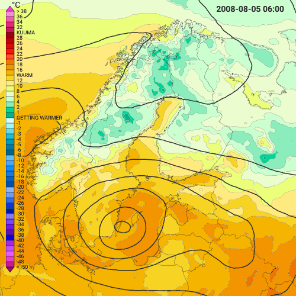

---

### png_truecolor — 24-bit PNG

**Input:** [`test/input/png_truecolor.get`](../../test/input/png_truecolor.get)

```
GET /dali?customer=test&product=t2m_p&type=png&time=200808050300&png.truecolor=1 HTTP/1.0
```

| Parameter | Value | Description |
|-----------|-------|-------------|
| `type` | `png` | PNG output |
| `png.truecolor` | `1` | Forces 24-bit true-colour PNG instead of palette |

**Output:**


---

### png_maxcolors_20 — Limited palette PNG

**Input:** [`test/input/png_maxcolors_20.get`](../../test/input/png_maxcolors_20.get)

```
GET /dali?customer=test&product=t2m_p&type=png&time=200808050300&png.maxcolors=20 HTTP/1.0
```

| Parameter | Value | Description |
|-----------|-------|-------------|
| `type` | `png` | PNG output |
| `png.maxcolors` | `20` | Caps the palette at 20 colours; reduces file size but introduces posterisation |

**Output:**


---

### pdf — PDF output

**Input:** [`test/input/pdf.get`](../../test/input/pdf.get)

```
GET /dali?customer=test&product=t2m_p&time=200808050300&type=pdf HTTP/1.0
```

| Parameter | Value | Description |
|-----------|-------|-------------|
| `type` | `pdf` | Produces a vector PDF document |

Output is a scalable PDF (no rasterisation).

---

### t2m_p_geojson — GeoJSON output

**Input:** [`test/input/t2m_p_geojson.get`](../../test/input/t2m_p_geojson.get)

```
GET /dali?customer=test&product=t2m_p&time=200808050300&type=geojson HTTP/1.0
```

| Parameter | Value | Description |
|-----------|-------|-------------|
| `type` | `geojson` | Exports isoband/isoline geometries as GeoJSON |

Polygon and line features are reprojected to WGS84 (EPSG:4326) in the output.

---

### t2m_p_kml — KML output

**Input:** [`test/input/t2m_p_kml.get`](../../test/input/t2m_p_kml.get)

```
GET /dali?customer=test&product=t2m_p&time=200808050300&type=kml HTTP/1.0
```

| Parameter | Value | Description |
|-----------|-------|-------------|
| `type` | `kml` | Exports isoband/isoline geometries as KML (Google Earth) |

Note: listed in `.testignore` — output precision can vary between RHEL 7 and RHEL 8 environments.

---

### datatile_temperature — DataTile: single-band temperature

**Input:** [`test/input/datatile_temperature.get`](../../test/input/datatile_temperature.get)

```
GET /dali?customer=grid&type=datatile&product=datatile_temperature&time=200808050800 HTTP/1.0
```

| Parameter | Value | Description |
|-----------|-------|-------------|
| `customer` | `grid` | Grid data customer directory |
| `type` | `datatile` | RGBA-encoded float data PNG (bypasses SVG pipeline) |
| `product` | `datatile_temperature` | Product JSON: [`test/dali/customers/grid/products/datatile_temperature.json`](../../test/dali/customers/grid/products/datatile_temperature.json) |
| `time` | `200808050800` | Valid time: 2008-08-05 08:00 UTC |

Returns a 64x64 PNG tile where each pixel encodes a temperature value (parameter `T-K`) as a 16-bit quantised value in the R and G channels.  The A channel is 255 for valid pixels, 0 for missing data.  Scale and offset metadata are embedded in PNG `tEXt` chunks (`datatile:min`, `datatile:max`).

**Output:** [`test/output/datatile_temperature.get`](../../test/output/datatile_temperature.get) — PNG (binary, not a visual image)

---

### datatile_wind — DataTile: dual-band wind direction + speed

**Input:** [`test/input/datatile_wind.get`](../../test/input/datatile_wind.get)

```
GET /dali?customer=grid&type=datatile&product=datatile_wind&time=200808050800 HTTP/1.0
```

| Parameter | Value | Description |
|-----------|-------|-------------|
| `customer` | `grid` | Grid data customer directory |
| `type` | `datatile` | RGBA-encoded float data PNG |
| `product` | `datatile_wind` | Product JSON: [`test/dali/customers/grid/products/datatile_wind.json`](../../test/dali/customers/grid/products/datatile_wind.json) |
| `time` | `200808050800` | Valid time: 2008-08-05 08:00 UTC |

Returns a 64x64 PNG tile with two bands encoded in the RGBA channels: wind direction (DD-D) in R+G and wind speed (FF-MS) in B+A.  This is the dual-band encoding where valid values occupy [1, 65535] and 0 indicates missing data.  Metadata chunks include `datatile:min1/max1` (direction) and `datatile:min2/max2` (speed).

**Output:** [`test/output/datatile_wind.get`](../../test/output/datatile_wind.get) — PNG (binary)

---

### datatile_precipitation — DataTile: single-band precipitation (RasterLayer)

**Input:** [`test/input/datatile_precipitation.get`](../../test/input/datatile_precipitation.get)

```
GET /dali?customer=grid&type=datatile&product=datatile_precipitation&time=200808050800 HTTP/1.0
```

| Parameter | Value | Description |
|-----------|-------|-------------|
| `customer` | `grid` | Grid data customer directory |
| `type` | `datatile` | RGBA-encoded float data PNG |
| `product` | `datatile_precipitation` | Product JSON: [`test/dali/customers/grid/products/datatile_precipitation.json`](../../test/dali/customers/grid/products/datatile_precipitation.json) |
| `time` | `200808050800` | Valid time: 2008-08-05 08:00 UTC |

Returns a 64x64 PNG tile with 1-hour precipitation (PRECIP1H-KGM2) encoded as a single-band datatile via the `raster` layer type.

**Output:** [`test/output/datatile_precipitation.get`](../../test/output/datatile_precipitation.get) — PNG (binary)

---

### autoclass — Automatic CSS class names

**Input:** [`test/input/autoclass.get`](../../test/input/autoclass.get)

```
GET /dali?customer=test&product=autoclass&time=200808050300&type=svg HTTP/1.0
```

| Parameter | Value | Description |
|-----------|-------|-------------|
| `product` | `autoclass` | Product JSON: [`test/dali/customers/test/products/autoclass.json`](../../test/dali/customers/test/products/autoclass.json) |
| `type` | `svg` | Forces SVG output |

The `autoclass` feature generates CSS class names automatically from isoband/isoline limit values using a template such as `"Temperature_{}_{}"`; the lower and upper limits substitute the placeholders (using `None` for open-ended bands).  This eliminates the need to assign class names manually in every isoband specification.

**Output:**

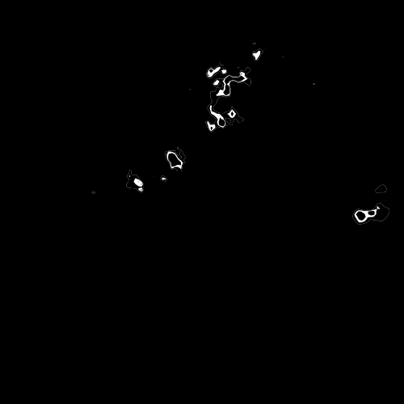

---

### autoqid — Automatic query IDs

**Input:** [`test/input/autoqid.get`](../../test/input/autoqid.get)

```
GET /dali?customer=test&product=autoqid&time=200808050300&format=svg HTTP/1.0
```

| Parameter | Value | Description |
|-----------|-------|-------------|
| `product` | `autoqid` | Product JSON: [`test/dali/customers/test/products/autoqid.json`](../../test/dali/customers/test/products/autoqid.json) |
| `format` | `svg` | Alternative to `type=svg` for specifying SVG output |

The `autoqid` feature auto-generates `qid` values for each isoband/isoline from the band limits using a template such as `"temperature_{}_{}"`; the resulting `qid` can then be referenced in URL parameter overrides.  Unlike `autoclass` (which generates CSS class names), `autoqid` generates the query IDs used for URL-based overrides.

**Output:**


---

### disable_svg — Conditionally disabled layer

**Input:** [`test/input/disable_svg.get`](../../test/input/disable_svg.get)

```
GET /dali?customer=test&product=disable_svg&time=200808050300 HTTP/1.0
```

| Parameter | Value | Description |
|-----------|-------|-------------|
| `product` | `disable_svg` | Product JSON: [`test/dali/customers/test/products/disable_svg.json`](../../test/dali/customers/test/products/disable_svg.json) |

A layer carrying `"disable": "svg"` is skipped entirely when rendering to SVG but rendered for PNG/PDF.  Useful for layers (e.g. pressure isolines) that are visually acceptable as vector but are too slow or heavy in SVG.

**Output:**

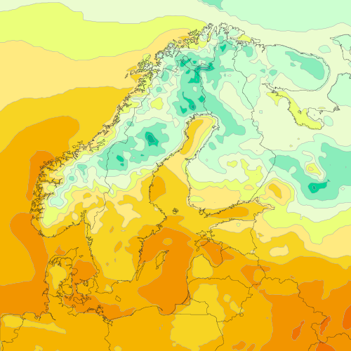

---

### enable_png — Conditionally enabled layer

**Input:** [`test/input/enable_png.get`](../../test/input/enable_png.get)

```
GET /dali?customer=test&product=enable_png&time=200808050300 HTTP/1.0
```

| Parameter | Value | Description |
|-----------|-------|-------------|
| `product` | `enable_png` | Product JSON: [`test/dali/customers/test/products/enable_png.json`](../../test/dali/customers/test/products/enable_png.json) |

A layer carrying `"enable": ["png","pdf"]` is rendered only for those output formats and suppressed for SVG.  The product adds pressure isolines only for raster/PDF output.

**Output:**


---

## Isoband and Isoline

### feelslike — FeelsLike parameter

**Input:** [`test/input/feelslike.get`](../../test/input/feelslike.get)

```
GET /dali?customer=test&product=feelslike&time=200808050300 HTTP/1.0
```

| Parameter | Value | Description |
|-----------|-------|-------------|
| `product` | `feelslike` | Product JSON: [`test/dali/customers/test/products/feelslike.json`](../../test/dali/customers/test/products/feelslike.json) |

Renders isobands and isolines of the `FeelsLike` apparent-temperature parameter from the `pal_skandinavia` producer, using the same colour scale as regular temperature.

**Output:**

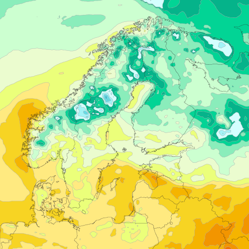

---

### precipitation — Precipitation isobands

**Input:** [`test/input/precipitation.get`](../../test/input/precipitation.get)

```
GET /dali?customer=test&product=precipitation&time=200808050300 HTTP/1.0
```

| Parameter | Value | Description |
|-----------|-------|-------------|
| `product` | `precipitation` | Product JSON: [`test/dali/customers/test/products/precipitation.json`](../../test/dali/customers/test/products/precipitation.json) |

Renders precipitation isobands and isolines from `pal_skandinavia` in the data's native CRS.

**Output:**


---

### precipitation_warm — Precipitation warm season

**Input:** [`test/input/precipitation_warm.get`](../../test/input/precipitation_warm.get)

```
GET /dali?customer=test&product=precipitation_warm&time=200808050300 HTTP/1.0
```

| Parameter | Value | Description |
|-----------|-------|-------------|
| `product` | `precipitation_warm` | Product JSON: [`test/dali/customers/test/products/precipitation_warm.json`](../../test/dali/customers/test/products/precipitation_warm.json) |

Uses a warm-season precipitation colour scale with finer class resolution in the low-intensity range.

**Output:**

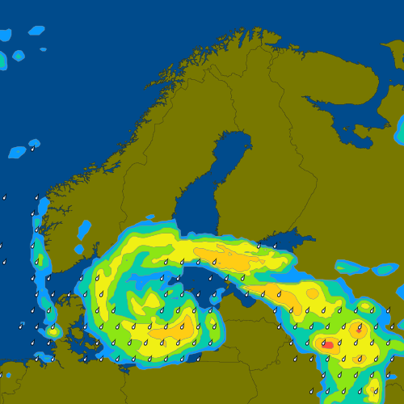

---

### precipitation_minarea — Suppress small polygons (geographic area)

**Input:** [`test/input/precipitation_minarea.get`](../../test/input/precipitation_minarea.get)

```
GET /dali?customer=test&product=precipitation&time=200808050300&l1.minarea=5000&l2.minarea=5000 HTTP/1.0
```

| Parameter | Value | Description |
|-----------|-------|-------------|
| `l1.minarea` | `5000` | Drops isoband polygons smaller than 5000 m² for layer `l1` |
| `l2.minarea` | `5000` | Same for layer `l2` |

The `minarea` setting removes noise from scattered small polygons.  The default unit is m².

**Output:**

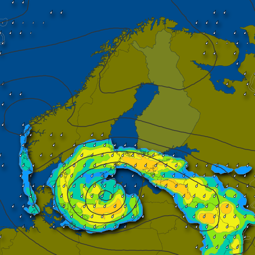

---

### precipitation_minarea_px — Suppress small polygons (pixel area)

**Input:** [`test/input/precipitation_minarea_px.get`](../../test/input/precipitation_minarea_px.get)

```
GET /dali?customer=test&product=precipitation&time=200808050300&l1.minarea=1000&l2.minarea=1000&l1.areaunit=px^2&l2.areaunit=px^2 HTTP/1.0
```

| Parameter | Value | Description |
|-----------|-------|-------------|
| `l1.minarea` | `1000` | Minimum polygon area threshold for layer `l1` |
| `l1.areaunit` | `px^2` | Interprets the area threshold in pixels² (screen-space) instead of m² |

Using `areaunit=px^2` makes the filter resolution-independent: useful when the product may be rendered at different map scales.

**Output:**

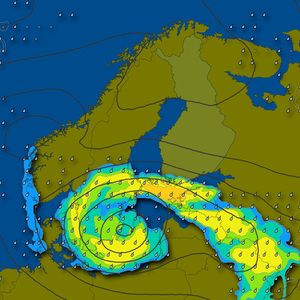

---

### radar — Radar precipitation

**Input:** [`test/input/radar.get`](../../test/input/radar.get)

```
GET /dali?customer=test&product=radar&time=20130910T1000 HTTP/1.0
```

| Parameter | Value | Description |
|-----------|-------|-------------|
| `product` | `radar` | Product JSON: [`test/dali/customers/test/products/radar.json`](../../test/dali/customers/test/products/radar.json) |
| `time` | `20130910T1000` | Valid time: 2013-09-10 10:00 UTC |

Renders radar-derived precipitation rate (`PrecipitationRate`) from the `tutka_suomi_rr` producer with a blue sea background and country-fill.  Demonstrates isoband rendering on a 500×800 px product in the data's native CRS.

**Output:**

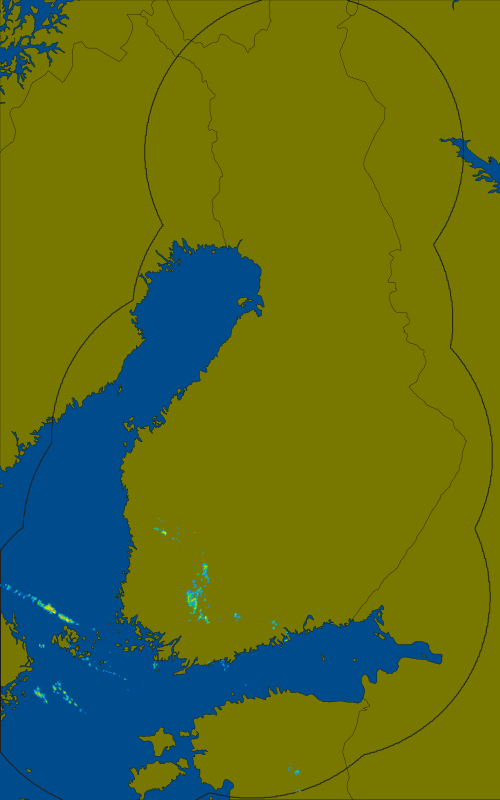

---

### radar_subdivide — Bilinear cell subdivision comparison (K = 0, 2, 4, 8)

**Input:** [`test/input/radar_subdivide.get`](../../test/input/radar_subdivide.get)

```
GET /dali?customer=test&product=radar_subdivide&time=20130910T1000 HTTP/1.0
```

| Parameter | Value | Description |
|-----------|-------|-------------|
| `product` | `radar_subdivide` | Product JSON: [`test/dali/customers/test/products/radar_subdivide.json`](../../test/dali/customers/test/products/radar_subdivide.json) |
| `time` | `20130910T1000` | Valid time: 2013-09-10 10:00 UTC |

Four-panel comparison over the SW Finland / Åland archipelago zoom at the same radar timestamp, each panel using a different value of the isoband layer's `subdivide` key. The top-left panel (`K = 0`) is the classic linear marching-squares output — note the sharp diamond-shaped lone-pixel polygons. With increasing `K` every interior level-curve segment is split into `K` shorter chords on the true bilinear level curve between the cell-edge intersections, turning the diamonds into progressively rounded four-lobed blobs. The cell-edge intersections themselves are identical across all four panels, which is what lets adjacent cells keep stitching together cleanly regardless of the `K` value. `K = 8` is close to the analytical bilinear shape; `K = 10` is the hard cap and produces only a sub-1 % further change.

See the [`subdivide` row in the isoband layer reference](../reference.md) and the [Bilinear cell subdivision section of the trax docs](https://github.com/fmidev/smartmet-library-trax/blob/master/docs/trax.md#bilinear-cell-subdivision) for the underlying math and limitations.

**Output:**

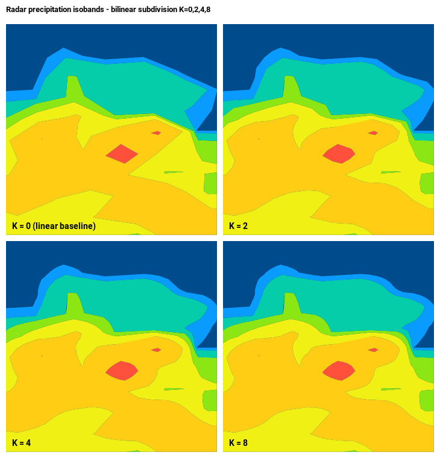

---

### tmax_smooth — Smoothed maximum temperature

**Input:** [`test/input/tmax_smooth.get`](../../test/input/tmax_smooth.get)

```
GET /dali?customer=test&product=tmax_smooth&time=200101011200 HTTP/1.0
```

| Parameter | Value | Description |
|-----------|-------|-------------|
| `product` | `tmax_smooth` | Product JSON: [`test/dali/customers/test/products/tmax_smooth.json`](../../test/dali/customers/test/products/tmax_smooth.json) |

Applies a contouring smoother (`"smoother": {"degree": 1, "size": 1}`) to maximum temperature before rendering isobands; reduces jagged edges in coarse-resolution data.

**Output:**

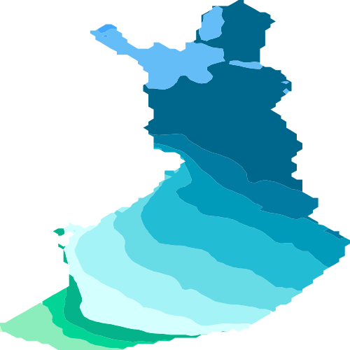

---

### t2m_p_smooth — Smoothed temperature

**Input:** [`test/input/t2m_p_smooth.get`](../../test/input/t2m_p_smooth.get)

```
GET /dali?customer=test&product=t2m_p_smooth&time=200808050300 HTTP/1.0
```

| Parameter | Value | Description |
|-----------|-------|-------------|
| `product` | `t2m_p_smooth` | Product JSON: [`test/dali/customers/test/products/t2m_p_smooth.json`](../../test/dali/customers/test/products/t2m_p_smooth.json) |

Same as `t2m_p` but with a stronger smoother applied to the temperature field, producing fewer and smoother contours.

**Output:**

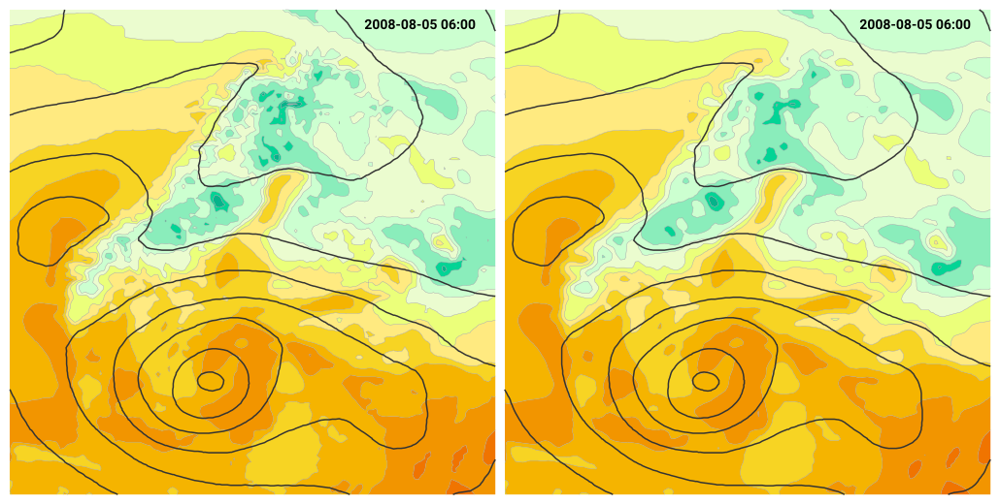

---

### Pressure smoothing comparison

The same European pressure field is rendered with several smoothing pipelines so the visual effect of each can be compared side by side.

Each test is a `/dali?customer=test&product=pressure_europe[_variant]&time=200808050300` request.  All variants share the same product structure — only the `filter` block on the isoband/isoline layers changes.

| Test | Filter | Product JSON | Output |
|------|--------|--------------|--------|
| [`pressure_europe.get`](../../test/input/pressure_europe.get) | None — raw isobands and isolines | [`pressure_europe.json`](../../test/dali/customers/test/products/pressure_europe.json) |  |
| [`pressure_europe_bezier.get`](../../test/input/pressure_europe_bezier.get) | Bezier curve fitting on the contour polylines, accuracy `5.0 px` (no pre-smoothing of the field) | [`pressure_europe_bezier.json`](../../test/dali/customers/test/products/pressure_europe_bezier.json) | 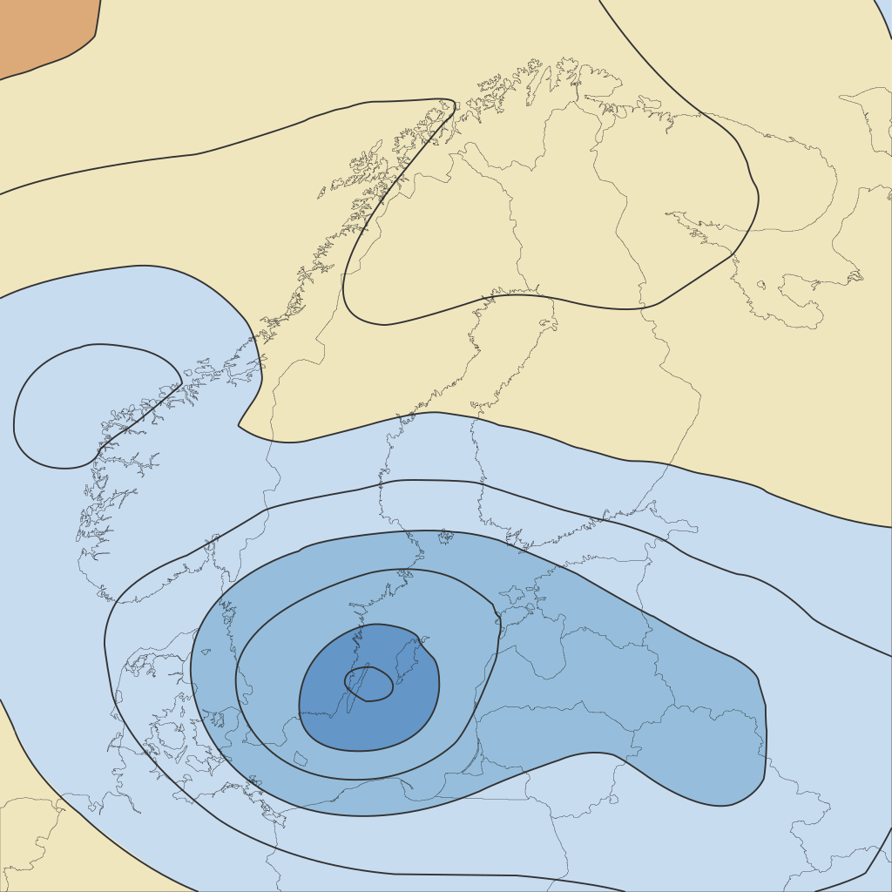 |
| [`pressure_europe_bezier_compare.get`](../../test/input/pressure_europe_bezier_compare.get) | Side-by-side comparison: no Bezier vs accuracy `2`/`3`/`5 px` | [`pressure_europe_bezier_compare.json`](../../test/dali/customers/test/products/pressure_europe_bezier_compare.json) | 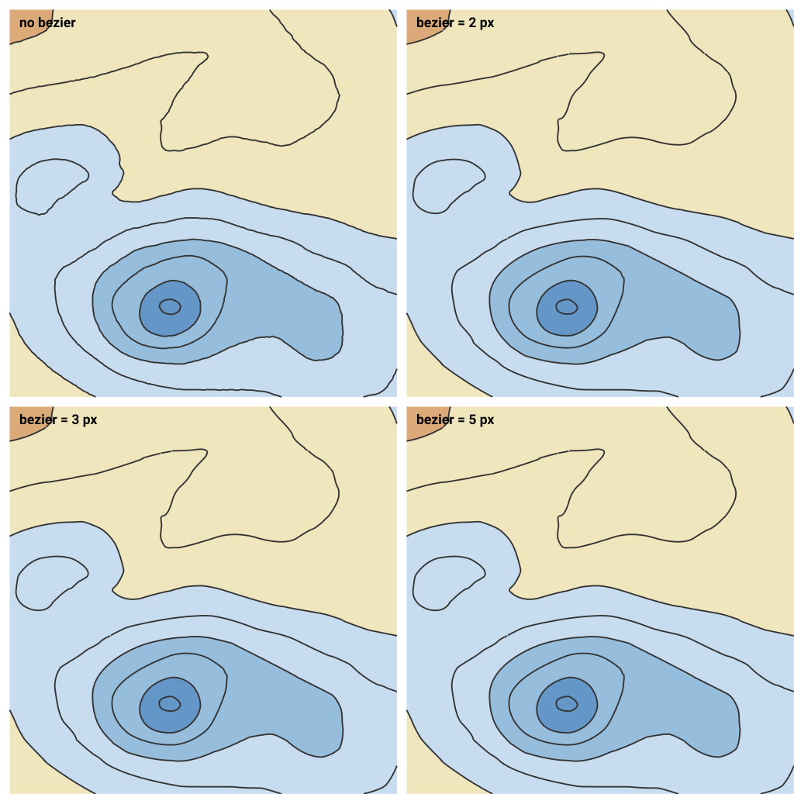 |
| [`pressure_europe_gaussian.get`](../../test/input/pressure_europe_gaussian.get) | Gaussian filter applied to the field before contouring | [`pressure_europe_gaussian.json`](../../test/dali/customers/test/products/pressure_europe_gaussian.json) | 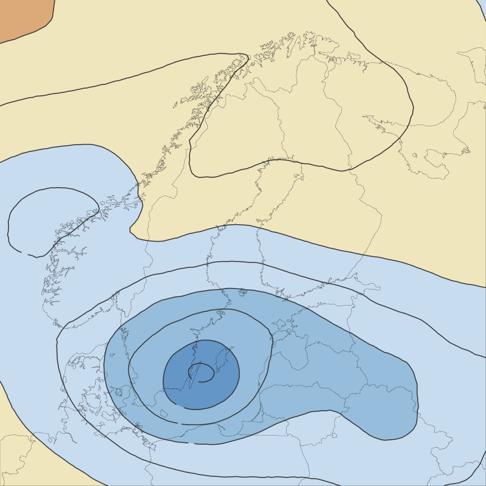 |
| [`pressure_europe_gaussian_bezier.get`](../../test/input/pressure_europe_gaussian_bezier.get) | Gaussian filter on the field + Bezier fitting on the contours | [`pressure_europe_gaussian_bezier.json`](../../test/dali/customers/test/products/pressure_europe_gaussian_bezier.json) | 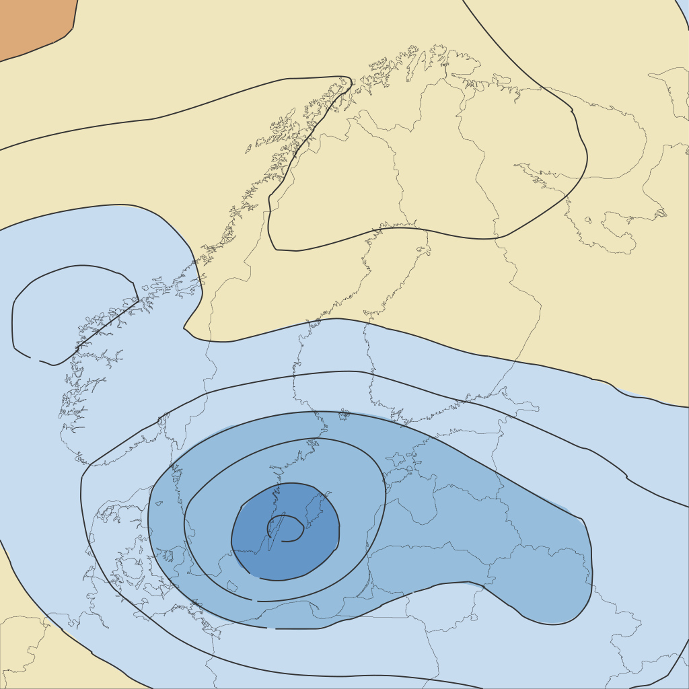 |
| [`pressure_europe_tukey.get`](../../test/input/pressure_europe_tukey.get) | Tukey biweight filter (robust to outliers) on the field | [`pressure_europe_tukey.json`](../../test/dali/customers/test/products/pressure_europe_tukey.json) |  |

The Bezier `accuracy` parameter is the maximum allowed deviation (in pixels) of the fitted cubic curve from the source polyline.  The minimum allowed value is 2 px — below that the moment-matching fitter starts producing extreme control points that project far outside the view.  Higher accuracy values give smoother, more compact paths at the cost of (mostly imperceptible) visual fidelity.  The `_compare` test renders the same field at four accuracy settings in a 2×2 grid for direct visual comparison.

To eliminate gaps between adjacent isobands' shared edges, the bezier code keeps a per-request cache of fitted cubics keyed by canonical-direction polyline.  The cache works for whole rings (rotation- and direction-invariant via canonical-form lookup) and for sub-segments split at counter-flagged corners and at view-boundary vertices.  Isolines drawn over isobands hit the same cache.  Sub-pixel residual differences may remain where contour ghostlines diverge between rings, but they fall well below the chosen accuracy threshold.

The fitting algorithm is a C++ port of [Raph Levien](https://raphlinus.github.io/)'s moment-matching cubic Bezier fitter from the Rust [`kurbo`](https://github.com/linebender/kurbo) library, which itself implements ideas from his 2009 UC Berkeley PhD thesis [*From Spiral to Spline: Optimal Techniques in Interactive Curve Design*](https://www.levien.com/phd/thesis.pdf).  The algorithm computes the signed area and first moment of the source curve segment and solves a quartic polynomial for cubic control points whose moments match.  The original Rust implementation is dual-licensed Apache-2.0 / MIT.

---

### TFP — Thermal-Front Parameter diagnostics

The TFP (Thermal-Front Parameter) diagnostic highlights baroclinic zones — boundaries where temperature/humidity changes sharply.  These three tests apply TFP isobands to different upper-level fields to reveal jet-stream edges, moisture boundaries, and frontal surfaces.  Each test is a `/dali?customer=test&product=tfp_*&type=png&time=200809101200` request.  See the [TFP metaparameter section in the reference](../reference.md) for the underlying scalar field options.

| Test | Field / Level | Product JSON | Output |
|------|---------------|--------------|--------|
| [`tfp_humidity.get`](../../test/input/tfp_humidity.get) | Humidity at 850 hPa (moisture boundaries) | [`tfp_humidity.json`](../../test/dali/customers/test/products/tfp_humidity.json) | 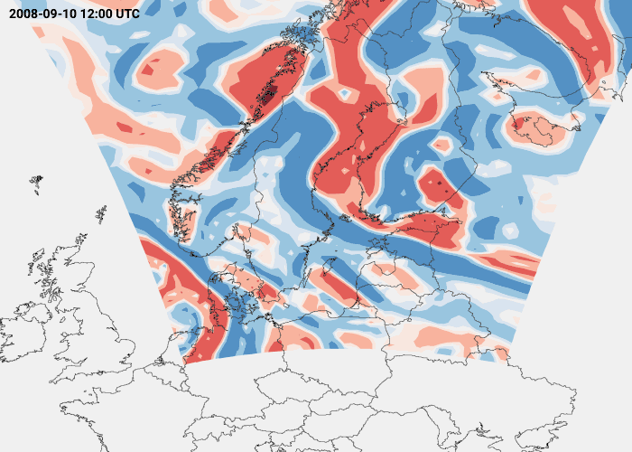 |
| [`tfp_theta.get`](../../test/input/tfp_theta.get) | Potential temperature at 850 hPa (frontal surface marker) | [`tfp_theta.json`](../../test/dali/customers/test/products/tfp_theta.json) | 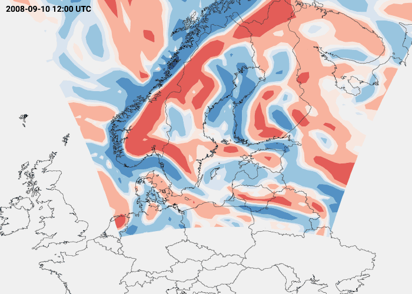 |
| [`tfp_wind.get`](../../test/input/tfp_wind.get) | Wind speed at 300 hPa (jet-stream edges) | [`tfp_wind.json`](../../test/dali/customers/test/products/tfp_wind.json) | 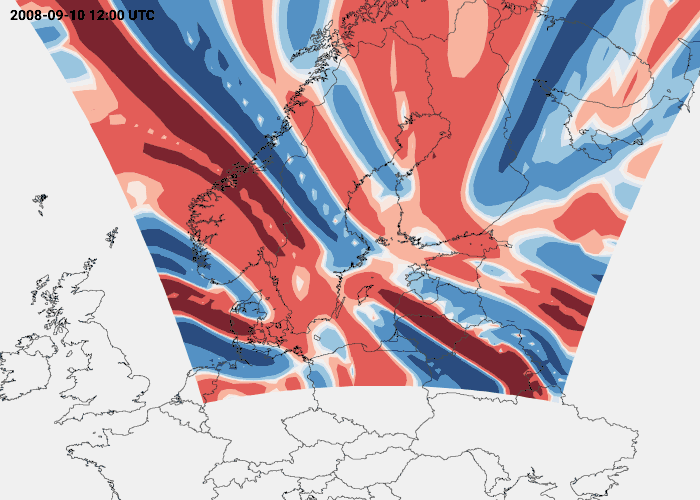 |

All three use the `ecmwf_skandinavia_painepinta` pressure-level producer, render to PNG (700×500 px) over Northern Europe in Web Mercator.

---

### crs_bbox — CRS bounding box handling

**Input:** [`test/input/crs_bbox.get`](../../test/input/crs_bbox.get)

```
GET /dali?customer=test&product=crs_bbox&time=200808050300 HTTP/1.0
```

| Parameter | Value | Description |
|-----------|-------|-------------|
| `product` | `crs_bbox` | Product JSON: [`test/dali/customers/test/products/crs_bbox.json`](../../test/dali/customers/test/products/crs_bbox.json) |

Tests that the bounding box specified in the product is interpreted correctly in the product's CRS.  The product uses `"crs": "data"` with a smoother applied.

**Output:**

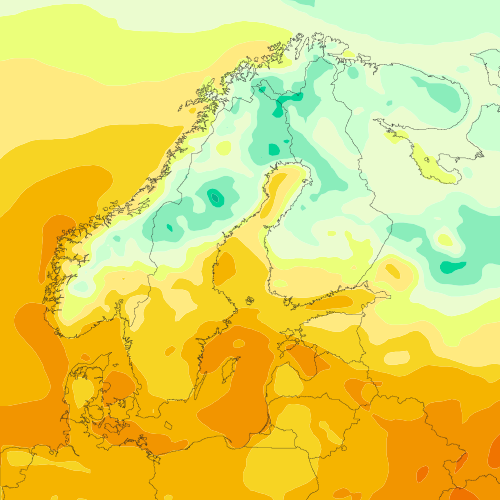

---

### t2m_p_noqid — Layers without qid

**Input:** [`test/input/t2m_p_noqid.get`](../../test/input/t2m_p_noqid.get)

```
GET /dali?customer=test&product=t2m_p_noqid&time=200808050300 HTTP/1.0
```

| Parameter | Value | Description |
|-----------|-------|-------------|
| `product` | `t2m_p_noqid` | Product JSON: [`test/dali/customers/test/products/t2m_p_noqid.json`](../../test/dali/customers/test/products/t2m_p_noqid.json) |

Like `t2m_p` but the layers omit `qid` fields.  Without a `qid`, layers cannot be overridden via URL parameters but the product still renders correctly.

**Output:**

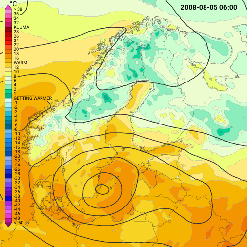

---

## Isoband Labels

Labels can be placed directly in the isoband definition with the `t2m_isoband_labels` test, or as a separate `IsolabelLayer` — see the [Isolabel examples](#isolabel-examples) section below.

### t2m_isoband_labels — Labels embedded in isoband layer

**Input:** [`test/input/t2m_isoband_labels.get`](../../test/input/t2m_isoband_labels.get)

```
GET /dali?customer=test&product=t2m_isoband_labels&time=200808050300 HTTP/1.0
```

| Parameter | Value | Description |
|-----------|-------|-------------|
| `product` | `t2m_isoband_labels` | Product JSON: [`test/dali/customers/test/products/t2m_isoband_labels.json`](../../test/dali/customers/test/products/t2m_isoband_labels.json) |

Demonstrates value labels embedded directly in the isoband layer specification.  Labels are drawn along the contour lines at a configured spacing.

**Output:**

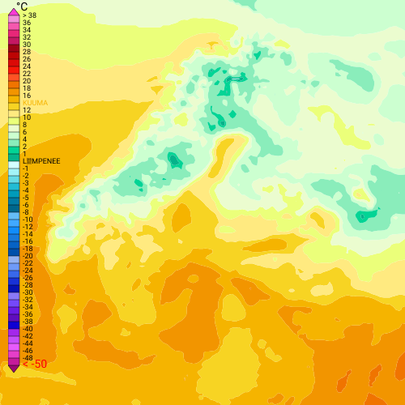

---

## Isolabel examples

Labels along isolines using the dedicated `IsolabelLayer`.  The placement algorithm — multi-angle local-extremum scan, divisibility-weighted MST selection, data-probed orientation — is documented in [`isolabel_algorithms.md`](../isolabel_algorithms.md).  The tests below exercise each tunable in turn (angle handling, cut-through style, multi-style, wide labels, concentric/dense/crossing isolines).

### isolabel — Basic isolabels

**Input:** [`test/input/isolabel.get`](../../test/input/isolabel.get)

```
GET /dali?customer=test&product=isolabel&time=200808050300 HTTP/1.0
```

| Parameter | Value | Description |
|-----------|-------|-------------|
| `product` | `isolabel` | Product JSON: [`test/dali/customers/test/products/isolabel.json`](../../test/dali/customers/test/products/isolabel.json) |

Uses the dedicated `isolabel` layer type to draw contour labels at a fixed spacing along isoline paths.

**Output:**

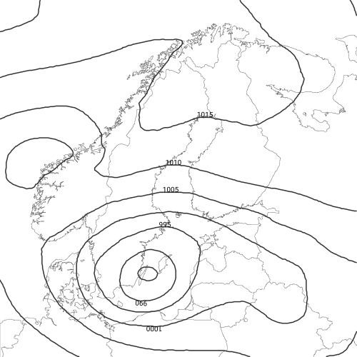

---

### isolabel_angles — Angle-following labels

**Input:** [`test/input/isolabel_angles.get`](../../test/input/isolabel_angles.get)

```
GET /dali?customer=test&product=isolabel_angles&time=200808050300 HTTP/1.0
```

| Parameter | Value | Description |
|-----------|-------|-------------|
| `product` | `isolabel_angles` | Product JSON: [`test/dali/customers/test/products/isolabel_angles.json`](../../test/dali/customers/test/products/isolabel_angles.json) |

Labels are rotated to follow the tangent direction of the isoline.

**Output:**

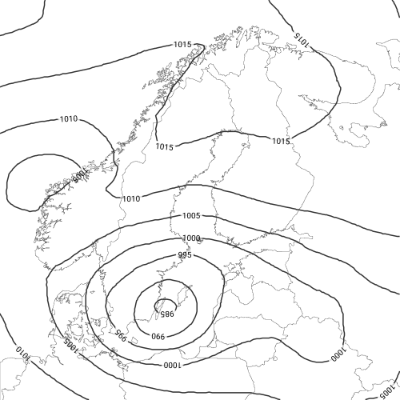

---

### isolabel_horizontal — Horizontal labels only

**Input:** [`test/input/isolabel_horizontal.get`](../../test/input/isolabel_horizontal.get)

```
GET /dali?customer=test&product=isolabel_horizontal&time=200808050300 HTTP/1.0
```

| Parameter | Value | Description |
|-----------|-------|-------------|
| `product` | `isolabel_horizontal` | Product JSON: [`test/dali/customers/test/products/isolabel_horizontal.json`](../../test/dali/customers/test/products/isolabel_horizontal.json) |

All labels are rendered horizontally regardless of isoline orientation; suitable when readability is prioritised over alignment with the contour.

**Output:**


---

### isolabel_cut — Cut-through labels

**Input:** [`test/input/isolabel_cut.get`](../../test/input/isolabel_cut.get)

```
GET /dali?customer=test&product=isolabel_cut&time=200808050300 HTTP/1.0
```

| Parameter | Value | Description |
|-----------|-------|-------------|
| `product` | `isolabel_cut` | Product JSON: [`test/dali/customers/test/products/isolabel_cut.json`](../../test/dali/customers/test/products/isolabel_cut.json) |

The isoline is cut at each label position so the label appears embedded in the line rather than on top of it.

**Output:**

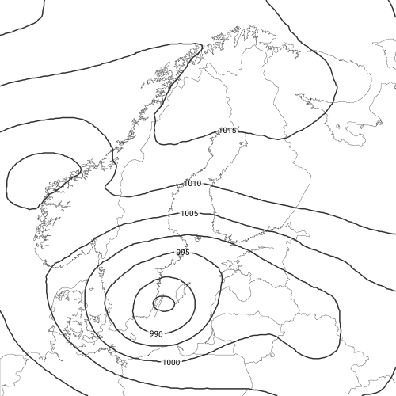

---

### isolabel_styles — Multiple label styles

**Input:** [`test/input/isolabel_styles.get`](../../test/input/isolabel_styles.get)

```
GET /dali?customer=test&product=isolabel_styles&time=200808050300 HTTP/1.0
```

| Parameter | Value | Description |
|-----------|-------|-------------|
| `product` | `isolabel_styles` | Product JSON: [`test/dali/customers/test/products/isolabel_styles.json`](../../test/dali/customers/test/products/isolabel_styles.json) |

Demonstrates per-isoline label styling: each contour level can have its own font size, colour, and background.

**Output:**

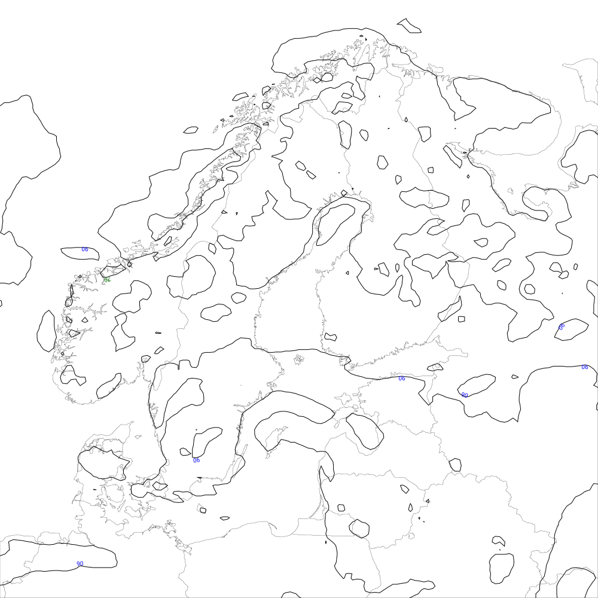

---

### isolabel_wide — Wide formatted labels

**Input:** [`test/input/isolabel_wide.get`](../../test/input/isolabel_wide.get)

```
GET /dali?customer=test&product=isolabel_wide&time=200808050300 HTTP/1.0
```

| Parameter | Value | Description |
|-----------|-------|-------------|
| `product` | `isolabel_wide` | Product JSON: [`test/dali/customers/test/products/isolabel_wide.json`](../../test/dali/customers/test/products/isolabel_wide.json) |

Sets `label.precision: 1` and `label.suffix: " hPa"` so labels render as `1015.0 hPa`.  Each candidate's collision box is sized from the actual rendered text, so wider labels reserve more space and the MST drops nearby competitors that would have fit at the default width.

**Output:**


---

### isolabel_concentric — Concentric closed contours

**Input:** [`test/input/isolabel_concentric.get`](../../test/input/isolabel_concentric.get)

```
GET /dali?customer=test&product=isolabel_concentric&time=200808050300 HTTP/1.0
```

| Parameter | Value | Description |
|-----------|-------|-------------|
| `product` | `isolabel_concentric` | Product JSON: [`test/dali/customers/test/products/isolabel_concentric.json`](../../test/dali/customers/test/products/isolabel_concentric.json) |

Tightens the spacing thresholds (`min_distance_self: 80`, `min_distance_same: 30`, `min_distance_other: 15`) so closely nested closed pressure rings can each carry a label.  The MST keeps the ladder placement readable instead of collapsing labels into clusters.

**Output:**


---

### isolabel_crossing — Two parameters labelled together

**Input:** [`test/input/isolabel_crossing.get`](../../test/input/isolabel_crossing.get)

```
GET /dali?customer=test&product=isolabel_crossing&time=200808050300 HTTP/1.0
```

| Parameter | Value | Description |
|-----------|-------|-------------|
| `product` | `isolabel_crossing` | Product JSON: [`test/dali/customers/test/products/isolabel_crossing.json`](../../test/dali/customers/test/products/isolabel_crossing.json) |

Labels two parameters at once — pressure plus temperature.  The SAT-based overlap test catches places where the two label sets cross at large angles; without SAT a corner-to-corner-only test would miss those collisions.

**Output:**

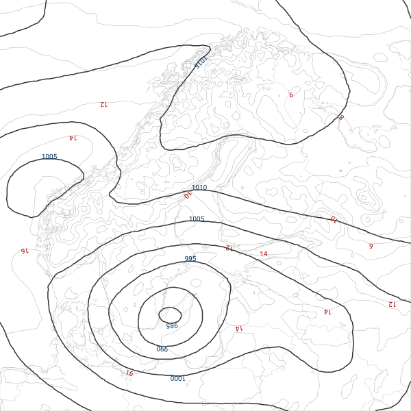

---

### isolabel_dense — Dense isovalue grid

**Input:** [`test/input/isolabel_dense.get`](../../test/input/isolabel_dense.get)

```
GET /dali?customer=test&product=isolabel_dense&time=200808050300 HTTP/1.0
```

| Parameter | Value | Description |
|-----------|-------|-------------|
| `product` | `isolabel_dense` | Product JSON: [`test/dali/customers/test/products/isolabel_dense.json`](../../test/dali/customers/test/products/isolabel_dense.json) |

Generates pressure isolines at every 1 hPa via `isovalues: { start: 990, stop: 1010, step: 1 }`.  Every divisibility class — multiples of 10, 5, 2, and others — competes for placement; the divisibility weighting keeps the round numbers visible while the rest fill in only where there is room.

**Output:**


---

## Location Label Placement

The `LocationLayer` places labels next to city markers using one of several algorithms.  The full algorithm reference is in [`docs/labeling_algorithms.md`](../labeling_algorithms.md); the tests below exercise each placement strategy and the cross-cutting options (free-space bias, population bucketing, pan invariance).

### location_labels_fixed — Fixed NE position

**Input:** [`test/input/location_labels_fixed.get`](../../test/input/location_labels_fixed.get)

```
GET /dali?customer=test&product=location_labels_fixed&type=svg HTTP/1.0
```

| Parameter | Value | Description |
|-----------|-------|-------------|
| `product` | `location_labels_fixed` | Product JSON: [`test/dali/customers/test/products/location_labels_fixed.json`](../../test/dali/customers/test/products/location_labels_fixed.json) |

Every label is placed at the NE corner with no conflict avoidance.  Labels that would cover a higher-priority marker are dropped (and so is their own marker), but labels are allowed to overlap each other.

**Output:**

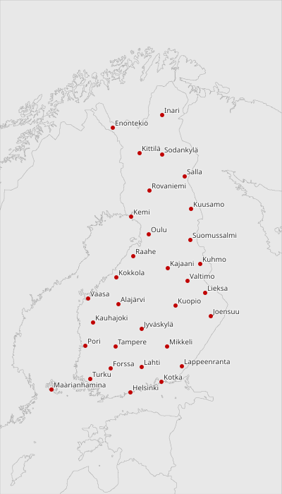

---

### location_labels_greedy — Greedy placement

**Input:** [`test/input/location_labels_greedy.get`](../../test/input/location_labels_greedy.get)

```
GET /dali?customer=test&product=location_labels_greedy&type=svg HTTP/1.0
```

| Parameter | Value | Description |
|-----------|-------|-------------|
| `product` | `location_labels_greedy` | Product JSON: [`test/dali/customers/test/products/location_labels_greedy.json`](../../test/dali/customers/test/products/location_labels_greedy.json) |

For each candidate (in geonames priority order) the algorithm tries the eight Imhof positions in priority order and keeps the first one that fits without overlapping a previously placed label or another candidate's marker.  Recommended default for most weather maps.

**Output:**

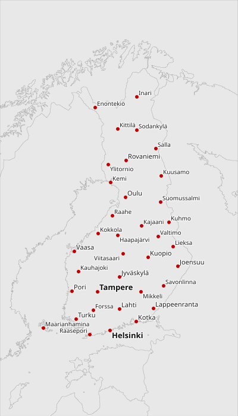

---

### location_labels_priority_greedy — Population-sorted greedy

**Input:** [`test/input/location_labels_priority_greedy.get`](../../test/input/location_labels_priority_greedy.get)

```
GET /dali?customer=test&product=location_labels_priority_greedy&type=svg HTTP/1.0
```

| Parameter | Value | Description |
|-----------|-------|-------------|
| `product` | `location_labels_priority_greedy` | Product JSON: [`test/dali/customers/test/products/location_labels_priority_greedy.json`](../../test/dali/customers/test/products/location_labels_priority_greedy.json) |

Same as greedy, but candidates are pre-sorted by population descending before placement.  Use this when geonames autocomplete order does not already match the population ranking you want.

**Output:**

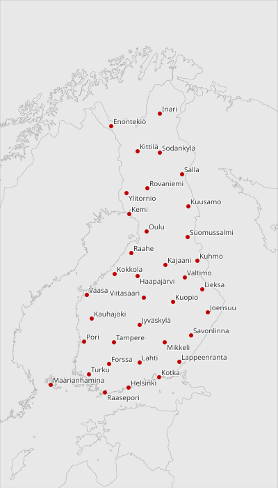

---

### location_labels_priority_greedy_bucketed — Population buckets + shorter-name tiebreak

**Input:** [`test/input/location_labels_priority_greedy_bucketed.get`](../../test/input/location_labels_priority_greedy_bucketed.get)

```
GET /dali?customer=test&product=location_labels_priority_greedy_bucketed&type=svg HTTP/1.0
```

| Parameter | Value | Description |
|-----------|-------|-------------|
| `product` | `location_labels_priority_greedy_bucketed` | Product JSON: [`test/dali/customers/test/products/location_labels_priority_greedy_bucketed.json`](../../test/dali/customers/test/products/location_labels_priority_greedy_bucketed.json) |

Adds `priority_bucket_ratio: 2.0` so cities with similar populations land in the same log-bucket and the shorter label wins ties.  On dense maps this typically places more labels overall — short names slot into prime NE positions and free up room for neighbours.

**Output:**

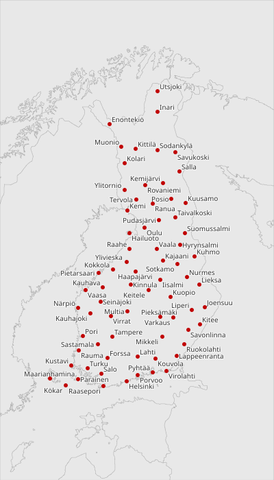

---

### location_labels_sa — Simulated annealing

**Input:** [`test/input/location_labels_sa.get`](../../test/input/location_labels_sa.get)

```
GET /dali?customer=test&product=location_labels_sa&type=svg HTTP/1.0
```

| Parameter | Value | Description |
|-----------|-------|-------------|
| `product` | `location_labels_sa` | Product JSON: [`test/dali/customers/test/products/location_labels_sa.json`](../../test/dali/customers/test/products/location_labels_sa.json) |

Uses Christensen-Marks-Shieber simulated annealing to minimise total label-overlap energy.  Converges toward a near-global optimum that pure greedy can miss in dense urban areas where several labels need to coordinate to fit.  The random seed is fixed so results are deterministic.

**Output:**

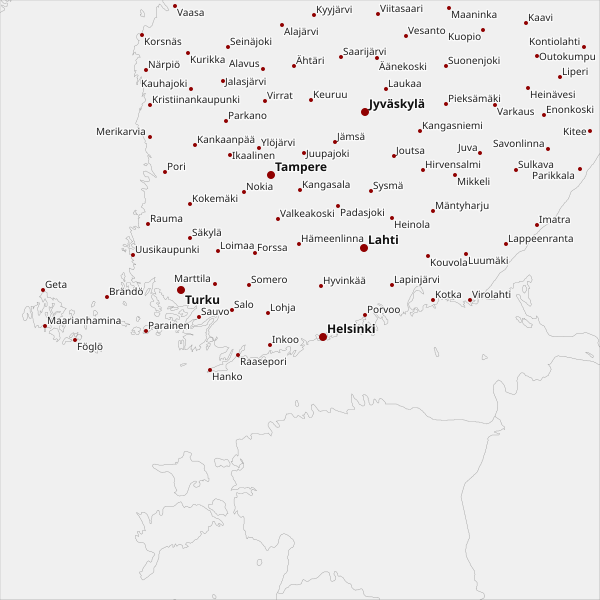

---

### location_labels_freespace — Greedy with free-space bias

**Input:** [`test/input/location_labels_freespace.get`](../../test/input/location_labels_freespace.get)

```
GET /dali?customer=test&product=location_labels_freespace&type=svg HTTP/1.0
```

| Parameter | Value | Description |
|-----------|-------|-------------|
| `product` | `location_labels_freespace` | Product JSON: [`test/dali/customers/test/products/location_labels_freespace.json`](../../test/dali/customers/test/products/location_labels_freespace.json) |

Adds `free_space_weight: 1.5, free_space_radius: 120` to the greedy run.  Each candidate scores positions by alignment with the direction away from neighbouring markers and labels, so coastal cities push their labels out into the empty water without needing a sea mask.

**Output:**

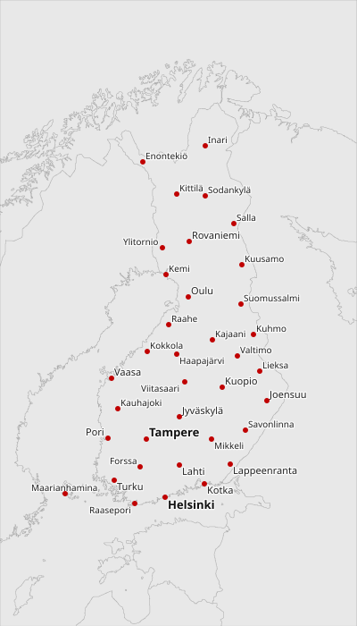

---

### location_labels_sa_freespace — Simulated annealing with free-space bias

**Input:** [`test/input/location_labels_sa_freespace.get`](../../test/input/location_labels_sa_freespace.get)

```
GET /dali?customer=test&product=location_labels_sa_freespace&type=svg HTTP/1.0
```

| Parameter | Value | Description |
|-----------|-------|-------------|
| `product` | `location_labels_sa_freespace` | Product JSON: [`test/dali/customers/test/products/location_labels_sa_freespace.json`](../../test/dali/customers/test/products/location_labels_sa_freespace.json) |

The same free-space bias on top of SA's overlap optimisation: the bias term is added to the position penalty and recomputed on every move so the bias reflects the current assignment.

**Output:**

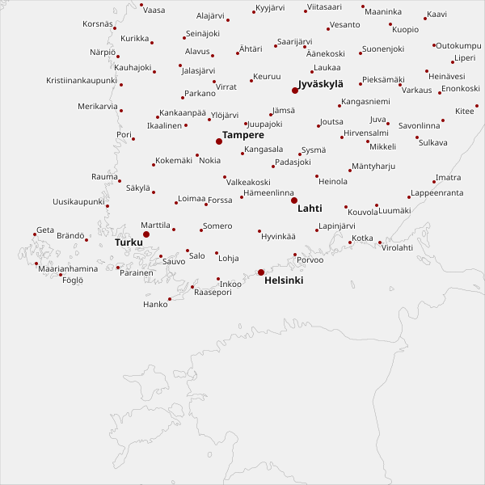

---

### location_labels_pan_invariant — Pan-invariant greedy

**Input:** [`test/input/location_labels_pan_invariant.get`](../../test/input/location_labels_pan_invariant.get)

```
GET /dali?customer=test&product=location_labels_pan_invariant&type=svg HTTP/1.0
```

| Parameter | Value | Description |
|-----------|-------|-------------|
| `product` | `location_labels_pan_invariant` | Product JSON: [`test/dali/customers/test/products/location_labels_pan_invariant.json`](../../test/dali/customers/test/products/location_labels_pan_invariant.json) |

Sets `pan_invariant: true` and centres on Jyväskylä.  Candidates are filtered to a margin-buffered bbox so cities just beyond the visible edge still influence the placement of visible cities; anchors outside the original bbox are skipped at render time.

**Output:**

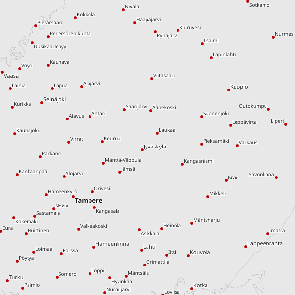

---

### location_labels_pan_invariant_shifted — Same view, panned 0.5° east

**Input:** [`test/input/location_labels_pan_invariant_shifted.get`](../../test/input/location_labels_pan_invariant_shifted.get)

```
GET /dali?customer=test&product=location_labels_pan_invariant_shifted&type=svg HTTP/1.0
```

| Parameter | Value | Description |
|-----------|-------|-------------|
| `product` | `location_labels_pan_invariant_shifted` | Product JSON: [`test/dali/customers/test/products/location_labels_pan_invariant_shifted.json`](../../test/dali/customers/test/products/location_labels_pan_invariant_shifted.json) |

Same projection as `location_labels_pan_invariant` but with `cx` shifted by +0.5°.  Cities visible in both panned views land at *identical* offsets from their markers — pan invariance verified per-city by the test harness.

**Output:**

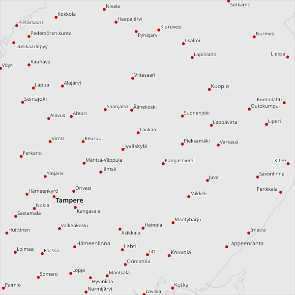

---

## SVG Customisation

### t2m_p_shadow — SVG drop shadow

**Input:** [`test/input/t2m_p_shadow.get`](../../test/input/t2m_p_shadow.get)

```
GET /dali?customer=test&product=t2m_p_shadow&time=200808050300 HTTP/1.0
```

| Parameter | Value | Description |
|-----------|-------|-------------|
| `product` | `t2m_p_shadow` | Product JSON: [`test/dali/customers/test/products/t2m_p_shadow.json`](../../test/dali/customers/test/products/t2m_p_shadow.json) |

Adds an SVG `<filter>` drop-shadow (`feDropShadow`) to the product's root element via the top-level `"attributes": {"filter": "url(#shadow)"}` setting.

**Output:**

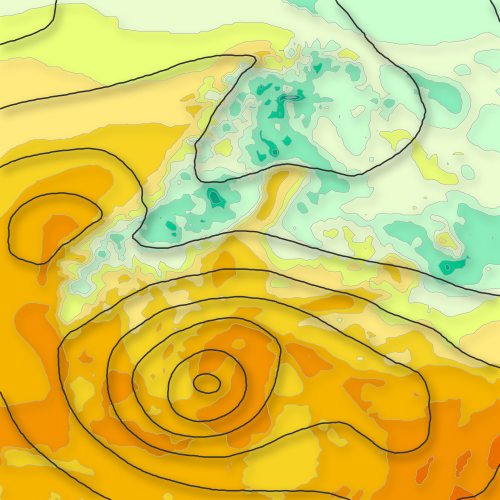

---

### t2m_p_display_none — Hidden layer with optimizesize

**Input:** [`test/input/t2m_p_display_none.get`](../../test/input/t2m_p_display_none.get)

```
GET /dali?customer=test&product=t2m_p&time=200808050300&l3.attributes.display=none&optimizesize=1 HTTP/1.0
```

| Parameter | Value | Description |
|-----------|-------|-------------|
| `l3.attributes.display` | `none` | Sets `display=none` on layer `l3` via URL override, making it invisible |
| `optimizesize` | `1` | When set, layers with `display=none` are omitted from the output entirely (reducing file size) |

The `optimizesize` flag strips out hidden layers rather than leaving them as invisible elements in the SVG.

**Output:**

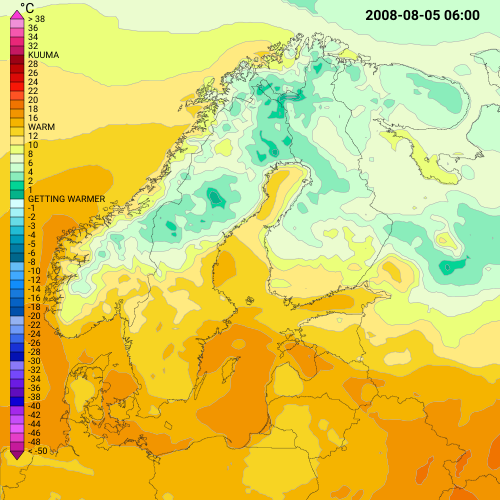

---

### t2m_pattern — SVG pattern fill

**Input:** [`test/input/t2m_pattern.get`](../../test/input/t2m_pattern.get)

```
GET /dali?customer=test&product=t2m_pattern&time=200808050300 HTTP/1.0
```

| Parameter | Value | Description |
|-----------|-------|-------------|
| `product` | `t2m_pattern` | Product JSON: [`test/dali/customers/test/products/t2m_pattern.json`](../../test/dali/customers/test/products/t2m_pattern.json) |

Uses SVG `<pattern>` elements defined in the `defs` section to fill isoband polygons with a hatching or repeat pattern rather than a solid colour.

**Output:**

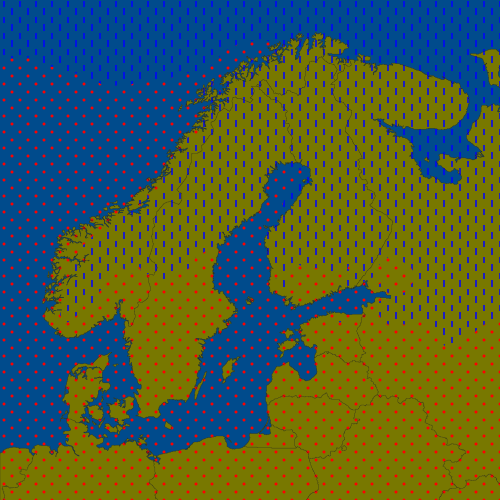

---

### defs_circle — SVG defs with reusable shapes

**Input:** [`test/input/defs_circle.get`](../../test/input/defs_circle.get)

```
GET /dali?customer=test&product=defs_circle&time=200808050300 HTTP/1.0
```

| Parameter | Value | Description |
|-----------|-------|-------------|
| `product` | `defs_circle` | Product JSON: [`test/dali/customers/test/products/defs_circle.json`](../../test/dali/customers/test/products/defs_circle.json) |

Shows how `defs.layers` can define reusable SVG elements (filters, named circles, clip paths, text nodes) that are referenced later via `xlink:href`.

**Output:**

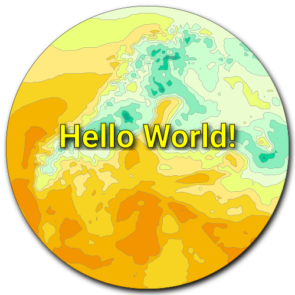

---

### clip — Explicit clipPath layer

**Input:** [`test/input/clip.get`](../../test/input/clip.get)

```
GET /dali?customer=test&product=clip&time=200808050300 HTTP/1.0
```

| Parameter | Value | Description |
|-----------|-------|-------------|
| `product` | `clip` | Product JSON: [`test/dali/customers/test/products/clip.json`](../../test/dali/customers/test/products/clip.json) |

Uses a `tag: "clipPath"` layer containing a `tag: "circle"` to create an SVG `<clipPath>` element inline.  A `tag: "g"` wrapper layer with `clip-path: url(#mycircle)` then applies it to the isoband layers, while the product-level `filter: url(#shadow)` adds a drop shadow.

**Output:**

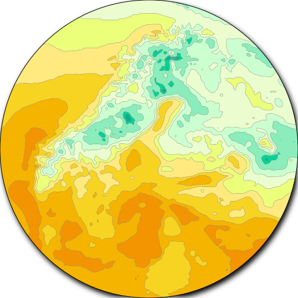

---

### circle — Circular clip with isobands

**Input:** [`test/input/circle.get`](../../test/input/circle.get)

```
GET /dali?customer=test&product=circle&time=200808050300 HTTP/1.0
```

| Parameter | Value | Description |
|-----------|-------|-------------|
| `product` | `circle` | Product JSON: [`test/dali/customers/test/products/circle.json`](../../test/dali/customers/test/products/circle.json) |
| `time` | `200808050300` | Valid time: 2008-08-05 03:00 UTC |

Projects Scandinavian temperature data using the data's own native CRS, renders temperature isobands and isolines, and clips the output with an SVG `<circle>` element centred at (250, 250) with radius 250.

**Output:**

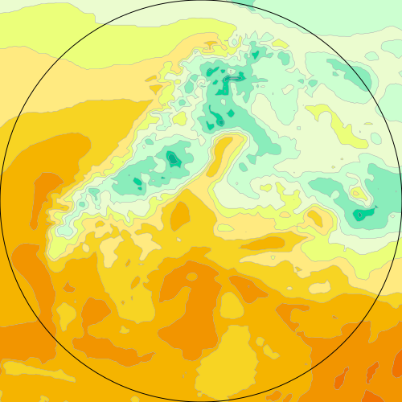

---

## Clipping to Geographic Boundaries

### t2m_inside_finland — Clip to country polygon

**Input:** [`test/input/t2m_inside_finland.get`](../../test/input/t2m_inside_finland.get)

```
GET /dali?customer=test&product=t2m_inside_finland&time=200808050300 HTTP/1.0
```

| Parameter | Value | Description |
|-----------|-------|-------------|
| `product` | `t2m_inside_finland` | Product JSON: [`test/dali/customers/test/products/t2m_inside_finland.json`](../../test/dali/customers/test/products/t2m_inside_finland.json) |

Uses `"inside"` on the isoband layer referencing a PostGIS query for the Finland border (`iso_a2='FI'`) to clip the rendered isobands to inside Finland.

**Output:**

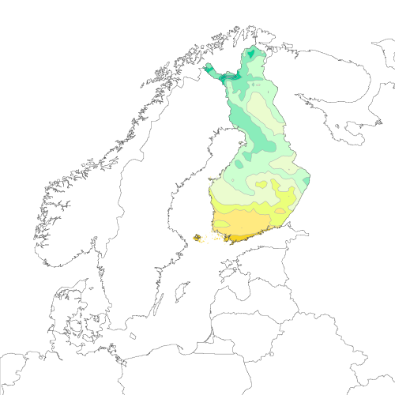

---

### t2m_inside_simplified_finland — Clip to simplified country polygon

**Input:** [`test/input/t2m_inside_simplified_finland.get`](../../test/input/t2m_inside_simplified_finland.get)

```
GET /dali?customer=test&product=t2m_inside_simplified_finland&time=200808050300 HTTP/1.0
```

| Parameter | Value | Description |
|-----------|-------|-------------|
| `product` | `t2m_inside_simplified_finland` | Product JSON: [`test/dali/customers/test/products/t2m_inside_simplified_finland.json`](../../test/dali/customers/test/products/t2m_inside_simplified_finland.json) |

Same as above but uses a `mindistance` tolerance to simplify the clip polygon, producing a smoother (less precise) boundary and faster rendering.

**Output:**

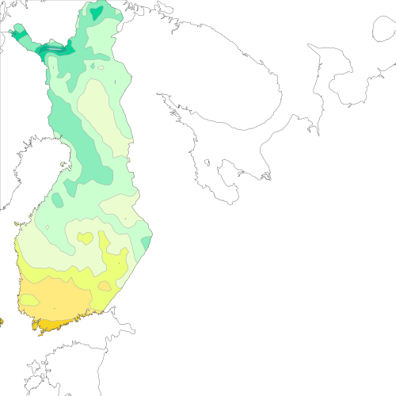

---

### t2m_outside_finland — Clip to outside country

**Input:** [`test/input/t2m_outside_finland.get`](../../test/input/t2m_outside_finland.get)

```
GET /dali?customer=test&product=t2m_outside_finland&time=200808050300 HTTP/1.0
```

| Parameter | Value | Description |
|-----------|-------|-------------|
| `product` | `t2m_outside_finland` | Product JSON: [`test/dali/customers/test/products/t2m_outside_finland.json`](../../test/dali/customers/test/products/t2m_outside_finland.json) |

Uses `"outside"` to clip isobands to the area outside Finland — the inverse of `t2m_inside_finland`.

**Output:**

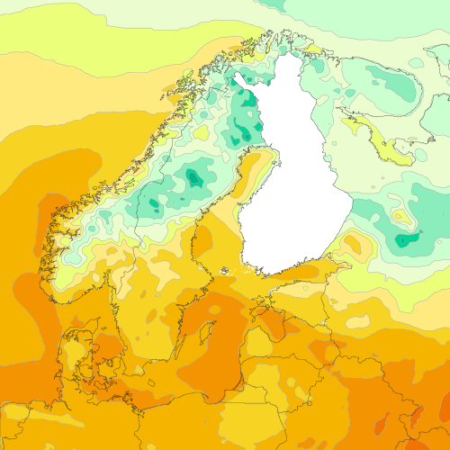

---

### t2m_inside_rain — Clip isobands to rain area

**Input:** [`test/input/t2m_inside_rain.get`](../../test/input/t2m_inside_rain.get)

```
GET /dali?customer=test&product=t2m_inside_rain&time=200808050300 HTTP/1.0
```

| Parameter | Value | Description |
|-----------|-------|-------------|
| `product` | `t2m_inside_rain` | Product JSON: [`test/dali/customers/test/products/t2m_inside_rain.json`](../../test/dali/customers/test/products/t2m_inside_rain.json) |

Clips temperature isobands to areas where precipitation exceeds 0 mm/h (the rain area).  The `inside` polygon is derived dynamically from another data layer rather than from a static geographic boundary.

**Output:**

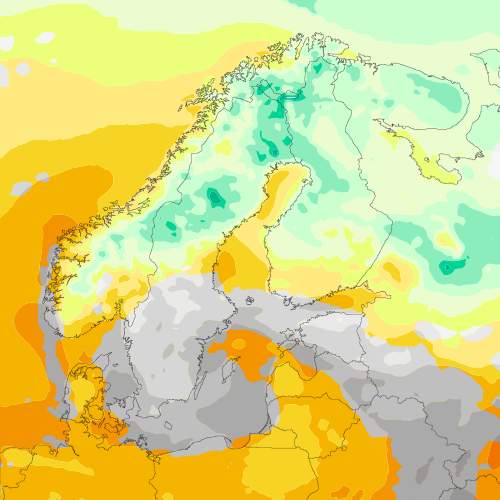

---

### t2m_lines_inside_rain — Isolines clipped to rain area

**Input:** [`test/input/t2m_lines_inside_rain.get`](../../test/input/t2m_lines_inside_rain.get)

```
GET /dali?customer=test&product=t2m_lines_inside_rain&time=200808050300 HTTP/1.0
```

| Parameter | Value | Description |
|-----------|-------|-------------|
| `product` | `t2m_lines_inside_rain` | Product JSON: [`test/dali/customers/test/products/t2m_lines_inside_rain.json`](../../test/dali/customers/test/products/t2m_lines_inside_rain.json) |

Temperature isolines (not isobands) are clipped to the rain area.  Shows that the `inside` clipping mechanism works equally for line layers.

**Output:**

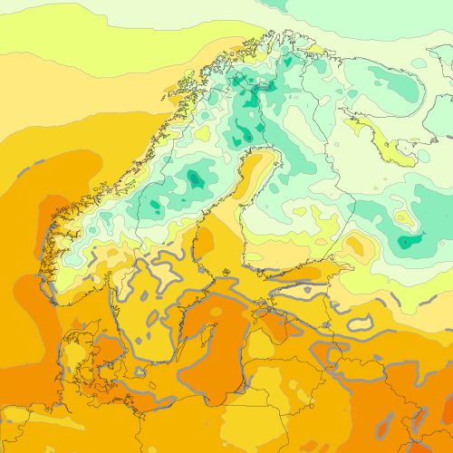

---

### frost_inside_simplified_finland — Frost probability inside Finland

**Input:** [`test/input/frost_inside_simplified_finland.get`](../../test/input/frost_inside_simplified_finland.get)

```
GET /dali?customer=test&product=frost_inside_simplified_finland&time=201604140000 HTTP/1.0
```

| Parameter | Value | Description |
|-----------|-------|-------------|
| `product` | `frost_inside_simplified_finland` | Product JSON: [`test/dali/customers/test/products/frost_inside_simplified_finland.json`](../../test/dali/customers/test/products/frost_inside_simplified_finland.json) |
| `time` | `201604140000` | Valid time: 2016-04-14 00:00 UTC |

Renders `FrostProbability` isobands from the `ground` producer at 1200×1200 px in EPSG:4326.  Uses `"inside": "ref:refs.finland"` where the `refs.finland` entry queries the Natural Earth countries table with `iso_a2 IN ('FI','AX')` and a `mindistance` simplification tolerance.

**Output:**

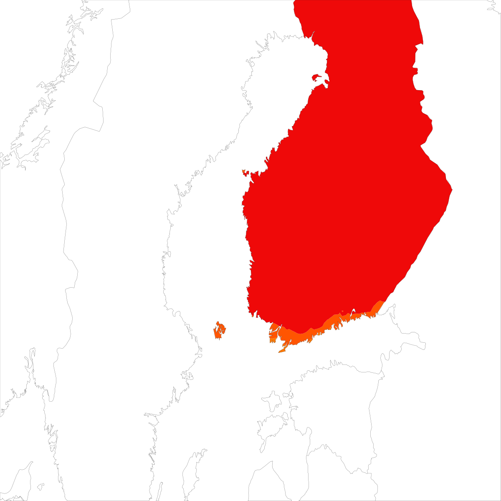

---

## Pressure Level and Elevation Selection

### t2m_level_* — Named pressure levels

**Input files:** [`test/input/t2m_level_1000.get`](../../test/input/t2m_level_1000.get), [`test/input/t2m_level_850.get`](../../test/input/t2m_level_850.get), [`test/input/t2m_level_300.get`](../../test/input/t2m_level_300.get)

```
GET /dali?customer=test&product=t2m_pressurelevel&time=20080909T1200&level=1000 HTTP/1.0
GET /dali?customer=test&product=t2m_pressurelevel&time=20080909T1200&level=850  HTTP/1.0
GET /dali?customer=test&product=t2m_pressurelevel&time=20080909T1200&level=300  HTTP/1.0
```

| Parameter | Value | Description |
|-----------|-------|-------------|
| `product` | `t2m_pressurelevel` | Product JSON: [`test/dali/customers/test/products/t2m_pressurelevel.json`](../../test/dali/customers/test/products/t2m_pressurelevel.json) |
| `time` | `20080909T1200` | Valid time: 2008-09-09 12:00 UTC |
| `level` | `1000` / `850` / `300` | Selects the pressure level in hPa from the `ecmwf_skandinavia_painepinta` producer |

The `level` parameter selects a pressure level slice; the producer must have data for that level.

| Level | Output |
|-------|--------|
| 1000 hPa | 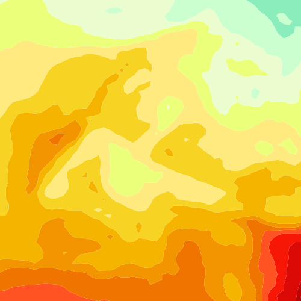 |
| 850 hPa |  |
| 300 hPa |  |

---

### t2m_elevation_* — Elevation in metres

**Input files:** [`test/input/t2m_elevation_1000.get`](../../test/input/t2m_elevation_1000.get), [`test/input/t2m_elevation_850.get`](../../test/input/t2m_elevation_850.get), [`test/input/t2m_elevation_300.get`](../../test/input/t2m_elevation_300.get)

```
GET /dali?customer=test&product=t2m_pressurelevel&time=20080909T1200&elevation=1000 HTTP/1.0
GET /dali?customer=test&product=t2m_pressurelevel&time=20080909T1200&elevation=850  HTTP/1.0
GET /dali?customer=test&product=t2m_pressurelevel&time=20080909T1200&elevation=300  HTTP/1.0
```

| Parameter | Value | Description |
|-----------|-------|-------------|
| `elevation` | `1000` / `850` / `300` | Selects the level using the `elevation` parameter (in metres or hPa depending on data convention) |

The `elevation` parameter is an alternative to `level`; which one is applicable depends on the data source's level type convention.

| Elevation | Output |
|-----------|--------|
| 1000 m |  |
| 850 m |  |
| 300 m | 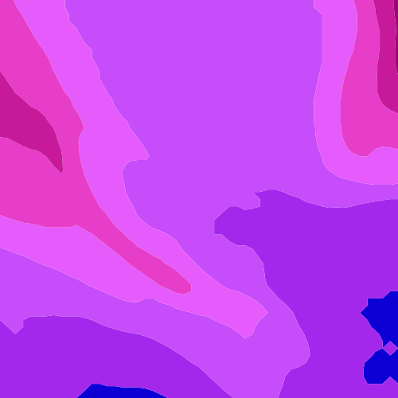 |

---

### high_resolution — High resolution rendering

**Input:** [`test/input/high_resolution.get`](../../test/input/high_resolution.get)

```
GET /dali?customer=test&product=high_resolution&time=202006051200 HTTP/1.0
```

| Parameter | Value | Description |
|-----------|-------|-------------|
| `product` | `high_resolution` | Product JSON: [`test/dali/customers/test/products/high_resolution.json`](../../test/dali/customers/test/products/high_resolution.json) |
| `time` | `202006051200` | Valid time: 2020-06-05 12:00 UTC |

Tests rendering of a high-resolution model grid (e.g. HARMONIE/AROME).  Listed in `.testignore` as a debugging test case with non-deterministic output in CI.

*No reference output image available.*

---

## Multiple Views and Side-by-Side Products

### t2m_twice — Two views side by side

**Input:** [`test/input/t2m_twice.get`](../../test/input/t2m_twice.get)

```
GET /dali?customer=test&product=t2m_twice&time=200808050300&v2.time_offset=1440 HTTP/1.0
```

| Parameter | Value | Description |
|-----------|-------|-------------|
| `product` | `t2m_twice` | Product JSON: [`test/dali/customers/test/products/t2m_twice.json`](../../test/dali/customers/test/products/t2m_twice.json) |
| `v2.time_offset` | `1440` | Advances the valid time of view 2 by 1440 minutes (24 hours) |

The product defines two 500×500 px views (`v1`, `v2`) side by side in a 1030×520 canvas.  Each view includes temperature isobands, isolines, and a time label.  The URL overrides `v2.time_offset` to show T+24 h in the second panel.

**Output:**

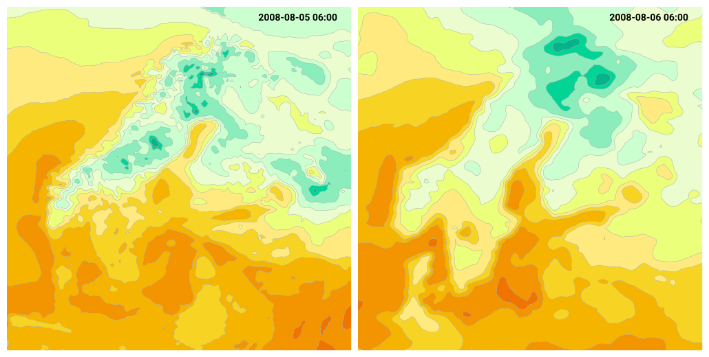

---

### t2m_twice_altered — Transformed second view

**Input:** [`test/input/t2m_twice_altered.get`](../../test/input/t2m_twice_altered.get)

```
GET /dali?customer=test&product=t2m_twice&time=200808050300
    &v2.time_offset=1440
    &v2.attributes.transform=translate%28500,1%29+rotate%2830%29+scale%280.75%29
    &v1.attributes.filter=url%28#shadow%29
    &v2.attributes.filter=url%28#shadow%29 HTTP/1.0
```

| Parameter | Value | Description |
|-----------|-------|-------------|
| `v2.attributes.transform` | `translate(500,1) rotate(30) scale(0.75)` | Applies an SVG transform to view 2: shifted, rotated 30°, scaled 75% |
| `v1.attributes.filter` | `url(#shadow)` | Adds a drop-shadow filter to view 1 |
| `v2.attributes.filter` | `url(#shadow)` | Adds a drop-shadow filter to view 2 |

Demonstrates that SVG attributes (including `transform` and `filter`) can be set on any view via URL overrides.  The URL-encoded values `%28` = `(`, `%29` = `)`.

**Output:**

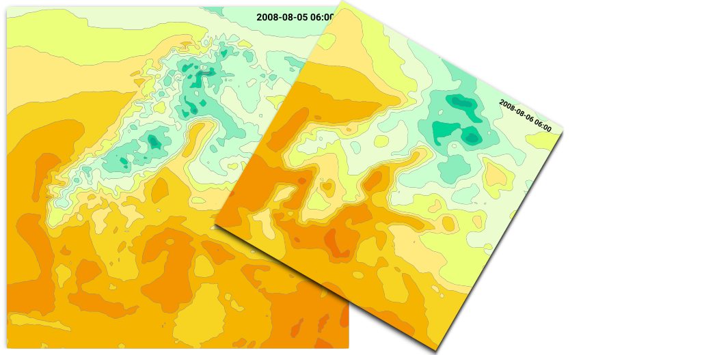

---

### t2m_twice_margins — Views with margins (unclipped)

**Input:** [`test/input/t2m_twice_margins.get`](../../test/input/t2m_twice_margins.get)

```
GET /dali?customer=test&product=t2m_twice&time=200808050300
    &v2.time_offset=1440
    &v1.clip=0&v2.clip=0
    &v1.margin=5&v2.margin=10
    &projection.place=Helsinki&projection.resolution=1 HTTP/1.0
```

| Parameter | Value | Description |
|-----------|-------|-------------|
| `v1.clip` | `0` | Disables clipping for view 1 (data may extend beyond the view boundary) |
| `v2.clip` | `0` | Disables clipping for view 2 |
| `v1.margin` | `5` | Adds a 5-pixel margin around view 1's data extent |
| `v2.margin` | `10` | Adds a 10-pixel margin around view 2's data extent |
| `projection.place` | `Helsinki` | Centres the projection on Helsinki |
| `projection.resolution` | `1` | Sets projection resolution to 1 km/px |

**Output:**

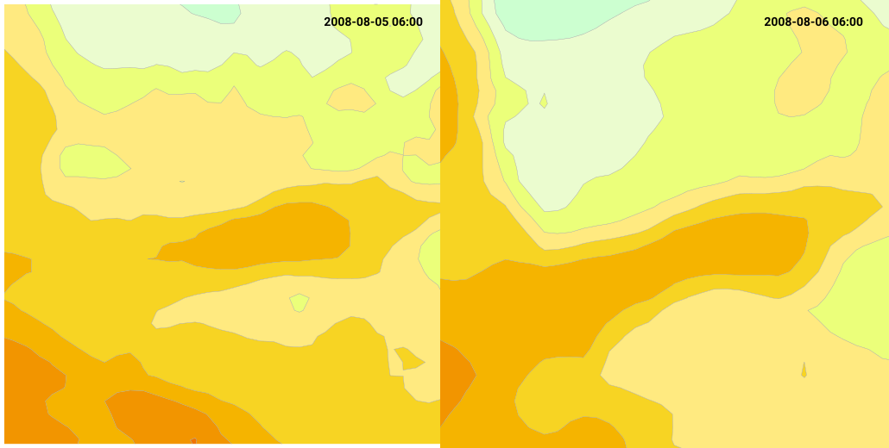

---

### t2m_twice_margins_clipped — Views with margins (clipped)

**Input:** [`test/input/t2m_twice_margins_clipped.get`](../../test/input/t2m_twice_margins_clipped.get)

```
GET /dali?customer=test&product=t2m_twice&time=200808050300
    &v2.time_offset=1440
    &v1.clip=1&v2.clip=1
    &v1.margin=5&v2.margin=10
    &projection.place=Helsinki&projection.resolution=1 HTTP/1.0
```

| Parameter | Value | Description |
|-----------|-------|-------------|
| `v1.clip` | `1` | Enables clipping for view 1 |
| `v2.clip` | `1` | Enables clipping for view 2 |

Same as `t2m_twice_margins` but clipping is re-enabled.  Layers are clipped to the view boundary even though a margin is specified.

**Output:**

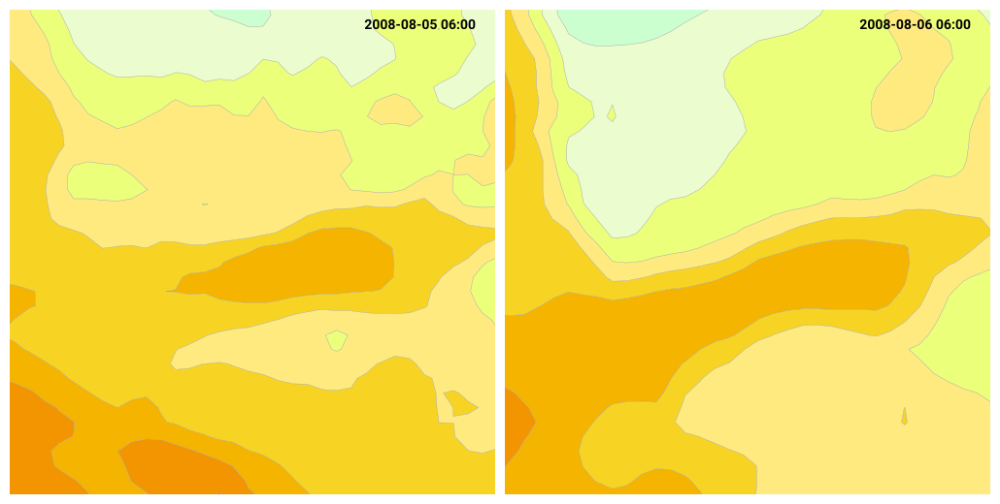

---

### resolution — View-level projection resolution

**Input:** [`test/input/resolution.get`](../../test/input/resolution.get)

```
GET /dali?customer=test&product=resolution&time=200808050300 HTTP/1.0
```

| Parameter | Value | Description |
|-----------|-------|-------------|
| `product` | `resolution` | Product JSON: [`test/dali/customers/test/products/resolution.json`](../../test/dali/customers/test/products/resolution.json) |

Two 500×500 views centred on Finland are placed side by side, each with a different `resolution` setting in their `projection` block (2.5 and 1.5 km/px).  Map layers use `minresolution` and `maxresolution` to select detail levels: coarse data is shown in black for coarse resolutions, fine data in red for fine resolutions.

**Output:**

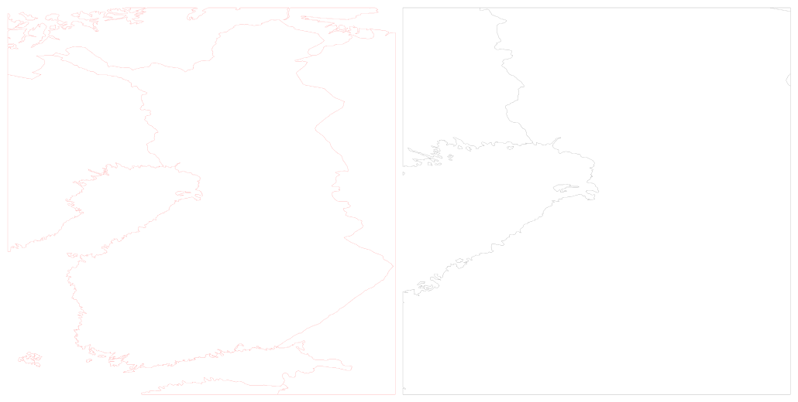

---

### ely_overlay — Multi-customer overlay

**Input:** [`test/input/ely_overlay.get`](../../test/input/ely_overlay.get)

```
GET /dali?customer=ely&product=temperatureoverlay&time=200808080000&type=svg HTTP/1.1
```

| Parameter | Value | Description |
|-----------|-------|-------------|
| `customer` | `ely` | Selects the `ely` customer directory (separate from `test`) |
| `product` | `temperatureoverlay` | Product JSON: [`test/dali/customers/ely/products/temperatureoverlay.json`](../../test/dali/customers/ely/products/temperatureoverlay.json) |
| `type` | `svg` | SVG output |

A second customer (`ely`) demonstrating that multiple customer configurations can coexist.  This overlay product uses a `number` layer with a masked legend background.

**Output:**

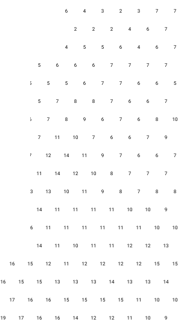

---

## Time Layer and Timezone

### timelayer — Time annotation

**Input:** [`test/input/timelayer.get`](../../test/input/timelayer.get)

```
GET /dali?customer=test&product=timelayer&time=200808051200 HTTP/1.0
```

| Parameter | Value | Description |
|-----------|-------|-------------|
| `product` | `timelayer` | Product JSON: [`test/dali/customers/test/products/timelayer.json`](../../test/dali/customers/test/products/timelayer.json) |
| `time` | `200808051200` | Valid time: 2008-08-05 12:00 UTC |

The `time` layer renders the product's valid time as formatted text (e.g. `"%Y-%m-%d %H:%M"`) at a specified position in the SVG.  The product uses `"timestamp": "validtime"` and `"timezone": "UTC"`.

**Output:**


---

### timezone — Time in local timezone

**Input:** [`test/input/timezone.get`](../../test/input/timezone.get)

```
GET /dali?customer=test&product=timelayer&time=200808051500&tz=Europe/Helsinki HTTP/1.0
```

| Parameter | Value | Description |
|-----------|-------|-------------|
| `time` | `200808051500` | Valid time: 2008-08-05 15:00 UTC |
| `tz` | `Europe/Helsinki` | Overrides the display timezone for the time layer; 15:00 UTC → 18:00 EEST |

The `tz` URL parameter overrides the product's timezone for all `time` layer annotations in the response.

**Output:**

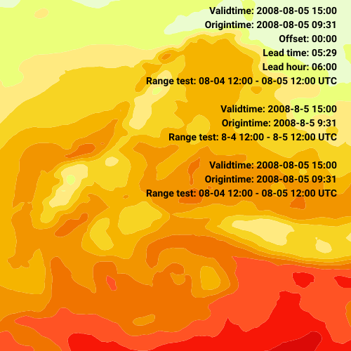

---

## Observation Numbers

### temperature_fmisid — Station temperatures by FMI ID

**Input:** [`test/input/temperature_fmisid.get`](../../test/input/temperature_fmisid.get)

```
GET /dali?customer=test&product=temperature_fmisid&time=200808050300 HTTP/1.0
```

| Parameter | Value | Description |
|-----------|-------|-------------|
| `product` | `temperature_fmisid` | Product JSON: [`test/dali/customers/test/products/temperature_fmisid.json`](../../test/dali/customers/test/products/temperature_fmisid.json) |
| `time` | `200808050300` | Valid time: 2008-08-05 03:00 UTC |

Plots temperature observations at a hand-picked list of FMI station IDs (`fmisid`).  Individual stations may override the default label offset (`dx`, `dy`).  Background: white fill + Natural Earth country borders.

**Output:**

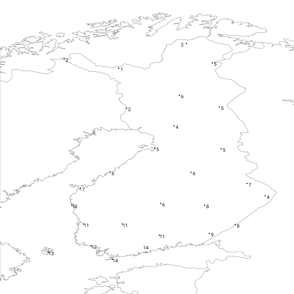

---

### opendata_temperature_fmisid — Opendata station temperatures

**Input:** [`test/input/opendata_temperature_fmisid.get`](../../test/input/opendata_temperature_fmisid.get)

```
GET /dali?customer=test&product=opendata_temperature_fmisid&time=20130805T1500 HTTP/1.0
```

| Parameter | Value | Description |
|-----------|-------|-------------|
| `product` | `opendata_temperature_fmisid` | Product JSON: [`test/dali/customers/test/products/opendata_temperature_fmisid.json`](../../test/dali/customers/test/products/opendata_temperature_fmisid.json) |
| `time` | `20130805T1500` | Valid time: 2013-08-05 15:00 UTC (ISO 8601 compact format) |

Same concept as `temperature_fmisid` but using the `opendata` producer from the Finnish Meteorological Institute.

**Output:**

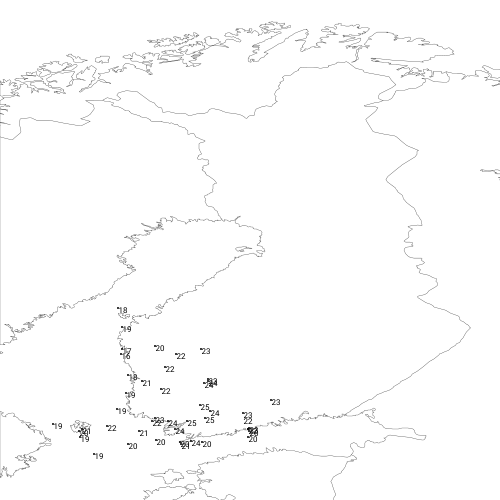

---

### opendata_temperature_fmisid_shift — Station numbers with label offset

**Input:** [`test/input/opendata_temperature_fmisid_shift.get`](../../test/input/opendata_temperature_fmisid_shift.get)

```
GET /dali?customer=test&product=opendata_temperature_fmisid_shift&time=20130805T1500 HTTP/1.0
```

| Parameter | Value | Description |
|-----------|-------|-------------|
| `product` | `opendata_temperature_fmisid_shift` | Product JSON: [`test/dali/customers/test/products/opendata_temperature_fmisid_shift.json`](../../test/dali/customers/test/products/opendata_temperature_fmisid_shift.json) |

Station labels are systematically shifted (`dx`, `dy`) to reduce overlap with symbols.

**Output:**

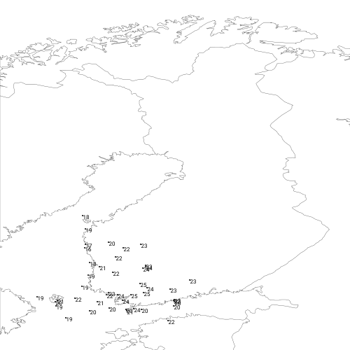

---

### opendata_temperature_grid — Grid-spaced observation numbers

**Input:** [`test/input/opendata_temperature_grid.get`](../../test/input/opendata_temperature_grid.get)

```
GET /dali?customer=test&product=opendata_temperature_grid&time=20130805T1500 HTTP/1.0
```

| Parameter | Value | Description |
|-----------|-------|-------------|
| `product` | `opendata_temperature_grid` | Product JSON: [`test/dali/customers/test/products/opendata_temperature_grid.json`](../../test/dali/customers/test/products/opendata_temperature_grid.json) |

Uses `"positions": {"layout": "grid", "dx": 30, "dy": 30}` to place observation values at regular pixel intervals, thinning dense station networks.

**Output:**

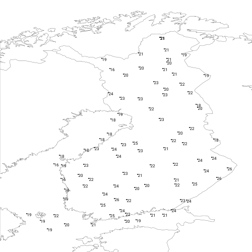

---

### opendata_temperature_keyword — Keyword-selected stations

**Input:** [`test/input/opendata_temperature_keyword.get`](../../test/input/opendata_temperature_keyword.get)

```
GET /dali?customer=test&product=opendata_temperature_keyword&time=20130805T1500 HTTP/1.0
```

| Parameter | Value | Description |
|-----------|-------|-------------|
| `product` | `opendata_temperature_keyword` | Product JSON: [`test/dali/customers/test/products/opendata_temperature_keyword.json`](../../test/dali/customers/test/products/opendata_temperature_keyword.json) |

Selects stations by keyword (administrative classification such as county or municipality) rather than by explicit FMI station IDs.

**Output:**

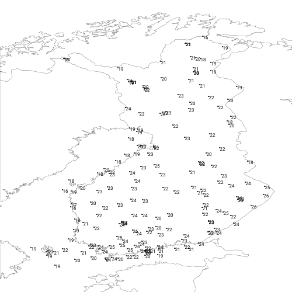

---

### ecmwf_data_numbers — ECMWF grid point values

**Input:** [`test/input/ecmwf_data_numbers.get`](../../test/input/ecmwf_data_numbers.get)

```
GET /dali?customer=test&product=ecmwf_data_numbers&time=201503131200 HTTP/1.0
```

| Parameter | Value | Description |
|-----------|-------|-------------|
| `product` | `ecmwf_data_numbers` | Product JSON: [`test/dali/customers/test/products/ecmwf_data_numbers.json`](../../test/dali/customers/test/products/ecmwf_data_numbers.json) |
| `time` | `201503131200` | Valid time: 2015-03-13 12:00 UTC |

Plots temperature values at regular grid intervals from the ECMWF surface analysis (`ecmwf_maailma_pinta`) over Europe.

**Output:**

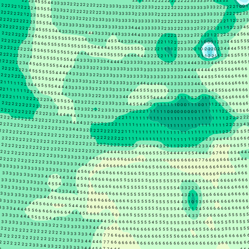

---

### ecmwfpoint_data_numbers — ECMWF point values

**Input:** [`test/input/ecmwfpoint_data_numbers.get`](../../test/input/ecmwfpoint_data_numbers.get)

```
GET /dali?customer=test&product=ecmwfpoint_data_numbers&time=200808051200 HTTP/1.0
```

| Parameter | Value | Description |
|-----------|-------|-------------|
| `product` | `ecmwfpoint_data_numbers` | Product JSON: [`test/dali/customers/test/products/ecmwfpoint_data_numbers.json`](../../test/dali/customers/test/products/ecmwfpoint_data_numbers.json) |
| `time` | `200808051200` | Valid time: 2008-08-05 12:00 UTC |

Plots ECMWF model values at specific geographic point locations rather than a regular grid.

**Output:**

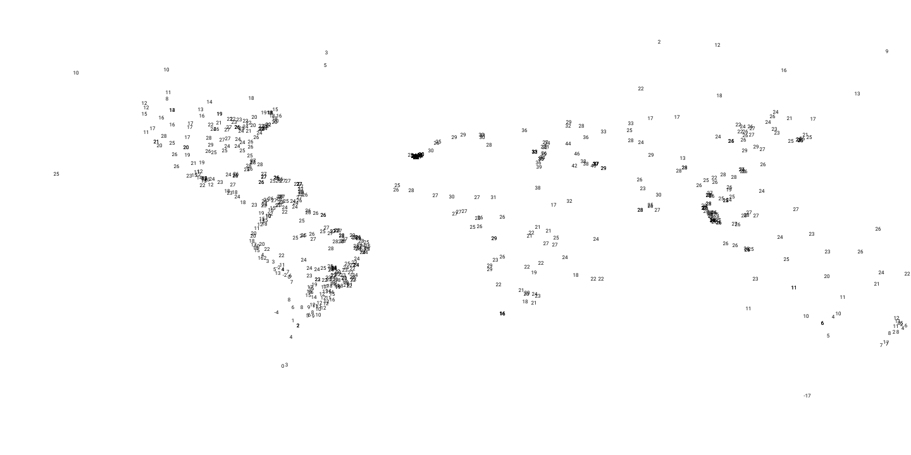

---

### ecmwf_world_numbers — ECMWF global grid values

**Input:** [`test/input/ecmwf_world_numbers.get`](../../test/input/ecmwf_world_numbers.get)

```
GET /dali?customer=test&product=ecmwf_world_numbers&time=201503131200 HTTP/1.0
```

| Parameter | Value | Description |
|-----------|-------|-------------|
| `product` | `ecmwf_world_numbers` | Product JSON: [`test/dali/customers/test/products/ecmwf_world_numbers.json`](../../test/dali/customers/test/products/ecmwf_world_numbers.json) |

Plots ECMWF global surface temperature values at grid intervals on a world map.

**Output:**

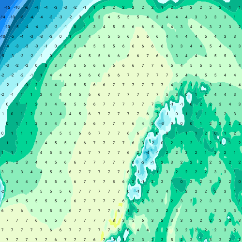

---

### aviation_numbers — Aviation temperature numbers

**Input:** [`test/input/aviation_numbers.get`](../../test/input/aviation_numbers.get)

```
GET /dali?customer=test&product=aviation_numbers&time=201503131200 HTTP/1.0
```

| Parameter | Value | Description |
|-----------|-------|-------------|
| `product` | `aviation_numbers` | Product JSON: [`test/dali/customers/test/products/aviation_numbers.json`](../../test/dali/customers/test/products/aviation_numbers.json) |
| `time` | `201503131200` | Valid time: 2015-03-13 12:00 UTC |

Renders ECMWF temperature isobands over the North Atlantic aviation area (EPSG:4326, 62.5–75°N, 15°W–37.5°E) and overlays integer temperature values at a 20×20 px grid with alternating 10-pixel row offsets (`ddx`).

**Output:**

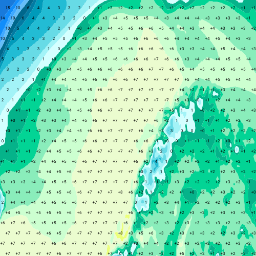

---

### aviation_numbers_multiple5 — Rounded-to-5 numbers

**Input:** [`test/input/aviation_numbers_multiple5.get`](../../test/input/aviation_numbers_multiple5.get)

```
GET /dali?customer=test&product=aviation_numbers_multiple5&time=201503131200 HTTP/1.0
```

| Parameter | Value | Description |
|-----------|-------|-------------|
| `product` | `aviation_numbers_multiple5` | Product JSON: [`test/dali/customers/test/products/aviation_numbers_multiple5.json`](../../test/dali/customers/test/products/aviation_numbers_multiple5.json) |

Like `aviation_numbers` but values are rounded to the nearest 5 (ICAO convention: temperatures reported in multiples of 5°C on SIGWX charts).

**Output:**


---

### synop_numbers — SYNOP observation values

**Input:** [`test/input/synop_numbers.get`](../../test/input/synop_numbers.get)

```
GET /dali?customer=test&product=synop_numbers&time=20081201T1200 HTTP/1.0
```

| Parameter | Value | Description |
|-----------|-------|-------------|
| `product` | `synop_numbers` | Product JSON: [`test/dali/customers/test/products/synop_numbers.json`](../../test/dali/customers/test/products/synop_numbers.json) |
| `time` | `20081201T1200` | Valid time: 2008-12-01 12:00 UTC |

Plots SYNOP observation values from the `pal_skandinavia` producer at station locations.

**Output:**

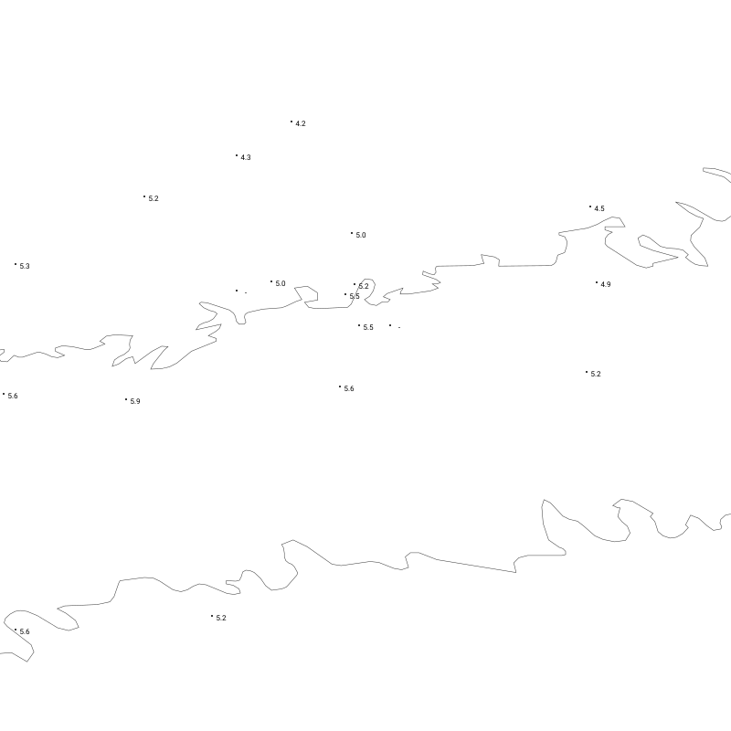

---

### monitoring — Health monitoring text

**Input:** [`test/input/monitoring.get`](../../test/input/monitoring.get)

```
GET /dali?customer=test&product=monitoring HTTP/1.0
```

| Parameter | Value | Description |
|-----------|-------|-------------|
| `product` | `monitoring` | Product JSON: [`test/dali/customers/test/products/monitoring.json`](../../test/dali/customers/test/products/monitoring.json) |

A minimal product that outputs a plain-text "OK" health-check response without requiring any weather data.  Used for liveness/readiness probes.

**Output:**


---

## Observation Positions and Keyword Selection

### latlon_positions — Lat/lon coordinate list

**Input:** [`test/input/latlon_positions.get`](../../test/input/latlon_positions.get)

```
GET /dali?customer=test&product=latlon_positions&time=201503131200 HTTP/1.0
```

| Parameter | Value | Description |
|-----------|-------|-------------|
| `product` | `latlon_positions` | Product JSON: [`test/dali/customers/test/products/latlon_positions.json`](../../test/dali/customers/test/products/latlon_positions.json) |

Plots observation values at positions specified as explicit latitude/longitude coordinate pairs in the product JSON.

**Output:**

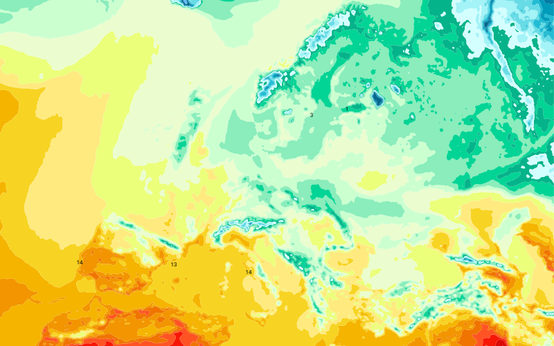

---

### latlon_positions_shifted — Positions with per-station label offset

**Input:** [`test/input/latlon_positions_shifted.get`](../../test/input/latlon_positions_shifted.get)

```
GET /dali?customer=test&product=latlon_positions_shifted&time=201503131200 HTTP/1.0
```

| Parameter | Value | Description |
|-----------|-------|-------------|
| `product` | `latlon_positions_shifted` | Product JSON: [`test/dali/customers/test/products/latlon_positions_shifted.json`](../../test/dali/customers/test/products/latlon_positions_shifted.json) |

Each coordinate entry includes an individual `dx`/`dy` offset for its label, allowing crowded stations to be legible without overlapping.

**Output:**


---

### keyword — Keyword-based station selection

**Input:** [`test/input/keyword.get`](../../test/input/keyword.get)

```
GET /dali?customer=test&product=keyword&time=201503131200 HTTP/1.0
```

| Parameter | Value | Description |
|-----------|-------|-------------|
| `product` | `keyword` | Product JSON: [`test/dali/customers/test/products/keyword.json`](../../test/dali/customers/test/products/keyword.json) |

Selects stations using a `keyword` field (e.g. a municipality or region name) instead of numeric IDs.  The server resolves the keyword to matching stations.

**Output:**


---

### keyword_shifted — Keyword stations with shifted labels

**Input:** [`test/input/keyword_shifted.get`](../../test/input/keyword_shifted.get)

```
GET /dali?customer=test&product=keyword_shifted&time=201503131200 HTTP/1.0
```

| Parameter | Value | Description |
|-----------|-------|-------------|
| `product` | `keyword_shifted` | Product JSON: [`test/dali/customers/test/products/keyword_shifted.json`](../../test/dali/customers/test/products/keyword_shifted.json) |

Same as `keyword` but with per-station label offsets (`dx`, `dy`) defined for each keyword entry.

**Output:**

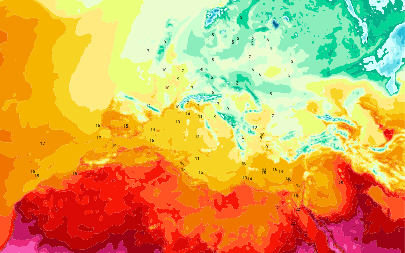

---

## Weather Symbols

### opendata_temperature_symbols — SmartMet symbols

**Input:** [`test/input/opendata_temperature_symbols.get`](../../test/input/opendata_temperature_symbols.get)

```
GET /dali?customer=test&product=opendata_temperature_symbols&time=20130805T1500 HTTP/1.0
```

| Parameter | Value | Description |
|-----------|-------|-------------|
| `product` | `opendata_temperature_symbols` | Product JSON: [`test/dali/customers/test/products/opendata_temperature_symbols.json`](../../test/dali/customers/test/products/opendata_temperature_symbols.json) |
| `time` | `20130805T1500` | Valid time: 2013-08-05 15:00 UTC |

Plots SmartMet weather symbols at station locations combined with temperature numbers.

**Output:**

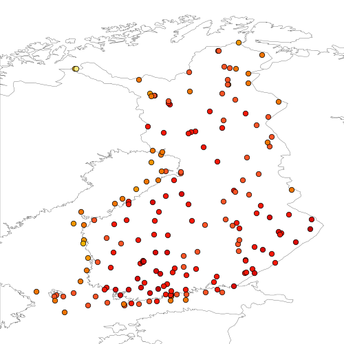

---

### opendata_temperature_symbols_oddmitime — Odd-minute valid time

**Input:** [`test/input/opendata_temperature_symbols_oddmitime.get`](../../test/input/opendata_temperature_symbols_oddmitime.get)

```
GET /dali?customer=test&product=opendata_temperature_symbols&time=20130805T1502 HTTP/1.0
```

| Parameter | Value | Description |
|-----------|-------|-------------|
| `time` | `20130805T1502` | Valid time: 15:02 UTC — not on the hour; tests nearest-time matching |

Tests that the system correctly snaps to the nearest available observation when the requested time is between observation steps.

**Output:**

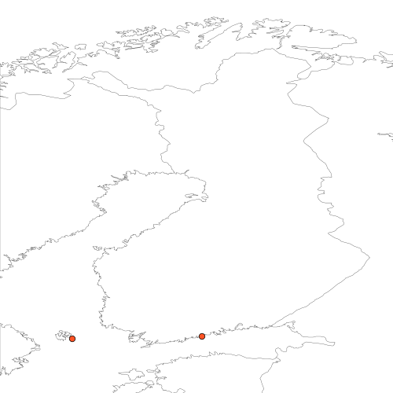

---

### opendata_temperature_symbols_oddmitime_interval_back — Time interval backward

**Input:** [`test/input/opendata_temperature_symbols_oddmitime_interval_back.get`](../../test/input/opendata_temperature_symbols_oddmitime_interval_back.get)

```
GET /dali?customer=test&product=opendata_temperature_symbols&time=20130805T1502&interval_start=2 HTTP/1.0
```

| Parameter | Value | Description |
|-----------|-------|-------------|
| `time` | `20130805T1502` | Non-round valid time |
| `interval_start` | `2` | Accept data up to 2 minutes before the requested time |

The `interval_start` parameter widens the time-matching window backward, useful for observations that arrive with a slight delay.

**Output:**


---

### opendata_temperature_symbols_oddmitime_interval_forward — Time interval forward

**Input:** [`test/input/opendata_temperature_symbols_oddmitime_interval_forward.get`](../../test/input/opendata_temperature_symbols_oddmitime_interval_forward.get)

```
GET /dali?customer=test&product=opendata_temperature_symbols&time=20130805T1455&interval_end=5 HTTP/1.0
```

| Parameter | Value | Description |
|-----------|-------|-------------|
| `time` | `20130805T1455` | Non-round valid time: 5 minutes before 15:00 |
| `interval_end` | `5` | Accept data up to 5 minutes after the requested time |

The `interval_end` parameter widens the window forward, allowing a request before the hour to still display the on-the-hour data.

**Output:**


---

### smartsymbol — SmartMet numeric symbol codes

**Input:** [`test/input/smartsymbol.get`](../../test/input/smartsymbol.get)

```
GET /dali?customer=test&product=smartsymbol&time=200808050300 HTTP/1.0
```

| Parameter | Value | Description |
|-----------|-------|-------------|
| `product` | `smartsymbol` | Product JSON: [`test/dali/customers/test/products/smartsymbol.json`](../../test/dali/customers/test/products/smartsymbol.json) |

Renders the `SmartSymbol` parameter (integer code) as SVG symbol graphics at station locations.  Each code maps to an SVG symbol ID loaded from the symbol set.

**Output:**

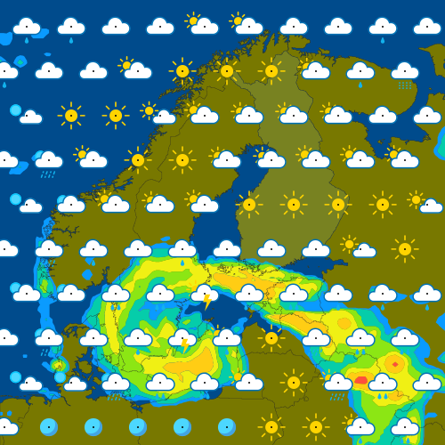

---

### smartsymbolnumber — Symbol codes as numbers

**Input:** [`test/input/smartsymbolnumber.get`](../../test/input/smartsymbolnumber.get)

```
GET /dali?customer=test&product=smartsymbolnumber&time=200808050300 HTTP/1.0
```

| Parameter | Value | Description |
|-----------|-------|-------------|
| `product` | `smartsymbolnumber` | Product JSON: [`test/dali/customers/test/products/smartsymbolnumber.json`](../../test/dali/customers/test/products/smartsymbolnumber.json) |

Plots the numeric `SmartSymbol` code as a text label (for debugging).

**Output:**


---

### weather — Standard weather symbols

**Input:** [`test/input/weather.get`](../../test/input/weather.get)

```
GET /dali?customer=test&product=weather&time=200808050300 HTTP/1.0
```

| Parameter | Value | Description |
|-----------|-------|-------------|
| `product` | `weather` | Product JSON: [`test/dali/customers/test/products/weather.json`](../../test/dali/customers/test/products/weather.json) |

Renders a set of weather symbols loaded from SVG symbol files.  The product combines a map background with symbol layer.

**Output:**

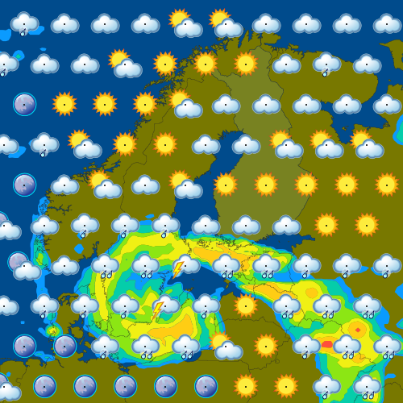

---

### weather-cssdef — Inline CSS override via URL

**Input:** [`test/input/weather-cssdef.get`](../../test/input/weather-cssdef.get)

```
GET /dali?customer=test&product=weather&time=200808050300
    &defs.css.test%2Fsymbols%2Fdot=data:,.Dot%20%7B%20fill%3A%20yellow%3B%20stroke%3A%20none%20%7D%0A HTTP/1.0
```

| Parameter | Value (URL-decoded) | Description |
|-----------|---------------------|-------------|
| `defs.css.test/symbols/dot` | `data:,.Dot { fill: yellow; stroke: none }` | Inlines a CSS rule for the `dot` symbol class via a data-URL; overrides the file-based CSS |

The `defs.css.{name}=data:,...` pattern allows injecting arbitrary CSS rules through the URL without modifying product files.

**Output:**


---

### weather-symbol-dataurl-get — Inline SVG symbol override

**Input:** [`test/input/weather-symbol-dataurl-get.get`](../../test/input/weather-symbol-dataurl-get.get)

```
GET /dali?customer=test&product=weather-base64-symbol&time=200808050300
    &defs.symbols.weather%2F1_II%2F1="data:;base64,PHN5bWJvbC..." HTTP/1.0
```

| Parameter | Value (URL-decoded) | Description |
|-----------|---------------------|-------------|
| `defs.symbols.weather/1_II/1` | `data:;base64,<base64-SVG>` | Replaces the SVG symbol `weather/1_II/1` with an inline base64-encoded SVG symbol (an orange circle) |

Allows runtime replacement of individual symbols through the URL, e.g. for A/B testing or custom client-specific iconography.

**Output:**


---

### weather-base64json-symbol — Base64 symbol from JSON

**Input:** [`test/input/weather-base64json-symbol.get`](../../test/input/weather-base64json-symbol.get)

```
GET /dali?customer=test&product=weather-base64-symbol&time=200808050300 HTTP/1.0
```

| Parameter | Value | Description |
|-----------|-------|-------------|
| `product` | `weather-base64-symbol` | Product JSON: [`test/dali/customers/test/products/weather-base64-symbol.json`](../../test/dali/customers/test/products/weather-base64-symbol.json) |

The product JSON itself specifies symbols using `data:;base64,…` data URLs (base64-encoded SVG), bypassing the filesystem symbol store.  Tests that the server can decode and embed inline symbols from the product definition.

**Output:**

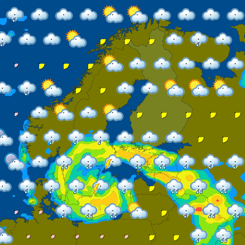

---

### symbols_coloured — Weather symbols in multiple projections

The same `symbols_coloured` product is rendered in four different projections using the `projection.crs` URL override:

**Inputs:**
- [`test/input/symbols_coloured_native.get`](../../test/input/symbols_coloured_native.get) — data native CRS
- [`test/input/symbols_coloured_fin.get`](../../test/input/symbols_coloured_fin.get) — `projection.crs=EPSG:3067`
- [`test/input/symbols_coloured_webmercator.get`](../../test/input/symbols_coloured_webmercator.get) — `projection.crs=EPSG:3857`
- [`test/input/symbols_coloured_wgs84.get`](../../test/input/symbols_coloured_wgs84.get) — `projection.crs=WGS84`

| Parameter | Value | Description |
|-----------|-------|-------------|
| `product` | `symbols_coloured` | Product JSON: [`test/dali/customers/test/products/symbols_coloured.json`](../../test/dali/customers/test/products/symbols_coloured.json) |
| `projection.crs` | *(varies)* | Overrides the product's CRS on-the-fly |

Demonstrates that `projection.crs` can reproject any product at request time without modifying the JSON.

| Projection | Output |
|------------|--------|
| Native CRS | 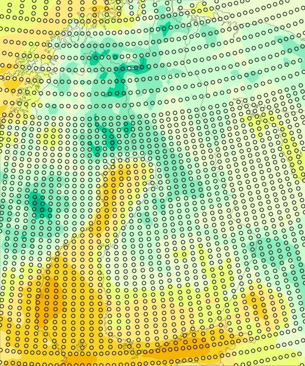 |
| EPSG:3067 (ETRS-TM35FIN) | 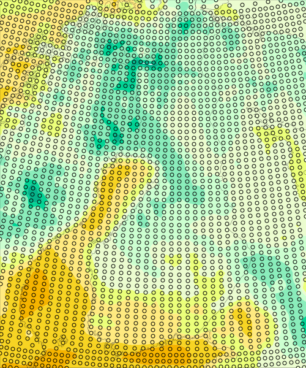 |
| EPSG:3857 (WebMercator) | 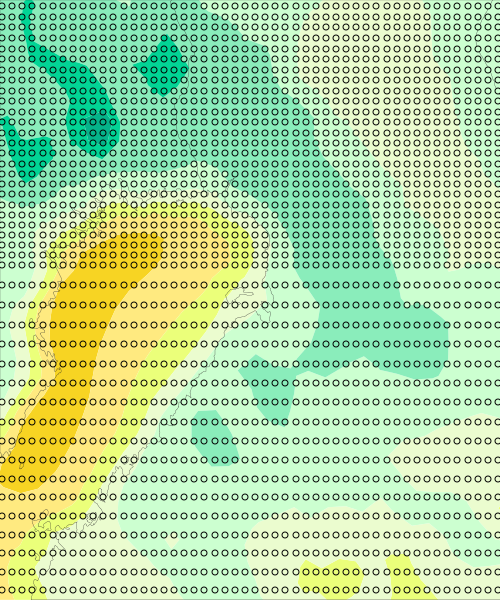 |
| WGS84 | 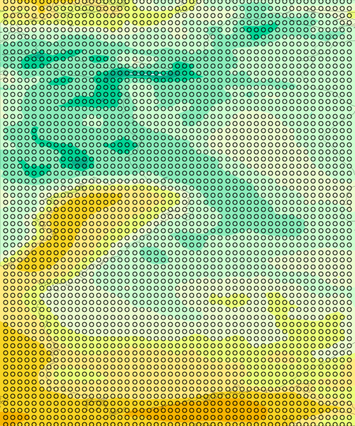 |

---

## Flash and Lightning Symbols

### flash_symbols — Combined flash symbols

**Input:** [`test/input/flash_symbols.get`](../../test/input/flash_symbols.get)

```
GET /dali?customer=test&product=flash_symbols&time=20130805T1500 HTTP/1.0
```

| Parameter | Value | Description |
|-----------|-------|-------------|
| `product` | `flash_symbols` | Product JSON: [`test/dali/customers/test/products/flash_symbols.json`](../../test/dali/customers/test/products/flash_symbols.json) |
| `time` | `20130805T1500` | Valid time: 2013-08-05 15:00 UTC |

Plots all flash (lightning) strike locations (cloud-to-ground and cloud-to-cloud) as symbols from the `flash` producer.

**Output:**

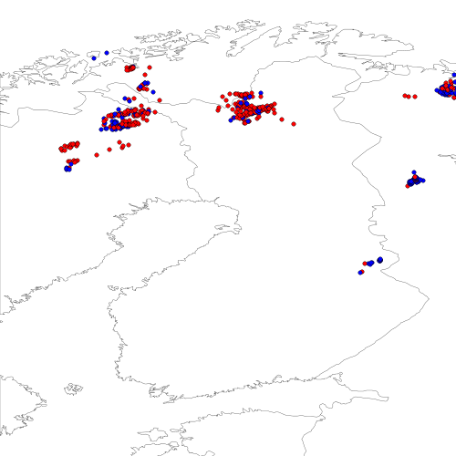

---

### flash_cloud_symbols — Cloud flash only

**Input:** [`test/input/flash_cloud_symbols.get`](../../test/input/flash_cloud_symbols.get)

```
GET /dali?customer=test&product=flash_cloud_symbols&time=20130805T1500 HTTP/1.0
```

| Parameter | Value | Description |
|-----------|-------|-------------|
| `product` | `flash_cloud_symbols` | Product JSON: [`test/dali/customers/test/products/flash_cloud_symbols.json`](../../test/dali/customers/test/products/flash_cloud_symbols.json) |

Plots only intra-cloud (IC) lightning flashes, filtering out cloud-to-ground (CG) strikes.

**Output:**

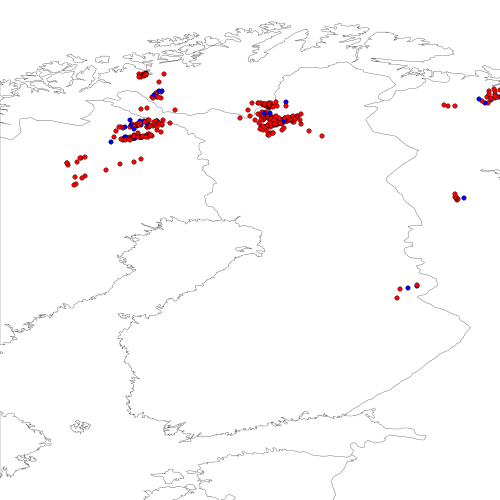

---

### flash_ground_symbols — Ground flash only

**Input:** [`test/input/flash_ground_symbols.get`](../../test/input/flash_ground_symbols.get)

```
GET /dali?customer=test&product=flash_ground_symbols&time=20130805T1500 HTTP/1.0
```

| Parameter | Value | Description |
|-----------|-------|-------------|
| `product` | `flash_ground_symbols` | Product JSON: [`test/dali/customers/test/products/flash_ground_symbols.json`](../../test/dali/customers/test/products/flash_ground_symbols.json) |

Plots only cloud-to-ground (CG) lightning strikes.

**Output:**

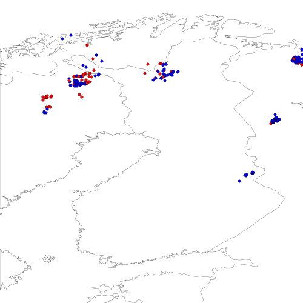

---

### flash_cloud_and_ground_symbols — Separate symbol types

**Input:** [`test/input/flash_cloud_and_ground_symbols.get`](../../test/input/flash_cloud_and_ground_symbols.get)

```
GET /dali?customer=test&product=flash_cloud_and_ground_symbols&time=20130805T1500 HTTP/1.0
```

| Parameter | Value | Description |
|-----------|-------|-------------|
| `product` | `flash_cloud_and_ground_symbols` | Product JSON: [`test/dali/customers/test/products/flash_cloud_and_ground_symbols.json`](../../test/dali/customers/test/products/flash_cloud_and_ground_symbols.json) |

Uses two symbol layers (one for IC, one for CG) with distinct symbol shapes and colours in a single product.

**Output:**

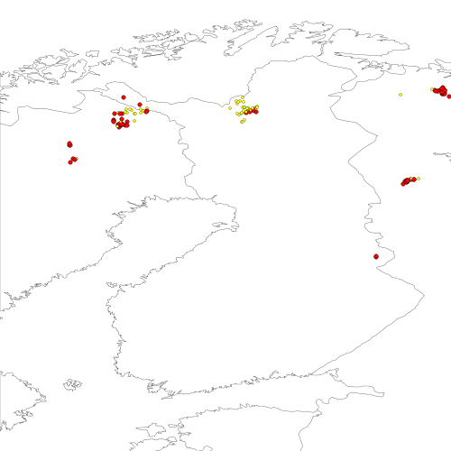

---

## Wind Arrows

### wind — Basic wind arrows

**Input:** [`test/input/wind.get`](../../test/input/wind.get)

```
GET /dali?customer=test&product=wind&time=200808050300 HTTP/1.0
```

| Parameter | Value | Description |
|-----------|-------|-------------|
| `product` | `wind` | Product JSON: [`test/dali/customers/test/products/wind.json`](../../test/dali/customers/test/products/wind.json) |

Renders wind direction arrows from `pal_skandinavia` using `"direction"` and `"speed"` parameters.  Arrow length scales with wind speed.

**Output:**


---

### wind_margin — Wind arrows with map margin

**Input:** [`test/input/wind_margin.get`](../../test/input/wind_margin.get)

```
GET /dali?customer=test&product=wind_margin&time=200808050300 HTTP/1.0
```

| Parameter | Value | Description |
|-----------|-------|-------------|
| `product` | `wind_margin` | Product JSON: [`test/dali/customers/test/products/wind_margin.json`](../../test/dali/customers/test/products/wind_margin.json) |

Same wind arrows but with a map area `margin` setting that extends the data area outside the nominal bounding box.

**Output:**

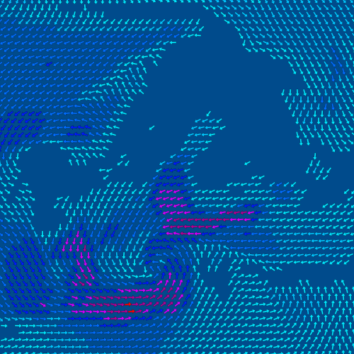

---

### wind_minrotationspeed — Arrow rotation threshold

**Input:** [`test/input/wind_minrotationspeed.get`](../../test/input/wind_minrotationspeed.get)

```
GET /dali?customer=test&product=wind&time=200808050300&l3.minrotationspeed=10 HTTP/1.0
```

| Parameter | Value | Description |
|-----------|-------|-------------|
| `l3.minrotationspeed` | `10` | Arrows for layer `l3` are only rotated (to point in the wind direction) when wind speed exceeds 10 m/s; calmer arrows remain pointing north |

The `minrotationspeed` threshold prevents cluttered arrow directions at very low wind speeds.

**Output:**


---

### wind_scaled — Scaled wind arrows

**Input:** [`test/input/wind_scaled.get`](../../test/input/wind_scaled.get)

```
GET /dali?customer=test&product=wind_scaled&time=200808050300 HTTP/1.0
```

| Parameter | Value | Description |
|-----------|-------|-------------|
| `product` | `wind_scaled` | Product JSON: [`test/dali/customers/test/products/wind_scaled.json`](../../test/dali/customers/test/products/wind_scaled.json) |

Uses an explicit `"scale"` factor to map wind speed to arrow length.

**Output:**


---

### wind_without_speed — Direction-only arrows

**Input:** [`test/input/wind_without_speed.get`](../../test/input/wind_without_speed.get)

```
GET /dali?customer=test&product=wind_without_speed&time=200808050300 HTTP/1.0
```

| Parameter | Value | Description |
|-----------|-------|-------------|
| `product` | `wind_without_speed` | Product JSON: [`test/dali/customers/test/products/wind_without_speed.json`](../../test/dali/customers/test/products/wind_without_speed.json) |

Arrows show direction only; all arrows are rendered at the same fixed length since no speed parameter is provided.

**Output:**

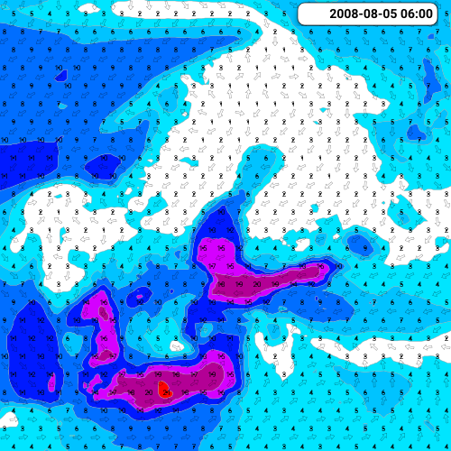

---

### hirlam_wind — HIRLAM wind (direction + speed)

**Input:** [`test/input/hirlam_wind.get`](../../test/input/hirlam_wind.get)

```
GET /dali?customer=test&product=hirlam_wind&time=201804060600 HTTP/1.0
```

| Parameter | Value | Description |
|-----------|-------|-------------|
| `product` | `hirlam_wind` | Product JSON: [`test/dali/customers/test/products/hirlam_wind.json`](../../test/dali/customers/test/products/hirlam_wind.json) |
| `time` | `201804060600` | Valid time: 2018-04-06 06:00 UTC |

Arrow layer using meteorological `"direction": "WindDirection"` and `"speed": "WindSpeedMS"` parameters from the HIRLAM NWP model.

**Output:**

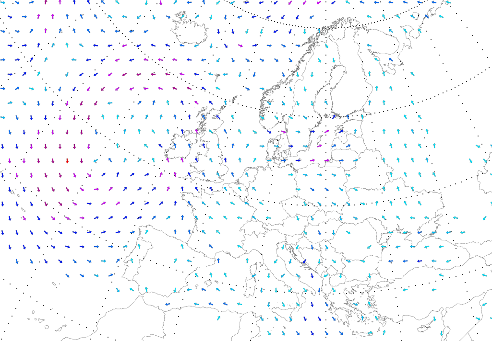

---

### hirlam_uv — HIRLAM wind (U/V components)

**Input:** [`test/input/hirlam_uv.get`](../../test/input/hirlam_uv.get)

```
GET /dali?customer=test&product=hirlam_uv&time=201804060600 HTTP/1.0
```

| Parameter | Value | Description |
|-----------|-------|-------------|
| `product` | `hirlam_uv` | Product JSON: [`test/dali/customers/test/products/hirlam_uv.json`](../../test/dali/customers/test/products/hirlam_uv.json) |

Arrow layer using Cartesian wind components `"u": "WindUMS"` and `"v": "WindVMS"` instead of direction/speed.  The server converts U/V to direction and magnitude internally.

**Output:**

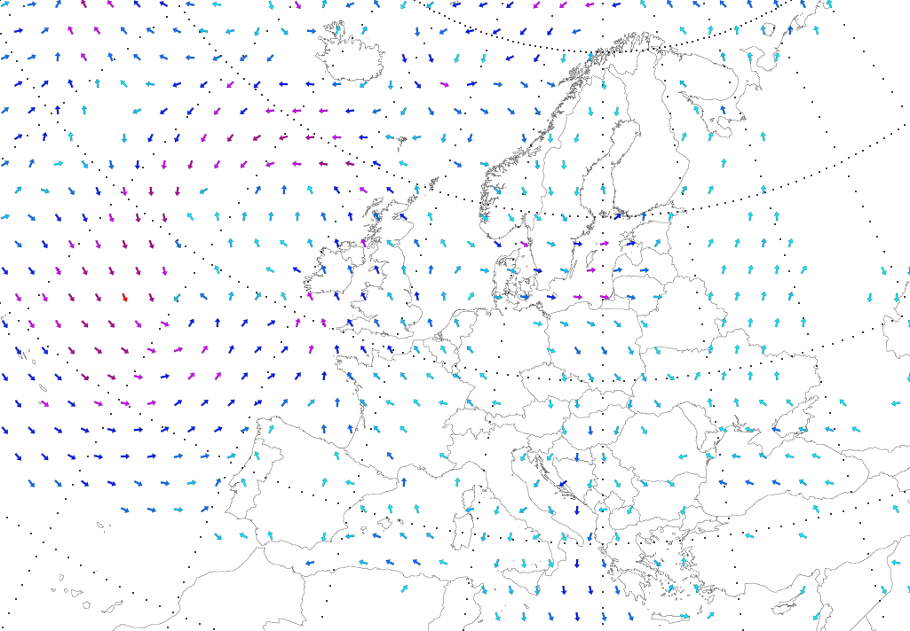

---

## Wind Barbs and Wind Roses

### windbarb — Classic wind barbs

**Input:** [`test/input/windbarb.get`](../../test/input/windbarb.get)

```
GET /dali?customer=test&product=windbarb&time=200808050300 HTTP/1.0
```

| Parameter | Value | Description |
|-----------|-------|-------------|
| `product` | `windbarb` | Product JSON: [`test/dali/customers/test/products/windbarb.json`](../../test/dali/customers/test/products/windbarb.json) |

Renders standard meteorological wind barbs (staff + barbs/pennants encoding speed in knots).

**Output:**

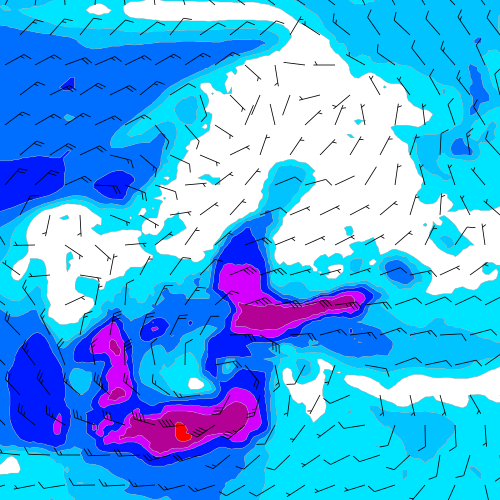

---

### windrose — Wind roses at stations

**Input:** [`test/input/windrose.get`](../../test/input/windrose.get)

```
GET /dali?customer=test&product=windrose&time=2013-08-05 HTTP/1.0
```

| Parameter | Value | Description |
|-----------|-------|-------------|
| `product` | `windrose` | Product JSON: [`test/dali/customers/test/products/windrose.json`](../../test/dali/customers/test/products/windrose.json) |
| `time` | `2013-08-05` | Valid date: 2013-08-05 (ISO 8601 date-only format) |

Renders wind roses at named coastal stations showing frequency distribution of wind direction and speed classes.  Each rose uses `starttimeoffset`/`endtimeoffset` to aggregate over a 24-hour window.  Station titles and connectors are customisable via CSS classes.

**Output:**

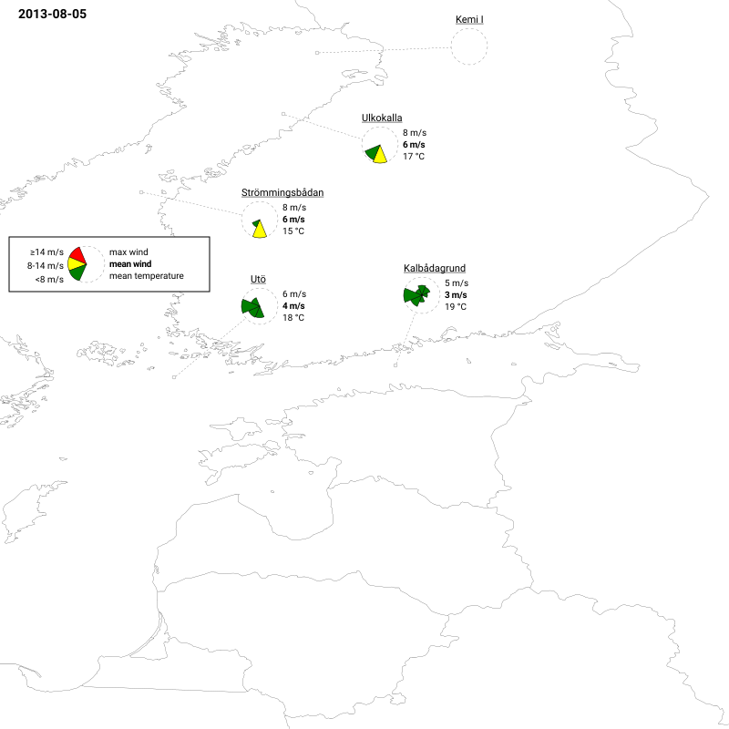

---

## WAFS Aviation Charts

WAFS (World Area Forecast System) products use ICAO aviation weather data at pressure levels.

### wafs_temperature — Upper-level temperature

**Input:** [`test/input/wafs_temperature.get`](../../test/input/wafs_temperature.get)

```
GET /dali?customer=test&product=wafs_temperature&time=201601191800 HTTP/1.0
```

| Parameter | Value | Description |
|-----------|-------|-------------|
| `product` | `wafs_temperature` | Product JSON: [`test/dali/customers/test/products/wafs_temperature.json`](../../test/dali/customers/test/products/wafs_temperature.json) |
| `time` | `201601191800` | Valid time: 2016-01-19 18:00 UTC |

Temperature isobands at a WAFS pressure level (flight level) over the North Atlantic aviation area.

**Output:**

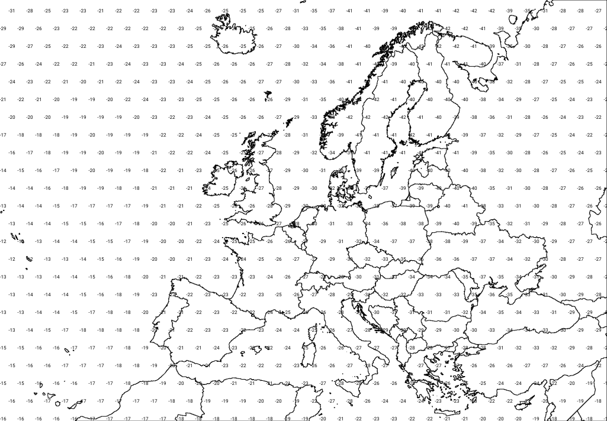

---

### wafs_wind — Upper-level wind arrows

**Input:** [`test/input/wafs_wind.get`](../../test/input/wafs_wind.get)

```
GET /dali?customer=test&product=wafs_wind&time=201601191800 HTTP/1.0
```

| Parameter | Value | Description |
|-----------|-------|-------------|
| `product` | `wafs_wind` | Product JSON: [`test/dali/customers/test/products/wafs_wind.json`](../../test/dali/customers/test/products/wafs_wind.json) |

Wind arrows at WAFS pressure level overlaid on a base map.

**Output:**

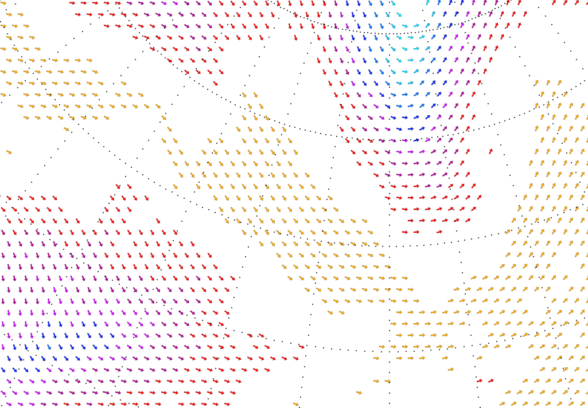

---

### wafs_leveldata — Level data display

**Input:** [`test/input/wafs_leveldata.get`](../../test/input/wafs_leveldata.get)

```
GET /dali?customer=test&product=wafs_leveldata&time=201601191800 HTTP/1.0
```

| Parameter | Value | Description |
|-----------|-------|-------------|
| `product` | `wafs_leveldata` | Product JSON: [`test/dali/customers/test/products/wafs_leveldata.json`](../../test/dali/customers/test/products/wafs_leveldata.json) |

Displays numeric values at grid points for WAFS level data.

**Output:**

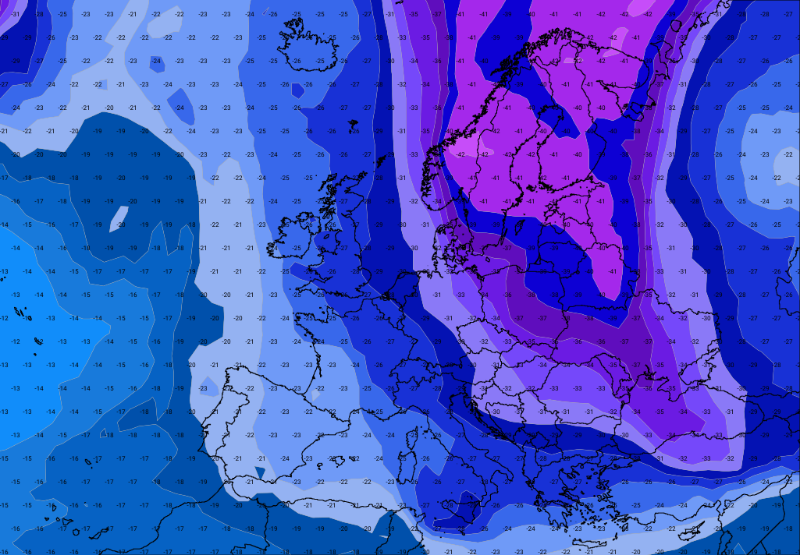

---

### wafs_windbarb — WAFS wind barbs

**Input:** [`test/input/wafs_windbarb.get`](../../test/input/wafs_windbarb.get)

```
GET /dali?customer=test&product=wafs_windbarb&time=201601191800 HTTP/1.0
```

| Parameter | Value | Description |
|-----------|-------|-------------|
| `product` | `wafs_windbarb` | Product JSON: [`test/dali/customers/test/products/wafs_windbarb.json`](../../test/dali/customers/test/products/wafs_windbarb.json) |

Standard wind barbs at a WAFS flight level.

**Output:**

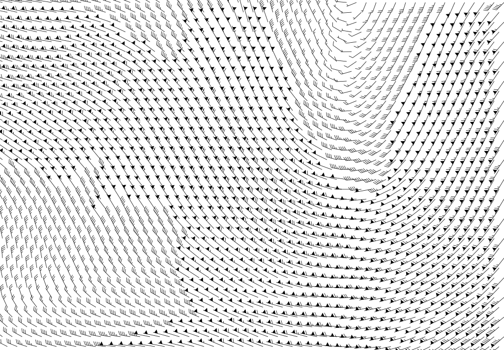

---

### wafs_windbarb_shifted — Wind barbs with label offset

**Input:** [`test/input/wafs_windbarb_shifted.get`](../../test/input/wafs_windbarb_shifted.get)

```
GET /dali?customer=test&product=wafs_windbarb_shifted&time=201601191800 HTTP/1.0
```

| Parameter | Value | Description |
|-----------|-------|-------------|
| `product` | `wafs_windbarb_shifted` | Product JSON: [`test/dali/customers/test/products/wafs_windbarb_shifted.json`](../../test/dali/customers/test/products/wafs_windbarb_shifted.json) |

WAFS wind barbs with a global label offset (`dx`, `dy`) applied to all barb positions.

**Output:**

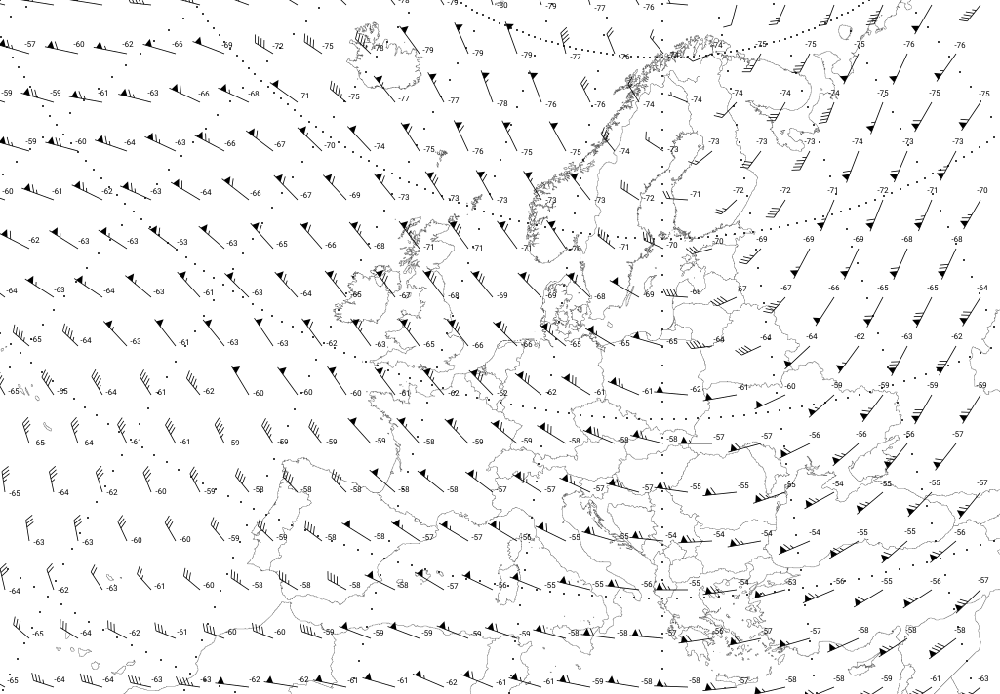

---

### wafs_windbarb_graticulefill — Wind barbs with graticule fill

**Input:** [`test/input/wafs_windbarb_graticulefill.get`](../../test/input/wafs_windbarb_graticulefill.get)

```
GET /dali?customer=test&product=wafs_windbarb_graticulefill&time=201601191800 HTTP/1.0
```

| Parameter | Value | Description |
|-----------|-------|-------------|
| `product` | `wafs_windbarb_graticulefill` | Product JSON: [`test/dali/customers/test/products/wafs_windbarb_graticulefill.json`](../../test/dali/customers/test/products/wafs_windbarb_graticulefill.json) |

Adds temperature-coloured filled rectangles in the graticule grid cells behind the wind barbs — a compact SIGWX-style layout.

**Output:**

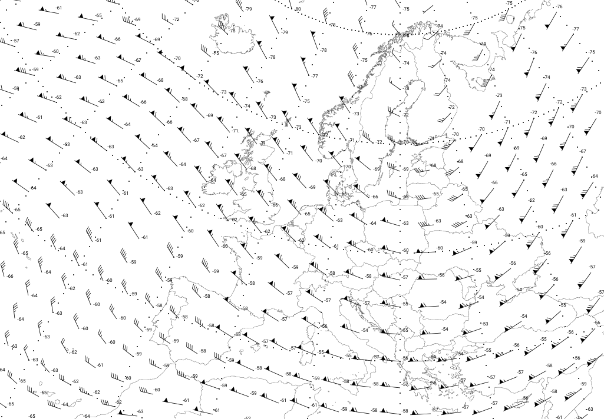

---

## Observations with Wind and Temperature

### opendata_meteorological_wind_keyword — Wind by keyword

**Input:** [`test/input/opendata_meteorological_wind_keyword.get`](../../test/input/opendata_meteorological_wind_keyword.get)

```
GET /dali?customer=test&product=opendata_meteorological_wind_keyword&time=20130805T1500 HTTP/1.0
```

| Parameter | Value | Description |
|-----------|-------|-------------|
| `product` | `opendata_meteorological_wind_keyword` | Product JSON: [`test/dali/customers/test/products/opendata_meteorological_wind_keyword.json`](../../test/dali/customers/test/products/opendata_meteorological_wind_keyword.json) |

Wind arrows at keyword-selected stations from the `opendata` producer.

**Output:**


---

### opendata_meteorological_wind_keyword_plustemperatures — Wind + temperature

**Input:** [`test/input/opendata_meteorological_wind_keyword_plustemperatures.get`](../../test/input/opendata_meteorological_wind_keyword_plustemperatures.get)

```
GET /dali?customer=test&product=opendata_meteorological_wind_keyword_plustemperatures&time=20130805T1500 HTTP/1.0
```

| Parameter | Value | Description |
|-----------|-------|-------------|
| `product` | `opendata_meteorological_wind_keyword_plustemperatures` | Product JSON: [`test/dali/customers/test/products/opendata_meteorological_wind_keyword_plustemperatures.json`](../../test/dali/customers/test/products/opendata_meteorological_wind_keyword_plustemperatures.json) |

Combines wind arrows and temperature numbers at keyword-selected stations.

**Output:**


---

### opendata_meteorological_wind_grid — Wind on grid

**Input:** [`test/input/opendata_meteorological_wind_grid.get`](../../test/input/opendata_meteorological_wind_grid.get)

```
GET /dali?customer=test&product=opendata_meteorological_wind_grid&time=20130805T1500 HTTP/1.0
```

| Parameter | Value | Description |
|-----------|-------|-------------|
| `product` | `opendata_meteorological_wind_grid` | Product JSON: [`test/dali/customers/test/products/opendata_meteorological_wind_grid.json`](../../test/dali/customers/test/products/opendata_meteorological_wind_grid.json) |

Wind arrows placed at regular pixel-grid intervals (`layout: "grid"`), thinning the station network for legibility.

**Output:**

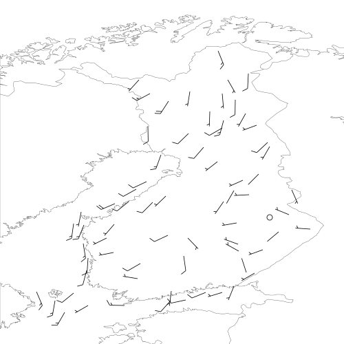

---

### opendata_meteorological_wind_data_plustemperatures — Wind + temperature data

**Input:** [`test/input/opendata_meteorological_wind_data_plustemperatures.get`](../../test/input/opendata_meteorological_wind_data_plustemperatures.get)

```
GET /dali?customer=test&product=opendata_meteorological_wind_data_plustemperatures&time=20130805T1500 HTTP/1.0
```

| Parameter | Value | Description |
|-----------|-------|-------------|
| `product` | `opendata_meteorological_wind_data_plustemperatures` | Product JSON: [`test/dali/customers/test/products/opendata_meteorological_wind_data_plustemperatures.json`](../../test/dali/customers/test/products/opendata_meteorological_wind_data_plustemperatures.json) |

Combines wind arrows and temperature numbers sourced from the same OpenData observation query.

**Output:**

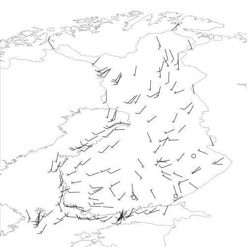

---

### opendata_meteorological_wind_data_plustemperatures_aggregate_max — Time-aggregated max wind

**Input:** [`test/input/opendata_meteorological_wind_data_plustemperatures_aggregate_max.get`](../../test/input/opendata_meteorological_wind_data_plustemperatures_aggregate_max.get)

```
GET /dali?customer=test&product=opendata_meteorological_wind_data_plustemperatures_aggregate_max&time=20130805T1500 HTTP/1.0
```

| Parameter | Value | Description |
|-----------|-------|-------------|
| `product` | `opendata_meteorological_wind_data_plustemperatures_aggregate_max` | Product JSON: [`test/dali/customers/test/products/opendata_meteorological_wind_data_plustemperatures_aggregate_max.json`](../../test/dali/customers/test/products/opendata_meteorological_wind_data_plustemperatures_aggregate_max.json) |

Uses SmartMet time-aggregation function syntax to compute maximum wind speed over a trailing 12-hour window: `"speed": "nanmax_t(WindSpeedMS:12h:0h)"`.  The `nanmax_t` function aggregates over the time range ignoring NaN values.

**Output:**


---

## Heatmap

### heatmap — Kernel-density heatmap

**Input:** [`test/input/heatmap.get`](../../test/input/heatmap.get)

```
GET /dali?customer=test&product=heatmap&time=20130805T1500&l.heatmap.kernel=exp&l.heatmap.radius=40&l.heatmap.deviation=4 HTTP/1.0
```

| Parameter | Value | Description |
|-----------|-------|-------------|
| `product` | `heatmap` | Product JSON: [`test/dali/customers/test/products/heatmap.json`](../../test/dali/customers/test/products/heatmap.json) |
| `time` | `20130805T1500` | Valid time: 2013-08-05 15:00 UTC |
| `l.heatmap.kernel` | `exp` | Kernel function for density estimation (`exp` = exponential decay) |
| `l.heatmap.radius` | `40` | Override: kernel radius in pixels (product default is 20) |
| `l.heatmap.deviation` | `4` | Override: kernel deviation parameter (product default is 10.0) |

The heatmap is generated by an `isoband` layer with a `"heatmap"` sub-block specifying `resolution`, `radius`, `kernel`, and `deviation`.  A kernel-density surface is computed from the observation point locations and then rendered as isobands.

**Output:**

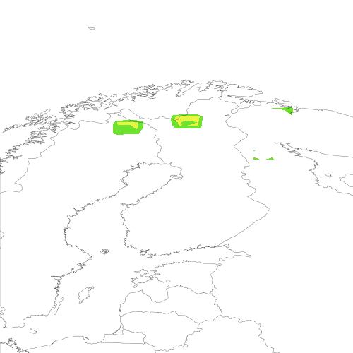

---

## Hovmoeller Diagrams

Hovmoeller diagrams show a meteorological parameter plotted over two axes, one of which is time.

### hovmoeller_geoph500 — Geopotential: time × longitude

**Input:** [`test/input/hovmoeller_geoph500.get`](../../test/input/hovmoeller_geoph500.get)

```
GET /dali?customer=test&product=hovmoeller_geoph500 HTTP/1.0
```

| Parameter | Value | Description |
|-----------|-------|-------------|
| `product` | `hovmoeller_geoph500` | Product JSON: [`test/dali/customers/test/products/hovmoeller_geoph500.json`](../../test/dali/customers/test/products/hovmoeller_geoph500.json) |

`"direction": "time_lon"` — time on Y-axis, longitude on X-axis at fixed `"latitude": 60.0`.  Plots 500 hPa geopotential height isobands over `lon_min`/`lon_max` = 5°–35°E.

**Output:**

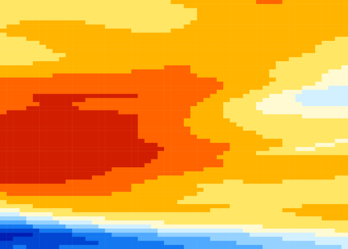

---

### hovmoeller_geoph500_time_lat — Geopotential: time × latitude

**Input:** [`test/input/hovmoeller_geoph500_time_lat.get`](../../test/input/hovmoeller_geoph500_time_lat.get)

```
GET /dali?customer=test&product=hovmoeller_geoph500_time_lat HTTP/1.0
```

| Parameter | Value | Description |
|-----------|-------|-------------|
| `product` | `hovmoeller_geoph500_time_lat` | Product JSON: [`test/dali/customers/test/products/hovmoeller_geoph500_time_lat.json`](../../test/dali/customers/test/products/hovmoeller_geoph500_time_lat.json) |

`"direction": "time_lat"` — time on Y-axis, latitude on X-axis at fixed `"longitude": 20.0`.

**Output:**

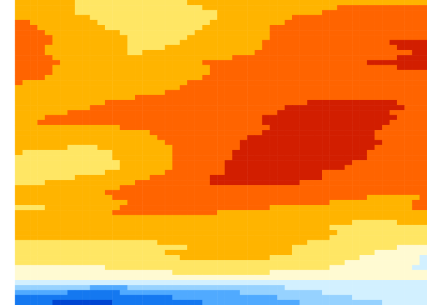

---

### hovmoeller_temperature_time_level — Temperature: time × pressure level

**Input:** [`test/input/hovmoeller_temperature_time_level.get`](../../test/input/hovmoeller_temperature_time_level.get)

```
GET /dali?customer=test&product=hovmoeller_temperature_time_level HTTP/1.0
```

| Parameter | Value | Description |
|-----------|-------|-------------|
| `product` | `hovmoeller_temperature_time_level` | Product JSON: [`test/dali/customers/test/products/hovmoeller_temperature_time_level.json`](../../test/dali/customers/test/products/hovmoeller_temperature_time_level.json) |

`"direction": "time_level"` — time on X-axis, pressure level on Y-axis at a fixed geographic point.  Shows the vertical temperature structure over time (a time-height cross-section).

**Output:**

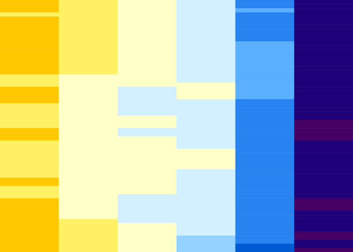

---

## Graticule

### graticule — Basic lat/lon grid

**Input:** [`test/input/graticule.get`](../../test/input/graticule.get)

```
GET /dali?customer=test&product=graticule HTTP/1.0
```

| Parameter | Value | Description |
|-----------|-------|-------------|
| `product` | `graticule` | Product JSON: [`test/dali/customers/test/products/graticule.json`](../../test/dali/customers/test/products/graticule.json) |

Two overlapping grids: a fine 1° grid (light, 0.2 px) skipping 10° multiples, and a coarse 10° grid (dark, 0.5 px).  Projection is inferred from the `kap` producer's native CRS.

**Output:**

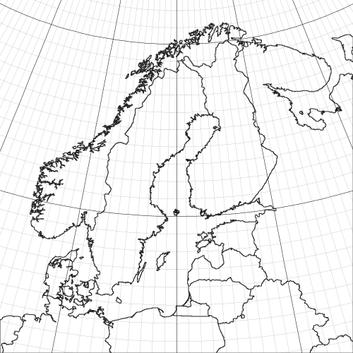

---

### graticule_goode — Graticule in Goode projection

**Input:** [`test/input/graticule_goode.get`](../../test/input/graticule_goode.get)

```
GET /dali?customer=test&product=graticule_goode HTTP/1.0
```

| Parameter | Value | Description |
|-----------|-------|-------------|
| `product` | `graticule_goode` | Product JSON: [`test/dali/customers/test/products/graticule_goode.json`](../../test/dali/customers/test/products/graticule_goode.json) |

A 10° graticule in the [Goode Interrupted Homolosine](https://proj.org/en/stable/operations/projections/igh.html) projection (`+proj=igh`).  Tests correct handling across the projection's interior discontinuities.

**Output:**

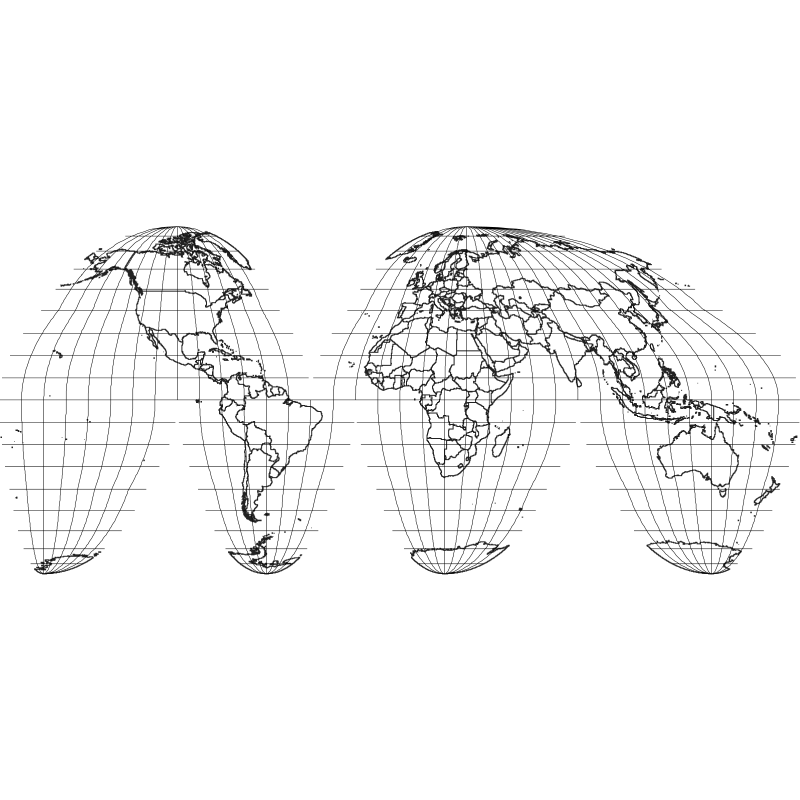

---

### graticule_num_center — Centred labels

**Input:** [`test/input/graticule_num_center.get`](../../test/input/graticule_num_center.get)

```
GET /dali?customer=test&product=graticule_num_center HTTP/1.0
```

| Parameter | Value | Description |
|-----------|-------|-------------|
| `product` | `graticule_num_center` | Product JSON: [`test/dali/customers/test/products/graticule_num_center.json`](../../test/dali/customers/test/products/graticule_num_center.json) |

Graticule with `"labels": {"layout": "center"}` — degree values placed at the centres of grid lines with a rectangle background.

**Output:**

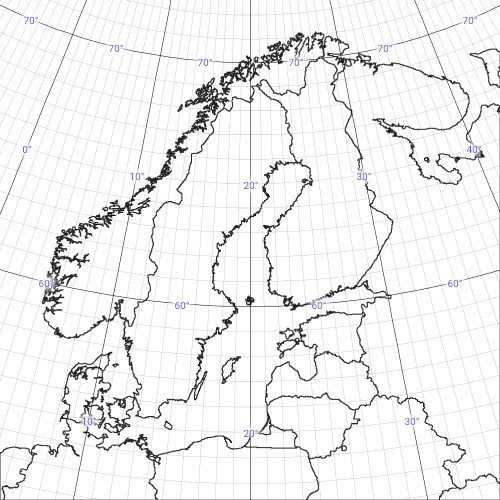

---

### graticule_num_center_edge — Edge-centred labels

**Input:** [`test/input/graticule_num_center_edge.get`](../../test/input/graticule_num_center_edge.get)

```
GET /dali?customer=test&product=graticule_num_edge_center HTTP/1.0
```

| Parameter | Value | Description |
|-----------|-------|-------------|
| `product` | `graticule_num_edge_center` | Product JSON: [`test/dali/customers/test/products/graticule_num_edge_center.json`](../../test/dali/customers/test/products/graticule_num_edge_center.json) |

Graticule with `"layout": "edge_center"` — labels placed at the mid-point of each grid line where it intersects the map edge (frame), with a bordered rectangle background.

**Output:**

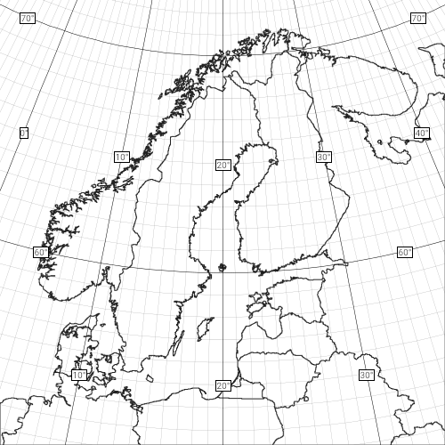

---

### graticule_num_cross — Crossing-point labels

**Input:** [`test/input/graticule_num_cross.get`](../../test/input/graticule_num_cross.get)

```
GET /dali?customer=test&product=graticule_num_cross HTTP/1.0
```

| Parameter | Value | Description |
|-----------|-------|-------------|
| `product` | `graticule_num_cross` | Product JSON: [`test/dali/customers/test/products/graticule_num_cross.json`](../../test/dali/customers/test/products/graticule_num_cross.json) |

Graticule with `"layout": "cross"` — labels placed at every intersection of latitude and longitude grid lines.

**Output:**


---

### graticule_ticks — Tick marks at frame

**Input:** [`test/input/graticule_ticks.get`](../../test/input/graticule_ticks.get)

```
GET /dali?customer=test&product=graticule_ticks HTTP/1.0
```

| Parameter | Value | Description |
|-----------|-------|-------------|
| `product` | `graticule_ticks` | Product JSON: [`test/dali/customers/test/products/graticule_ticks.json`](../../test/dali/customers/test/products/graticule_ticks.json) |

Uses `"layout": "ticks"` to draw only short tick marks at the map border where grid lines intersect, without drawing the full grid lines across the map.

**Output:**

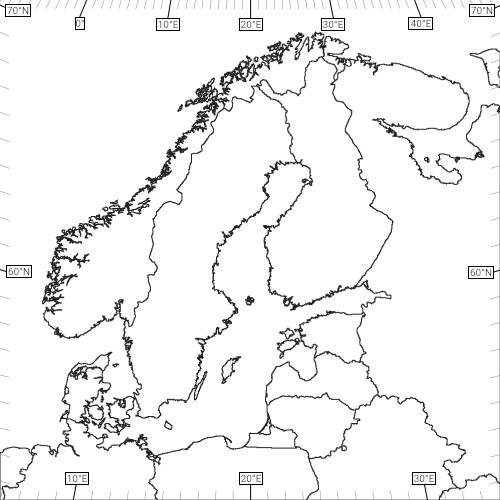

---

## Circles Layer

The `circle` layer type draws SVG circles at named geographic locations.

### circles — Concentric circles at cities

**Input:** [`test/input/circles.get`](../../test/input/circles.get)

```
GET /dali?customer=test&product=circles&time=201503131200 HTTP/1.0
```

| Parameter | Value | Description |
|-----------|-------|-------------|
| `product` | `circles` | Product JSON: [`test/dali/customers/test/products/circles.json`](../../test/dali/customers/test/products/circles.json) |
| `time` | `201503131200` | Valid time: 2015-03-13 12:00 UTC |

Draws concentric rings around named cities (Helsinki, Tampere, Turku) over a Natural Earth map in EPSG:3035 (ETRS-LAEA).  Each `circle` layer entry specifies a `name` (resolved to coordinates via a geocoder) and a radius.

**Output:**

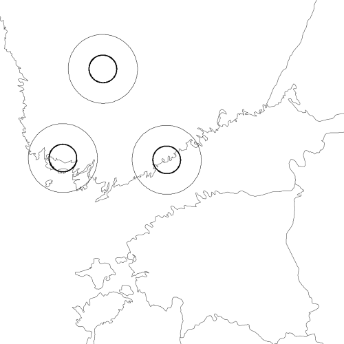

---

### circles_labels_sw — Circle labels (SW anchor)

**Input:** [`test/input/circles_labels_sw.get`](../../test/input/circles_labels_sw.get)

```
GET /dali?customer=test&product=circles_labels_sw&time=201503131200 HTTP/1.0
```

| Parameter | Value | Description |
|-----------|-------|-------------|
| `product` | `circles_labels_sw` | Product JSON: [`test/dali/customers/test/products/circles_labels_sw.json`](../../test/dali/customers/test/products/circles_labels_sw.json) |

Adds city name labels to the circles, anchored at the south-west corner of each station.

**Output:**

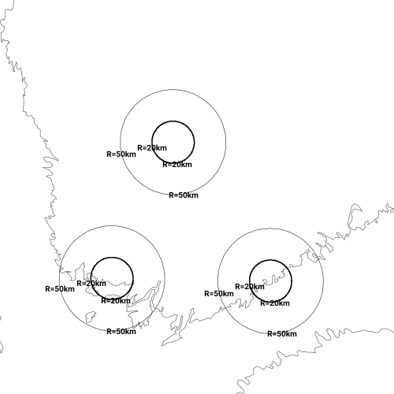

---

### circles_labels_tr — Circle labels (TR anchor)

**Input:** [`test/input/circles_labels_tr.get`](../../test/input/circles_labels_tr.get)

```
GET /dali?customer=test&product=circles_labels_tr&time=201503131200 HTTP/1.0
```

| Parameter | Value | Description |
|-----------|-------|-------------|
| `product` | `circles_labels_tr` | Product JSON: [`test/dali/customers/test/products/circles_labels_tr.json`](../../test/dali/customers/test/products/circles_labels_tr.json) |

Same as `circles_labels_sw` but labels are anchored at the top-right corner.

**Output:**

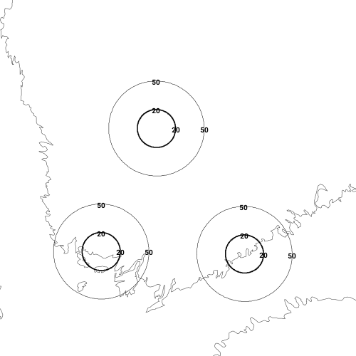

---

## Fronts

### fronts — Weather fronts

**Input:** [`test/input/fronts.get`](../../test/input/fronts.get)

```
GET /dali?customer=test&product=fronts&type=png&time=201503131200 HTTP/1.0
```

| Parameter | Value | Description |
|-----------|-------|-------------|
| `product` | `fronts` | Product JSON: [`test/dali/customers/test/products/fronts.json`](../../test/dali/customers/test/products/fronts.json) |
| `type` | `png` | Rasterised PNG output (700×500 px, 8-bit palette) |

Renders weather fronts (cold, warm, occluded, stationary) in EPSG:3857 over a background map.  Uses the `fronts` layer type with CSS styling.

**Output:**


---

## PostGIS Layer

### ice — Ice chart from PostGIS

**Input:** [`test/input/ice.get`](../../test/input/ice.get)

```
GET /dali?customer=test&product=ice HTTP/1.0
```

| Parameter | Value | Description |
|-----------|-------|-------------|
| `product` | `ice` | Product JSON: [`test/dali/customers/test/products/ice.json`](../../test/dali/customers/test/products/ice.json) |

Renders Baltic Sea ice chart polygons from the `icemap` PostGIS database using `"layer_type": "postgis"`.  The PostGIS layer can read any geometry type (Polygon, MultiPolygon, LineString) and apply CSS fill/stroke styling.

**Output:**

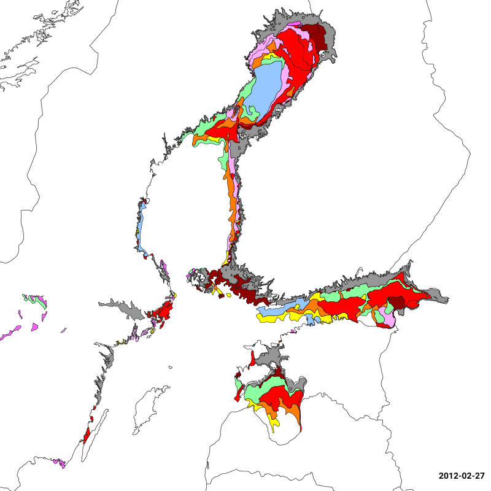

---

## WKT Layer

### wkt — Well-Known Text geometry

**Input:** [`test/input/wkt.get`](../../test/input/wkt.get)

```
GET /dali?customer=test&product=wkt&time=201503131200 HTTP/1.0
```

| Parameter | Value | Description |
|-----------|-------|-------------|
| `product` | `wkt` | Product JSON: [`test/dali/customers/test/products/wkt.json`](../../test/dali/customers/test/products/wkt.json) |
| `time` | `201503131200` | Valid time: 2015-03-13 12:00 UTC |

The `wkt` layer type renders arbitrary WKT (Well-Known Text) geometry strings (e.g. polygons, lines) stored in the product definition.  Geometries are projected to the map CRS and styled with CSS.

**Output:**

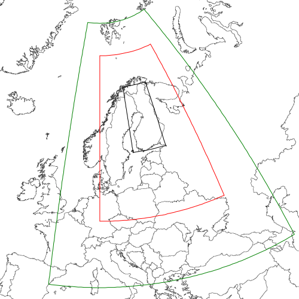

---

## METAR Layer

### metar_basic — Aviation METAR observations

**Input:** [`test/input/metar_basic.get`](../../test/input/metar_basic.get)

```
GET /dali?customer=test&product=metar_basic&time=201511170020&format=svg HTTP/1.0
```

| Parameter | Value | Description |
|-----------|-------|-------------|
| `product` | `metar_basic` | Product JSON: [`test/dali/customers/test/products/metar_basic.json`](../../test/dali/customers/test/products/metar_basic.json) |
| `time` | `201511170020` | Valid time: 2015-11-17 00:20 UTC |
| `format` | `svg` | SVG output format |

Uses `"layer_type": "metar"` with `"message_type": "METAR"` and `"message_format": "TAC"` to decode raw METAR reports stored as TAC (Traditional Alphanumeric Code) weather tokens.  Controls which elements to display: `show_station`, `show_wind`, `show_visibility`, `show_present_weather`, `show_sky_condition`, `show_temperature`.

*No reference output image available (no test output file generated in CI).*

---

## Fire Weather

### forestfire — Forest Fire Index isobands

**Input:** [`test/input/forestfire.get`](../../test/input/forestfire.get)

```
GET /dali?product=forestfire&time=20190207T0600 HTTP/1.0
```

| Parameter | Value | Description |
|-----------|-------|-------------|
| `product` | `forestfire` | No `customer` specified — uses the default customer directory |
| `time` | `20190207T0600` | Valid time: 2019-02-07 06:00 UTC |

Renders `ForestFireIndex` isobands using `"extrapolation": 2` to fill in missing data near the domain boundaries.  The product uses the `forestfire` producer (separate from general synoptic producers).

**Output:**

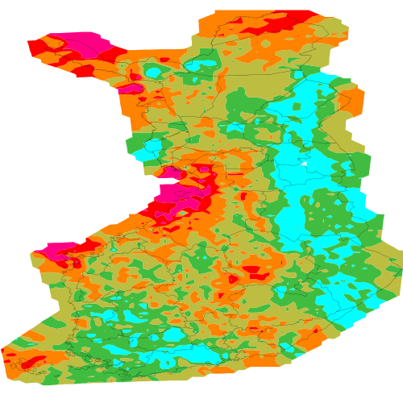

---

### grassfire — Grassfire risk by named region

**Input:** [`test/input/grassfire.get`](../../test/input/grassfire.get)

```
GET /dali?product=grassfire&time=20181212T0600 HTTP/1.0
```

| Parameter | Value | Description |
|-----------|-------|-------------|
| `product` | `grassfire` | Uses default customer |
| `time` | `20181212T0600` | Valid time: 2018-12-12 06:00 UTC |

Renders grassfire risk levels using the `grassfire` layer type.  Regions are matched by named feature attributes (e.g. `"value": "Uusimaa"` matches the Uusimaa administrative area).

**Output:**

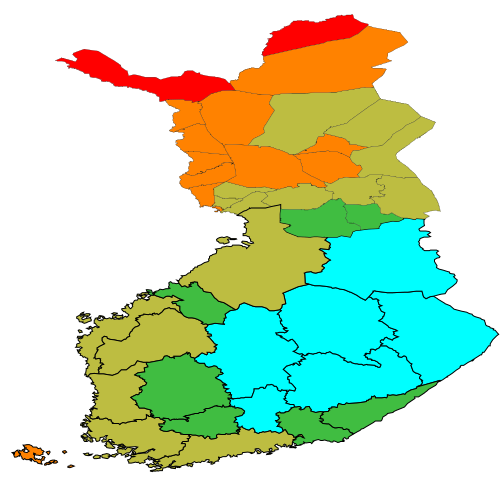

---

### grassfire_automatic — Grassfire risk by attribute range

**Input:** [`test/input/grassfire_automatic.get`](../../test/input/grassfire_automatic.get)

```
GET /dali?product=grassfire_automatic&time=20181212T0600 HTTP/1.0
```

| Parameter | Value | Description |
|-----------|-------|-------------|
| `product` | `grassfire_automatic` | Uses default customer |

Like `grassfire` but regions are matched by numeric attribute ranges instead of named values — more flexible for data with numeric risk-class codes.

*No reference output image available.*

---

## Text Layer

### text — SVG text layer

**Input:** [`test/input/text.get`](../../test/input/text.get)

```
GET /dali?customer=test&product=text&time=200808050300 HTTP/1.0
```

| Parameter | Value | Description |
|-----------|-------|-------------|
| `product` | `text` | Product JSON: [`test/dali/customers/test/products/text.json`](../../test/dali/customers/test/products/text.json) |

The `text` layer type renders static or parameterised text strings as SVG `<text>` elements.  The product also demonstrates how `tag: "clipPath"` and `tag: "g"` layers are used to create inline clip regions.

**Output:**


---

## Map simplification

The `MapLayer` honours four optional settings that thin the polygons returned by PostGIS before they are clipped, projected and rendered:

- an amalgamator that merges nearby polygons via constrained Delaunay triangulation,
- a Douglas-Peucker / Visvalingam-Whyatt simplifier with a pixel-based tolerance,
- the legacy `minarea` (km²) and `mindistance` (km) filters.

The GIS engine applies them in the order amalgamator → `minarea` → `mindistance` → simplifier, so that `minarea` and the new simplifier operate on the merged outline. See the [Map structure documentation](../reference.md#map-amalgamation-and-simplification) for the algorithmic background and a "Choosing an algorithm" comparison.

The five examples below all render the same Northern-Baltic view (lon 18°–27°, lat 59°–65°, 900×600 px) using the `gshhg.gshhs_h_l1` table (the GSHHG high-resolution L1 land polygons, ≈ 200 m vertex spacing). A bbox prefilter (`the_geom && ST_MakeEnvelope(17, 58, 28, 66, 4326)`) is added to every test so that the engine reads only the ~14 000 polygons in the area instead of all 144 000 globally — without that filter the amalgamator would attempt a Delaunay triangulation of every island in the world. They are directly comparable so that the visual effect of each option is easy to read.

> **Units.** `amalgamation_length` and `amalgamation_area` are in **CRS coordinate units** — at this latitude (≈ 60° N), 1° lat ≈ 111 km and 1° lon ≈ 56 km, so `amalgamation_length=0.05` ≈ 3 km and `amalgamation_area=0.0005` ≈ 1.5 km². The simplifier's `tolerance` is in **pixels** at the active projection.

### map_baseline — No simplification (reference image)

**Input:** [`test/input/map_baseline.get`](../../test/input/map_baseline.get)

```
GET /dali?customer=test&product=map_baseline HTTP/1.0
```

| Parameter | Value | Description |
|-----------|-------|-------------|
| `product` | `map_baseline` | [`test/dali/customers/test/products/map_baseline.json`](../../test/dali/customers/test/products/map_baseline.json) |

The unfiltered source data from `gshhg.gshhs_h_l1`: every coastline vertex from the high-resolution GSHHG product is kept (≈ 45 000 vertices in the rendered output). The Stockholm archipelago, Finland's southwestern archipelago and Åland are visible as dense clusters of individual skerries — exactly the kind of data the simplifier and amalgamator are designed to thin. This image is the reference against which the simplification settings below should be compared.

**Output:**

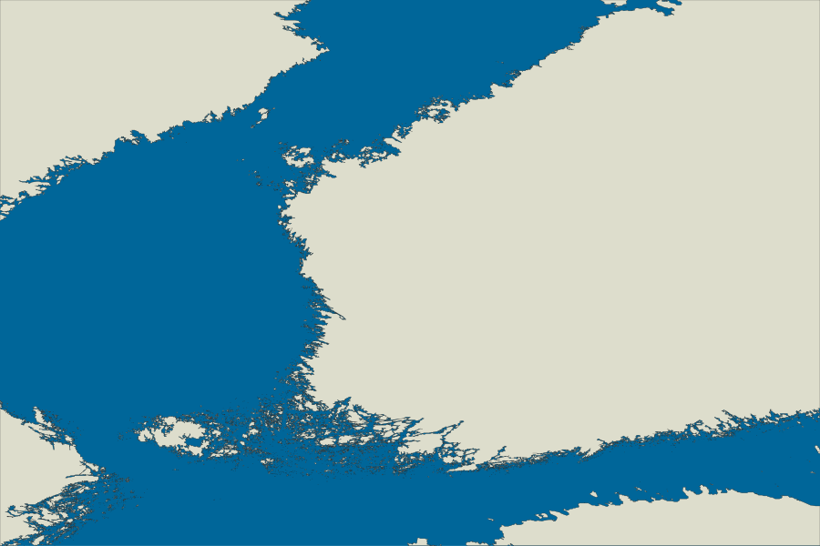

---

### map_simplifier_dp — Douglas-Peucker simplification

**Input:** [`test/input/map_simplifier_dp.get`](../../test/input/map_simplifier_dp.get)

```
GET /dali?customer=test&product=map_simplifier_dp HTTP/1.0
```

| Parameter | Value | Description |
|-----------|-------|-------------|
| `product` | `map_simplifier_dp` | [`test/dali/customers/test/products/map_simplifier_dp.json`](../../test/dali/customers/test/products/map_simplifier_dp.json) |

Same data as the baseline with `simplifier="douglas_peucker"` and `tolerance=3.0` pixels (the pixel tolerance is converted to CRS coordinate units per request using the projection box). About 20 % of the source vertices are removed (≈ 36 000 vertices remain) and the per-island silhouette becomes visibly saw-toothed. Douglas-Peucker keeps the points furthest from the chord between consecutive anchors, which on a smoothly-curving coastline tends to keep the tips of peninsulas and straight-cut the bays in between. Use DP for polygonal/man-made features (administrative borders, building footprints) or when you need a strict "max perpendicular error" guarantee; Visvalingam-Whyatt below is usually a better fit for natural coastlines.

**Output:**


---

### map_simplifier_vw — Visvalingam-Whyatt simplification

**Input:** [`test/input/map_simplifier_vw.get`](../../test/input/map_simplifier_vw.get)

```
GET /dali?customer=test&product=map_simplifier_vw HTTP/1.0
```

| Parameter | Value | Description |
|-----------|-------|-------------|
| `product` | `map_simplifier_vw` | [`test/dali/customers/test/products/map_simplifier_vw.json`](../../test/dali/customers/test/products/map_simplifier_vw.json) |

Same data as the baseline with `simplifier="visvalingam_whyatt"` and `tolerance=5.0` pixels (a pixel² area threshold for VW, applied after bbox conversion to CRS units). About 19 % of the source vertices are removed (≈ 37 000 vertices remain). VW iteratively removes the vertex whose triangle with its neighbours has the smallest area, which preserves the overall shape character better than DP at the same vertex-reduction level — bays and peninsulas remain recognisable rather than being straight-cut, and the silhouette is blockier rather than spiky. This is the recommended default for natural coastlines, rivers, and lake outlines.

**Output:**


---

### map_amalgamate — Polygon amalgamation

**Input:** [`test/input/map_amalgamate.get`](../../test/input/map_amalgamate.get)

```
GET /dali?customer=test&product=map_amalgamate HTTP/1.0
```

| Parameter | Value | Description |
|-----------|-------|-------------|
| `product` | `map_amalgamate` | [`test/dali/customers/test/products/map_amalgamate.json`](../../test/dali/customers/test/products/map_amalgamate.json) |

Same data as the baseline with `amalgamation_length=0.05` (≈ 3 km gap-bridging) and `amalgamation_area=0.0005` (≈ 1.5 km² minimum island area). The amalgamator triangulates the gaps between polygons via constrained Delaunay; gap triangles whose edges are all shorter than `amalgamation_length` are accepted as part of the merged outline. The Stockholm archipelago and Finland's southwestern archipelago consolidate into chunkier landmasses while the larger distinct islands and the mainland coast keep their identity. About 94 % of the source vertices are removed (≈ 2 500 vertices remain) — far more than the simplifier alone could achieve while still leaving the coastline silhouette recognisable, because amalgamation can collapse hundreds of small skerries into a single outline. This is a topology change that GEOS' `SimplifyPreserveTopology` cannot perform — that simplifier would leave each tiny island as its own (simplified) polygon.

**Output:**

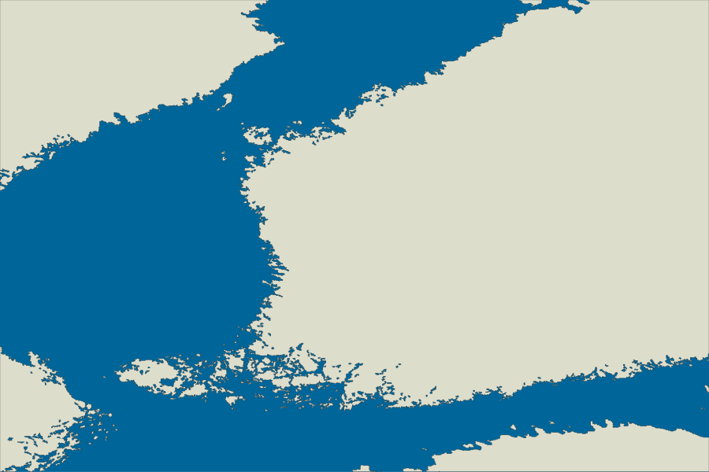

---

### map_amalgamate_simplified — Amalgamation followed by Visvalingam-Whyatt

**Input:** [`test/input/map_amalgamate_simplified.get`](../../test/input/map_amalgamate_simplified.get)

```
GET /dali?customer=test&product=map_amalgamate_simplified HTTP/1.0
```

| Parameter | Value | Description |
|-----------|-------|-------------|
| `product` | `map_amalgamate_simplified` | [`test/dali/customers/test/products/map_amalgamate_simplified.json`](../../test/dali/customers/test/products/map_amalgamate_simplified.json) |

Same amalgamation as `map_amalgamate` with `simplifier="visvalingam_whyatt"` and `tolerance=1.5` pixels chained on. About 97 % of the source vertices are removed in total (≈ 1 300 vertices remain). This combination is the recommended pipeline for archipelago and dense-coastline datasets: amalgamation gets the silhouette right by merging nearby islands, and the simplifier then thins out the redundant vertices on the merged boundary.

**Output:**

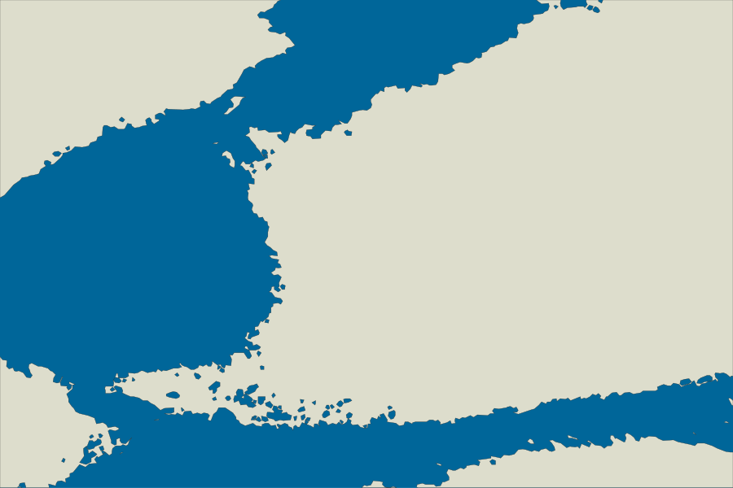

---

## World Map Products

These products render global-scale model data in various projections.  Each family (ECMWF, GFS) covers a standard set of projections; Pacific-centred views are available for equidistant cylindrical and WGS84 projections.

### ECMWF global temperature

All EC world products use the `ecmwf_maailma_pinta` producer and a 1440×720 px canvas:

| Test | Projection | CRS | Input |
|------|-----------|-----|-------|
| `ec_world_eqc` | Equidistant Cylindrical (Atlantic) | `EPSG:4087` | [`ec_world_eqc.get`](../../test/input/ec_world_eqc.get) |
| `ec_world_eqc_pacific` | Equidistant Cylindrical (Pacific, lon₀=180°) | `+init=epsg:4087 +lon_0=180` | [`ec_world_eqc_pacific.get`](../../test/input/ec_world_eqc_pacific.get) |
| `ec_world_webmercator` | Web Mercator | `EPSG:3857` | [`ec_world_webmercator.get`](../../test/input/ec_world_webmercator.get) |
| `ec_world_wgs84_atlantic` | Geographic WGS84 (Atlantic) | `+init=epsg:4326` | [`ec_world_wgs84_atlantic.get`](../../test/input/ec_world_wgs84_atlantic.get) |
| `ec_world_wgs84_pacific` | Geographic WGS84 (Pacific, lon_wrap=180) | `+init=epsg:4326 +lon_wrap=180` | [`ec_world_wgs84_pacific.get`](../../test/input/ec_world_wgs84_pacific.get) |

The `+lon_wrap=180` modifier shifts the longitude seam to the antimeridian so that the Pacific Ocean is unbroken.

| Projection | Output |
|-----------|--------|
| EQC Atlantic | 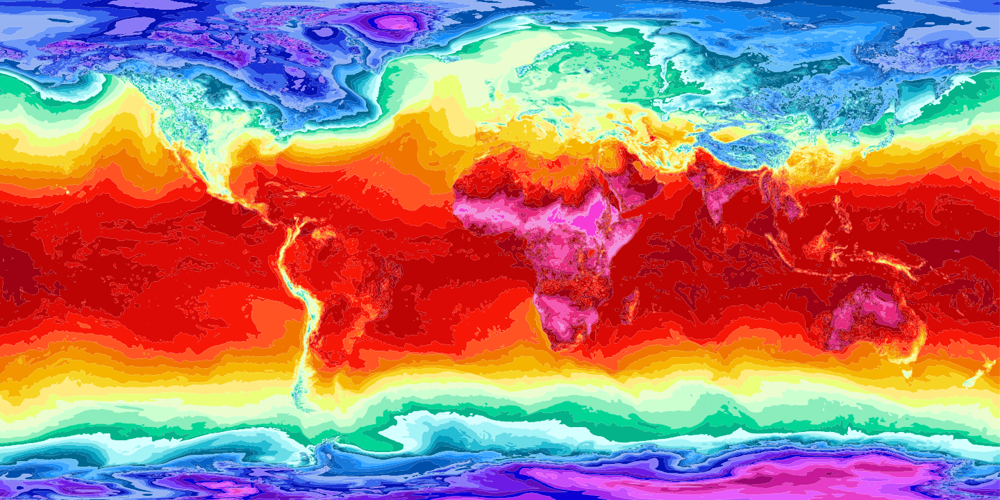 |
| EQC Pacific |  |
| Web Mercator |  |
| WGS84 Atlantic |  |
| WGS84 Pacific |  |

---

### GFS global temperature

All GFS world products use the `gfs` producer.  In addition to the five standard projections, GFS also includes polar, Goode, Natural Earth, and Near-side Perspective views:

| Test | Projection | CRS |
|------|-----------|-----|
| `gfs_world_eqc` | EQC Atlantic | `+init=epsg:4087` |
| `gfs_world_eqc_pacific` | EQC Pacific (lon₀=180°) | `+init=epsg:4087 +lon_0=180` |
| `gfs_world_webmercator` | Web Mercator (Atlantic) | `EPSG:3857` |
| `gfs_world_webmercator_pacific` | Web Mercator (Pacific bbox) | `EPSG:3857` |
| `gfs_world_wgs84_atlantic` | Geographic WGS84 Atlantic | `+init=epsg:4326` |
| `gfs_world_wgs84_pacific` | Geographic WGS84 Pacific | `+init=epsg:4326 +lon_wrap=180` |
| `gfs_world_arctic` | Polar Stereographic (N) | `+proj=stere +lat_0=90` |
| `gfs_world_antarctic` | Polar Stereographic (S) | `+proj=stere +lat_0=-90` |
| `gfs_world_goode` | Goode Homolosine | `+proj=igh +lon_0=0` |
| `gfs_world_natural_earth` | Natural Earth | `+proj=natearth` |
| `gfs_world_perspective` | Near-side Perspective (h=3000 km) | `+proj=nsper +h=3000000 +lat_0=60 +lon_0=25` |
| `gfs_world_stereographic` | Polar Stereographic (Europe) | `+proj=stere +lat_0=90 +lat_ts=60 +lon_0=20` |

| Projection | Output |
|-----------|--------|
| EQC Atlantic | 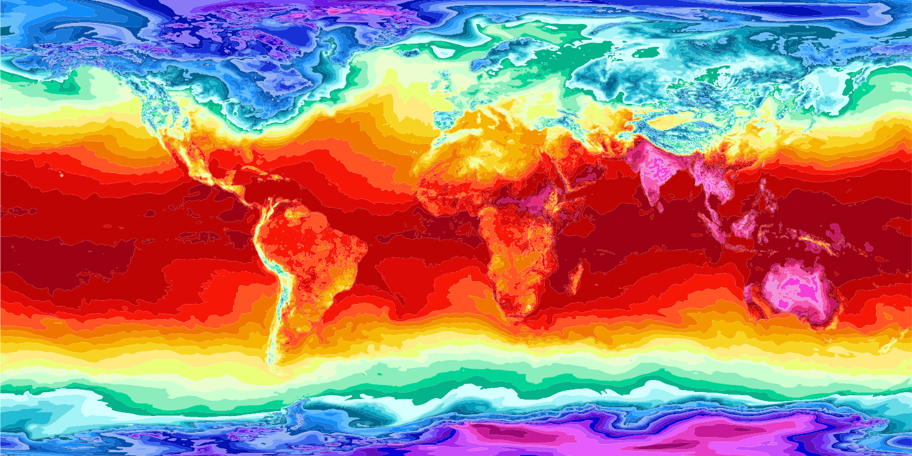 |
| EQC Pacific |  |
| Web Mercator | 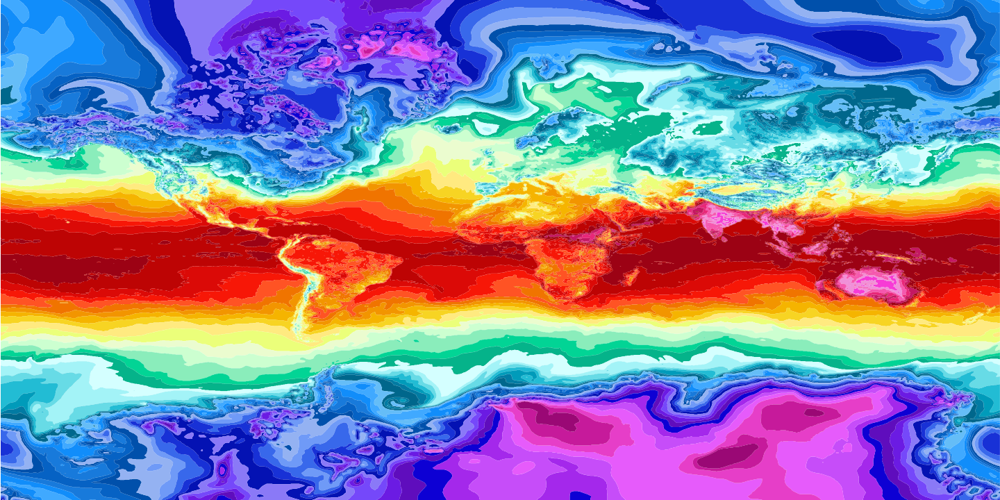 |
| Web Mercator Pacific | 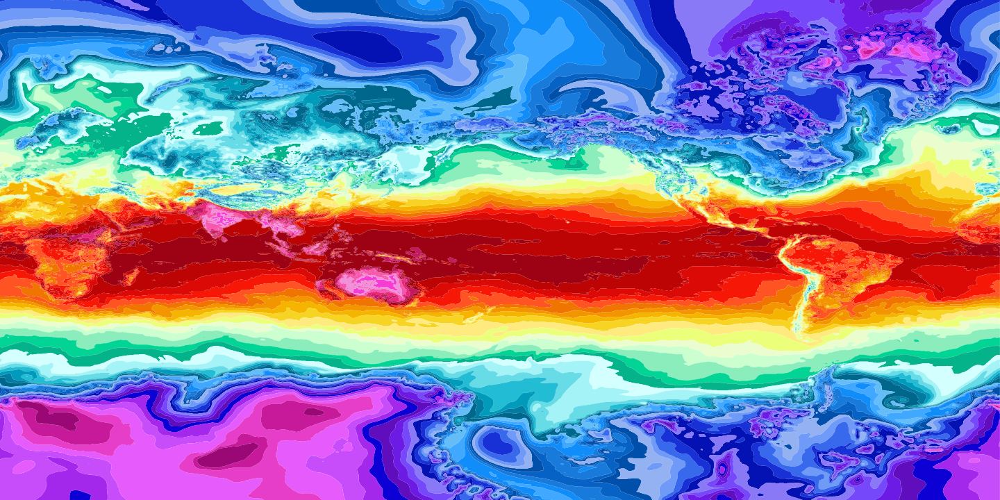 |
| WGS84 Atlantic | 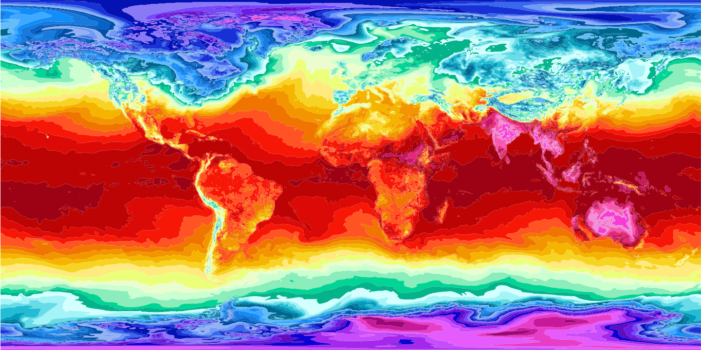 |
| WGS84 Pacific | 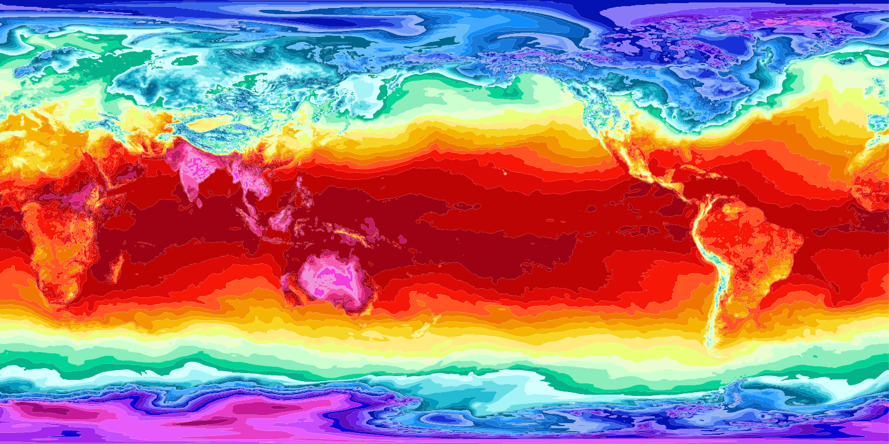 |
| Arctic | 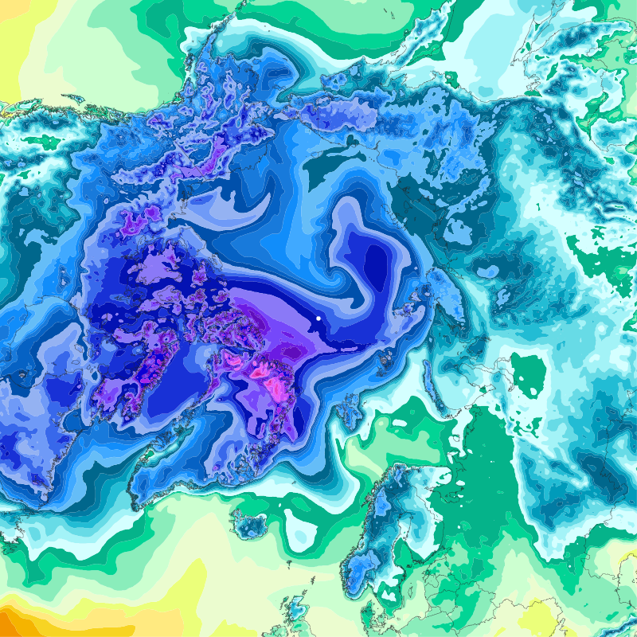 |
| Antarctic | 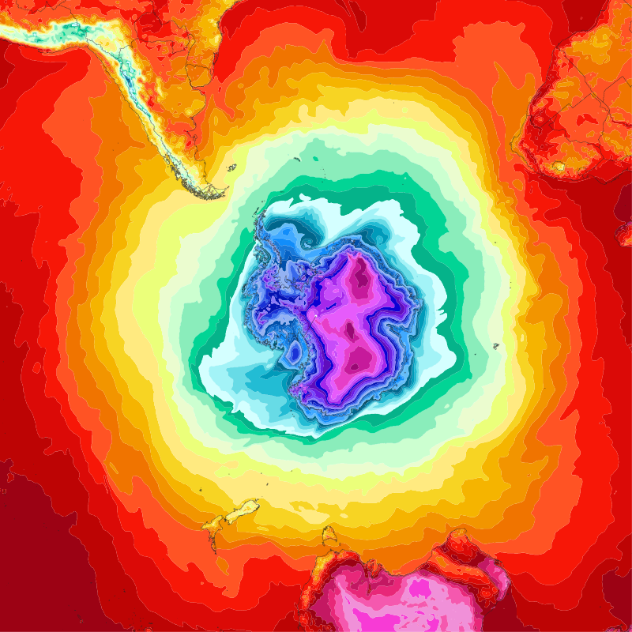 |
| Goode Homolosine | 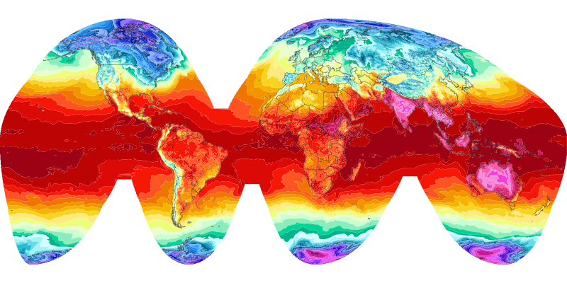 |
| Natural Earth | 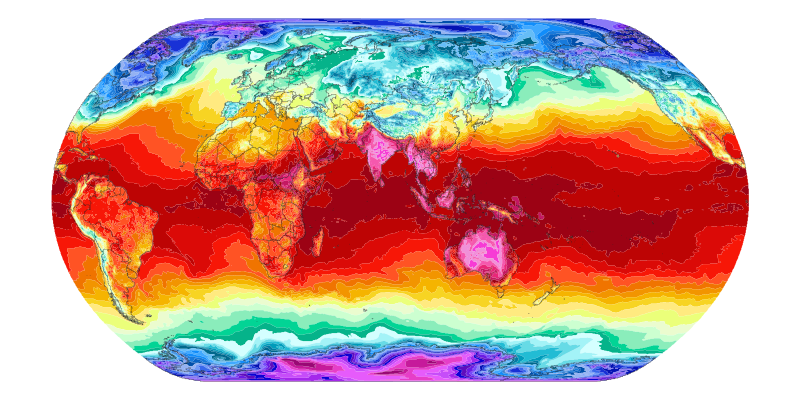 |
| Perspective (h=3000 km) | 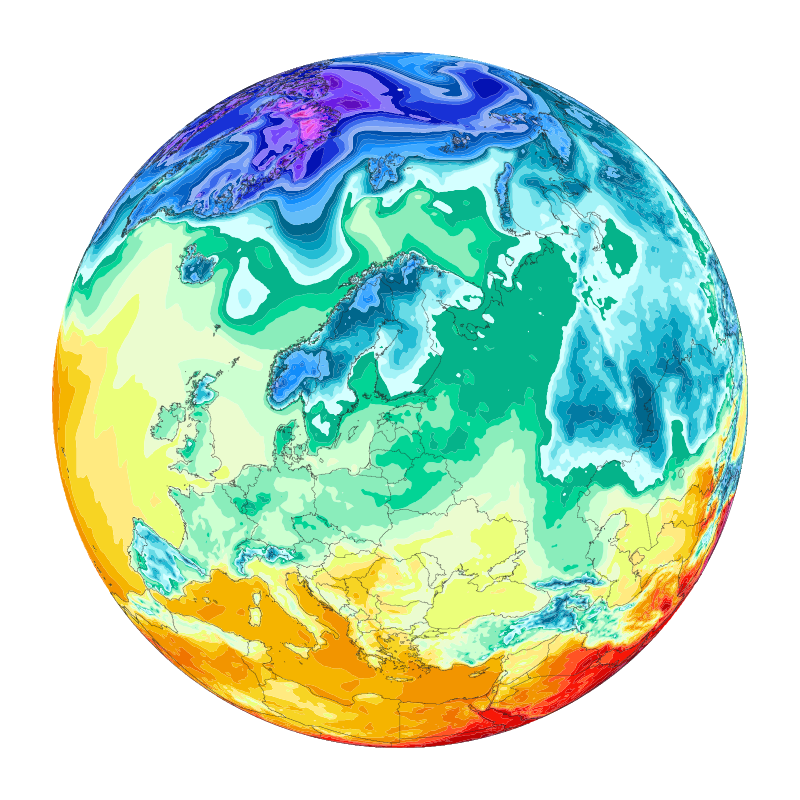 |
| Stereographic (Europe) | 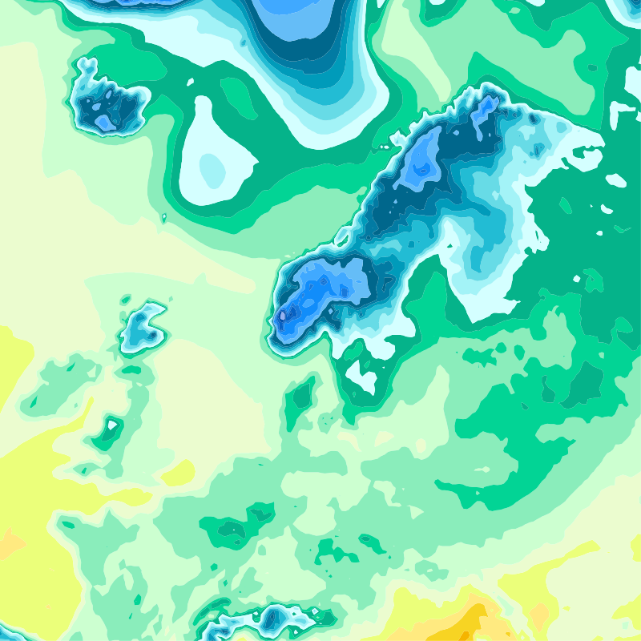 |

---

