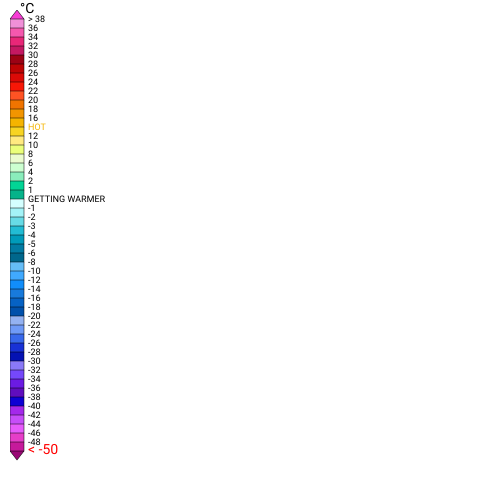
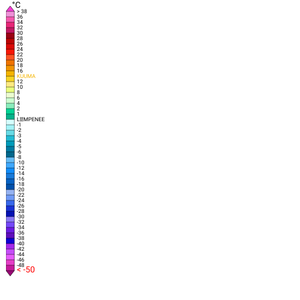
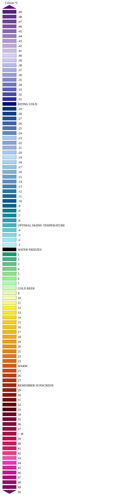
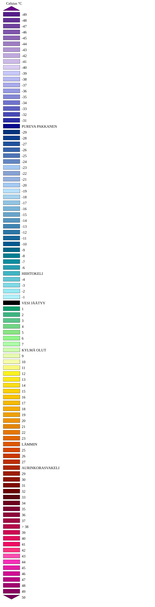
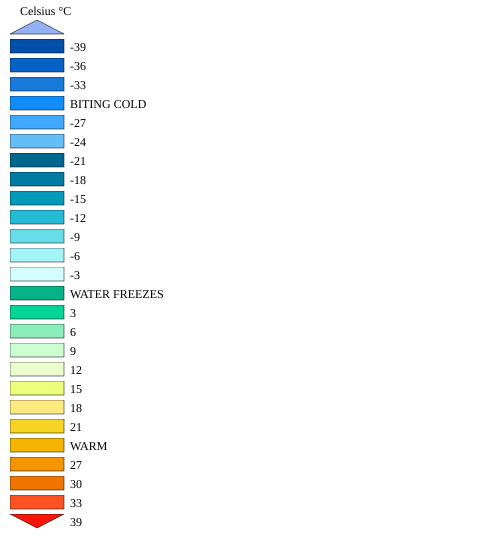
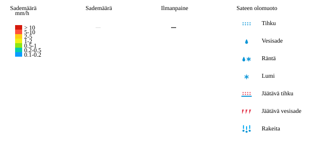
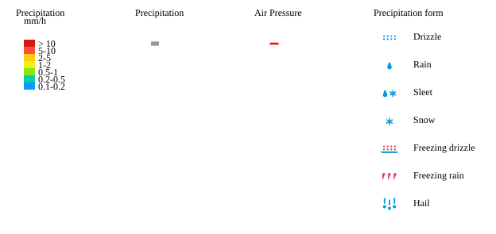
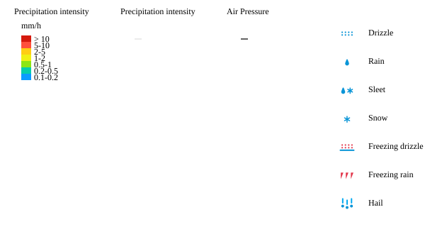
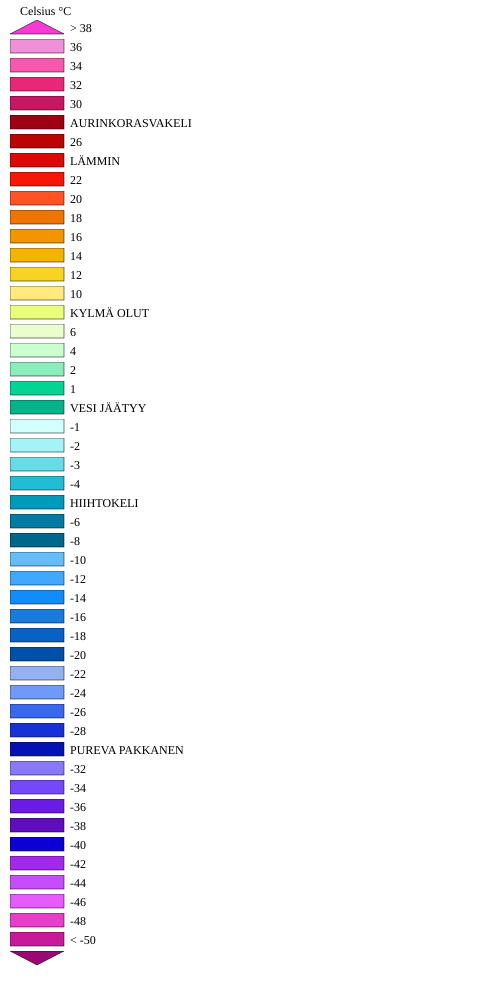
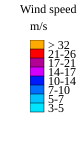

# Legend Examples

The `GetLegendGraphic` operation returns a legend image for a named layer + style combination.  Test inputs are in [`test/input/wms_getlegendgraphic_*.get`](../../test/input/) and expected SVG outputs in [`test/output/wms_getlegendgraphic_*.get`](../../test/output/); the PNG previews on this page are rasterised from those SVGs and live in [`docs/images/legends/`](../images/legends/).

All requests use the shared template:

```
GET /wms?service=WMS&request=GetLegendGraphic&version=1.3.0&sld_version=1.1.0
    &layer=<layer>&style=<style>&format=image/svg%2Bxml[&language=<lang>] HTTP/1.0
```

| Parameter | Description |
|-----------|-------------|
| `request` | Always `GetLegendGraphic` for this page |
| `layer` | Layer to render the legend for |
| `style` | Style to use; empty selects the layer default |
| `sld_version` | SLD version (required by the WMS spec) |
| `format` | Always `image/svg+xml` here |
| `language` | Optional translation key — `en`, `fi`, `sv` |

## Contents

- [Automatic Legends](#automatic-legends)
- [Style Variants](#style-variants)
- [Modified and Product-Specific Templates](#modified-and-product-specific-templates)
- [Multilingual Translations](#multilingual-translations)
- [Internal Legends](#internal-legends)
- [External Legends](#external-legends)

---

## Automatic Legends

The default legend is generated automatically by reading isoband colour definitions from the product CSS.  English and Finnish renderings of the same `test:precipitation` layer differ only in the localized labels.

### wms_getlegendgraphic_automatic — Default automatic legend

**Input:** [`test/input/wms_getlegendgraphic_automatic.get`](../../test/input/wms_getlegendgraphic_automatic.get) — `layer=test:precipitation`


### wms_getlegendgraphic_automatic_fi — Finnish translation

**Input:** [`test/input/wms_getlegendgraphic_automatic_fi.get`](../../test/input/wms_getlegendgraphic_automatic_fi.get) — `language=fi`


### wms_getlegendgraphic_automatic_isoband_labels — Isoband label legend

**Input:** [`test/input/wms_getlegendgraphic_automatic_isoband_labels.get`](../../test/input/wms_getlegendgraphic_automatic_isoband_labels.get) — `layer=test:t2m_isoband_labels`

Legend for the layer that draws contour value labels along the isoband boundaries.



### wms_getlegendgraphic_automatic_isoband_labels_fi — Isoband label legend (Finnish)

**Input:** [`test/input/wms_getlegendgraphic_automatic_isoband_labels_fi.get`](../../test/input/wms_getlegendgraphic_automatic_isoband_labels_fi.get)



---

## Style Variants

Three named isoband styles for the `test:t2m` layer plus two isoline styles for `test:precipitation` exercise the `&style=` selector.  Each English/Finnish pair shares the same colour ramp; only the labels are localized.

### Isoband — `temperature_one_degrees` (1°C bands)

| Test | Image |
|------|-------|
| [`wms_getlegendgraphic_automatic_isoband_style1`](../../test/input/wms_getlegendgraphic_automatic_isoband_style1.get) |  |
| [`wms_getlegendgraphic_automatic_isoband_style1_fi`](../../test/input/wms_getlegendgraphic_automatic_isoband_style1_fi.get) |  |

### Isoband — `temperature_two_degrees` (2°C bands)

| Test | Image |
|------|-------|
| [`wms_getlegendgraphic_automatic_isoband_style2`](../../test/input/wms_getlegendgraphic_automatic_isoband_style2.get) |  |
| [`wms_getlegendgraphic_automatic_isoband_style2_fi`](../../test/input/wms_getlegendgraphic_automatic_isoband_style2_fi.get) |  |

### Isoband — `temperature_three_degrees` (3°C bands)

| Test | Image |
|------|-------|
| [`wms_getlegendgraphic_automatic_isoband_style3`](../../test/input/wms_getlegendgraphic_automatic_isoband_style3.get) |  |
| [`wms_getlegendgraphic_automatic_isoband_style3_fi`](../../test/input/wms_getlegendgraphic_automatic_isoband_style3_fi.get) |  |

### Isoline — `precipitation_thin_style`

| Test | Image |
|------|-------|
| [`wms_getlegendgraphic_automatic_isoline_style1`](../../test/input/wms_getlegendgraphic_automatic_isoline_style1.get) |  |
| [`wms_getlegendgraphic_automatic_isoline_style1_fi`](../../test/input/wms_getlegendgraphic_automatic_isoline_style1_fi.get) |  |

### Isoline — `precipitation_thick_style`

| Test | Image |
|------|-------|
| [`wms_getlegendgraphic_automatic_isoline_style2`](../../test/input/wms_getlegendgraphic_automatic_isoline_style2.get) |  |
| [`wms_getlegendgraphic_automatic_isoline_style2_fi`](../../test/input/wms_getlegendgraphic_automatic_isoline_style2_fi.get) |  |

---

## Modified and Product-Specific Templates

### wms_getlegendgraphic_automatic_modified — Per-layer overrides

**Input:** [`test/input/wms_getlegendgraphic_automatic_modified.get`](../../test/input/wms_getlegendgraphic_automatic_modified.get) — `layer=test:precipitation_modified`

Layer JSON overrides individual legend rows (custom labels, omitted bands) on top of the automatic CSS-derived ramp.



### wms_getlegendgraphic_automatic_modified_fi — Modified, Finnish

**Input:** [`test/input/wms_getlegendgraphic_automatic_modified_fi.get`](../../test/input/wms_getlegendgraphic_automatic_modified_fi.get)


### wms_getlegendgraphic_automatic_product_specific_template — Custom CTPP2 template

**Input:** [`test/input/wms_getlegendgraphic_automatic_product_specific_template.get`](../../test/input/wms_getlegendgraphic_automatic_product_specific_template.get) — `layer=test:t2m`

The `test:t2m` layer specifies its own legend SVG template (`legend_template:` in the layer config), replacing the default vertical stack with a custom layout.


### wms_getlegendgraphic_automatic_product_specific_template_fi — Custom template, Finnish

**Input:** [`test/input/wms_getlegendgraphic_automatic_product_specific_template_fi.get`](../../test/input/wms_getlegendgraphic_automatic_product_specific_template_fi.get)



---

## Multilingual Translations

The `test:snow_drift_index` layer carries title and band-label translations for English, Finnish, and Swedish.  The `&language=` parameter selects which translation file is rendered into the legend.

| Test | Language | Image |
|------|----------|-------|
| [`wms_getlegendgraphic_automatic_translation_en`](../../test/input/wms_getlegendgraphic_automatic_translation_en.get) | `en` |  |
| [`wms_getlegendgraphic_automatic_translation_fi`](../../test/input/wms_getlegendgraphic_automatic_translation_fi.get) | `fi` |  |
| [`wms_getlegendgraphic_automatic_translation_sv`](../../test/input/wms_getlegendgraphic_automatic_translation_sv.get) | `sv` |  |

---

## Internal Legends

When the product JSON embeds an explicit `legend:` block, the server uses that definition instead of deriving one from CSS.

### wms_getlegendgraphic_internal_legend — Embedded legend block

**Input:** [`test/input/wms_getlegendgraphic_internal_legend.get`](../../test/input/wms_getlegendgraphic_internal_legend.get) — `layer=test:t2m_p`


### wms_getlegendgraphic_internal_legend_fi — Embedded legend, Finnish

**Input:** [`test/input/wms_getlegendgraphic_internal_legend_fi.get`](../../test/input/wms_getlegendgraphic_internal_legend_fi.get)


---

## External Legends

The layer can also point to an external SVG file, optionally selecting a named style block within it.

### wms_getlegendgraphic_external_legend — Default external legend

**Input:** [`test/input/wms_getlegendgraphic_external_legend.get`](../../test/input/wms_getlegendgraphic_external_legend.get) — `layer=test:wind_legend`



### wms_getlegendgraphic_external_legend_fi — External legend, Finnish

**Input:** [`test/input/wms_getlegendgraphic_external_legend_fi.get`](../../test/input/wms_getlegendgraphic_external_legend_fi.get)


### wms_getlegendgraphic_external_legend_alternative_style — Named style block

**Input:** [`test/input/wms_getlegendgraphic_external_legend_alternative_style.get`](../../test/input/wms_getlegendgraphic_external_legend_alternative_style.get) — `style=alternative_legend_style1`

Selects an alternative style block within the same external legend SVG.


### wms_getlegendgraphic_external_legend2 — Second external legend file

**Input:** [`test/input/wms_getlegendgraphic_external_legend2.get`](../../test/input/wms_getlegendgraphic_external_legend2.get) — `layer=test:wind_legend2`

A second external legend layer, demonstrating that multiple external legend files can coexist.


