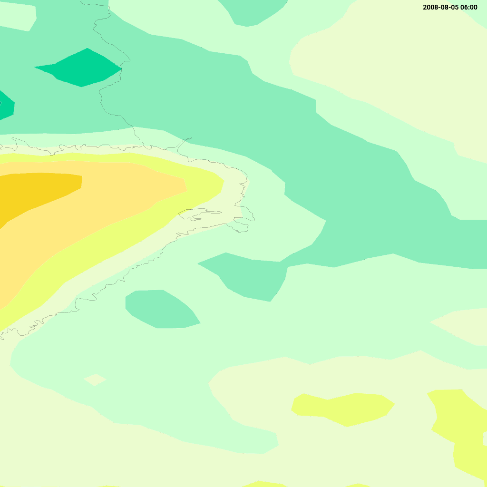
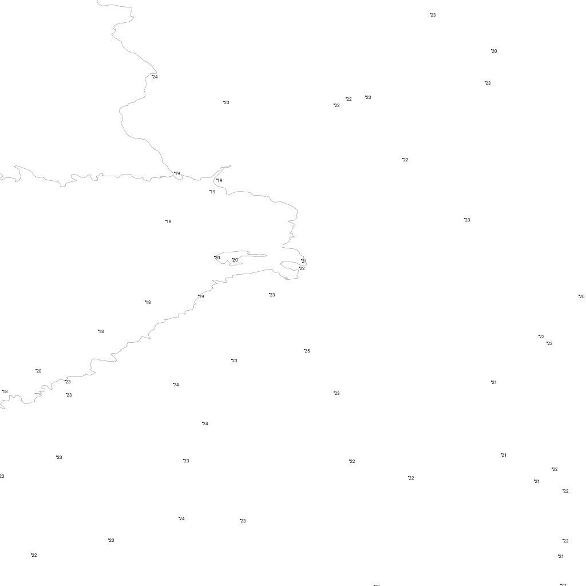

# OGC Tiles Test Examples

The OGC Tiles tests exercise the `/tiles` endpoint, which implements the OGC API — Tiles standard.  This is the RESTful successor to WMTS using the collections model.  The URL path structure is:

```
/tiles/collections/{collection}/tiles/{TileMatrixSet}/{TileMatrix}/{TileRow}/{TileCol}?f={format}[&datetime=…][&elevation=…][&reference_time=…]
```

Unlike WMTS (which carries dimensions as path segments), OGC API — Tiles passes them as **query parameters** (see [Dimensions](#dimensions) below).

Test inputs are in [`test/input/tiles_*.get`](../../test/input/) and expected outputs in [`test/output/tiles_*.get`](../../test/output/).

## Contents

- [Dimensions](#dimensions)
- [tiles_getcollections](#tiles_getcollections)
- [tiles_getcollection_pressure](#tiles_getcollection_pressure)
- [tiles_gettile_elevation_850 / _500](#tiles_gettile_elevation_850--_500)

## Dimensions

A collection's available dimensions are advertised in its metadata (`/tiles/collections/{id}`) under `extent`:

- `extent.temporal.interval` — `[[start, end]]` in RFC 3339 (from the layer's time dimension).
- `extent.vertical.interval` + `extent.vertical.values` — the discrete levels (e.g. pressure), with `vrs` giving the unit.

Dimension values are supplied on the tile request as query parameters:

| Parameter | Example | Maps to |
|-----------|---------|---------|
| `datetime` | `20080909T1200` | valid time (OGC-standard spelling; `TIME` also accepted) |
| `elevation` | `850` | vertical level (e.g. pressure in hPa) |
| `reference_time` | `20080909T0000` | model analysis / origin time |

Omitted dimensions fall back to their defaults (e.g. the most current time).
- [tiles_gettile_isoband](#tiles_gettile_isoband)
- [tiles_gettile_temperature_numbers](#tiles_gettile_temperature_numbers)
- [tiles_gettile_geotiff](#tiles_gettile_geotiff)
- [tiles_gettile_geotiff_wind_speed_and_direction_1 and _2](#tiles_gettile_geotiff_wind_speed_and_direction_1-and-_2)
- [Mapbox Vector Tile (MVT) outputs](#mapbox-vector-tile-mvt-outputs)
  - [tiles_gettile_mvt_isoband](#tiles_gettile_mvt_isoband)
  - [tiles_gettile_mvt_isoline](#tiles_gettile_mvt_isoline)
  - [tiles_gettile_mvt_numbers](#tiles_gettile_mvt_numbers)
  - [tiles_gettile_mvt_circles](#tiles_gettile_mvt_circles)

## tiles_getcollections

**Input:** [`test/input/tiles_getcollections.get`](../../test/input/tiles_getcollections.get)

```
GET /tiles/collections HTTP/1.0
```

Returns a catalogue of all available tile collections (layers), with their identifiers, titles, extent, and supported tile matrix sets and formats.

**Output:** [`test/output/tiles_getcollections.get`](../../test/output/tiles_getcollections.get) — XML/JSON

## tiles_getcollection_pressure

**Input:** [`test/input/tiles_getcollection_pressure.get`](../../test/input/tiles_getcollection_pressure.get)

```
GET /tiles/collections/test:t2m_pressure HTTP/1.0
```

Returns the collection metadata for a pressure-level layer, including both temporal and vertical extents:

```json
"extent": {
  "spatial":  { "bbox": [[…]], "crs": "…/CRS84" },
  "temporal": { "interval": [["2008-09-09T00:00:00Z", "2008-09-19T00:00:00Z"]], "trs": "…/ISO-8601/…" },
  "vertical": { "interval": [["1000", "300"]], "values": ["1000","925","850","700","500","300"], "vrs": "hPa" }
}
```

**Output:** [`test/output/tiles_getcollection_pressure.get`](../../test/output/tiles_getcollection_pressure.get) — JSON

## tiles_gettile_elevation_850 / _500

**Input:** [`test/input/tiles_gettile_elevation_850.get`](../../test/input/tiles_gettile_elevation_850.get) / [`_500`](../../test/input/tiles_gettile_elevation_500.get)

```
GET /tiles/collections/test:t2m_pressure/tiles/EPSG:3067/3/2/4?f=png&datetime=20080909T1200&elevation=850 HTTP/1.0
GET /tiles/collections/test:t2m_pressure/tiles/EPSG:3067/3/2/4?f=png&datetime=20080909T1200&elevation=500 HTTP/1.0
```

The two requests differ only in `elevation`; they render **distinct** tiles (850 hPa vs 500 hPa), verifying that the query-parameter dimensions reach the renderer.

**Output:** [`test/output/tiles_gettile_elevation_850.get`](../../test/output/tiles_gettile_elevation_850.get) / `_500` — PNG

## tiles_gettile_isoband

**Input:** [`test/input/tiles_gettile_isoband.get`](../../test/input/tiles_gettile_isoband.get)

```
GET /tiles/collections/test:t2m/tiles/EPSG:4326/5/4/36?f=png&TIME=20080805T030000 HTTP/1.0
```

| Query segment | Value | Description |
|---------------|-------|-------------|
| `test:t2m` | Collection | Temperature isoband layer |
| `EPSG:4326` | TileMatrixSet | WGS 84 tile grid |
| `5/4/36` | TileMatrix/Row/Col | Tile coordinates |
| `f` | `png` | Output format as query parameter (vs. file extension in WMTS) |
| `TIME` | `20080805T030000` | Valid time |

Returns a 1024×1024 PNG isoband tile.  Functionally equivalent to the WMTS `wmts_gettile_isoband` test.

**Output:** [`test/output/tiles_gettile_isoband.get`](../../test/output/tiles_gettile_isoband.get) — PNG (1024×1024)



## tiles_gettile_temperature_numbers

**Input:** [`test/input/tiles_gettile_temperature_numbers.get`](../../test/input/tiles_gettile_temperature_numbers.get)

```
GET /tiles/collections/test:opendata_temperature_numbers/tiles/EPSG:4326/5/4/36?f=svg&TIME=20130805T1500 HTTP/1.0
```

Returns a 1024×1024 SVG tile of temperature number annotations.

**Output:** [`test/output/tiles_gettile_temperature_numbers.get`](../../test/output/tiles_gettile_temperature_numbers.get) — SVG



## tiles_gettile_geotiff

**Input:** [`test/input/tiles_gettile_geotiff.get`](../../test/input/tiles_gettile_geotiff.get)

```
GET /tiles/collections/grid:raster_1/tiles/EPSG:4326/5/4/36?f=tiff&TIME=20080805T080000 HTTP/1.0
```

Returns a GeoTIFF tile of raw numerical grid data.

**Output:** [`test/output/tiles_gettile_geotiff.get`](../../test/output/tiles_gettile_geotiff.get) — GeoTIFF

## tiles_gettile_geotiff_wind_speed_and_direction_1 and _2

These tests retrieve GeoTIFF tiles for a multi-band wind product (`grid:wind_speed_and_direction`).  Two variants test different band configurations:

```
GET /tiles/collections/grid:wind_speed_and_direction_1/tiles/EPSG:4326/5/4/36?f=tiff&TIME=20080805T080000 HTTP/1.0
GET /tiles/collections/grid:wind_speed_and_direction_2/tiles/EPSG:4326/5/4/36?f=tiff&TIME=20080805T080000 HTTP/1.0
```

Wind speed and direction are encoded in separate GeoTIFF bands, allowing clients to reconstruct vector wind fields.

**Output:** [`test/output/tiles_gettile_geotiff_wind_speed_and_direction_1.get`](../../test/output/tiles_gettile_geotiff_wind_speed_and_direction_1.get) / [`_2`](../../test/output/tiles_gettile_geotiff_wind_speed_and_direction_2.get) — GeoTIFF

## Mapbox Vector Tile (MVT) outputs

MVT is a compact binary format for encoding vector geometry data in tiles, widely used by Mapbox, OpenLayers, and other mapping clients.

### tiles_gettile_mvt_isoband

**Input:** [`test/input/tiles_gettile_mvt_isoband.get`](../../test/input/tiles_gettile_mvt_isoband.get)

```
GET /tiles/collections/test:t2m/tiles/EPSG:4326/5/4/36?f=mvt&TIME=20080805T030000 HTTP/1.0
```

| Query segment | Value | Description |
|---------------|-------|-------------|
| `f` | `mvt` | Mapbox Vector Tile binary format |

Returns temperature isoband polygons encoded as an MVT tile.  The isoband geometry is quantised and delta-encoded per the MVT specification.

**Output:** [`test/output/tiles_gettile_mvt_isoband.get`](../../test/output/tiles_gettile_mvt_isoband.get) — MVT (binary)

### tiles_gettile_mvt_isoline

**Input:** [`test/input/tiles_gettile_mvt_isoline.get`](../../test/input/tiles_gettile_mvt_isoline.get)

```
GET /tiles/collections/test:t2m_p/tiles/EPSG:4326/5/4/36?f=mvt&TIME=20080805T030000 HTTP/1.0
```

Returns temperature isolines as MVT `LineString` features.

**Output:** [`test/output/tiles_gettile_mvt_isoline.get`](../../test/output/tiles_gettile_mvt_isoline.get) — MVT (binary)

### tiles_gettile_mvt_numbers

**Input:** [`test/input/tiles_gettile_mvt_numbers.get`](../../test/input/tiles_gettile_mvt_numbers.get)

```
GET /tiles/collections/test:t2m_numbers/tiles/EPSG:4326/5/4/36?f=mvt&TIME=20080805T030000 HTTP/1.0
```

Returns temperature number positions and values as MVT `Point` features with the numeric value as an attribute.

**Output:** [`test/output/tiles_gettile_mvt_numbers.get`](../../test/output/tiles_gettile_mvt_numbers.get) — MVT (binary)

### tiles_gettile_mvt_circles

**Input:** [`test/input/tiles_gettile_mvt_circles.get`](../../test/input/tiles_gettile_mvt_circles.get)

```
GET /tiles/collections/test:t2m_circles/tiles/EPSG:4326/5/4/36?f=mvt&TIME=20080805T030000 HTTP/1.0
```

Returns circle-layer data (station point positions with radius attributes) as MVT `Point` features.

**Output:** [`test/output/tiles_gettile_mvt_circles.get`](../../test/output/tiles_gettile_mvt_circles.get) — MVT (binary)
