# WMS Test Examples

The WMS tests exercise the `/wms` endpoint.  Test inputs are in [`test/input/wms_*.get`](../../test/input/) and expected outputs in [`test/output/wms_*.get`](../../test/output/).  Product configurations are under [`test/wms/customers/`](../../test/wms/customers/).

## Contents

- [GetCapabilities](#getcapabilities)
- [GetMap — Isoband styles](#getmap--isoband-styles)
- [GetMap — Isoline styles](#getmap--isoline-styles)
- [GetMap — Isolabel styles](#getmap--isolabel-styles)
- [GetMap — Temperature numbers](#getmap--temperature-numbers)
- [GetMap — Meteorological wind arrows](#getmap--meteorological-wind-arrows)
- [GetMap — Wind arrows (model data)](#getmap--wind-arrows-model-data)
- [GetMap — Wind numbers](#getmap--wind-numbers)
- [GetMap — Temperature symbols](#getmap--temperature-symbols)
- [GetMap — Multiple layers](#getmap--multiple-layers)
- [GetMap — CRS variants](#getmap--crs-variants)
- [GetMap — Time interpolation](#getmap--time-interpolation)
- [GetMap — Time intervals](#getmap--time-intervals)
- [GetMap — GeoJSON output](#getmap--geojson-output)
- [GetMap — PDF output](#getmap--pdf-output)
- [GetMap — DataTile output](#getmap--datatile-output)
- [GetMap — Observation data](#getmap--observation-data)
- [GetMap — Variants](#getmap--variants)
- [GetMap — Frame layer](#getmap--frame-layer)
- [GetMap — Ice chart](#getmap--ice-chart)
- [GetMap — Symbol style](#getmap--symbol-style)
- [GetMap — Error handling](#getmap--error-handling)
- [GetMap — Grid Engine layers](#getmap--grid-engine-layers)
- [GetFeatureInfo](#getfeatureinfo)
- [GetLegendGraphic](#getlegendgraphic) — see also the [Legend Examples](legends.md) page

## GetCapabilities

### wms_getcapabilities

**Input:** [`test/input/wms_getcapabilities.get`](../../test/input/wms_getcapabilities.get)

```
GET /wms?service=wms&request=GetCapabilities&debug=1 HTTP/1.0
```

| Parameter | Value | Description |
|-----------|-------|-------------|
| `service` | `wms` | OGC WMS service identifier (case-insensitive) |
| `request` | `GetCapabilities` | Returns the service metadata XML document |
| `debug` | `1` | Adds layer-level debug information to the response |

Returns a WMS 1.3.0 XML capabilities document listing all advertised layers, styles, CRS support, output formats, and service metadata.

**Output:** [`test/output/wms_getcapabilities.get`](../../test/output/wms_getcapabilities.get) — XML

### wms_getcapabilities_fi

**Input:** [`test/input/wms_getcapabilities_fi.get`](../../test/input/wms_getcapabilities_fi.get)

```
GET /wms?service=wms&request=GetCapabilities&language=fi&debug=1 HTTP/1.0
```

| Parameter | Value | Description |
|-----------|-------|-------------|
| `language` | `fi` | Returns layer titles and abstracts in Finnish |
| `debug` | `1` | Adds layer-level debug information |

Demonstrates multi-language support in GetCapabilities: layer titles and abstracts are returned in the requested language when translations are defined in the product JSON.

**Output:** [`test/output/wms_getcapabilities_fi.get`](../../test/output/wms_getcapabilities_fi.get) — XML

### wms_getcapabilities_json

**Input:** [`test/input/wms_getcapabilities_json.get`](../../test/input/wms_getcapabilities_json.get)

```
GET /wms?service=wms&request=GetCapabilities&format=application/json&debug=1 HTTP/1.0
```

| Parameter | Value | Description |
|-----------|-------|-------------|
| `format` | `application/json` | Returns capabilities as a JSON document instead of XML |
| `debug` | `1` | Adds layer-level debug information |

Returns the same layer metadata as the XML capabilities but in JSON format, suitable for programmatic consumption.

**Output:** [`test/output/wms_getcapabilities_json.get`](../../test/output/wms_getcapabilities_json.get) — JSON

### wms_getcapabilities_namespace

**Input:** [`test/input/wms_getcapabilities_namespace.get`](../../test/input/wms_getcapabilities_namespace.get)

```
GET /wms?service=wms&request=GetCapabilities&namespace=ely HTTP/1.0
```

| Parameter | Value | Description |
|-----------|-------|-------------|
| `namespace` | `ely` | Filters the capabilities response to only include layers in the `ely` customer namespace |

Returns a capabilities document scoped to a single customer namespace.

**Output:** [`test/output/wms_getcapabilities_namespace.get`](../../test/output/wms_getcapabilities_namespace.get) — XML

### wms_getcapabilities_recursive

**Input:** [`test/input/wms_getcapabilities_recursive.get`](../../test/input/wms_getcapabilities_recursive.get)

```
GET /wms?service=wms&request=GetCapabilities&debug=1&layout=recursive HTTP/1.0
```

| Parameter | Value | Description |
|-----------|-------|-------------|
| `layout` | `recursive` | Groups layers recursively by customer namespace in the capabilities XML |

**Output:** [`test/output/wms_getcapabilities_recursive.get`](../../test/output/wms_getcapabilities_recursive.get) — XML

### wms_getcapabilities_timeinterval

**Input:** [`test/input/wms_getcapabilities_timeinterval.get`](../../test/input/wms_getcapabilities_timeinterval.get)

```
GET /wms?service=wms&request=GetCapabilities&starttime=2008-08-09T00:00:00Z&endtime=2008-08-09T06:00:00Z&debug=1 HTTP/1.0
```

| Parameter | Value | Description |
|-----------|-------|-------------|
| `starttime` | `2008-08-09T00:00:00Z` | Restricts time dimension listings to this start |
| `endtime` | `2008-08-09T06:00:00Z` | Restricts time dimension listings to this end |

Returns capabilities with time dimension values limited to the specified interval.

**Output:** [`test/output/wms_getcapabilities_timeinterval.get`](../../test/output/wms_getcapabilities_timeinterval.get) — XML

---

## GetMap — Isoband styles

All three tests render temperature isobands for the `test:t2m` layer over Scandinavia (EPSG:4326, bbox 59–71°N, 17–34°E, 300×500 px, PNG).  They differ only in the `styles` parameter, which selects the isoband interval width.

### wms_getmap_isoband_style1

**Input:** [`test/input/wms_getmap_isoband_style1.get`](../../test/input/wms_getmap_isoband_style1.get)

```
GET /wms?service=wms&request=GetMap&version=1.3.0
    &layers=test:t2m
    &styles=temperature_one_degrees
    &crs=EPSG:4326
    &bbox=59,17,71,34
    &width=300&height=500
    &format=image/png
    &time=200808050300 HTTP/1.0
```

| Parameter | Value | Description |
|-----------|-------|-------------|
| `service` | `wms` | OGC WMS service |
| `request` | `GetMap` | Render a map image |
| `version` | `1.3.0` | WMS version |
| `layers` | `test:t2m` | Layer `t2m` in customer `test` |
| `styles` | `temperature_one_degrees` | 1°C isoband width style |
| `crs` | `EPSG:4326` | WGS 84 geographic CRS |
| `bbox` | `59,17,71,34` | Bounding box: minLat, minLon, maxLat, maxLon (WMS 1.3.0 axis order for EPSG:4326) |
| `width` / `height` | `300` / `500` | Output image dimensions in pixels |
| `format` | `image/png` | PNG output |
| `time` | `200808050300` | Valid time: 2008-08-05 03:00 UTC |

Product config: [`test/wms/customers/test/products/t2m.json`](../../test/wms/customers/test/products/t2m.json)


### wms_getmap_isoband_style2

**Input:** [`test/input/wms_getmap_isoband_style2.get`](../../test/input/wms_getmap_isoband_style2.get)

Same as above with `styles=temperature_two_degrees` (2°C isoband width).


### wms_getmap_isoband_style3

**Input:** [`test/input/wms_getmap_isoband_style3.get`](../../test/input/wms_getmap_isoband_style3.get)

Same as above with `styles=temperature_three_degrees` (3°C isoband width).


### wms_getmap_isoband_tile

**Input:** [`test/input/wms_getmap_isoband_tile.get`](../../test/input/wms_getmap_isoband_tile.get)

Renders the same `test:t2m` layer cropped to a WMS tile-compatible bounding box, verifying that isobands are properly clipped to tile boundaries.


---

## GetMap — Isoline styles

### wms_getmap_isoline_style1

**Input:** [`test/input/wms_getmap_isoline_style1.get`](../../test/input/wms_getmap_isoline_style1.get)

```
GET /wms?service=wms&request=GetMap&version=1.3.0
    &layers=test:precipitation
    &styles=precipitation_thin_style
    &crs=EPSG:4326
    &bbox=59,17,71,34
    &width=300&height=500
    &format=image/png
    &time=200808050300 HTTP/1.0
```

| Parameter | Value | Description |
|-----------|-------|-------------|
| `layers` | `test:precipitation` | Precipitation isobands + isoline layer |
| `styles` | `precipitation_thin_style` | Thin (1 px) isoline style |

Product config: [`test/wms/customers/test/products/precipitation_areas.json`](../../test/wms/customers/test/products/precipitation_areas.json)


### wms_getmap_isoline_style2

**Input:** [`test/input/wms_getmap_isoline_style2.get`](../../test/input/wms_getmap_isoline_style2.get)

Same request with `styles=precipitation_thick_style` (2 px isoline width).


### wms_getmap_isoline_groups

**Input:** [`test/input/wms_getmap_isoline_groups.get`](../../test/input/wms_getmap_isoline_groups.get)

```
GET /wms?service=wms&request=GetMap&version=1.3.0
    &layers=test:pressure_isoline_groups
    &styles=
    &crs=EPSG:4326
    &bbox=59,17,71,34
    &width=300&height=500
    &format=image/png
    &time=200808050300 HTTP/1.0
```

| Parameter | Value | Description |
|-----------|-------|-------------|
| `layers` | `test:pressure_isoline_groups` | Pressure isolines with grouped rendering |
| `styles` | _(empty)_ | Default style |

Demonstrates the `isoline_groups` feature: isolines are organised into named groups (e.g. every 5 hPa vs every 1 hPa), which can be styled and filtered independently.

Product config: [`test/wms/customers/test/products/pressure_isoline_groups.json`](../../test/wms/customers/test/products/pressure_isoline_groups.json)


### Time-aggregate variants — isoline groups

| Test | Output |
|------|--------|
| `wms_getmap_isoline_groups_aggregate_min` | 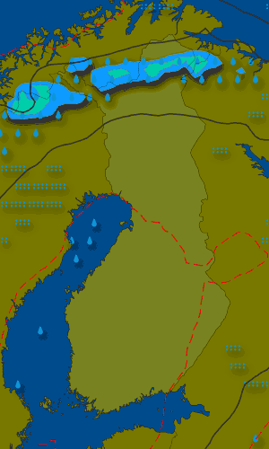 |
| `wms_getmap_isoline_groups_aggregate_max` |  |

---

## GetMap — Isolabel styles

### wms_getmap_isolabel_style1

**Input:** [`test/input/wms_getmap_isolabel_style1.get`](../../test/input/wms_getmap_isolabel_style1.get)

```
GET /wms?service=wms&request=GetMap&version=1.3.0
    &layers=test:isolabel
    &styles=isolabel_small_blue_text_style
    &crs=EPSG:4326
    &bbox=59,17,71,34
    &width=300&height=500
    &format=image/png
    &time=200808050300 HTTP/1.0
```

| Parameter | Value | Description |
|-----------|-------|-------------|
| `layers` | `test:isolabel` | Layer with isoline labels |
| `styles` | `isolabel_small_blue_text_style` | Small (24 px), blue Roboto font labels |

The `isolabel` layer type places text annotations directly on isolines at computed placement positions.

Product config: [`test/wms/customers/test/products/isolabel.json`](../../test/wms/customers/test/products/isolabel.json)


### wms_getmap_isolabel_style2

**Input:** [`test/input/wms_getmap_isolabel_style2.get`](../../test/input/wms_getmap_isolabel_style2.get)

Same request with `styles=isolabel_big_red_text_style` (36 px red Roboto font).


---

## GetMap — Temperature numbers

### wms_getmap_temperature_numbers

**Input:** [`test/input/wms_getmap_temperature_numbers.get`](../../test/input/wms_getmap_temperature_numbers.get)

```
GET /wms?service=wms&request=GetMap&version=1.3.0
    &layers=test:opendata_temperature_numbers
    &styles=
    &crs=EPSG:4326
    &bbox=59,17,71,34
    &width=600&height=1000
    &format=image/png
    &time=20130805T1500 HTTP/1.0
```

| Parameter | Value | Description |
|-----------|-------|-------------|
| `layers` | `test:opendata_temperature_numbers` | Temperature observations as numeric labels |
| `width` / `height` | `600` / `1000` | Higher resolution for readable numbers |
| `time` | `20130805T1500` | ISO 8601 time format |

Renders temperature observations from the `opendata` producer at FMI station positions over a background map.

Product config: [`test/wms/customers/test/products/opendata_temperature_numbers.json`](../../test/wms/customers/test/products/opendata_temperature_numbers.json)


### Mindistance and priority variants

The following tests verify label collision avoidance and priority selection for dense station networks:

| Test | `mindistance` | `priority` | Description | Output |
|------|---------------|------------|-------------|--------|
| `wms_getmap_temperature_numbers_mindistance` | set | — | Filter stations closer than `mindistance` pixels | 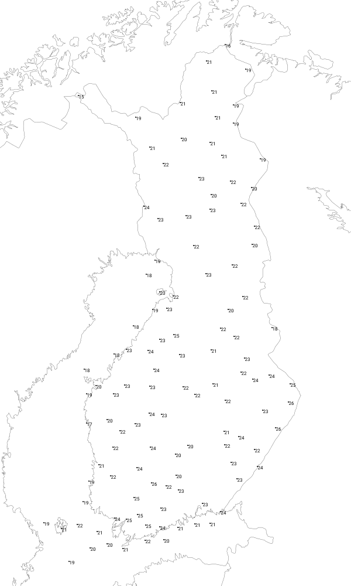 |
| `wms_getmap_temperature_numbers_mindistance_priority_none` | set | `none` | No priority: arbitrary station is kept |  |
| `wms_getmap_temperature_numbers_mindistance_priority_min` | set | `min` | Keep station with minimum value | 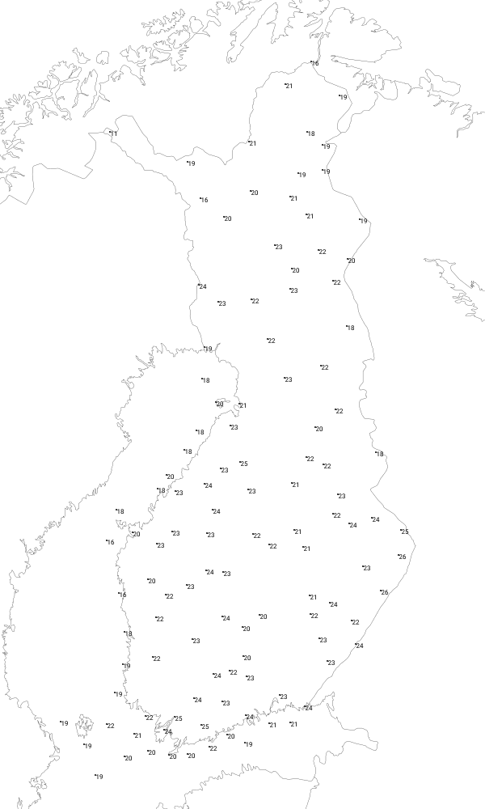 |
| `wms_getmap_temperature_numbers_mindistance_priority_max` | set | `max` | Keep station with maximum value |  |
| `wms_getmap_temperature_numbers_mindistance_priority_extrema` | set | `extrema` | Keep both min and max within the area | 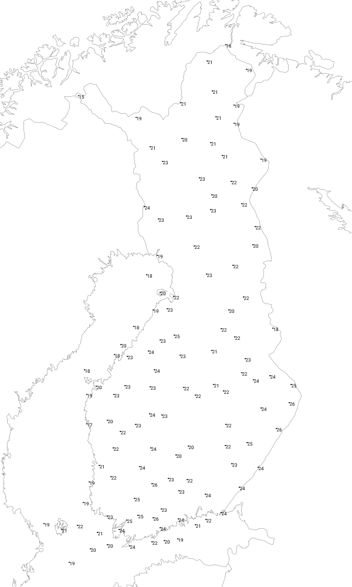 |
| `wms_getmap_temperature_numbers_mindistance_priority_array` | set | array | User-defined priority list |  |
| `wms_getmap_temperature_numbers_aggregate_min` | — | — | Time-aggregate: minimum over interval | 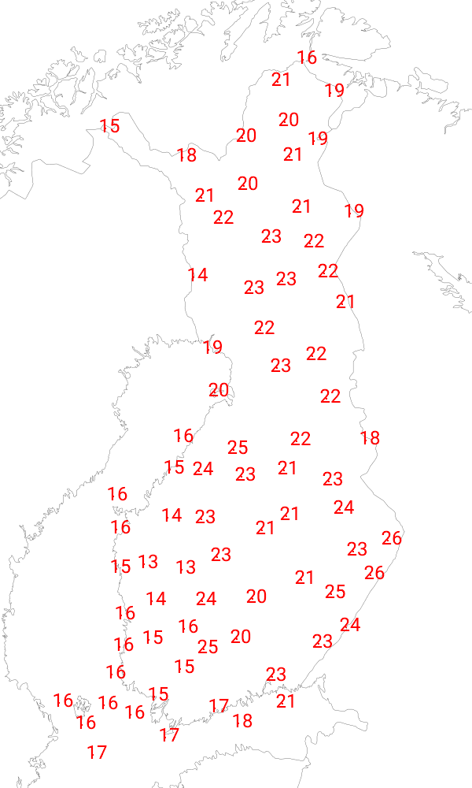 |
| `wms_getmap_temperature_numbers_aggregate_max` | — | — | Time-aggregate: maximum over interval | 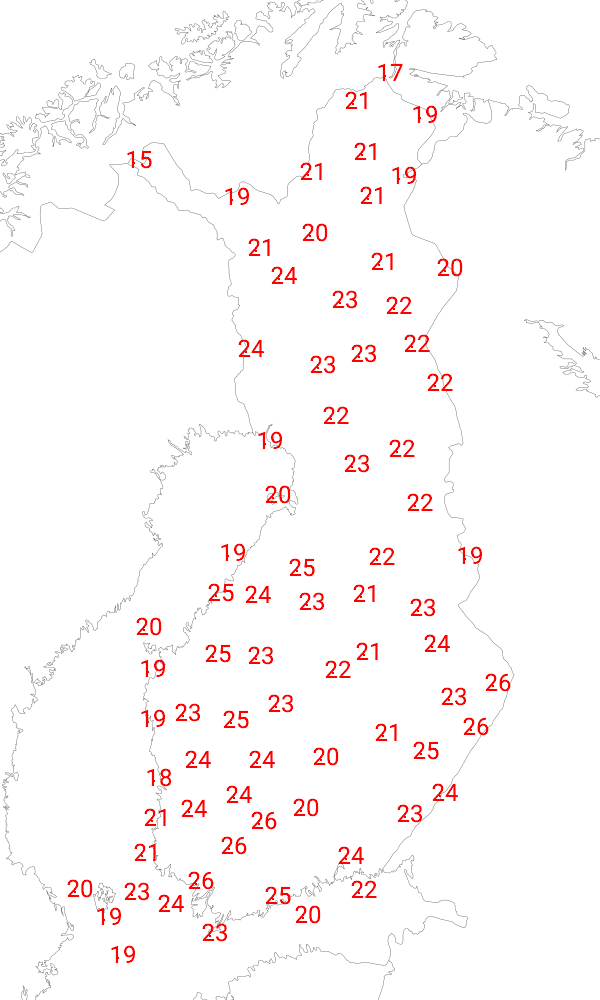 |

### wms_getmap_temperature_numbers_svgxml — SVG output

The same `opendata_temperature_numbers` layer requested with `format=image/svg+xml` instead of PNG.

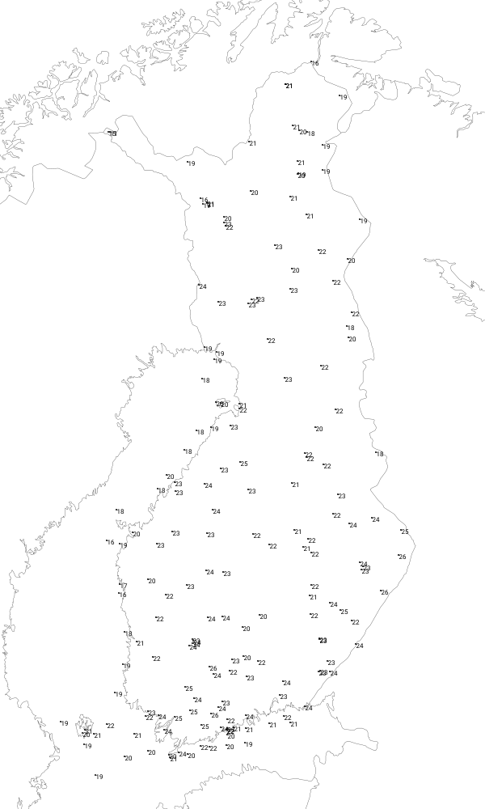

---

## GetMap — Meteorological wind arrows

### wms_getmap_meteorological_windarrows

**Input:** [`test/input/wms_getmap_meteorological_windarrows.get`](../../test/input/wms_getmap_meteorological_windarrows.get)

```
GET /wms?service=wms&request=GetMap&version=1.3.0
    &layers=test:opendata_meteorological_windarrows
    &styles=
    &crs=EPSG:4326
    &bbox=59,17,71,34
    &width=600&height=1000
    &format=image/png
    &time=20130805T1500 HTTP/1.0
```

| Parameter | Value | Description |
|-----------|-------|-------------|
| `layers` | `test:opendata_meteorological_windarrows` | Wind observations as meteorological barb symbols |

Renders wind barbs at FMI observation stations, scaled to knots (`multiplier=1.94384449244`).  Wind barbs face the wind direction with the `southflop` option ensuring correct hemisphere rendering.

Product config: [`test/wms/customers/test/products/opendata_meteorological_windarrows.json`](../../test/wms/customers/test/products/opendata_meteorological_windarrows.json)


### wms_getmap_meteorological_windarrows_svgxml — SVG output

Same data with `format=image/svg+xml`.

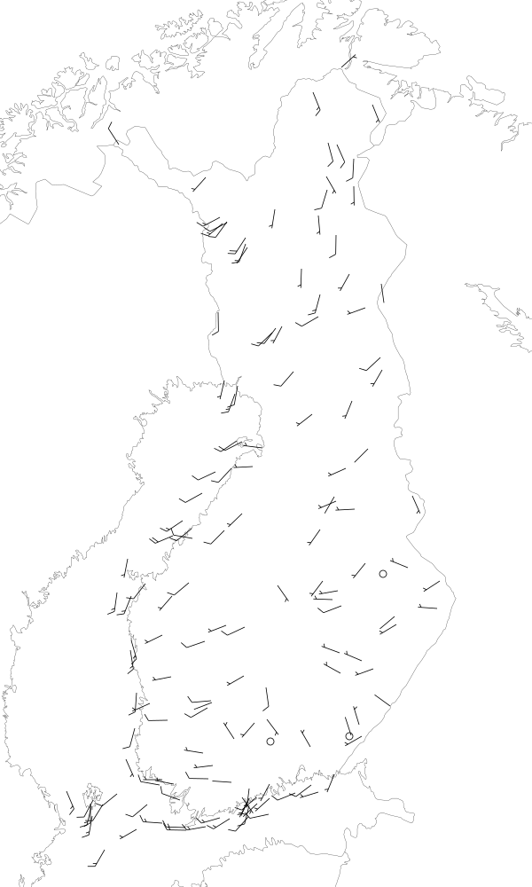

### Mindistance and priority variants — meteorological windarrows

| Test | Output |
|------|--------|
| `wms_getmap_meteorological_windarrows_mindistance` | 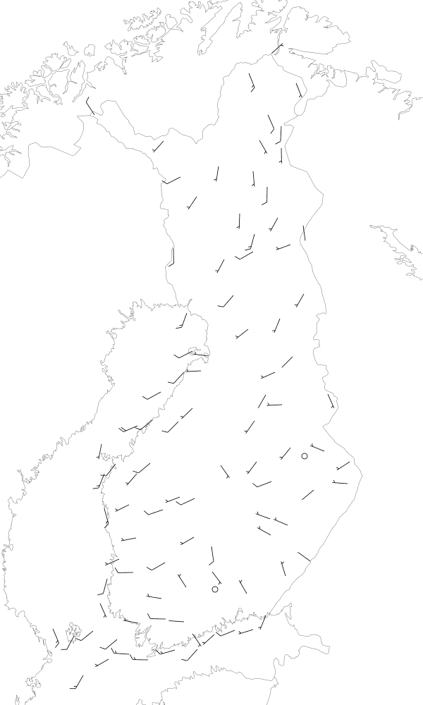 |
| `wms_getmap_meteorological_windarrows_mindistance_priority_none` |  |
| `wms_getmap_meteorological_windarrows_mindistance_priority_min` | 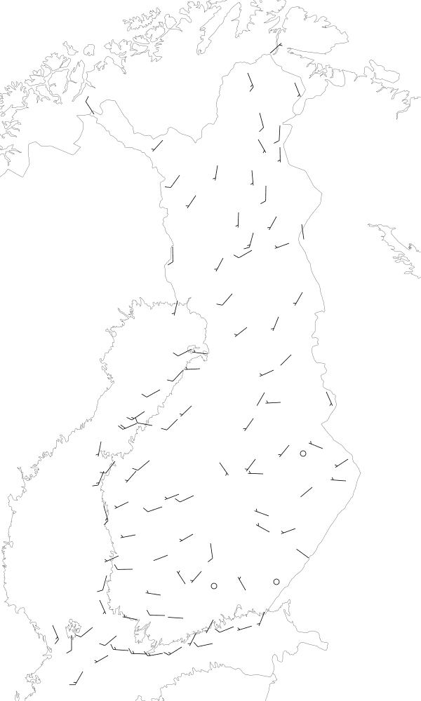 |
| `wms_getmap_meteorological_windarrows_mindistance_priority_max` | 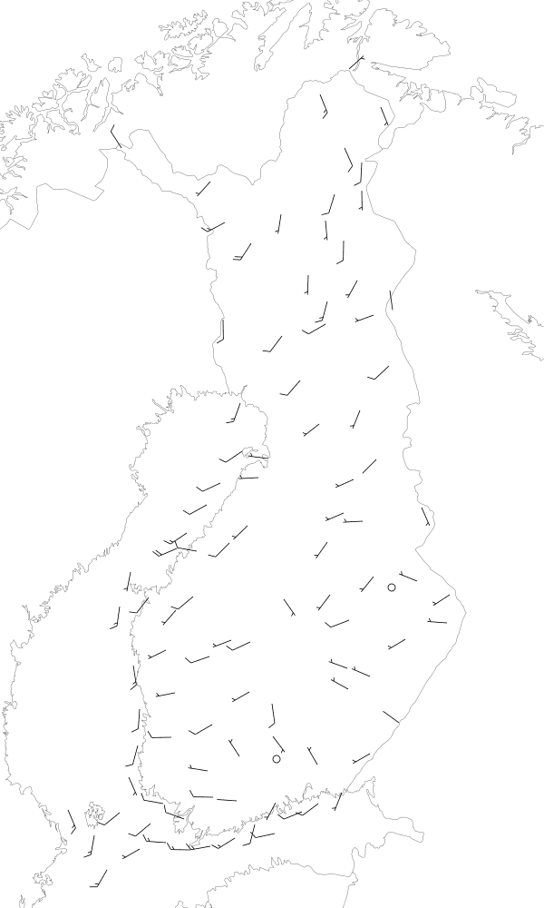 |
| `wms_getmap_meteorological_windarrows_mindistance_priority_extreama` |  |
| `wms_getmap_meteorological_windarrows_mindistance_priority_array` | 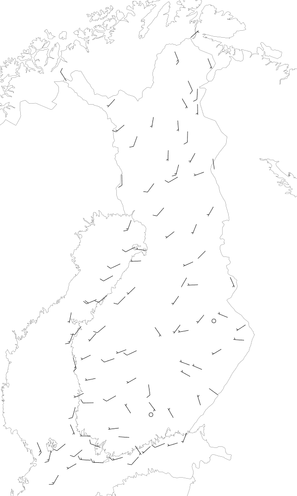 |
| `wms_getmap_meteorological_windarrows_aggregate_min` | 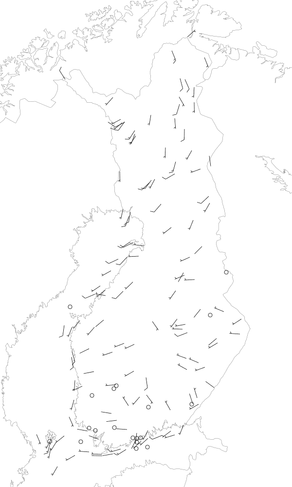 |
| `wms_getmap_meteorological_windarrows_aggregate_max` | 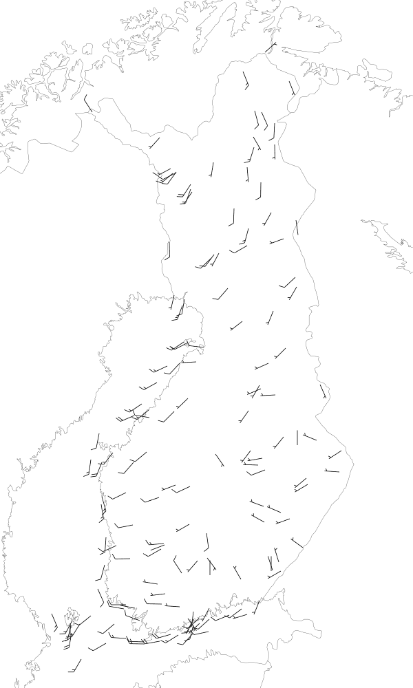 |

> The `_priority_extreama` test name preserves an original typo and is kept verbatim so the input file path matches.

---

## GetMap — Wind arrows (model data)

### wms_getmap_windarrows

**Input:** [`test/input/wms_getmap_windarrows.get`](../../test/input/wms_getmap_windarrows.get)

```
GET /wms?servicE=wms&requesT=GetMap&versioN=1.3.0
    &layerS=test:windarrows
    &styleS=
    &crS=EPSG:4326
    &bboX=59,17,71,34
    &widtH=300&heighT=500
    &formaT=image/svg%2Bxml
    &timE=200808050300 HTTP/1.0
```

Note: parameter names use mixed case (e.g. `layerS`, `crS`) — this tests that the WMS handler is case-insensitive for all WMS standard parameters.

| Parameter | Value | Description |
|-----------|-------|-------------|
| `layers` | `test:windarrows` | Model wind arrows at a regular grid layout |
| `format` | `image/svg+xml` | SVG output |

Product config: [`test/wms/customers/test/products/windarrows.json`](../../test/wms/customers/test/products/windarrows.json)


### wms_getmap_windarrows_style

**Input:** [`test/input/wms_getmap_windarrows_style.get`](../../test/input/wms_getmap_windarrows_style.get)

```
GET /wms?service=wms&request=GetMap&version=1.3.0
    &layers=test:windarrows
    &styles=windarrows_sparse_style
    &crs=EPSG:4326&bbox=59,17,71,34
    &width=300&height=500
    &format=image/png&time=200808050300 HTTP/1.0
```

| Parameter | Value | Description |
|-----------|-------|-------------|
| `styles` | `windarrows_sparse_style` | Sparser grid layout (50×50 px spacing) |


### wms_getmap_windarrows_style_svg — SVG style

Same sparser style requested with `format=image/svg+xml`.


### Time-aggregate variants — windarrows

| Test | Output |
|------|--------|
| `wms_getmap_windarrows_aggregate_min` |  |
| `wms_getmap_windarrows_aggregate_max` |  |

---

## GetMap — Wind numbers

### wms_getmap_windnumbers_style1

**Input:** [`test/input/wms_getmap_windnumbers_style1.get`](../../test/input/wms_getmap_windnumbers_style1.get)

```
GET /wms?service=wms&request=GetMap&version=1.3.0
    &layers=test:windnumbers
    &styles=
    &crs=EPSG:4326&bbox=59,17,71,34
    &width=300&height=500
    &format=image/png&time=200808050300 HTTP/1.0
```

| Parameter | Value | Description |
|-----------|-------|-------------|
| `layers` | `test:windnumbers` | Wind speed as numeric annotations at a regular grid |
| `styles` | _(empty)_ | Default style (fine grid: 20×20 px) |

Product config: [`test/wms/customers/test/products/windnumbers.json`](../../test/wms/customers/test/products/windnumbers.json)


### wms_getmap_windnumbers_style2

Same with `styles=windnumbers_sparse_style` (60×60 px grid).


### Time-aggregate variants — windnumbers

| Test | Output |
|------|--------|
| `wms_getmap_windnumbers_aggregate_min` |  |
| `wms_getmap_windnumbers_aggregate_max` |  |

---

## GetMap — Temperature symbols

### wms_getmap_temperature_symbols

**Input:** [`test/input/wms_getmap_temperature_symbols.get`](../../test/input/wms_getmap_temperature_symbols.get)

```
GET /wms?service=wms&request=GetMap&version=1.3.0
    &layers=test:opendata_temperature_symbols
    &styles=
    &crs=EPSG:4326&bbox=59,17,71,34
    &width=600&height=1000
    &format=image/svg%2Bxml
    &time=20130805T1500 HTTP/1.0
```

| Parameter | Value | Description |
|-----------|-------|-------------|
| `layers` | `test:opendata_temperature_symbols` | Temperature observations as colour-coded SVG symbols |

Renders temperature observations as coloured circle symbols using the `symbol` layer type.


### Mindistance and priority variants — temperature symbols

Same priority-selection scheme as for temperature numbers, applied to the symbol layer:

| Test | Output |
|------|--------|
| `wms_getmap_temperature_symbols_mindistance` | 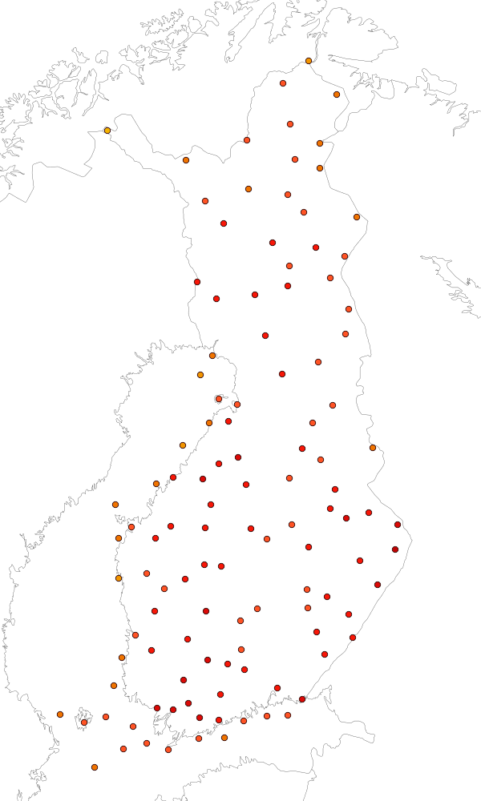 |
| `wms_getmap_temperature_symbols_mindistance_priority_none` |  |
| `wms_getmap_temperature_symbols_mindistance_priority_min` | 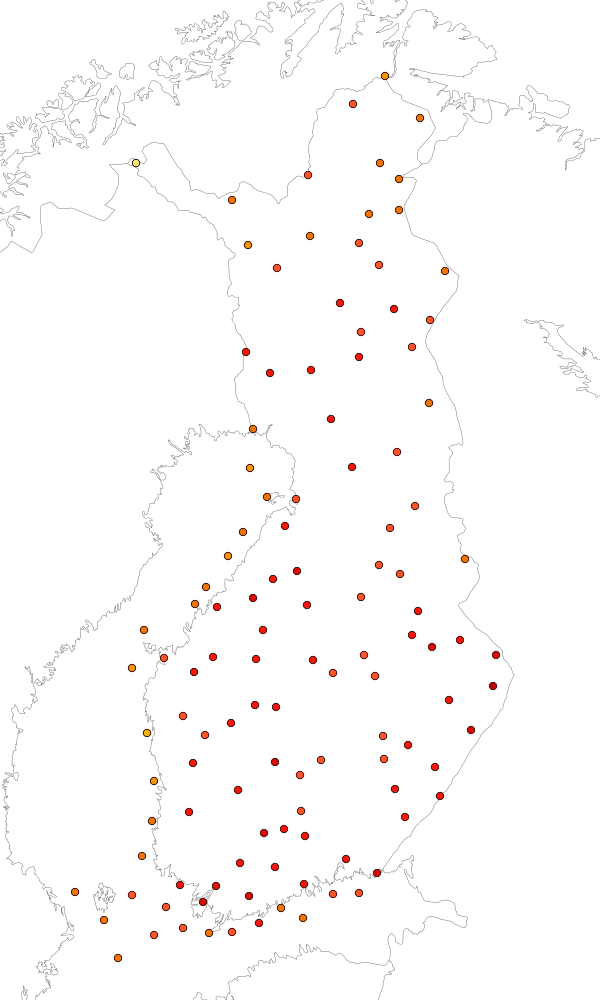 |
| `wms_getmap_temperature_symbols_mindistance_priority_max` |  |
| `wms_getmap_temperature_symbols_mindistance_priority_extrema` | 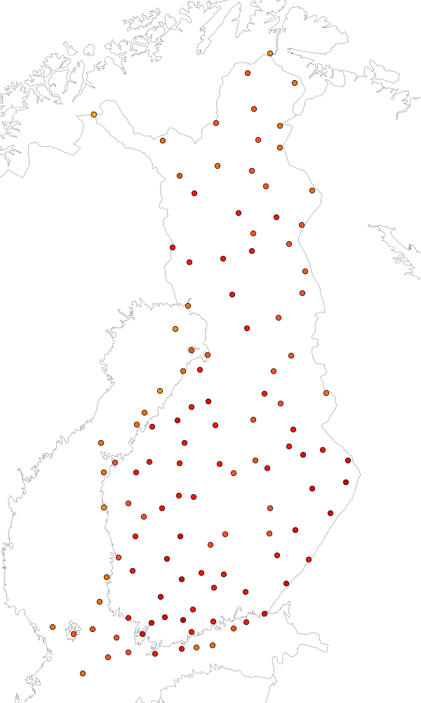 |
| `wms_getmap_temperature_symbols_mindistance_priority_array` | 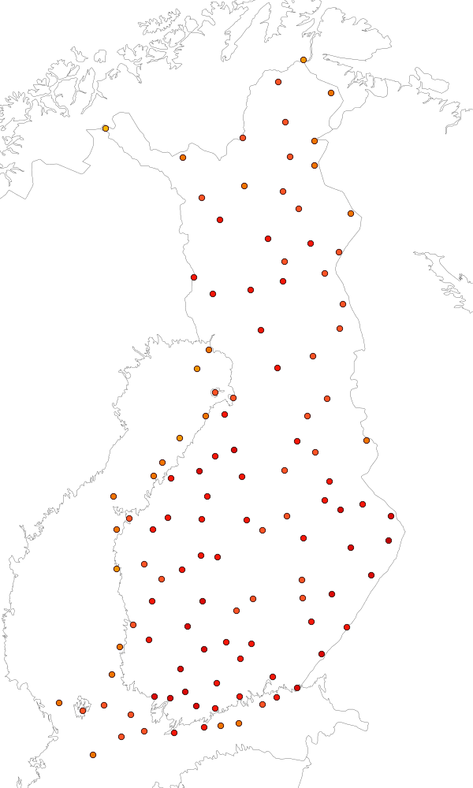 |

---

## GetMap — Multiple layers

### wms_getmap_multiple_layers

**Input:** [`test/input/wms_getmap_multiple_layers.get`](../../test/input/wms_getmap_multiple_layers.get)

```
GET /wms?service=wms&request=GetMap&version=1.3.0
    &layers=test:backgroundmap,test:precipitation_areas,test:cities
    &styles=
    &crs=EPSG:4326&bbox=59,17,71,34
    &width=300&height=500
    &format=image/svg%2Bxml
    &time=20080805120000 HTTP/1.0
```

| Parameter | Value | Description |
|-----------|-------|-------------|
| `layers` | `test:backgroundmap,test:precipitation_areas,test:cities` | Comma-separated layer list rendered bottom-to-top |
| `styles` | _(empty)_ | Default styles for all layers |

Demonstrates composite multi-layer rendering: a background map, precipitation isobands/isolines, and city symbol overlay are merged into a single SVG response.


### wms_getmap_multiple_layers_with_style

**Input:** [`test/input/wms_getmap_multiple_layers_with_style.get`](../../test/input/wms_getmap_multiple_layers_with_style.get)

```
GET /wms?...&layers=test:backgroundmap,test:precipitation_areas,test:cities
    &styles=,precipitation_thick_style, HTTP/1.0
```

| Parameter | Value | Description |
|-----------|-------|-------------|
| `styles` | `,precipitation_thick_style,` | Per-layer styles: empty for 1st and 3rd layers, explicit style for 2nd |

The `styles` list must have the same number of comma-separated entries as `layers`; empty entries use the default style.


---

## GetMap — CRS variants

### wms_getmap_png (EPSG:4326, PNG)

**Input:** [`test/input/wms_getmap_png.get`](../../test/input/wms_getmap_png.get)

```
GET /wms?service=wms&request=GetMap&version=1.3.0
    &layers=ely:wmsmap&styles=
    &crs=EPSG:4326&bbox=59,17,71,34
    &width=300&height=500
    &format=image/png&time=200808050300 HTTP/1.0
```

Standard WMS GetMap request using EPSG:4326 with PNG output.

Product config: [`test/wms/customers/ely/products/wmsmap.json`](../../test/wms/customers/ely/products/wmsmap.json)


### wms_getmap_svgxml (case-insensitive parameters)

**Input:** [`test/input/wms_getmap_svgxml.get`](../../test/input/wms_getmap_svgxml.get)

Same request with mixed-case parameter names (`servicE`, `requesT`, etc.) and `format=image/svg+xml`.  Verifies that all WMS standard parameters are parsed case-insensitively.


### wms_getmap_crs_auto2_42001 (AUTO2 UTM zone)

**Input:** [`test/input/wms_getmap_crs_auto2_42001.get`](../../test/input/wms_getmap_crs_auto2_42001.get)

```
GET /wms?service=wms&request=getmap&version=1.3.0
    &layers=ely:wmsmap&styles=
    &crs=AUTO2:42001,1,25,60
    &debug=1
    &bbox=221000,6660000,690000,7770000
    &width=500&height=500
    &format=image/svg%2bxml
    &time=200808050300 HTTP/1.0
```

| Parameter | Value | Description |
|-----------|-------|-------------|
| `crs` | `AUTO2:42001,1,25,60` | OGC AUTO2 Universal Transverse Mercator; zone determined by `lon=25°E, lat=60°N` |
| `bbox` | `221000,6660000,690000,7770000` | Bounding box in metres (AUTO2 projected coordinates) |

OGC AUTO2 CRS codes automatically derive a projection from supplied reference coordinates.  `42001` = UTM.


### wms_getmap_crs_auto2_42004

Same but with `AUTO2:42004` (Equidistant Cylindrical).


### wms_getmap_crs_scandinavia (named CRS)

**Input:** [`test/input/wms_getmap_crs_scandinavia.get`](../../test/input/wms_getmap_crs_scandinavia.get)

```
GET /wms?...&crs=CRS:SmartMetScandinavia
    &bbox=-1010040,-4051052,1005949,-1814781
    &width=500&height=500 HTTP/1.0
```

| Parameter | Value | Description |
|-----------|-------|-------------|
| `crs` | `CRS:SmartMetScandinavia` | Named CRS defined in the server's GIS configuration |
| `bbox` | (metres) | Bounding box in the named CRS's projected coordinate system |

Demonstrates the use of server-defined named CRS strings in addition to standard EPSG/AUTO2 codes.


---

## GetMap — Time interpolation

### wms_getmap_svgxml_interpolated_time

**Input:** [`test/input/wms_getmap_svgxml_interpolated_time.get`](../../test/input/wms_getmap_svgxml_interpolated_time.get)

```
GET /wms?...&layers=ely:wmsmap&time=200808050330 HTTP/1.0
```

| Parameter | Value | Description |
|-----------|-------|-------------|
| `time` | `200808050330` | 03:30 UTC — halfway between data timesteps at 03:00 and 04:00 |

Tests that the server correctly interpolates or snaps to the nearest available data timestep when the requested time does not exactly match a data timestep.


---

## GetMap — Time intervals

The `flash15min` layer stores data in 15-minute slots.  The `time` parameter can specify either a point in time or an interval using ISO 8601 duration syntax.

| Test | `time` value | Description |
|------|-------------|-------------|
| `wms_getmap_interval_default` | `201308051200` | Point in time; server uses the default aggregation interval |
| `wms_getmap_interval_start_30m` | `201308051200/PT30M` | 30-minute window starting at 12:00 |
| `wms_getmap_interval_end_30m` | `PT30M/201308051200` | 30-minute window ending at 12:00 |
| `wms_getmap_interval_30m30m` | `PT30M/201308051200/PT30M` | 30-minute window centred at 12:00 |

| Test | Output |
|------|--------|
| `wms_getmap_interval_default` |  |
| `wms_getmap_interval_start_30m` | 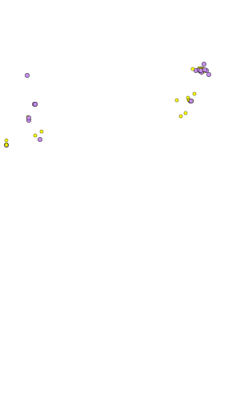 |
| `wms_getmap_interval_end_30m` | 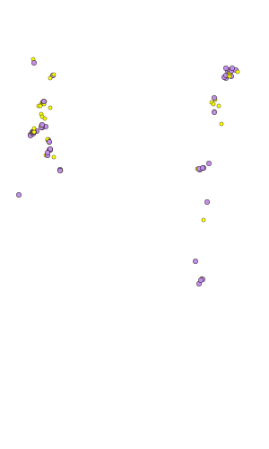 |
| `wms_getmap_interval_30m30m` | 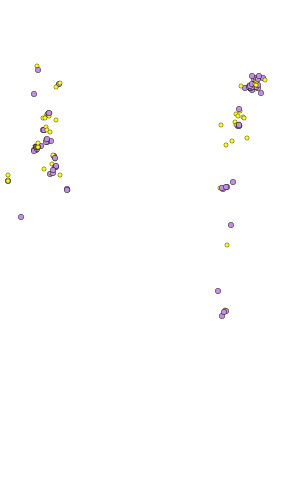 |

---

## GetMap — GeoJSON output

### wms_getmap_geojson

**Input:** [`test/input/wms_getmap_geojson.get`](../../test/input/wms_getmap_geojson.get)

```
GET /wms?service=wms&request=GetMap&version=1.3.0
    &layers=test:precipitation_areas&styles=
    &crs=EPSG:4326&bbox=59,17,71,34
    &width=300&height=500
    &format=application/geo%2Bjson
    &time=20080805120000 HTTP/1.0
```

| Parameter | Value | Description |
|-----------|-------|-------------|
| `format` | `application/geo+json` | Returns isoband geometry as a GeoJSON FeatureCollection |

Isobands are returned as GeoJSON MultiPolygon features with the band's lower/upper limits as properties.  Used for programmatic access to contour geometry.

**Output:** [`test/output/wms_getmap_geojson.get`](../../test/output/wms_getmap_geojson.get) — GeoJSON

### wms_getmap_geojson_precision

Same but tests that coordinate precision is controlled by the `precision` configuration setting.

**Output:** [`test/output/wms_getmap_geojson_precision.get`](../../test/output/wms_getmap_geojson_precision.get) — GeoJSON

---

## GetMap — PDF output

### wms_getmap_pdf

**Input:** [`test/input/wms_getmap_pdf.get`](../../test/input/wms_getmap_pdf.get)

```
GET /wms?...&layers=ely:wmsmap&format=application/pdf&time=200808050300 HTTP/1.0
```

| Parameter | Value | Description |
|-----------|-------|-------------|
| `format` | `application/pdf` | Returns the map as a PDF vector document |

**Output:** [`test/output/wms_getmap_pdf.get`](../../test/output/wms_getmap_pdf.get) — PDF

---

## GetMap — DataTile output

### wms_getmap_datatile

**Input:** [`test/input/wms_getmap_datatile.get`](../../test/input/wms_getmap_datatile.get)

```
GET /wms?service=wms&request=GetMap&version=1.3.0&layers=grid:datatile_temperature&styles=&crs=EPSG:4326&bbox=34,-12,74,40&width=64&height=64&format=application/x-datatile%2Bpng&time=200808050800 HTTP/1.0
```

| Parameter | Value | Description |
|-----------|-------|-------------|
| `layers` | `grid:datatile_temperature` | Temperature datatile product from the grid customer |
| `format` | `application/x-datatile+png` | Requests RGBA-encoded float data PNG instead of a visual image |
| `width` / `height` | `64` | Tile dimensions |
| `bbox` | `34,-12,74,40` | Bounding box covering Europe |

Returns a datatile PNG where pixel values encode temperature data for client-side processing (particle animations, colour ramps, etc.).  The MIME type `application/x-datatile+png` triggers the datatile pipeline, which bypasses SVG rendering entirely and queries the grid engine directly.

**Output:** [`test/output/wms_getmap_datatile.get`](../../test/output/wms_getmap_datatile.get) — PNG (binary, not a visual image)

---

## GetMap — Observation data

### wms_getmap_netatmo_observations

**Input:** [`test/input/wms_getmap_netatmo_observations.get`](../../test/input/wms_getmap_netatmo_observations.get)

```
GET /wms?...&layers=test:netatmo5min&crs=EPSG:4326
    &bbox=53.5,3.5,72,33&width=600&height=800
    &format=image/png&time=20190325090500 HTTP/1.0
```

| Parameter | Value | Description |
|-----------|-------|-------------|
| `layers` | `test:netatmo5min` | Netatmo citizen weather station observations |
| `time` | `20190325090500` | Observation time (5-minute data) |

Renders crowd-sourced Netatmo temperature observations as coloured dots.


### wms_getmap_roadcloud_observations

Same pattern for RoadCloud road-condition sensor data.


---

## GetMap — Variants

The `variant` layer prefix selects an alternative data producer using the variant layer syntax `variant:{variant_name}:{layer_name}`.

| Test | `layers` | Description | Output |
|------|----------|-------------|--------|
| `wms_getmap_variant_pal` | `variant:pal:temperature` | Temperature layer using the `pal` data producer variant |  |
| `wms_getmap_variant_ground` | `variant:ground:groundtemperature` | Ground temperature from the `ground` variant | 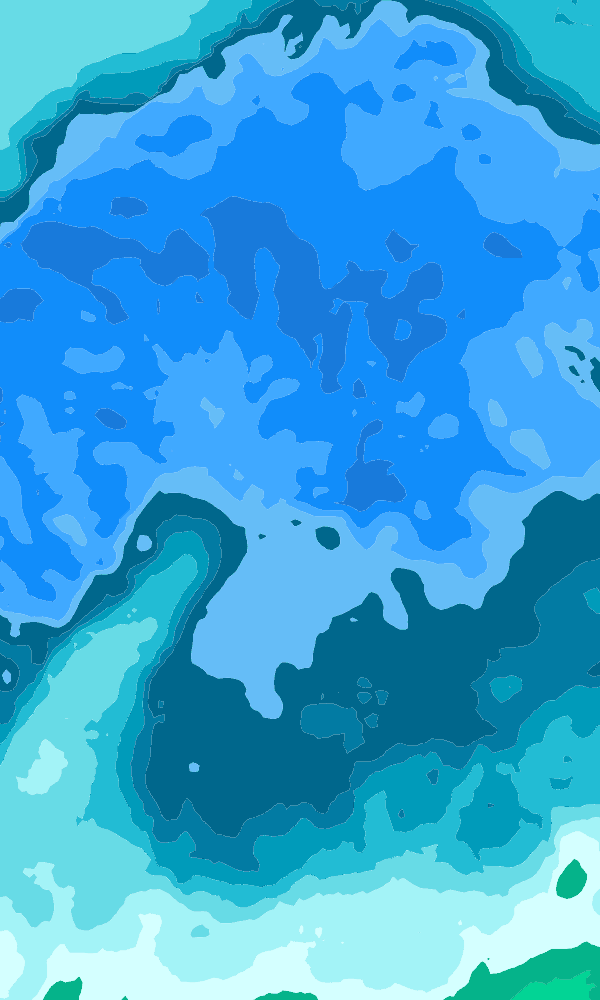 |
| `wms_getmap_nonvariant_pal` | `test:nonvariant_pal` | Same data but as a regular (non-variant) layer | 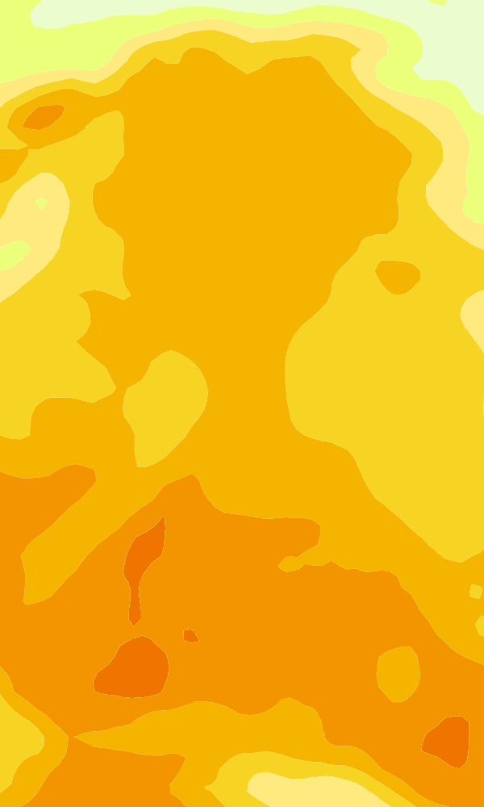 |
| `wms_getmap_nonvariant_ground` | `test:nonvariant_ground` | Same data but as a regular (non-variant) layer |  |

---

## GetMap — Frame layer

### wms_getmap_frame

**Input:** [`test/input/wms_getmap_frame.get`](../../test/input/wms_getmap_frame.get)

```
GET /wms?...&layers=test:frame_layer&crs=EPSG:4326
    &bbox=51,8,68,32&width=1800&height=2500
    &format=image/svg%2Bxml&time=current HTTP/1.0
```

| Parameter | Value | Description |
|-----------|-------|-------------|
| `layers` | `test:frame_layer` | Ice-map style frame with inner/outer borders and tick-mark scale |
| `bbox` | `51,8,68,32` | Geographic bounding box (lat/lon) |
| `time` | `current` | Use the most recent available data timestep |

The `frame` layer type draws a decorative border with inner and outer rectangular frames and a graduated scale with tick marks and labels.

Product config: [`test/wms/customers/test/products/frame_layer.json`](../../test/wms/customers/test/products/frame_layer.json)


---

## GetMap — Ice chart

### wms_icechart_fmi_color

**Input:** [`test/input/wms_icechart_fmi_color.get`](../../test/input/wms_icechart_fmi_color.get)

```
GET /wms?...&layers=test:icechart_fmi_color&crs=EPSG:4326
    &bbox=51,6,69,33&width=2000&height=2500
    &format=image/svg%2Bxml&time=20120227142200 HTTP/1.0
```

| Parameter | Value | Description |
|-----------|-------|-------------|
| `layers` | `test:icechart_fmi_color` | Baltic Sea ice chart with FMI colour scheme |
| `time` | `20120227142200` | Winter 2012 ice analysis time |

Renders Baltic Sea ice coverage using the FMI ice-chart color conventions.


### wms_icechart_areas

**Input:** [`test/input/wms_icechart_areas.get`](../../test/input/wms_icechart_areas.get)

Same ice chart data rendered as named area polygons rather than coloured fills.


### wms_icechart_fmi_color_epsg3857 — Ice chart in Web Mercator

**Input:** [`test/input/wms_icechart_fmi_color_epsg3857.get`](../../test/input/wms_icechart_fmi_color_epsg3857.get)

Same FMI-colour ice chart but reprojected to Web Mercator (`crs=EPSG:3857`) for browser overlay use.

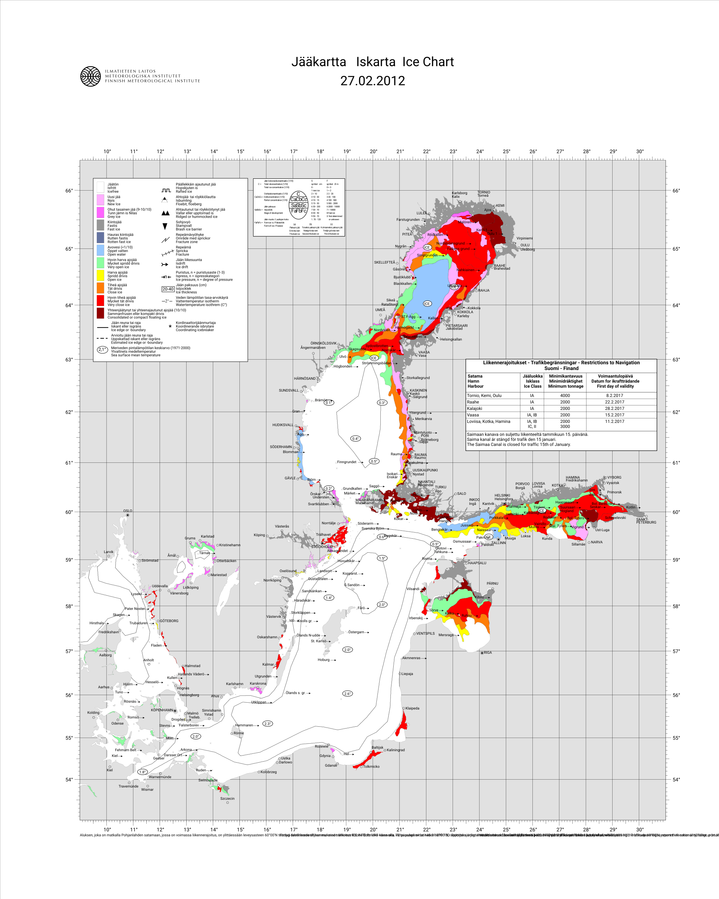

---

## GetMap — Symbol style

### wms_getmap_symbol_style

**Input:** [`test/input/wms_getmap_symbol_style.get`](../../test/input/wms_getmap_symbol_style.get)

```
GET /wms?...&layers=test:precipitation&styles=precipitation_red_rain_style
    &crs=EPSG:4326&bbox=59,17,71,34&width=300&height=500
    &format=image/png&time=200808050300 HTTP/1.0
```

| Parameter | Value | Description |
|-----------|-------|-------------|
| `layers` | `test:precipitation` | Precipitation layer |
| `styles` | `precipitation_red_rain_style` | Custom style that uses a rain SVG symbol instead of filled isobands |

Demonstrates that an isoband layer can be rendered as repeated SVG symbols rather than filled polygons by specifying a symbol-based style.


---

## GetMap — Error handling

When a request contains invalid parameters the server returns either an XML service exception (default) or an in-image error (when `EXCEPTIONS=INIMAGE` or format-specific variants are used).

| Test | Error | Response format |
|------|-------|-----------------|
| `wms_getmap_invalid_crs` | Unknown CRS | XML exception |
| `wms_getmap_invalid_crs_json` | Unknown CRS | JSON exception |
| `wms_getmap_invalid_layer` | Unknown layer | XML exception |
| `wms_getmap_invalid_layer_json` | Unknown layer | JSON exception |
| `wms_getmap_invalid_style` | Unknown style | XML exception |
| `wms_getmap_invalid_style_json` | Unknown style | JSON exception |
| `wms_getmap_invalid_time` | Invalid time | XML exception |
| `wms_getmap_invalid_time_json` | Invalid time | JSON exception |
| `wms_getmap_invalid_version` | Unsupported version | XML exception |
| `wms_getmap_invalid_version_json` | Unsupported version | JSON exception |
| `wms_getmap_invalid_format` | Unsupported format | XML exception |
| `wms_getmap_invalid_layer_inimage_pdf` | Unknown layer | Error PDF |
| `wms_getmap_invalid_time_inimage_pdf` | Invalid time | Error PDF |

In-image error renderings (`EXCEPTIONS=INIMAGE`) carry the failure message inside the requested image format:

| Test | Output |
|------|--------|
| `wms_getmap_invalid_crs_inimage_blank` — blank PNG |  |
| `wms_getmap_invalid_crs_inimage_png` — error PNG |  |
| `wms_getmap_invalid_style_inimage_png` — error PNG |  |
| `wms_getmap_invalid_format_inimage_svg` — error SVG |  |
| `wms_getmap_invalid_version_inimage_svg` — error SVG |  |

---

## GetMap — Grid Engine layers

The `grid:` layer namespace is served by the SmartMet **grid-content engine** (Redis-backed GRIB1/GRIB2/NetCDF) rather than the QueryData engine.  Tests are named `wms::grid::<layer>::<producer>` (and `wms::qd::...` for the analogous QueryData wind-stream cases) — the `::` segments survive intentionally in the filename so the test harness can derive the layer / producer pair from the path.

All requests use `format=image/svg+xml`; the PNG previews here are rasterised from the SVG outputs.  Producers exercised by the suite:

- `pal` — Finland-area model (default bbox `59,17,71,34`, 300×500 px)
- `ecmwf_eurooppa_pinta` — ECMWF Europe surface (bbox `34,-12,74,40`, 500×500 px) selected with `&producer=ecmwf_eurooppa_pinta`
- `ecmwf_maailma_pinta` — ECMWF global surface, world bbox

Product configurations live in [`test/wms/customers/grid/products/`](../../test/wms/customers/grid/products/).

### Temperature

Six temperature layers with progressively richer styling — base isobands, isolines, smoothing, labels, multi-style composite.

| Test | Producer | Output |
|------|----------|--------|
| `wms::grid::temperature_1::pal` | `pal` | 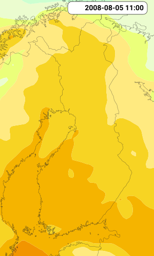 |
| `wms::grid::temperature_1::ecmwf_eurooppa_pinta` | ECMWF Europe | 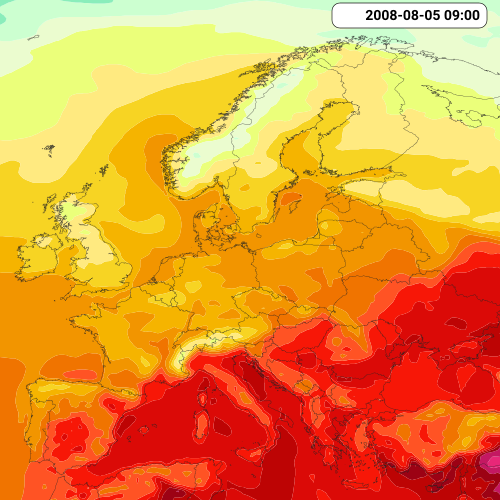 |
| `wms::grid::temperature_1::ecmwf_eurooppa_pinta::time_interpolation` | ECMWF Europe, interpolated time | 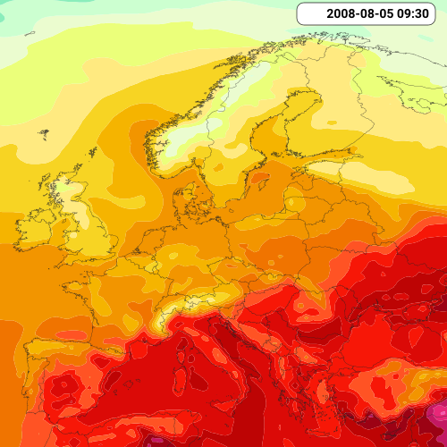 |
| `wms::grid::temperature_1::ecmwf_maailma_pinta` | ECMWF World | 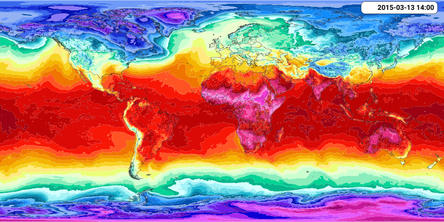 |
| `wms::grid::temperature_2::pal` | `pal` | 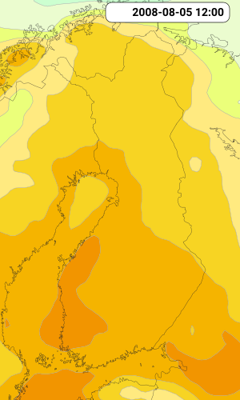 |
| `wms::grid::temperature_3::pal` | `pal` | 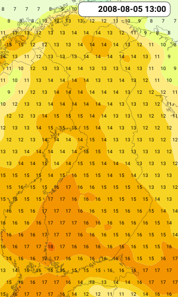 |
| `wms::grid::temperature_4::pal` | `pal` | 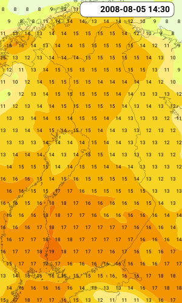 |
| `wms::grid::temperature_4::pal::time_interpolation` | `pal`, interpolated time |  |
| `wms::grid::temperature_5::pal` | `pal` | 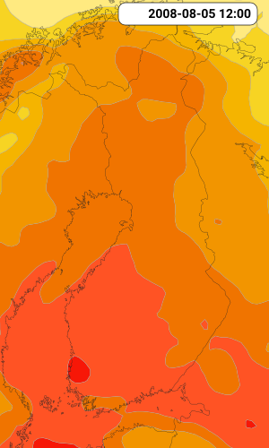 |
| `wms::grid::temperature_6::pal` | `pal` | 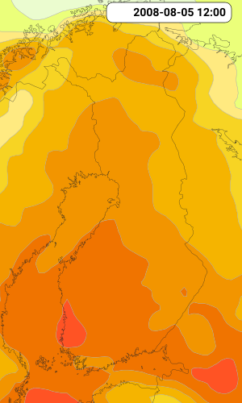 |

The `::time_interpolation` suffix tests requesting a timestamp between two stored timesteps; the grid engine interpolates linearly.  TopoJSON output of the same isobands is exercised by `wms::grid::temperature_1::pal::topojson` and `wms::grid::temperature_2::pal::topojson` (JSON output, not shown here).

### Precipitation

| Test | Producer | Output |
|------|----------|--------|
| `wms::grid::precipitation_1::pal` | `pal` | 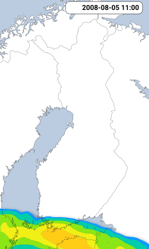 |
| `wms::grid::precipitation_1::ecmwf_eurooppa_pinta` | ECMWF Europe | 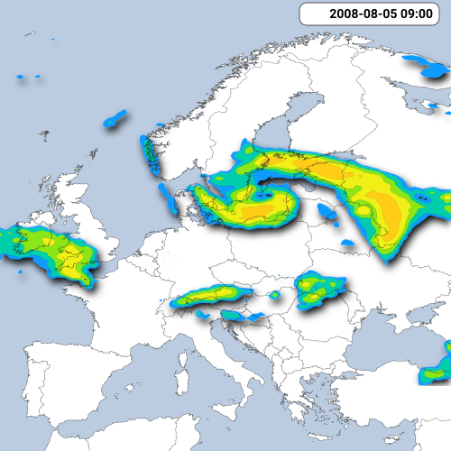 |

### Raster

The `raster_*` products render gridded data through a `RasterLayer` that emits PNG-in-SVG `<image>` elements.  `_t1` / `_t2` suffixes select between alternative styling templates.

| Test | Producer | Output |
|------|----------|--------|
| `wms::grid::raster_1_t1::pal` | `pal` |  |
| `wms::grid::raster_1_t1::ecmwf_eurooppa_pinta` | ECMWF Europe | 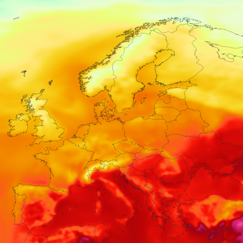 |
| `wms::grid::raster_1_t2::pal` | `pal` | 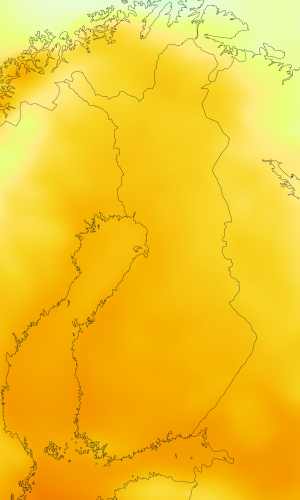 |
| `wms::grid::raster_1_t2::ecmwf_eurooppa_pinta` | ECMWF Europe |  |
| `wms::grid::raster_2::ecmwf_eurooppa_pinta` | ECMWF Europe | 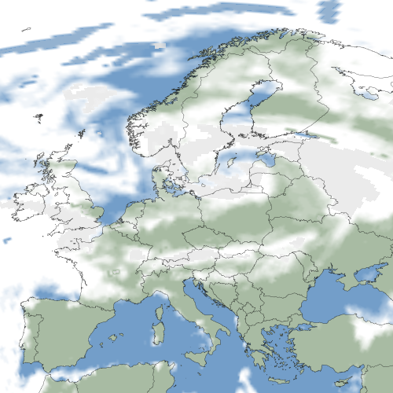 |
| `wms::grid::raster_3_t1::pal` | `pal` | 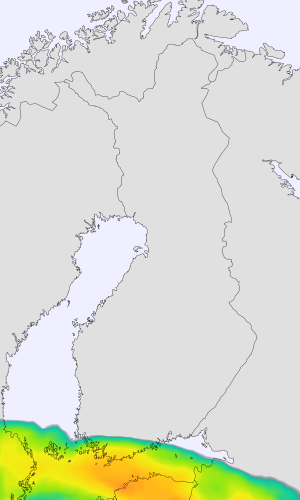 |
| `wms::grid::raster_3_t1::ecmwf_eurooppa_pinta` | ECMWF Europe | 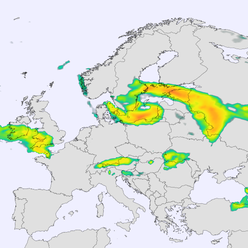 |
| `wms::grid::raster_3_t2::pal` | `pal` | 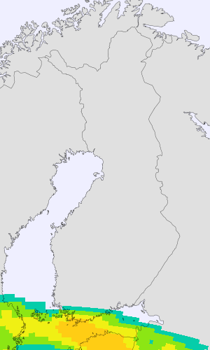 |
| `wms::grid::raster_3_t2::ecmwf_eurooppa_pinta` | ECMWF Europe | 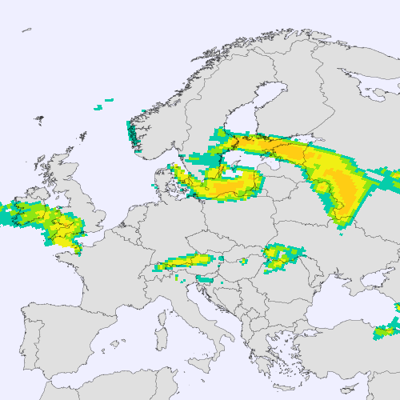 |
| `wms::grid::raster_4_t1::ecmwf_eurooppa_pinta` | ECMWF Europe | 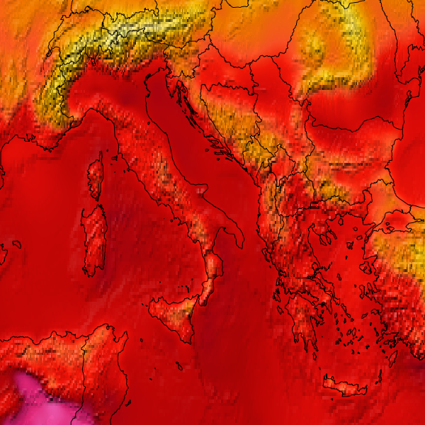 |
| `wms::grid::raster_5_t1::ecmwf_eurooppa_pinta` | ECMWF Europe | 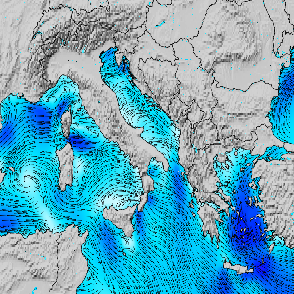 |
| `wms::grid::raster_6_t1::ecmwf_eurooppa_pinta` | ECMWF Europe | 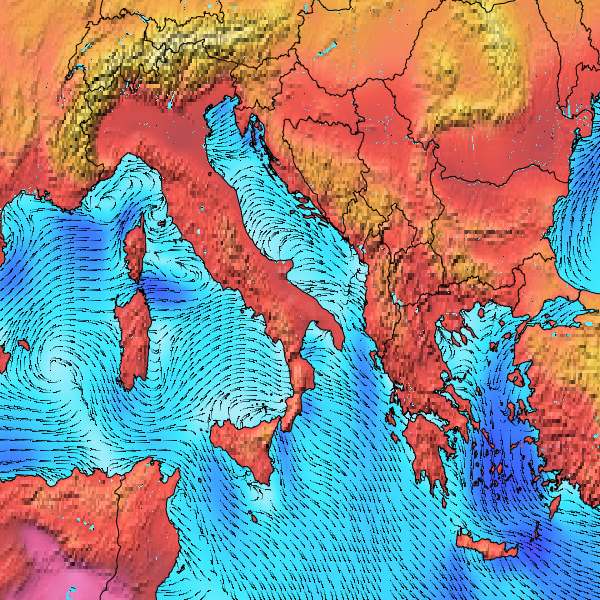 |

### Wind direction / speed

Vector quantities decomposed into separate direction and speed layers, plus a combined-style layer.

| Test | Producer | Output |
|------|----------|--------|
| `wms::grid::wind_direction_1::pal` | `pal` | 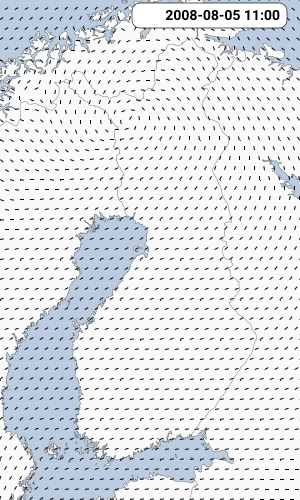 |
| `wms::grid::wind_direction_1::ecmwf_eurooppa_pinta` | ECMWF Europe | 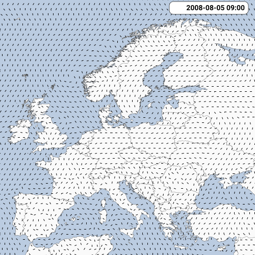 |
| `wms::grid::wind_speed_1::pal` | `pal` | 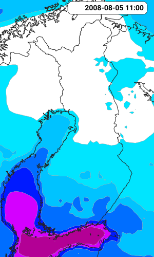 |
| `wms::grid::wind_speed_1::ecmwf_eurooppa_pinta` | ECMWF Europe | 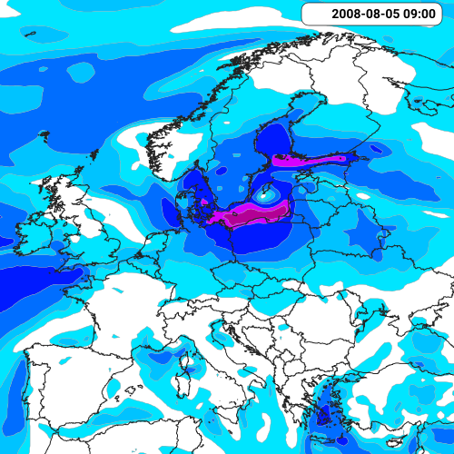 |
| `wms::grid::wind_speed_2::pal` | `pal` | 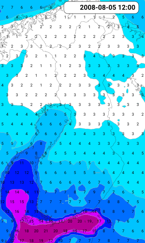 |
| `wms::grid::wind_speed_2::ecmwf_eurooppa_pinta` | ECMWF Europe | 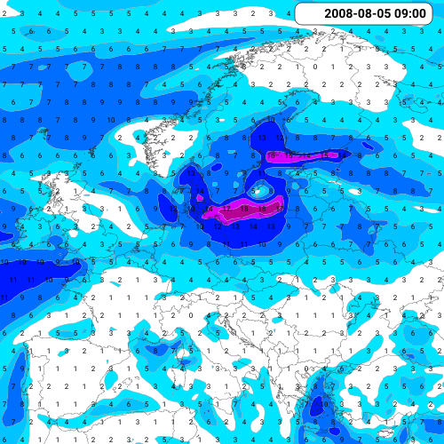 |
| `wms::grid::wind_speed_and_direction_1::pal` | `pal` | 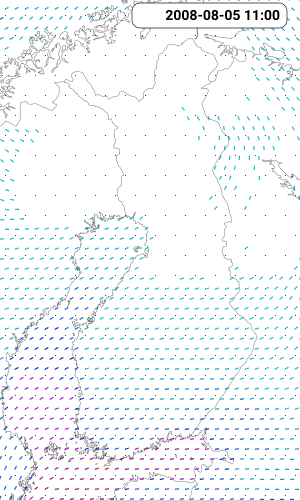 |
| `wms::grid::wind_speed_and_direction_1::ecmwf_eurooppa_pinta` | ECMWF Europe | 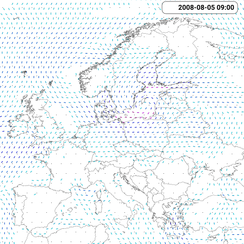 |

`wms::grid::wind_speed_1::ecmwf_eurooppa_pinta::topojson` exercises the same layer with TopoJSON output (not shown).

### Wind streamlines

Streamline traces driven by U/V wind components, served from both grid and QueryData engines for parity testing.

| Test | Engine / Producer | Output |
|------|-------------------|--------|
| `wms::grid::wind_stream_1::pal` | grid / `pal` | 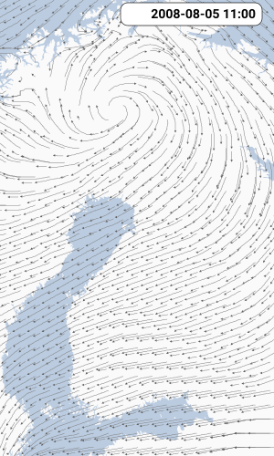 |
| `wms::grid::wind_stream_1::ecmwf_eurooppa_pinta` | grid / ECMWF Europe | 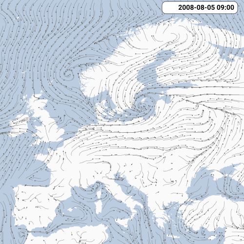 |
| `wms::grid::wind_stream_4::ecmwf_eurooppa_pinta` | grid / ECMWF Europe | 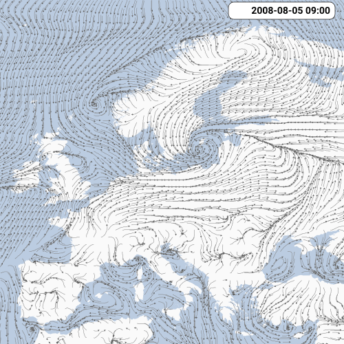 |
| `wms::qd::wind_stream_2::ecmwf_maailma_pinta` | QueryData / ECMWF World | 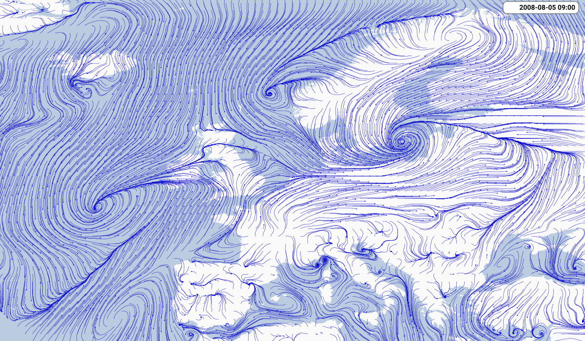 |
| `wms::qd::wind_stream_3::pal` | QueryData / `pal` | 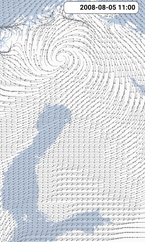 |
| `wms::qd::wind_stream_3::ecmwf_maailma_pinta` | QueryData / ECMWF World | 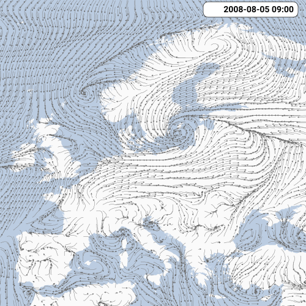 |
| `wms::qd::wind_stream_4::ecmwf_maailma_pinta` | QueryData / ECMWF World | 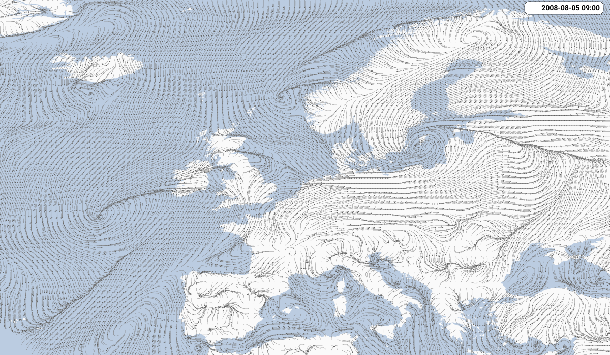 |

### wmsmap — Plain background map

`wmsmap` (under the `ely` customer) is the simple Natural-Earth + graticule background that the WMS GetCapabilities tests use for projection coverage.


(Same image as [`wms_getmap_png`](#wms_getmap_png-epsg4326-png) above — `wmsmap` is the underlying product name.)

---

## GetFeatureInfo

GetFeatureInfo returns data values at a specified pixel location within a previously rendered map.

### wms_getfeatureinfo_json

**Input:** [`test/input/wms_getfeatureinfo_json.get`](../../test/input/wms_getfeatureinfo_json.get)

```
GET /wms?service=wms&request=GetFeatureInfo&version=1.3.0
    &layers=test:frame_layer
    &query_layers=test:frame_layer
    &styles=
    &crs=EPSG:4326&bbox=51,8,68,32
    &width=1800&height=2500
    &format=image/svg%2Bxml
    &i=900&j=1250
    &info_format=application/json
    &time=current HTTP/1.0
```

| Parameter | Value | Description |
|-----------|-------|-------------|
| `request` | `GetFeatureInfo` | Returns data at a pixel position |
| `query_layers` | `test:frame_layer` | Layers to query (must be a subset of `layers`) |
| `i` | `900` | Pixel column in the image (0-based from left) |
| `j` | `1250` | Pixel row in the image (0-based from top) |
| `info_format` | `application/json` | Return data as JSON |

**Output:** [`test/output/wms_getfeatureinfo_json.get`](../../test/output/wms_getfeatureinfo_json.get) — JSON

### wms_getfeatureinfo_html

Same request with `info_format=text/html`.

**Output:** [`test/output/wms_getfeatureinfo_html.get`](../../test/output/wms_getfeatureinfo_html.get) — HTML

### wms_getfeatureinfo_precipitation_json

**Input:** [`test/input/wms_getfeatureinfo_precipitation_json.get`](../../test/input/wms_getfeatureinfo_precipitation_json.get)

```
GET /wms?...&layers=test:precipitation_areas&query_layers=test:precipitation_areas
    &bbox=59,17,71,34&width=300&height=500
    &i=150&j=250&info_format=application/json
    &time=20080805120000 HTTP/1.0
```

Queries the precipitation isoband value at pixel (150, 250) — the centre of the map.

**Output:** [`test/output/wms_getfeatureinfo_precipitation_json.get`](../../test/output/wms_getfeatureinfo_precipitation_json.get) — JSON

### wms_getfeatureinfo_numbers_json

**Input:** [`test/input/wms_getfeatureinfo_numbers_json.get`](../../test/input/wms_getfeatureinfo_numbers_json.get)

Queries the temperature value at a station position from the `opendata_temperature_numbers_max` layer (uses the time-maximum aggregate).

**Output:** [`test/output/wms_getfeatureinfo_numbers_json.get`](../../test/output/wms_getfeatureinfo_numbers_json.get) — JSON

Additional GetFeatureInfo tests:
- `wms_getfeatureinfo_missing_query_layers` — error when `query_layers` is omitted
- `wms_getfeatureinfo_precipitationform_symbols_json` — queries precipitation form symbols
- `wms_getfeatureinfo_precipitation_isoband_labels_json` — queries isoband label values
- `wms_getfeatureinfo_roadcondition_isoband_json` — queries road condition isobands
- `wms_getfeatureinfo_temperature_symbols_json` — queries temperature symbol data

---

## GetLegendGraphic

`GetLegendGraphic` returns a legend image for a given layer and style.  The complete gallery — automatic, style variants, modified, product-specific templates, multilingual, internal, and external legends — is on its own page: see [Legend Examples](legends.md).

---

