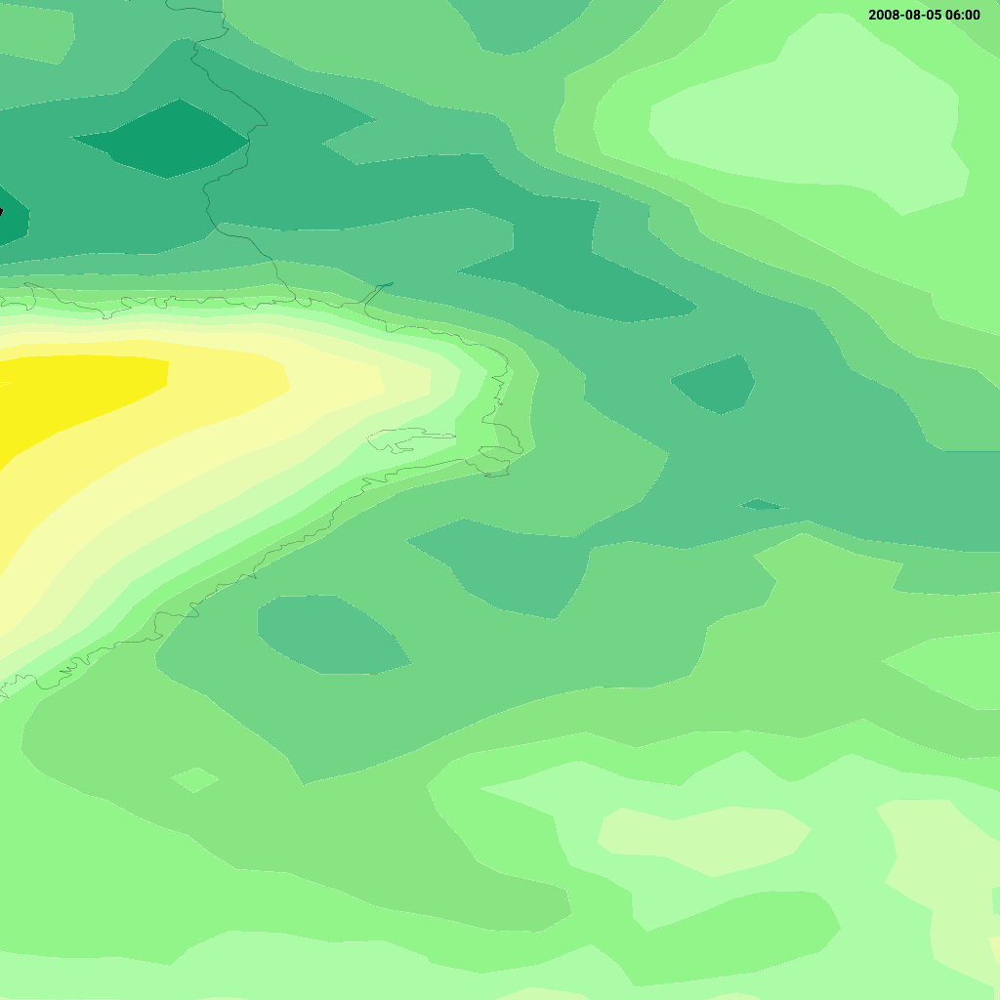

# WMTS Test Examples

The WMTS tests exercise the `/wmts` endpoint, which implements OGC Web Map Tile Service 1.0.0.  The REST-KVP hybrid URL path has the form:

```
/wmts/1.0.0/{layer}/{style}[/{dimension}…]/{TileMatrixSet}/{TileMatrix}/{TileRow}/{TileCol}.{format}
```

Temporal and vertical layers carry their dimension values as **extra path segments between the style and the TileMatrixSet** (see [Dimensions](#dimensions) below).  Layers without dimensions use the plain seven-segment form `…/{style}/{TileMatrixSet}/…`.

Test inputs are in [`test/input/wmts_*.get`](../../test/input/) and expected outputs in [`test/output/wmts_*.get`](../../test/output/).

## Contents

- [Dimensions](#dimensions)
- [wmts_getcapabilities](#wmts_getcapabilities)
- [wmts_gettile_isoband](#wmts_gettile_isoband)
- [wmts_gettile_temperature_numbers](#wmts_gettile_temperature_numbers)
- [wmts_gettile_geotiff](#wmts_gettile_geotiff)
- [wmts_gettile_elevation_850 / _500](#wmts_gettile_elevation_850--_500)

## Dimensions

A layer's dimensions are advertised in `GetCapabilities`: each `<Layer>` lists a `<Dimension>` (with `<ows:Identifier>`, `<ows:UOM>`/`<UnitSymbol>`, `<Default>`, `<Value>`) for every axis it offers, and its `<ResourceURL>` template names the matching placeholders, e.g.:

```
…/{Style}/{Time}/{Reference_time}/{Elevation}/{TileMatrixSet}/{TileMatrix}/{TileRow}/{TileCol}.png
```

At request time each placeholder becomes a **path segment**, in the same order the capabilities advertise them:

| Dimension | Identifier | Example value | Maps to |
|-----------|------------|---------------|---------|
| Time | `Time` | `20080909T1200` | valid time |
| Reference time | `Reference_time` | `20080909T0000` | model analysis / origin time |
| Elevation | `Elevation` | `850` | vertical level (e.g. pressure in hPa) |

So a temperature layer on pressure levels is requested as:

```
/wmts/1.0.0/test:t2m_pressure/default/20080909T1200/20080909T0000/850/EPSG:3067/3/2/4.png
```

Notes:

- Identifiers are capitalised (`Time`, `Reference_time`, `Elevation`) to match what the GeoWeb OpenLayers client substitutes into the template.
- Any omitted trailing dimension falls back to its default (e.g. the most current time); a bare seven-segment URL renders the layer at all defaults.
- A `TIME=` query parameter is still accepted for backward compatibility, but the path segment takes precedence.

## wmts_getcapabilities

**Input:** [`test/input/wmts_getcapabilities.get`](../../test/input/wmts_getcapabilities.get)

```
GET /wmts/1.0.0/WMTSCapabilities.xml HTTP/1.0
```

Returns the WMTS 1.0.0 capabilities document listing all available tile layers, tile matrix sets, styles, and supported output formats.  Each layer advertises tile matrix sets for EPSG:3035, EPSG:3067, EPSG:3857, and EPSG:4326.

**Output:** [`test/output/wmts_getcapabilities.get`](../../test/output/wmts_getcapabilities.get) — XML

## wmts_gettile_isoband

**Input:** [`test/input/wmts_gettile_isoband.get`](../../test/input/wmts_gettile_isoband.get)

```
GET /wmts/1.0.0/test:t2m/temperature_one_degrees/EPSG:4326/5/4/36.png?TIME=20080805T030000 HTTP/1.0
```

| Path segment | Value | Description |
|--------------|-------|-------------|
| `test:t2m` | Layer | Temperature isoband layer in customer `test` |
| `temperature_one_degrees` | Style | 1°C isoband interval style |
| `EPSG:4326` | TileMatrixSet | WGS 84 tile grid |
| `5` | TileMatrix | Zoom level 5 |
| `4` | TileRow | Row 4 within the tile grid |
| `36` | TileCol | Column 36 within the tile grid |
| `.png` | Format | PNG output |
| `TIME` | `20080805T030000` | Valid time query parameter |

Returns a 1024×1024 PNG tile of temperature isobands.

**Output:** [`test/output/wmts_gettile_isoband.get`](../../test/output/wmts_gettile_isoband.get) — PNG (1024×1024)



## wmts_gettile_temperature_numbers

**Input:** [`test/input/wmts_gettile_temperature_numbers.get`](../../test/input/wmts_gettile_temperature_numbers.get)

```
GET /wmts/1.0.0/test:opendata_temperature_numbers/default/EPSG:4326/5/4/36.svg?TIME=20130805T1500 HTTP/1.0
```

| Path segment | Value | Description |
|--------------|-------|-------------|
| `test:opendata_temperature_numbers` | Layer | Temperature observation numbers |
| `default` | Style | Default style |
| `.svg` | Format | SVG output (vector tiles) |
| `TIME` | `20130805T1500` | Valid time |

Returns a 1024×1024 SVG tile containing temperature number annotations as vector graphics.

**Output:** [`test/output/wmts_gettile_temperature_numbers.get`](../../test/output/wmts_gettile_temperature_numbers.get) — SVG


## wmts_gettile_geotiff

**Input:** [`test/input/wmts_gettile_geotiff.get`](../../test/input/wmts_gettile_geotiff.get)

```
GET /wmts/1.0.0/grid:raster_1/default/EPSG:4326/5/4/36.tiff?TIME=20080805T080000 HTTP/1.0
```

| Path segment | Value | Description |
|--------------|-------|-------------|
| `grid:raster_1` | Layer | Raw gridded raster data layer |
| `.tiff` | Format | GeoTIFF raster tile |
| `TIME` | `20080805T080000` | Valid time |

Returns a GeoTIFF tile containing raw numerical grid data (not rendered colour).  Used for programmatic access to model data in raster form.

**Output:** [`test/output/wmts_gettile_geotiff.get`](../../test/output/wmts_gettile_geotiff.get) — GeoTIFF (metadata/header only in the test)

## wmts_gettile_elevation_850 / _500

**Input:** [`test/input/wmts_gettile_elevation_850.get`](../../test/input/wmts_gettile_elevation_850.get) / [`_500`](../../test/input/wmts_gettile_elevation_500.get)

```
GET /wmts/1.0.0/test:t2m_pressure/default/20080909T1200/20080909T0000/850/EPSG:3067/3/2/4.png HTTP/1.0
GET /wmts/1.0.0/test:t2m_pressure/default/20080909T1200/20080909T0000/500/EPSG:3067/3/2/4.png HTTP/1.0
```

| Path segment | Value | Description |
|--------------|-------|-------------|
| `test:t2m_pressure` | Layer | Temperature isobands on constant pressure levels |
| `default` | Style | Default style |
| `20080909T1200` | `{Time}` | Valid time |
| `20080909T0000` | `{Reference_time}` | Model analysis time |
| `850` / `500` | `{Elevation}` | Pressure level in hPa |
| `EPSG:3067` | TileMatrixSet | TM35FIN tile grid |
| `3/2/4` | TileMatrix/Row/Col | Zoom 3, row 2, col 4 |

The two requests differ only in the `{Elevation}` segment; they render **distinct** tiles (850 hPa vs 500 hPa temperature fields), which guards against the elevation dimension being silently dropped on the way to the renderer.

**Output:** [`test/output/wmts_gettile_elevation_850.get`](../../test/output/wmts_gettile_elevation_850.get) / `_500` — PNG

---

