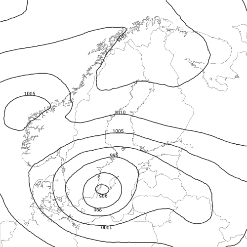
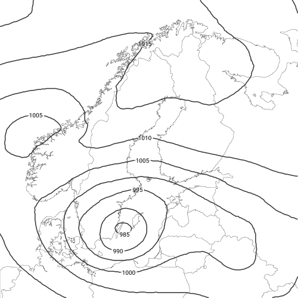
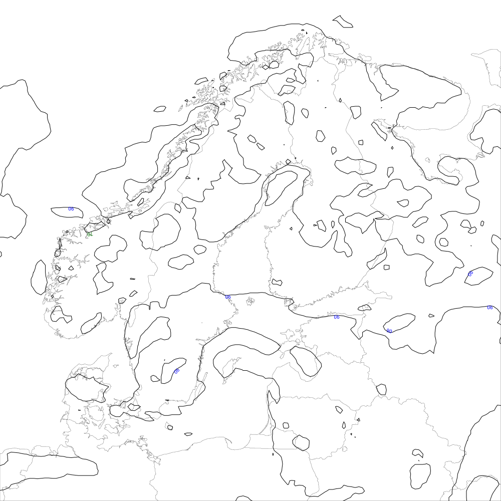
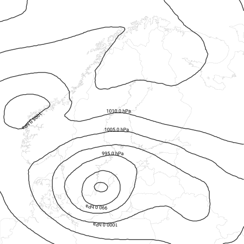
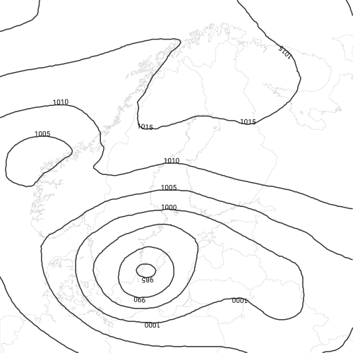
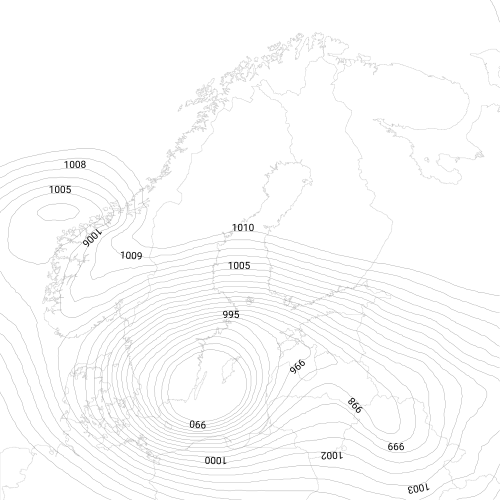

# IsolabelLayer placement algorithm

This file describes how `IsolabelLayer` chooses *where* to put labels along an isoline and *how* each one is oriented. Configuration knobs are listed in [reference.md](reference.md#isolabellayer); this document explains *what* the algorithm does at each step and *why*.

## Pipeline

```
isovalues  (set directly via "isovalues" / "isobands", and/or
            inherited from the parent IsolineLayer's "isolines" array)
   │
   ▼
contour engine    ← getIsolines(isovalues): Trax produces the V-isoline as
                    the boundary of the [V, +∞] isoband and strips the
                    +∞ "ghost" segments
   │
   ▼
smoothing         ← optional IsolineFilter pass, direction-preserving
   │
   ▼
projection        ← world-CRS → image-pixel via Fmi::OGR::transform
   │
   ▼
candidate scan    ← for every angle in `angles` rotate y, find local
                    maxima of the rotated y, record (x, y, tangent angle,
                    integrated turn over a stencil)
   │
   ▼
deduplication     ← drop bit-identical (id, x, y) duplicates emitted by
                    the multi-angle scan
   │
   ▼
quality filter    ← drop candidates outside [-max_angle, max_angle],
                    too close or too far from image edges, or whose
                    integrated turn exceeds max_curvature
   │
   ▼
weighting         ← assign a multiplicative cost based on isovalue
                    divisibility: 10s > 5s > 2s > others
   │
   ▼
collision boxes   ← per-candidate rotated bbox sized from the actual
                    rendered text length (`label.print(isovalue)`)
   │
   ▼
SELECTION         ← Kruskal MST over the candidate graph, edges weighted
                    by length × w_i·w_j, edges shorter than min_distance_*
                    move to a "bad pairs" rejection list
   │
   ▼
orientation fix   ← per-candidate perpendicular probe of the data:
                    sample 2 px in the visual-left direction, flip the
                    label 180° if the sample falls below the isovalue
   │
   ▼
emit SVG          ← <text> elements with a translate/rotate transform
                    that keeps the label tangent to the isoline
```

The pipeline is deterministic: identical inputs produce identical outputs, and the layer is reentrant.

## Candidate generation

For each polyline emitted by the contour engine, candidates are picked at *local maxima of a rotated y-coordinate*. With rotation angle α, the rotated y of vertex `(x, y)` is `sin(α)·x + cos(α)·y`. Local maxima of that scalar are computed with a stencil of `±stencil_size` neighbours. The default `angles: [0, -45, 45, 180]` therefore yields:

- `0°`  — bottom-most vertices in pixel y-down (largest y)
- `-45°` — extrema along the NE/SW diagonal
- `+45°` — extrema along the NW/SE diagonal
- `180°` — top-most vertices in pixel y-down (smallest y)

The recorded angle for each candidate is the polyline tangent at that vertex — the average of the two adjacent edges:

```
angle = ½ · (atan2(y3 − y2, x3 − x2) + atan2(y2 − y1, x2 − x1))
```

The tangent always reflects the polyline's traversal direction in pixel coordinates, regardless of which scan rotation found the candidate.

The same physical vertex frequently qualifies under multiple rotations (the topmost point of a smooth loop is also a NE/NW extremum). Because every scan reads the same OGR coordinates, duplicate candidates are bit-for-bit identical in `(id, x, y)` and are dropped by a single `std::sort` + `std::unique` pass before the selection stage. This keeps the MST input small without changing the output.

## Quality filters

`remove_bad_candidates` discards any candidate that fails one of three tests:

1. **Angle range** — `|angle| ≤ max_angle` (default 60°). Steep tangents render as near-vertical text which is hard to read; the limit also acts as a winding-direction selector (only one of "top of CCW loop" / "top of CW loop" passes for any given closed contour).
2. **Edge clearance** — `min_distance_edge ≤ d ≤ max_distance_edge` where `d` is the centre-point distance to the nearest image edge. Generous defaults make tilted-bbox extent corrections unnecessary in practice.
3. **Curvature** — the integrated turn over `±stencil_size` neighbours stays below `max_curvature`. Sharp bends produce visibly broken text under straight rotation.

## Weighting and divisibility preference

Each candidate carries a weight derived from its isovalue's divisibility:

| isovalue % 10 | isovalue % 5 | isovalue % 2 | weight |
|---|---|---|---|
| 0 |   |   | 1 |
|   | 0 |   | 4 |
|   |   | 0 | 16 |
|   |   |   | 64 |

The MST stage sorts edges by `length × w_i·w_j`, so a 10–10 connection is always preferred over 10–5 even when their geometric lengths are identical. With multiplicative weights, fives still get selected when they sit between tens that are far apart, but the hierarchy is preserved when distances are comparable.

## Collision boxes

Each surviving candidate gets an oriented rectangle approximating the rendered text:

- height ≈ font height in pixels (the layer assumes ~10 px at the default font size)
- width ≈ `n_chars · 8` px, where `n_chars = label.print(isovalue).size()`

Sizing per-candidate matters when the label format adds prefixes/suffixes/decimals: `"1015.0 hPa"` (10 chars) reserves ~80 px versus `"1015"` (4 chars) at ~32 px.

The pairwise distance between two boxes is hybrid: a SAT (separating-axis theorem) test on the four edge-normal axes determines whether the rotated rectangles overlap; if they do, the distance is 0 (the pair is rejected outright). If a separating axis exists, the historical corner-to-corner minimum is returned, which preserves the existing tunings of `min_distance_*`.

## Selection — minimum spanning tree

Selection is a Kruskal MST over candidate pairs:

1. Build all pairwise edges shorter than 250 px.
2. For each edge, look up the relevant `min_distance_*` threshold:
   - `min_distance_self` (default 200 px) — same isoline segment (`id`)
   - `min_distance_same` (default 50 px) — same isovalue, different segment
   - `min_distance_other` (default 20 px) — different isovalue
   Edges below the threshold do not enter the MST; they are recorded in a per-candidate "bad pairs" list instead.
3. Sort the remaining edges by `length · w_i · w_j` ascending.
4. Walk the sorted edges. For each, run a union-find merge: if the endpoints belong to different components and are not already accepted/rejected, both endpoints become **Accepted** and every candidate listed in their bad-pairs is **Rejected**.
5. Stop when no candidates remain undecided.

The combined sort + Kruskal + bad-pairs propagation produces a sparse, well-spaced label set that prefers round-number isovalues without having to hand-tune absolute distances per layer.

## Orientation

After selection, each accepted candidate is given a 180° flip if its perpendicular-left direction (in pixel y-down) does *not* point toward higher data values:

```
sample = q→value(translate(cand.x + 2·sin θ, cand.y − 2·cos θ))
if (sample < cand.isovalue)
    cand.angle += 180
```

Trax produces every isoline as the boundary of the `[V, +∞]` isoband and follows the GeoJSON right-hand-rule for the parent polygon — exterior CCW, holes CW — but the V-isoline that survives ghost-stripping can come from *either* an exterior or a hole, so its winding alone does not tell us which side of the contour holds the higher values. The data probe makes that decision per candidate, which is why the lookup is necessary even though the convention is in principle deterministic.

If `upright: true` is set, a second flip ensures the label angle stays in `[-90°, +90°]`, keeping the text right-way-up regardless of gradient direction.

## Settings reference

The full configurable set is documented in [reference.md – IsolabelLayer](reference.md#isolabellayer). The tunables that matter most in practice:

- `angles` — the multi-angle scan list. `[0, -45, 45, 180]` covers the natural cardinal extrema. `[0]` alone confines candidates to topmost points; adding more angles increases candidate density but also dedup work.
- `max_angle` — caps tilt. 60° is comfortable; 80°+ allows more candidates on convoluted isolines at the cost of harder-to-read tilt.
- `min_distance_self / same / other` — spacing thresholds between labels. Conventional defaults give one label per local extremum on typical pressure maps.
- `min_isoline_length` — discards too-short polylines before they generate candidates.
- `max_curvature` — rejects candidates on sharp bends.

## Gallery

All images come straight from the `test/output/` integration tests; click to compare the JSON product file to the rendered SVG.

### Defaults

[`isolabel.json`](../test/dali/customers/test/products/isolabel.json) renders pressure isolines with the algorithm defaults. Eight labels survive the MST on the visible portion of the map.



### Multi-angle scan

[`isolabel_angles.json`](../test/dali/customers/test/products/isolabel_angles.json) extends the angle list to `[0, -45, 45, 135, -135, 180]` and bumps `max_angle` to 80°. The extra candidates yield more labels, oriented at the diagonals where the closed pressure rings curve.


### Forced upright

[`isolabel_cut.json`](../test/dali/customers/test/products/isolabel_cut.json) uses `upright: true`. After the data-driven flip every label stays in the `[-90°, +90°]` readable range.


### Forced horizontal

[`isolabel_horizontal.json`](../test/dali/customers/test/products/isolabel_horizontal.json) sets `label.orientation: horizontal`. The data probe and tangent rotation are skipped entirely; labels render flat on the page even where the isoline curves steeply.



### Per-isoline styles

[`isolabel_styles.json`](../test/dali/customers/test/products/isolabel_styles.json) attaches a `fill` attribute to each isoline definition. The label-emit loop searches `isolines` by value and applies the matching attributes, giving each isovalue its own colour.



### Wide formatted labels

[`isolabel_wide.json`](../test/dali/customers/test/products/isolabel_wide.json) sets `label.precision: 1` and `label.suffix: " hPa"`, producing strings like `1015.0 hPa`. The collision boxes are sized from the rendered text length, so the wider labels correctly reserve more space and the MST drops nearby competitors.



### Concentric closed contours

[`isolabel_concentric.json`](../test/dali/customers/test/products/isolabel_concentric.json) tightens the spacing thresholds (`min_distance_self: 80`, `min_distance_same: 30`, `min_distance_other: 15`) to pack labels onto closely nested closed pressure rings. The MST keeps the ladder placement readable rather than collapsing labels into clusters.



### Crossing parameter families

[`isolabel_crossing.json`](../test/dali/customers/test/products/isolabel_crossing.json) labels two parameters at once — pressure plus temperature. The SAT-based overlap test catches places where the two label sets cross at large angles; without SAT the corner-to-corner-only test missed those collisions.


### Dense isovalue grid

[`isolabel_dense.json`](../test/dali/customers/test/products/isolabel_dense.json) generates pressure isolines at every 1 hPa via `isovalues: { start: 990, stop: 1010, step: 1 }`. Every divisibility class — multiples of 10, 5, 2, and others — competes for placement; the divisibility weighting keeps the round numbers visible while the rest fill in only where there is room.



## Implementation notes

- **Why a data probe** — the V-isoline can come from either an exterior or a hole of the parent `[V, +∞]` isoband, so the polyline winding alone cannot distinguish "uphill on the left" from "uphill on the right". A single sample 2 px perpendicular to the tangent settles it. Sampling distance of 2 px is small enough that the sample stays within the polyline's local frame even on dense isovalue grids.
- **Why the MST** — running a true conflict-graph maximum-independent-set solver would be cleaner in theory but more expensive and harder to make deterministic across platforms. The MST heuristic with multiplicative divisibility weights gives the desired ladder-style placement and runs in `O(n² log n)` worst-case for typical map-sized candidate counts.
- **Why dedupe before the MST** — without it, the four-angle default scan can multiply candidate counts 3–5× on smooth contours, inflating the `O(n²)` edge-enumeration cost without changing the surviving label set.
- **What is *not* checked** — labels are not tested against arbitrary background obstacles (e.g. coastlines, place names). Map authors who need that mask the isoline layer through an alpha-dilation filter built from the rendered isolabel layer; see the existing tests for the `<mask>` pattern.

## References

- Imhof, E. (1975). *Positioning names on maps*. The American Cartographer, 2(2), 128–144. — quality criteria still cited as canonical for line-feature labelling.
- Wolff, A., & Strijk, T. (2000). *The map-labeling bibliography*. — survey of line-labelling formulations.
- Edmondson, S., Christensen, J., Marks, J., & Shieber, S. (1997). *A general cartographic labelling algorithm*. Cartographica, 33(4), 13–23. — extension of the 1995 simulated-annealing framework to line features.
- Mote, K. (2007). *Fast point-feature label placement for dynamic visualizations*. Information Visualization, 6(4), 249–260. — greedy-with-one-swap, used in production map renderers.
