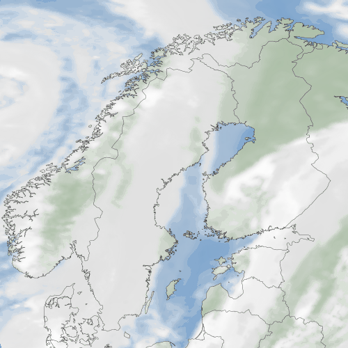

Table of Contents
=================

- [Table of Contents](#table-of-contents)
- [Product definition](#product-definition)
  - [Product configuration](#product-configuration)
    - [Shared attributes](#shared-attributes)
      - [Time intervals](#time-intervals)
      - [Clipping and margins](#clipping-and-margins)
      - [Output formatting](#output-formatting)
    - [Product level attributes](#product-level-attributes)
    - [Views](#views)
    - [Layers](#layers)
      - [BackgroundLayer](#backgroundlayer)
      - [MapLayer](#maplayer)
      - [LocationLayer](#locationlayer)
      - [IsobandLayer](#isobandlayer)
      - [IsolineLayer](#isolinelayer)
        - [isolines-attribute](#isolines-attribute)
      - [IsolabelLayer](#isolabellayer)
      - [SymbolLayer](#symbollayer)
        - [mindistance and priority](#mindistance-and-priority)
      - [ArrowLayer](#arrowlayer)
      - [NumberLayer](#numberlayer)
      - [NullLayer](#nulllayer)
      - [CloudCeilingLayer](#cloudceilinglayer)
      - [StreamLayer](#streamlayer)
      - [RasterLayer](#rasterlayer)
      - [LegendLayer](#legendlayer)
      - [TimeLayer](#timelayer)
      - [TagLayer](#taglayer)
      - [WKTLayer](#wktlayer)
      - [GraticuleLayer](#graticulelayer)
        - [GraticuleLayer settings](#graticulelayer-settings)
        - [Graticule settings](#graticule-settings)
        - [GraticuleLabels](#graticulelabels)
      - [CircleLayer](#circlelayer)
        - [CircleLayer settings](#circlelayer-settings)
        - [Circle settings](#circle-settings)
        - [CircleLabels settings](#circlelabels-settings)
      - [TranslationLayer](#translationlayer)
      - [WindRoseLayer](#windroselayer)
      - [PostGISLayer](#postgislayer)
      - [IceMapLayer](#icemaplayer)
      - [FinnishRoadObservationLayer](#finnishroadobservationlayer)
        - [Algorithm to deduce weather condition symbol](#algorithm-to-deduce-weather-condition-symbol)
      - [PresentWeatherObservationLayer](#presentweatherobservationlayer)
        - [Algorithm to deduce present weather symbol](#algorithm-to-deduce-present-weather-symbol)
    - [Structure definitions](#structure-definitions)
      - [Attribute structure](#attribute-structure)
      - [AttributeSelection structure](#attributeselection-structure)
      - [Projection structure](#projection-structure)
      - [Defs structure](#defs-structure)
      - [Smoother structure](#smoother-structure)
    - [Sampling structure](#sampling-structure)
      - [Heatmap structure](#heatmap-structure)
      - [Isoband structure](#isoband-structure)
      - [Intersection structure](#intersection-structure)
      - [Isoline structure](#isoline-structure)
      - [Isofilter structure](#isofilter-structure)
      - [LegendLabels structure](#legendlabels-structure)
      - [LegendSymbols structure](#legendsymbols-structure)
      - [Text structure](#text-structure)
      - [Map structure](#map-structure)
      - [MapStyles structure](#mapstyles-structure)
      - [MapFeature structure](#mapfeature-structure)
      - [Positions structure](#positions-structure)
      - [Label structure](#label-structure)
      - [Location structure](#location-structure)
      - [Observation structure](#observation-structure)
      - [Station structure](#station-structure)
      - [WindRose structure](#windrose-structure)
      - [Connector structure](#connector-structure)
      - [Filters structure](#filters-structure)
- [Using dynamically created grids](#using-dynamically-created-grids)
    - [Introduction](#introduction)
    - [Grids with the same timestamp](#grids-with-the-same-timestamp)
    - [Grids calculated over multiple timesteps](#grids-calculated-over-multiple-timesteps)
    - [Functions](#functions)
- [Generic querystring options](#generic-querystring-options)
- [WMS GetMap and GetCapabilities configuration](#wms-getmap-and-getcapabilities-configuration)
  - [WMS layer variants](#wms-layer-variants)
- [Configuration](#configuration)
  - [Main configuration file](#main-configuration-file)
  - [Plugin configuration file](#plugin-configuration-file)

# Product definition

## Product configuration

There can be thousands of different products defined for the Dali plugin. Each product has its own configuration file, which is used in order to define values for the attributes needed when constructing the final image. 
The table below shows an example of a product configuration file and the image that is returned when this product is requested. 

<table>
<tr>
<th>Product configuration file </th>
<th> Produced image </th>
<tr><td rowspan="40">
<pre><code>
{ // *** Product
  "title": "MyRedMap",
  "projection":
   {
     "xsize": 300,
      "ysize": 550,
      "crs": "EPSG:2393",
      "bboxcrs": "EPSG:4326",
      "cy": 64.8,
      "cx": 25.4,
      "resolution": 2.5
   },
   "views": [
       {  // *** View 1
       "layers": [
        { // **** Layer 1 : Light blue background
           "layer_type": "background",
           "attributes":
           {
               "stroke": "none",
               "fill": "rgb(190,230,255)"
           }
        },
        { // ***  Layer 2 : Red map with black borders
           "layer_type": "map",
           "map":
          {
            "schema": "natural_earth",
            "table": "europe_country_wgs84"
           },
           "attributes":
           {
            "class": "Europe",
            "stroke": "black",
            "stroke-width": "0.5",
            "fill": "rgb(255,0,0)"
           }
        }
       ]
     }
    ]
}</code></pre></td><td>f</td></tr>
</table>

The product configuration files are written in Java Script Object Notation (JSON). In order to create your own product configuration files you just need to know what attributes are used on different configuration levels, i.e.,  what attributes can be given on the product level, on the view level and on the layer level. These attributes are described flater in this chapter. 

The attribute description for each attribute  consists of the attribute name, the attribute type, the default value and a short description of the attribute usage. In the attribute description the attribute type can be defined in the following ways:

| Type                   | Description                                                                                                                                                                                                                                                                                                            |
| ---------------------- | ---------------------------------------------------------------------------------------------------------------------------------------------------------------------------------------------------------------------------------------------------------------------------------------------------------------------- |
| (string)               | A string with no default value. Not giving a value to the string may be considered as an error if the  title for the SVG is not defined, or if no default symbol name is given for a legend.                                                                                                                           |
| string                 | A string. Usually this variable needs to be defined, for example, qid to give an ID to isobands. The string may also have a default value, for example, the default separator for the  LegendLabels is an "en dash" (Unicode 2013).                                                                                    |
| _Structure_            | When the type is a structure name then the attribute value is defined as a structure, or the value is a reference to a such structure. For example "projection" -attribute is defined to be the type of  Projection structure, which means that it contains a list of attributes defined for the Projection structure. |
| [_Structure_]          | An array of structures. The type of the structure is defined inside the brackets. For example an attribute which type is [Layer] contains an array of Layer structures.                                                                                                                                                |
| {string:string}        | A map from names to values.                                                                                                                                                                                                                                                                                            |
| {string:string:string} | A map from principal names to a map of name-value pairs.                                                                                                                                                                                                                                                               |
   

### Shared attributes 

There are some upper level attributes that can be used also on the lower level in the hierarchy. For example, some attributes defined on the product level are visible also on the view and layer levels. These levels can directly use these upper level attribute values or override the values with their own values. These attributes can be overridden also by the request parameters. For example, the "language" attribute can be overridden by using the "language" parameter in the request.

The table below contains a list of attributes that are shared from the top level to the lower levels. 

<pre><b>Shared attributes </b></pre>
| Name           | Type         | Default value   | Description                                                                                                                                                                                                    |
| -------------- | ------------ | --------------- | -------------------------------------------------------------------------------------------------------------------------------------------------------------------------------------------------------------- |
| language       | (string)     | config:language | Language code. The code does not need to follow ISO 639-1 or other similar standards, it is merely a code name.                                                                                                |
| customer       | (string)     | config:customer | The customer name. The customer setting defines the subdirectory in the Dali configuration directory from which the JSON, CSS and SVG includes are taken, unless an absolute path is given for a JSON include. |
| producer       | (string)     | config:model    | The producer name to be used when querying data from QEngine.                                                                                                                                                  |
| tz             | (string)     | UTC             | The timezone used for parsing time (but not origintime)                                                                                                                                                        |
| time           | (string)     |                 | The time in any string format recognized by the MacGyver time parser (ISO-format, SQL, timestamps, epoch times, offsets from current time).                                                                    |
| time_offset    | (int)        |                 | The time offset in minutes to be added to the time. The principal time is usually set at the top most level (Product), and a time_offset is then used to modify it for different views of data.                |
| interval_start | (int)        |                 | Time in minutes backward from time+time_offset. Used for selecting an interval of observations.                                                                                                                |
| interval_end   | (int)        |                 | Time in minutes forward from time+time_offset. Used for selecting an interval of observations.                                                                                                                 |
| origintime     | (string)     |                 | The querydata origintime in any string format recognized by the MacGyver time parser (ISO-format, SQL, timestamps, epoch times, offsets from current time).                                                    |
| projection     | _Projection_ |                 | The Projection structure.                                                                                                                                                                                      |
| xmargin        | int          | 0               | X-margin in pixels for clipping out features.                                                                                                                                                                  |
| ymargin        | int          | 0               | Y-margin in pixels for clipping out features.                                                                                                                                                                  |
| clip           | bool         | false           | Whether each layer should be placed into a rectangular clipPath.                                                                                                                                               |

#### Time intervals

Normally the "valid time" for the data is time + time_offset. If a time interval is defined, it is producer dependent how the settings are interpreted. Most layers ignore the settings, and the settings are ignored for all forecasts. For lightning data the interval is true, all flashes in the interval are picked. For other observations only the latest one in the time interval will be selected. For this reason interval_end is usually not needed for observations either.

#### Clipping and margins

Normally any point strictly outside the layer rectangle will be omitted. However, if the image will be tiled, this may produce images where symbols or text appear only in one tile, and the rest of the symbol is cut off from the adjacent tile. The layer effective bounding box may be expanded using the setting "margin", which sets both the x-margin and y-margin, or directly by setting "xmargin" and/or "ymargin".

For observations any point inside the expanded area will be included. Typically one would expand the layer by half the size of any symbol needed in the image, be it a symbol, a number or whatever. The marging has an effect also on geometries. For example if one wishes to draw isolines with a line a few pixels wide, the margings should be expanded accordingly.

For tiled images expanding the area has no discernible effect, since the clipping will be automatic since the rendered image is still the expected size and does not include the margins. However, if one has multiple views in a single image, one should set "clip" to true to make sure none of the layers leak outside their respective areas. Using a clipPath slows rendering down a little, hence it is not on by default.

#### Output formatting

PNG output formatting can be tuned using the following settings inside a top level "png" tag:

| Name        | Type     | Default value | Description                                                                                                          |
| ----------- | -------- | ------------- | -------------------------------------------------------------------------------------------------------------------- |
| quality     | (double) | 10            | The PNG compression level. 10=good, 20=poor                                                                          |
| errorfactor | (double) | 2.0           | Tuning parameter for color reduction. Must be greater than 1.0                                                       |
| maxcolors   | (int)    | 0             | Desired maximum number of colors in the palette. Zero implies no maximum, and palette fitting will be fully adaptive |
| truecolor   | (bool)   | false         | Set to avoid color reduction completely                                                                              |

### Product level attributes

The product level is the highest structural level used in the product configuration file. The product attributes are used in order to define product level properties for the current product. On the other hand, the product attributes define the substructures related to the current product. 

The table below contains a list of attributes that can be defined for the product. 

<pre><b>Product </b></pre>
| Name       | Type         | Default value    | Description                                                                                                                                                                              |
| ---------- | ------------ | ---------------- | ---------------------------------------------------------------------------------------------------------------------------------------------------------------------------------------- |
| svg_tmpl   | (string)     | config:templates | The <a href="http://ctpp.havoc.ru/en/">CTPP2</a> template to be used for generating the SVG image. The default template is selected automatically based on the selected image format.    |
| qid        | (string)     | -                | An identifier for the product. Usually this can be left empty.                                                                                                                           |
| width      | (int)        | projection.xsize | The width of the SVG image. If the product contains only one view with no transformations, the default value will be taken from the Product projection xsize variable.                   |
| height     | (int)        | projection.ysize | The height of the SVG image. If the product contains only one view with no transformations, the default value will be taken from the Product projection ysize variable.                  |
| title      | (string)     | -                | The title of the generated SVG image.                                                                                                                                                    |
| attributes | _Attributes_ | -                | The SVG image attributes for the product level &lt;g&gt;...&lt;/g&gt; group.                                                                                                             |
| defs       | _Defs_       | -                | The SVG image header definitions such as styles, symbols, paths not to be drawn directly etc. This information is defined as the Defs structure, which is described in the next section. |
| views      | _[View]_     | -                | An array of the View structures used in the SVG image. Usually a product has only one View structure which shares the projection defined on the product level.                           |

### Views

A product can contain several views that are merged together into single image / product. The product level attribute "views" are used in order to define an array of the _View_ structures for the product. Each view must have its own _View_ structure in this array. The _View_ structure is used in order to define the view level attributes and the lower level structures (i.e. layers).

The table below contains a list of attributes that can be defined in the _View_ structure. 

<pre><b>View</b></pre>
| Name       | Type         | Default value | Description                                                                    |
| ---------- | ------------ | ------------- | ------------------------------------------------------------------------------ |
| qid        | (string)     | -             | An identifier for the view. Normally something simple such as "view1" or "v1". |
| attributes | _Attributes_ | -             | The SVG attributes for the View level <g>...</g> group.                        |
| layers     | _[Layer]_    | -             | An array of the _Layer_ structures needed in order to construct the view.      |

### Layers

A view can contain several layers that are merged together into single view. The view level attribute "layers" are used in order to define an array of the Layer structures for the view. Each layer must have its own Layer structure in this array. 
The Layer structure is used in order to define layer level properties. The most important attribute on the layer level is the "layer_type" attribute, which defines the type of the current layer. At the same time it defines indirectly which layer module the Dali plugin should use  to create an image for the current layer. 
On the other hand, the layer type tells us which other attributes we should define for the current layer. In other words, if the layer type is for example "isoband" then we should define on this level also all isoband layer related attributes.
All the layers share some common attributes. In addition, each layer type has its own attributes. The table below contains a list of attributes that are common in all layers.  

<pre><b>Layer</b></pre>
<table>
<tr>
<th>Name </th>
<th>Type </th>
<th>Default Value </th>
<th colspan="2"> Description </th></tr>
<tr><td>qid</td><td>(string)</td><td>-</td><td colspan="2">An identified for the layer. Normally something simple such as "layer1" or "t2mlayer" or just "l1".</td></tr>
<tr><td>css</td><td>(string)</td><td>-</td><td colspan="2">An external CSS file to be included into the style section. E.g.,  "isobands/temperature.css".</td></tr>
<tr><td>attributes</td><td><i>Attributes</i></td><td>-</td><td colspan="2">The SVG attributes for the Layer level top SVG tag. Often the tag is &lt;g&gt;, but may be any other tag too for example when layer_type=tag is used.</td></tr>
<tr><td rowspan="17">layer_type</td><td rowspan="17">(string)</td><td rowspan="17">"tag"</td><td colspan="2">The type of the layer.</td></tr>
<tr><td><b>Value</b></td><td><b>Layer</b></td></tr>
<tr><td>background</td><td>BackgroundLayer</td></tr>
<tr><td>map</td><td>MapLayer</td></tr>
<tr><td>location</td><td>LocationLayer</td></tr>
<tr><td>isoband</td><td>IsobandLayer</td></tr>
<tr><td>isoline</td><td>IsolineLayer</td></tr>
<tr><td>isolabel</td><td>IsolabelLayer</td></tr>
<tr><td>symbol</td><td>SymbolLayer</td></tr>
<tr><td>arrow</td><td>ArrowLayer</td></tr>
<tr><td>number</td><td>NumberLayer</td></tr>
<tr><td>null</td><td>NumllLayer</td></tr>
<tr><td>cloudceiling</td><td>CloudCeilingLayer</td></tr>
<tr><td>stream</td><td>StreamLayer</td></tr>
<tr><td>legend</td><td>LegendLayer</td></tr>
<tr><td>time</td><td>TileLayer</td></tr>
<tr><td>tag</td><td>TagLayer</td></tr>
<tr><td>translation</td><td>TranslationLayer</td></tr>
<tr><td>windrose</td><td>WindRoseLayer</td></tr>
<tr><td>postgis</td><td>PostGISLayer</td></tr>
<tr><td>icemap</td><td>IceMApLayer</td></tr>
<tr><td>minresolution</td><td>(double)</td><td>-</td><td colspan="2">Minimum resolution of the projection for the layer to be generated at all.</td></tr>
<tr><td>maxresolution</td><td>(double)</td><td>-</td><td colspan="2">Maximum resolution of the projection for the layer to be generated at all.</td></tr>
</table>

Notice that the term "resolution" used above might be a little bit misleading in this case, since it refers to the number of kilometers represented by one pixel. Hence the higher the resolution the worse the accuracy of the image actually is. The actual condition to be satisfied is minresolution <= resolution < maxresolution, where one or both of the limits may be missing.

#### BackgroundLayer

The background layer is used to create a background for the current view. So it  is usually the lowest layer in the view. 

The table below shows  a simple example on the usage of  the background layer.

<table>
<tr>
<th>Product configuration file </th>
<th> Produced image layer </th>
<tr><td rowspan="40">
<pre><code>
{ // *** Product
  "title": "MyLightBlueBackground",
  "projection":
   {
     "xsize": 300,
      "ysize": 550,
      "crs": "EPSG:2393",
      "bboxcrs": "EPSG:4326",
      "cy": 64.8,
      "cx": 25.4,
      "resolution": 2.5
   },
   "views": [
       {  // *** View 1
       "layers": [
        { // **** Layer 1 : Light blue background
           "layer_type": "background",
           "attributes":
           {
               "stroke": "none",
               "fill": "rgb(190,230,255)"
           }
        }
       ]
     }
    ]
}</code></pre></td><td></td></tr>
</table>

The background layer has no attributes than the generic Layer or Properties attributes. The layer exists merely to obtain the "xsize" and "ysize" attribute values for a rectangle element so that the background can be filled with a value.

#### MapLayer

The table below shows  a simple example on the usage of  the  map layer.

<table>
<tr>
<th>Product configuration file </th>
<th> Produced image layer</th>
<tr><td rowspan="40">
<pre><code>
{ // *** Product
   "title": "MyMap",
   "projection":
   {
      "xsize": 300,
      "ysize": 550,
      "crs": "EPSG:2393",
      "bboxcrs": "EPSG:4326",
      "cy": 64.8,
      "cx": 25.4,
      "resolution": 2.5
   },
   "views": [
    {
     "layers": [
    {
       "layer_type": "map",
       "map":
       {
        "schema": "natural_earth",
        "table": "europe_country_wgs84"
       },
       "attributes":
       {
        "class": "Europe"
       }
    } ]
  }]
 }</code></pre></td><td></td></tr>
</table>

The table below contains a list of attributes that can be defined for the map layer in addition to the common layer attributes.

<pre><b>MapLayer</b></pre>
| Name      | Type        | Default value | Description                                        |
| --------- | ----------- | ------------- | -------------------------------------------------- |
| map       | Map         | -             | The Map structure                                  |
| precision | double      | 1.0           | Precision of SVG coordinates                       |
| styles    | [MapStyles] | -             | Optional regional styling based on forecast values |

#### LocationLayer

The location layer can be used  to point specific locations in the image. For example, we can create an image layer that shows all important cities by using predefined symbols. It is also possible to use different symbols based on some information. For example, we can use a red square symbol for  cities with  population  over a million and a red circle symbol for  cities with  population  less than a million, but more than fifty thousand. 

The table below shows  a simple example on the usage of  the location layer.

<table>
<tr>
<th>Product configuration file </th>
<th> Produced image layer</th>
<tr><td rowspan="40">
<pre><code>
{ // *** Product
      "title": "MyCities",
   "projection":
  {
      "xsize": 300, "ysize": 550, "crs": "EPSG:2393",
      "bboxcrs": "EPSG:4326", "cy": 64.8, "cx": 25.4,
      "resolution": 2.5
   },
   "views": [
     { // *** View 1
     "attributes": {   "id": "view1" },
     "layers": [
    { // *** Layer 1 : Map
      "layer_type": "map",
      "map":
       {
        "schema": "natural_earth",
        "table": "europe_country_wgs84"
       },
       "attributes":
       {
        "class": "Europe"
       }
    },
    { // *** Layer 2: Cities
      "qid": "cities",
       "layer_type": "location",
        "keyword" : "ely_cities",
           "css": "maps/map.css",
        "symbols":
       {
          "default": [
         {
            "hilimit": 1000000,
            "symbol": "city"
         },
         {
            "lolimit": 1000000,
            "symbol": "bigcity"
         }],
         "PPLC": [
         {
            "symbol": "capital"
         } ]
        }
    } ]
  } ]
}</code></pre></td><td></td></tr>
</table>

The table below contains a list of attributes that can be defined for the location layer in addition to the common layer attributes.

<pre><b>LocationLayer</b></pre>
| Name        | Type                                                  | Default value | Description                                                                            |
| ----------- | ----------------------------------------------------- | ------------- | -------------------------------------------------------------------------------------- |
| keyword     | string                                                | -             | The geonames keyword.                                                                  |
| mindistance | double                                                | 30            | Minimum distance between location symbols.                                             |
| countries   | (string) or string                                    | -             | Allowed country isocodes.                                                              |
| symbol      | (string)                                              | -             | Default symbol.                                                                        |
| symbols     | [AttributeSelection] or {string:[AttributeSelection]} | -             | Symbol selection based on population, or a map from feature codes to symbol selection. |

#### IsobandLayer

The isoband layer can be used  to add filled contours (= isobands) to the view. Isobands can be used for presenting several kinds of data such as  temperatures, rain amounts, cloudiness, ice cover, flash heatmap etc.

The tables below show simple examples  on the usage of   the isoband layer.

<table>
<tr>
<th>Product configuration file </th>
<th> Produced image layer</th>
<tr><td rowspan="40">
<pre><code>
{ // *** Product
  "title": "MyCloudiness",
  "projection":
   {
     "xsize": 300,
      "ysize": 550,
      "crs": "EPSG:2393",
      "bboxcrs": "EPSG:4326",
      "cy": 64.8,
      "cx": 25.4,
      "resolution": 2.5
   },
   "views": [
       {  // *** View 1
       "layers": [
        { // ***  Layer 1 : Cloudiness
           "layer_type": "isoband",
           "isobands": "json:isobands/cloudiness.json",
           "css": "isobands/cloudiness.css",
           "parameter": "TotalCloudCover",
           "multiplier": 0.0898,
           "offset" : -0.49,
           "attributes":
           {
            "shape-rendering": "crispEdges"
           }
        }
       ]
     }
    ]
}</code></pre></td><td>/td></tr>
</table>

<table>
<tr>
<th>Product configuration file </th>
<th> Produced image layer</th>
<tr><td rowspan="40">
<pre><code>
{ // *** Product
    "title" : "Lightning heatmap for 15 minute period",
    "abstract" :  "Lightning heatmap for 15 minute period",
    "interval_start": 15,
    "interval_end": 15,
    "projection":
    {
        "crs": "EPSG:4326",
        "cx" : 25,
        "cy" : 65,
        "resolution" : 5,
        "xsize": 500,
        "ysize": 500
    },
    "producer": "flash",
    "views": [{
        "layers": [
            {
                "qid": "l",
                "layer_type": "isoband",
                "parameter": "peak_current",
                "isobands": "json:isobands/heatmap.json",
                "css": "isobands/heatmap.css",
                "attributes": {
                    "shape-rendering": "crispEdges"
                },
                "heatmap" : {
                    "resolution" : 10,
                    "radius" : 10,
                    "kernel" : "exp",
                    "deviation" : 10.0
                }
            },
            {
                "qid": "l1",
                "layer_type": "map",
                "map":
                {
                    "schema": "natural_earth",
                    "table": "admin_0_countries",
                    "minarea": 100
                },
                "attributes":
                {
                    "id": "europe_country_lines",
                    "fill": "none",
                    "stroke": "#222",
                    "stroke-width": "0.3px"
                }
            }
        ]
    }]
}</code></pre></td><td></td></tr>
</table>

The table below contains a list of attributes that can be defined for the isoband layer in addition to the common layer attributes.
<pre><b>IsobandLayer</b></pre>
<table>
<tr>
<th>Name </th>
<th>Type </th>
<th>Default Value </th>
<th colspan="2"> Description </th></tr>
<tr><td>parameter</td><td>(string)</td><td>-</td><td colspan="2">The parameter name for the isobands.</td></tr>
<tr><td>level</td><td>double</td><td>linear</td><td colspan="2">The querydata level value. By default the first level is used.</td></tr>
<tr><td rowspan="6">interpolation</td><td rowspan="6">(string)</td><td rowspan="6">"linear"</td><td colspan="2">The interpolation method.</td></tr>
<tr><td><b>Value</b></td><td><b>Description</b></td></tr>
<tr><td>linear</td><td>Values are interpolated linearly.</td></tr>
<tr><td>midpoint|nearest|discrete</td><td>Nearest point value is used.</td></tr>
<tr><td>logarithmic</td><td>Logarithmic interpolation. Useful mostly for logarithmic parameters such as precipitation rate, which may have sharp peaks near strong showers.</td></tr>
<tr><td>isobands</td><td><i>[Isoband]</i></td><td>-</td><td colspan="2">An array if <i>Isoband</i> structures./td></tr>
<tr><td>autoqid</td><td>(string)</td><td>-</td><td>Pattern for generating a qid for each isoband, for example "temperature_{}_{}"|
<tr><td>autoclass</td><td>(string)</td><td>-</td><td>Pattern for generating a class for each isoband, for example "Temperature_{}_{}"|
<tr><td>precision</td><td>(double)</td><td>1.0</td><td colspan="2">Precision of SVG coordinates./td></tr>
<tr><td>unit_conversion</td><td>(string)</td><td>-</td><td colspan="2">Name of desired unit conversion defined in the configuration file.</td></tr>
<tr><td>multiplier</td><td>(double)</td><td>-</td><td colspan="2">A multiplier for valid data values for unit conversion purposes.</td></tr>
<tr><td>offset</td><td>(double)</td><td>0.0</td><td colspan="2">An offset for valid data values for unit conversion purposes.</td></tr>
<tr><td>smoother</td><td><i>Smoother</i></td><td>-</td><td colspan="2">Smoother settings for the 2D grid data.</tr>
<tr><td>sampling</td><td><i>Sampling<i></td><td>-</td><td colspan="2">Sampling settings for the 2D grid data.</tr>
<tr><td>extrapolation</td><td><i>int</i></td><td>0</td><td colspan="2">How many grid cells to extrapolate data into regions with unknown values</tr>
<tr><td>minarea</td><td><i>double</i></td><td>-</td><td colspan="2">Mimimum area for polygons, including holes</tr>
<tr><td>areaunits</td><td><i>(string)</i></td><td>km^2</td><td colspan="2">Units for minarea setting. km^2 or px^2</tr>
<tr><td>isofilter</td><td><i>Isofilter</i></td><td>-</td><td>Lowpass filter for isolines/isobands. Preferable to smoother settings when data resolution is high.</td></tr>
<tr><td>heatmap</td><td><i>Heatmap</i></td><td>-</td><td colspan="2">Heatmap settings.</tr>
<tr><td>inside</td><td><i>Map</i></td><td>-</td><td colspan="2">Intersect isoband with the map</tr>
<tr><td>outsider</td><td><i>Map</i></td><td>-</td><td colspan="2">Substract map from isoband.</tr>
<tr><td>intersect</td><td><i>[Intersection]</i> or <i>Intersection</i></td><td>-</td><td colspan="2">Alternate isoband(s) with which to intersect.</td></tr>
<tr><td>closed_range</td><td>bool<td>true</td><td>True if the last isoband is a closed interval. For example for percentages one would want range 90 <= x <= 100 instead of 90 <= x < 100.</td></tr>
<tr><td>validate</td><td>bool</td><td>false</td><td>True if the geometries are to be validated (slow, for debugging purposes)</td></tr>
<tr><td>strict</td><td>bool</td><td>false</td><td>In strict mode invalid geometries cause an error. Extra information will be dumped to the journal and attached to the thrown exception</td></tr>
<tr><td>desliver</td><td>bool</td><td>false</td><td>True if sliver polygons are to be removed</td></tr>
</table>

In automatic qid and class generation "." will be replaced by ",", since "." is reserved for JSON paths. If both the lower limit and upper limit are undefined, "nan" will be used to fill the pattern. If only the lower limit is missing, "-inf" will be used. If only the upper limit is missing, "inf" will be used.

#### IsolineLayer

The isoline layer can be used  to add isolines to the view. Isolines can be used  to present several  kinds of data like pressure variations, altitude variations, etc.

The table below shows a simple example  on the usage of   the isoline layer.

<table>
<tr>
<th>Product configuration file </th>
<th> Produced image layer</th>
<tr><td rowspan="40">
<pre><code>
{ // *** Product
  "title": "MyPressure",
  "projection":
   {
     "xsize": 300,
      "ysize": 550,
      "crs": "EPSG:2393",
      "bboxcrs": "EPSG:4326",
      "cy": 64.8,
      "cx": 25.4,
      "resolution": 2.5
   },
   "views": [
       {  // *** View 1
       "layers": [
      { // *** Layer 1 : Map
         "layer_type": "map",
         "map":
         {
          "schema": "natural_earth",
          "table": "europe_country_wgs84"
         },
         "attributes":
         {
          "class": "Europe"
         }
      },
      { // *** Layer 2 : Isoline
           "layer_type": "isoline",
           "isolines": "json:isolines/pressure.json",
           "css": "isolines/pressure.css",
           "parameter": "Pressure",
           "attributes" :
           {
            "class" : "Pressure"
           }
        }
       ]
     }
    ]
}
}</code></pre></td><td></td></tr>
</table>

The table below contains a list of attributes that can be defined for the isoline layer in addition to the common layer attributes.

<pre><b>IsolineLayer</b></pre>
| Name            | Type                         | Default value | Description                                                                                                                                    |
| --------------- | ---------------------------- | ------------- | ---------------------------------------------------------------------------------------------------------------------------------------------- |
| parameter       | (string)                     | -             | The parameter name for the isolines.                                                                                                           |
| level           | (double)                     | -             | The querydata level value. By default the first level is used.                                                                                 |
| interpolation   | linear                       | (string)      | linear or logarithmic                                                                                                                          |
| isolines        | [Isoline]                    | -             | An array of Isoline structures or set of parameters which define how array of Isoline structures are generated (see. isolines-attribute below) |
| autoqid         | (string)                     | -             | Pattern for generating a qid for each isoline, for example "temperature_{}"                                                                    |
| autoclass       | (string)                     | -             | Pattern for generating a class for each isoline, for example "Temperature_{}"                                                                  |
| precision       | (double)                     | 1.0           | Precision of SVG coordinates.                                                                                                                  |
| unit_conversion | (string)                     | -             | Name of desired unit conversion. Unit conversions are listed in the configuration file.                                                        |
| multiplier      | (double)                     | 1.0           | A multiplier for valid data values for unit conversion purposes.                                                                               |
| offset          | (double)                     | 0.0           | An offset for valid data values for unit conversion purposes.                                                                                  |
| smoother        | _Smoother_                   | -             | Smoother settings for the 2D grid data.                                                                                                        |
| sampling        | _Sampling_                   | -             | Sampling settings for the 2D grid data.                                                                                                        |
| extrapolation   | int                          | 0             | How many grid cells to extrapolate data into regions with unknown values.                                                                      |
| minarea         | double                       | -             | Minimum area for closed linestrings in km^2.                                                                                                   |
|areaunits        | (string)                     | km^2          | Units for minarea setting. km^2 or px^2|
| inside          | _Map_                        | -             | Intersect isoband with a map                                                                                                                   |
| outside         | _Map_                        | -             | Substract map from isoband                                                                                                                     |
| intersect       | _[Intersect]_ or _Intersect_ | -             | Alternate isoband(s) with which to intersect.                                                                                                  |
| validate        | bool                         | false         | True if the geometries are to be validated (slow, for debugging purposes)                                                                      |
| strict          | bool                         | false         | In strict mode invalid geometries cause an error. Extra information will be dumped to the journal and attached to the thrown exception         |
| desliver        | bool                         | false         | True if sliver polygons are to be removed                                                                                                      |

In automatic qid/class generation "." will be replaced by ",", since "." is reserved for JSON path definitions.

##### isolines-attribute

Isolines are defined by using isolines-attribute. There are two alternative ways to define the attribute

1) Define explicitly array of Isoline structures

Example:

<pre><code>
"isolines":
{
[
    {
        "qid": "pressure_950",
        "value": 950,
	"attributes": {}
    },
    {
        "qid": "pressure_960",
        "value": 960,
	"attributes": {}
    },
    {
        "qid": "pressure_970",
        "value": 970,
	"attributes": {}
    },
    {
        "qid": "pressure_980",
        "value": 980,
	"attributes": {}
    },
    {
        "qid": "pressure_990",
        "value": 990,
	"attributes": {}
    },
    {
        "qid": "pressure_1000",
        "value": 1000,
	"attributes": {}
    },
    {
        "qid": "pressure_1010",
        "value": 1010,
	"attributes": {}
    },
    {
        "qid": "pressure_1020",
        "value": 1020,
	"attributes": {}
    },
    {
        "qid": "pressure_1030",
        "value": 1030,
	"attributes": {}
    },
    {
        "qid": "pressure_1040",
        "value": 1040,
	"attributes": {}
    },
    {
        "qid": "pressure_1050",
        "value": 1050,
	"attributes": {}
    },
]
}
</code></pre>

2) Define set of parameters which are used to generate Isoline structures. The following parameters must be defined:

| Name       | Type                                | Description                                                                       | Note                                  | Example                       |
| ---------- | ----------------------------------- | --------------------------------------------------------------------------------- | ------------------------------------- | ----------------------------- |
| qidprefix  | string                              | Prefix of isoline layer id.                                                       | optional, default value is 'isoline_' | qidprefix="pressure_isoline_" |
| startvalue | int/double                          | Value of first Isoline.                                                           |                                       | startvalue=900                |
| endvalue   | int/double                          | Value of last Isoline                                                             |                                       | endvalue=1100                 |
| interval   | int/double                          | The interval between two successive Isolines.                                     |                                       | interval=10                   |
| except     | int/double or array of ints/doubles | The interval is not shown if it is divisible by except value(s) (modulo-operator) | optional                              | except=5 or except=[3,5]      |

Example:

<pre><code>
                {
		    "qid": "l4",
                    "layer_type": "isoline",
                     "isolines": 
		    {  
			"qidprefix": "isoline_main_", 
			"startvalue": 900, 
			"endvalue": 1100,
			"interval": 5
		    },
                    "css": "isolines/pressure.css",
                    "parameter": "Pressure",
		    "attributes":
		    {
			"fill": "none",
			"stroke": "#333",
			"stroke-width": "1.5px"
		    }
                },
                {
		    "qid": "l5",
                    "layer_type": "isoline",
                    "isolines": 
		    {  
			"qidprefix": "isoline_sub_", 
			"startvalue": 900, 
			"endvalue": 1100,
			"interval": 2,
			"except": 5
		    },
                    "css": "isolines/pressure.css",
                    "parameter": "Pressure",
		    "attributes":
		    {
			"fill": "none",
			"stroke": "red",
			"stroke-dasharray": "10,5",
			"stroke-width": "1.0px"
		    }
		}
</code></pre>

#### IsolabelLayer

The isolabel layer is derived from the isoline layer, and thus inherits all its settings. The settings below are then available for positioning isovalues on the isolines.
It is also possible to refer to the isolines that would be generated by an isoband layer, or to list to generate isovalues explicitly without referring to another layer.

<pre><b>IsolabelLayer</b></pre>
| Name               | Type      | Default value  | Description                                                                                              |
| ------------------ | --------- | -------------- | -------------------------------------------------------------------------------------------------------- |
| label              | Label     | -              | Label settings including the orientation                                                                 |
| angles             | [double]  | [0,-45,45,180] | Orientations in which local maxima are searched for suitable label positions.                            |
| upright            | bool      | false          | Optionally turn labels upright if their angle is outside -90...90                                        |
| max_angle          | double    | 60             | Allow label angles only in range -60...60                                                                |
| min_isoline_length | double    | 150            | Minimum length of the isoline in pixels for placing any labels                                           |
| min_distance_other | double    | 20             | Minimum distance to labels on isolines with another value                                                |
| min_distance_same  | double    | 50             | Minimum distance to labels on isolines with the same value                                               |
| min_distance_same  | double    | 200            | Minimum distance to labels on the same isoline segment                                                   |
| max_curvature      | double    | 90             | Maximum local curvature change at the label position                                                     |
| stencil_size       | int       | 5              | Search N adjacent points when looking for extrema and calculating the local curvature.                   |
| isovalues          | [double]  | -              | Array of isovalue to be used.                                                                            |
| isobands           | [Isoband] | -              | Array of isoband structures. All potential values will be extracted and inserted to the isovalues array. |
| isolines           | [Isoline] | -              | Array of isoline structures. All values will be extracted and inserted to the isovalues array.           |
| textattributes     | [Attributes] | -           | Attributes to be assigned separately for each label                                                      |

The isovalues parameter may also be a JSON object with start, stop and step (default=1) doubles.

#### SymbolLayer

The symbol layer can be used to add different kinds of symbols to the view. The symbols are added at  the given locations and the type of the symbol depends on the value of the field defined by the "parameter" attribute. The actual symbol figures are stored in the file systems s SVG images.

The table below shows a simple example  on the usage of   the symbol layer.

<table>
<tr>
<th>Product configuration file </th>
<th> Produced image layer</th>
<tr><td rowspan="40">
<pre><code>
{ // *** Product
    "title": "MyWeatherSymbols",
    "refs":
  {
      "myprojection": "json:maps/finlandprojection.json",
      "finland":  {
       "schema": "natural_earth",
       "table": "finland_country_wgs84",
       "minarea": 100,
       "mindistance": 1
      }
    },
    "projection": "ref:refs.myprojection",
    "views": [
   {
    "attributes":  { "id": "view1" },
       "layers": [
    {
         "layer_type": "map",
         "map": {
          "schema": "natural_earth",
           "table": "finland_country_wgs84",
          "minarea": 80,
           "mindistance": 5
         },
         "attributes": {
           "id": "europe_country_lines",
           "fill": "none",
           "stroke": "#666",
           "stroke-width": "0.5pt"
         }
       },
      {
        "layer_type": "symbol",
        "css": "symbols/weather.css",
        "symbols": "json:symbols/weather.json",
        "parameter": "weathersymbol",
        "scale": 1.25,
        "positions": {
         "layout": "latlon",
         "locations": [
             { "longitude": 24.93417, "latitude": 60.17556 },
             { "longitude": 28.27838, "latitude": 61.02292 },
             { "longitude": 21.85943, "latitude": 61.57477 },
             { "longitude": 25.60742, "latitude": 62.20806 },
             { "longitude": 27.89568, "latitude": 62.94718 },
             { "longitude": 23.13066, "latitude": 63.83847 },
             { "longitude": 27.40756, "latitude": 64.13355 },
             { "longitude": 24.56371, "latitude": 65.73641 },
             { "longitude": 28.15806, "latitude": 67.29250 },
             { "longitude": 24.15138, "latitude": 67.60517 },
             { "longitude": 27.02881, "latitude": 68.90596 }
         ],

         "dx": -20,
         "dy": -20
        }
      }]
  }]

}</code></pre></td><td></td></tr>
</table>

The table below contains a list of attributes that can be defined for the symbol layer in addition to the common layer attributes.

<pre><b>SymbolLayer </b></pre>
| Name            | Type                    | Default value | Description                                                                                   |
| --------------- | ----------------------- | ------------- | --------------------------------------------------------------------------------------------- |
| parameter       | (string)                | -             | The parameter for the symbols.                                                                |
| unit_conversion | (string)                | -             | Name of desired unit conversion. Unit conversions are listed in the configuration file.       |
| multiplier      | (double)                | 1.0           | A multiplier for valid data values for unit conversion purposes.                              |
| offset          | (double)                | 0.0           | An offset for valid data for unit conversion purposes.                                        |
| level           | (double)                | -             | The querydata level value. By default the first level is used.                                |
| positions       | _Positions_             | -             | The positions for the symbols.                                                                |
| minvalues       | int                     | 0             | Minimum required number of valid values (or return error response)                            |
| maxdistance     | double                  | 5             | Maximum distance for a station to be accepted close enough to the position.                   |
| dx              | (int)                   | -             | Common positional adjustment for all symbols.                                                 |
| dy              | (int)                   | -             | Common positional adjustment for all symbols.                                                 |
| scale           | (double)                | -             | Scale factor for the symbols.                                                                 |
| symbol          | (string)                | -             | The default symbol. This is mostly useful for marking all the positions with a single symbol. |
| symbols         | _[AttributeSelection]_  | -             | The symbols for different data values.                                                        |
| mindistance     | int                     | -             | Minimum distance in pixels between symbols.                                                   |
| priority        | string or integer array | -             | Priority order of symbols.                                                                    |
| rendering_order | string                  | "normal"      | Rendering order of the symbol is normal or reverse with respect to priority                   |

Note that assigning a proper scale for symbols with CSS or SVG attributes alone  is difficult. Using the scale-attribute eases the  scaling of the symbols.

##### mindistance and priority

<pre><b>Allowed priority values</b></pre>
| Value      | Description                                                                                       |
| ---------- | ------------------------------------------------------------------------------------------------- |
| min        | Symbols with smallest value are drawn first.                                                      |
| max        | Symbols with biggest value are drawn first.                                                       |
| extrema    | Symbols with biggest mean deviation drawn first.                                                  |
| none       | Symbols are treated equally, there is no priority order.                                          |
| [83,82,81] | Symbols with values 83,82,81 are drawn first in the order given, the rest have no priority order. |

Symbols are drawn on the map starting from the highest priority. If there already is a symbol nearby on the map (mindistance parameter), the symbol is not shown. Regarding mindistance and priority parameters the same logic is applied in Arrow-, Number- and CloudCeilingLayers.

#### ArrowLayer

The arrow layer is usually used for showing wind directions on the map. Technically it can be used for showing all kinds of directions. 

The table below shows a simple example  on the usage of   the arrow layer.

<table>
<tr>
<th>Product configuration file </th>
<th> Produced image layer</th>
<tr><td rowspan="40">
<pre><code>
{ // *** Product
  "title": "MyWindDirections",
  "projection":
   {
     "xsize": 300,
      "ysize": 550,
      "crs": "EPSG:2393",
      "bboxcrs": "EPSG:4326",
      "cy": 64.8,
      "cx": 25.4,
      "resolution": 2.5
   },
   "views": [
  {  // *** View 1
      "layers": [
    { // *** Layer 1 : Map
      "layer_type": "map",
      "map":
      {
        "schema": "natural_earth",
        "table": "europe_country_wgs84"
       },
       "attributes":
       {
        "class": "Europe"
       }
    },

    { // *** Layer 2 :Wind arrows
      "layer_type": "arrow",
      "css": "arrows/windarrow.css",
      "direction": "WindDirection",
      "speed": "WindSpeedMS",
      "attributes":
      {
        "id": "wind_arrows",
        "class": "WindArrow",
        "mask": "url(#windlegendmask)"
       },
       "arrows": "json:arrows/windarrow.json",
       "positions":
       {
        "x": 5,
        "y": 5,
        "dx": 30,
        "dy": 30,
        "ddx": 15
       }
    } ]
   } ]
}</code></pre></td><td></td></tr>
</table>

The table below contains a list of attributes that can be defined for the arrow layer in addition to the common layer attributes. 

<pre><b>ArrowLayer </b></pre>
| Name             | Type                    | Default value | Description                                                                                                                                |
| ---------------- | ----------------------- | ------------- | ------------------------------------------------------------------------------------------------------------------------------------------ |
| direction        | (string)                | -             | The parameter name for the arrow direction.                                                                                                |
| speed            | (string)                | -             | The parameter name for speed, if one is needed.                                                                                            |
| u                | (string)                | -             | The parameter name for the U-component of the speed vector.                                                                                |
| v                | (string)                | -             | The parameter name for the V-component of the speed vector.                                                                                |
| fixeddirection   | (double)                | -             | Fixed direction value for testing purposes.                                                                                                |
| fixedspeed       | (double)                | -             | Fixed speed value for testing purposes.                                                                                                    |
| level            | (double)                | -             | The querydata level value. By default the first level is used.                                                                             |
| symbol           | (string)                | -             | The default symbol for the arrows. May be overridden in the arrows-definitions. The special value "windbarb" has not yet been implemented. |
| scale            | (double)                | -             | Scale factor for the symbols                                                                                                               |
| unit_conversion  | (string)                | -             | Name of desired unit conversion. Unit conversions are listed in the configuration file.                                                    |
| multiplier       | (double)                | -             | Multiplier for the speed parameter                                                                                                         |
| offset           | (double)                | -             | Offset for the speed parameter                                                                                                             |
| minrotationspeed | (double)                | -             | Minimum required speed for the arrow to be rotated at all                                                                                  |
| dx               | (int)                   | -             | Common positional adjustment for all arrows.                                                                                               |
| dy               | (int)                   | -             | Common positional adjustment for all arrows.                                                                                               |
| southflop        | boolean                 | false         | Set to true if the arrow symbol should be flipped horizontally in the southern hemisphere (used for wind barbs).                           |
| northflop        | boolean                 | false         | Set to true if the arrow symbol should be flipped horizontally in the northern hemisphere.                                                 |
| flip             | boolean                 | false         | Set to true if the arrow symbol should always be flipped vertically.                                                                       |
| positions        | _Positions_             | -             | Arrow position generation definitions.                                                                                                     |
| minvalues        | int                     | 0             | Minimum required number of valid values (or return error response)                                                                         |
| maxdistance      | double                  | 5             | Maximum distance for a station to be accepted close enough to the position.                                                                |
| arrows           | _[AttributeSelection]_  | -             | SVG attribute selection for speed dependent arrows.                                                                                        |
| mindistance      | int                     | -             | Minimum distance in pixels between arrows.                                                                                                 |
| rendering_order  | string                  | "normal"      | Rendering order of the symbol is normal or reverse with respect to priority                                                                |
| priority         | string or integer array | -             | Priority order of arrows.                                                                                                                  |

Note: A direction parameter is sufficient to draw arrows. An additional speed component may be defined to style the arrows depending on the speed. Both U- and V-components must be specified if used, but these cannot be used simultaneously with the direction and speed parameters.

#### NumberLayer

The number layers is used  to add numerical values for  temperatures, pressures, rain amounts, etc. in  the view. 

The table below shows a simple example  on the usage of   the number layer.

<table>
<tr>
<th>Product configuration file </th>
<th> Produced image layer</th>
<tr><td rowspan="40">
<pre><code>
{ // *** Product
   "title": "Temperature Overlay",
   "refs":
  {
    "myprojection": "json:maps/finlandprojection.json"
   },
   "projection": "ref:refs.myprojection",
   "views": [
     {  // *** View 1
     "layers": [
    { // *** Layer 1 : Map
      "layer_type": "map",
      "map":
      {
        "schema": "natural_earth",
        "table": "europe_country_wgs84"
       },
       "attributes":
       {
        "class": "Europe"
       }
    },
      { // *** Layer 2 : Numbers
       "layer_type": "number",
       "css": "numbers/numbers.css",
       "parameter": "Temperature",
       "attributes":
      {
         "class": "Number",
        "mask" : "url(#legendmask)"
        },
        "label": "json:numbers/integers.json",
        "positions":
      {
        "x": 20,
        "y": 18,
        "dx": 30,
        "dy": 30,
        "ddx": 15
       }
        } ]
  } ]
}</code></pre></td><td></td></tr>
</table>

The table below contains a list of attributes that can be defined for the number layer in addition to the common layer attributes.

<pre><b>NumberLayer </b></pre>
| Name            | Type                    | Default value | Description                                                                             |
| --------------- | ----------------------- | ------------- | --------------------------------------------------------------------------------------- |
| parameter       | (string)                | -             | The parameter name for the numbers.                                                     |
| level           | (double)                | -             | The querydata level value. By default the first level is used.                          |
| positions       | _Positions_             | -             | The positions for the numbers.                                                          |
| minvalues       | int                     | 0             | Minimum required number of valid values (or return error response)                      |
| maxdistance     | double                  | 5             | Maximum distance for a station to be accepted close enough to the position.             |
| label           | _Label_                 | -             | Label definitions.                                                                      |
| numbers         | _[AttributeSelection]_  | -             | SVG attribute selection based on the value of the label.                                |
| unit_conversion | (string)                | -             | Name of desired unit conversion. Unit conversions are listed in the configuration file. |
| multiplier      | (double)                | 1.0           | A multiplier for valid data values for unit conversion purposes.                        |
| offset          | (double)                | 0.0           | An offset for valid data for unit conversion purposes.                                  |
| mindistance     | int                     | -             | Minimum distance in pixels between numbers.                                             |
| rendering_order | string                  | "normal"      | Rendering order of the symbol is normal or reverse with respect to priority             |
| priority        | string or integer array | -             | Priority order of numbers.                                                              |

#### NullLayer

Null layers are merely placeholders for definitions which will be inserted into the block if a suitable STYLES option is used and the qid settings match. Sample use cases for null layers include

 * enabling numbers over isobands
 * enabling symbols over the underlying image
 * enabling arrows over isobands
 * enabling isolabels over isobands

#### CloudCeilingLayer

The cloud_ceiling layer is used for cloud ceiling observations (ie. the height of the base of the lowest clouds when the cloud amount is more than falf of the sky: broken, overcast or obscured)

The table below shows a simple example on the usage of the cloud_ceiling layer.

<table>
<tr>
<th>Product configuration file </th>
<th> Produced image layer</th>
<tr><td rowspan="40">
<pre><code>
{
    "title": "Cloud Ceiling",
    "abstract": "Cloud ceiling from FMI's AWS-stations",
    "producer": "observations_fmi",
    "interval_start": 15,
    "interval_end": 0,
    "language": "fi",
    "projection": {},
    "views": [{
	"qid": "v1",
	"attributes": {
	    "id": "view1"
	},
	"layers": [
	    {
		"qid": "finland",
		"layer_type": "map",
		"map":
		{
		    "schema": "natural_earth",
		    "table": "admin_0_countries",
		    "where": "iso_a2 IN ('FI','AX')"
		},
		"attributes": {
		    "id": "finland_country",
		    "fill": "rgb(255, 255, 204)"
		}
	    },
            {
                "qid": "finland-roads",
                "layer_type": "map",
                "map": {
                    "schema": "esri",
                    "table": "europe_roads_eureffin",
                    "where": "cntryname='Finland'",
                    "lines": true
                },
                "attributes": {
                    "class": "Road"
                }
            },
            {
		"qid": "borders",
		"layer_type": "map",
		"css": "maps/map.css",
		"map": {
                    "lines": true,
                    "schema": "esri",
                    "table": "europe_country_wgs84",
                    "mindistance": 2.5,
                    "minarea": 10
		},
		"attributes": {
                    "class": "Border",
                    "id": "BorderMap"
		}
            },
	    {
                "qid": "cities",
                "layer_type": "location",
                "keyword": "ely_cities",
                "css": "maps/map.css",
                "symbols": {
                    "default": [
                        {
                            "symbol": "city"
                        }
                    ]
                }
            },
	    {
		"qid": "cloud_ceiling_observations",
		"layer_type": "cloud_ceiling",
		"keyword": "synop_fi",
		"priority": "min",
		"mindistance": 35,
		"attributes": {
		    "fill": "rgba(0,0,255,1.00)", 
		    "font-family": "Verdana", 
		    "font-size": "16px", 
		    "text-anchor": "middle", 
		    "stroke": "#000000", 
		    "stroke-width": 0.5
		},		
		"label": {		    
		    "padding_char": "0",
		    "padding_length": 3,
		    "missing": "-",
		    "multiple": 100,
		    "dx": 6,
		    "dy": -10,
		    "rounding": "towardzero"
		}
	    }
        ]
    }]
}
</code></pre></td><td></td></tr>
</table>

The cloudceiling layer is inherited from number layer so the same attributes are available. Label object has two new attributes 'padding_char' and 'padding_length' to format numbers.

#### StreamLayer

The streamline layer is used for visualizing directional parameters such as wind direction, wave direction, ice drift direction etc.

The table below contains a list of attributes that can be defined for the streamline layer in addition to the common layer attributes.

<pre><b>StreamLayer </b></pre>
| Name        | Type     | Default value | Description                                          |
| ----------- | -------- | ------------- | ---------------------------------------------------- |
| parameter   | (string) | -             | The parameter name for the direction.                |
| u           | (string) | -             | Alternative U-component parameter for the direction. |
| v           | (string) | -             | Alternative V-component parameter for the direction. |
| min_length  | (int)    | 5             | Minimum generated stream line length in pixels.      |
| max_length  | (int)    | 2048          | Maximum generated stream line length in pixels.      |
| line_length | (int)    | 32            | Length of a stream line segment in pixels.           |
| xstep       | (int)    | 20            | Streamline start point step size in x-direction.     |
| ystep       | (int)    | 20            | Streamline start point step size in y-direction.     |
| precision   | (double) | 1.0           | Precision of the generated coordinates.              |

#### RasterLayer

The core concept of a raster layer is to render an image from a set of grid-based values, where each grid cell corresponds to a pixel in the resulting raster image. The color of each pixel is determined by mapping its associated value to a position within a predefined color map. This color map is essentially a list of value-color pairs, allowing for the identification of lower and upper bounds for each input value, along with their associated colors. By default, the final color is computed via linear interpolation between these bounds on a per-channel basis (A, R, G, B), resulting in a smooth color gradient. This technique eliminates hard boundaries between value regions, yielding a more continuous and visually intuitive representation.

The value-to-color mapping is handled by so-called painter elements, which can vary in type. The current implementation supports two painter types. The first, named "default", utilizes a full value-to-color list to perform interpolation across multiple defined intervals. The second, called "range", functions similarly but operates over a single continuous value range. It is configured using only the minimum and maximum values of the dataset, along with their corresponding colors. It assumes that all grid values fall within this range and performs a direct linear interpolation between the defined endpoint colors.

The table below contains a list of attributes that can be defined for the raster layer in addition to the common layer attributes.

<pre><b>RasterLayer </b></pre>
| Name          | Type     | Default value | Description                                                                    |
| ------------- | -------- | ------------- | ------------------------------------------------------------------------------ |
| parameter     | (string) | -             | The parameter name for the direction.                                          |
| compression   | (int)    | 1             | Compression rate (1 = fast,low compression, 9 = slow, high compression.        |
| interpolation | (string) | linear        | Interpolation method when fetching grid pixels (linear / nearest).             |
| painter       | (string) | default       | Painter element (default / range).                                             |

Attributes for the painter "default".

| Name          | Type     | Default value | Description                                                                     |
| ------------- | -------- | ------------- | ------------------------------------------------------------------------------- |
| colormap      | (string) |               | Name of the colormap for "default" painter. This refers to a colormap file.     |
| smooth        | (bool)   | true          | Should the painter use "smooth colors" i.e. linarly interpolate colors.         |

Attributes for the painter "range".

| Name          | Type     | Default value | Description                                                                     |
| ------------- | -------- | ------------- | ------------------------------------------------------------------------------- |
| min_value     | (float)  |               | The minimum value of the value range.                                           |
| max_value     | (float)  |               | The maximum value of the value range.                                           |
| min_color     | (ARGB)   | 00000000      | The color used with the minimum value (min_value).                              |
| max_color     | (ARGB)   | 00000000      | The color used with the maximum value (max_value).                              |
| low_color     | (ARGB)   | 00000000      | The color used with values that are smaller than the minimum value (min_value). |
| high_color    | (ARGB)   | 00000000      | The color used with values that are bigger than the maximum value (max_value).  |

#### LegendLayer

The legend layer can be used  to define legends for the colors or symbols used in the product. 

The table below shows a simple example  on the usage of   the legend layer.

<table>
<tr>
<th>Product configuration file </th>
<th> Produced image layer</th>
<tr><td rowspan="40">
<pre><code>
{ // *** Product
   "title": "MyLegendLayer",
   "refs": {
       "myprojection": {
        "xsize": 300, "ysize": 550, "crs": "EPSG:2393",
      "bboxcrs": "EPSG:4326",  "cy": 64.8, "cx": 25.4,
      "resolution": 2.5
       }
   },
      "defs": {
    "styles": {
       ".Label": { "font": "Arial", "font-size": 9 },
       ".Units": { "font": "Arial", "font-size": 11 }
    },
    "layers": [  {
      "tag": "symbol",
      "attributes": { "id": "rect" },
      "layers": [ {
        "tag": "rect",
        "attributes": { "width": "14", "height": "12"}
       } ]
     },
     {
        "tag": "symbol",
        "attributes": { "id": "uptriangle" },
        "layers": [ {
        "tag": "path",
        "attributes": {"d": "M0 12,7 0,14 12Z"}
       } ]
     } ]
   },
   "projection": "ref:refs.myprojection",
   "views": [ { // *** View 1
     "layers": [ {  // *** Layer 1 : Wind speed labels
       "layer_type": "legend",
       "x": 10, "y": 10, "dx": 0, "dy": 12,
       "isobands": "json:isobands/wind.json",
          "symbols": {
        "css": "isobands/wind.css",
        "symbol": "rect",
        "start": "uptriangle",
        "attributes": {"stroke": "black", "stroke-width": "0.5"}
       },
       "labels":  {
        "type": "lolimit",
        "dx": 18,
        "dy": 14,
        "conversions": { "32": "&#62; 32" }
       },
       "attributes": {
         "transform": "translate(-7 0)",
        "id": "windlegend",
         "class": "Label"
       },
       "layers": [ {
         "tag": "text",
            "cdata": "m/s",
         "attributes": { "x": 28, "y": 12, "class": "Units" }
      } ]
    } ]
     } ]
}</code></pre></td><td></td></tr>
</table>

The table below contains a list of attributes that can be defined for the legend layer in addition to the common layer attributes.

<pre><b>LegendLayer </b></pre>
| Name     | Type            | Default value | Description                                                         |
| -------- | --------------- | ------------- | ------------------------------------------------------------------- |
| x        | int             | 10            | X-coordinate of the first legend symbol.                            |
| y        | int             | 10            | Y-coordinate of the first legend symbol.                            |
| dx       | int             | 0             | X-coordinate offset to the next legend symbol.                      |
| dy       | int             | 20            | Y-coordinate offset to the next legend symbol.                      |
| symbols  | _LegendSymbols_ | -             | Symbols to be used in the legend.                                   |
| labels   | _LegendLabels_  | -             | Label definitions for the legend.                                   |
| isobands | _[Isoband]_     | -             | An array if _Isobands_ structures from which to generate the legend |

#### TimeLayer

The time layer can be used in order to add the date and time information into the view. 

The table below shows a simple example  on the usage of   the time layer.

<table>
<tr>
<th>Product configuration file </th>
<th> Produced image layer</th>
<tr><td rowspan="40">
<pre><code>
{ // *** Product
   "title": "MyTimeLayer",
   "projection" :
  {
    "crs": "EPSG:3067",
    "bboxcrs": "WGS84",
    "xsize": 320,
    "ysize": 384,
    "x1": 11.2,
    "x2": 31.5,
    "y1": 53.2,
    "y2": 66.5
   },
  "views": [
  { // *** View 1
       "layers": [
    { // *** Layer 1
       "layer_type" : "time",
         "timestamp" : "origintime",
       "timezone" : "UTC",
       "format" : "%d.%m.%Y/%H:%M:%S",
        "x" : 140,
         "y" : 120,
       "attributes": {
         "text-anchor": "middle",
          "font-size": 18
       }
     } ]
   } ]
}</code></pre></td><td></td></tr>
</table>

The table below contains a list of attributes that can be defined for the time layer in addition to the common layer attributes.

<pre><b>TimeLayer </b></pre>
| Name      | Type                 | Default value    | Description                                                                                                                                                                                                                                                                                                                                             |
| --------- | -------------------- | ---------------- | ------------------------------------------------------------------------------------------------------------------------------------------------------------------------------------------------------------------------------------------------------------------------------------------------------------------------------------------------------- |
| timezone  | (string)             | UTC              | The time zone for the timestamp.                                                                                                                                                                                                                                                                                                                        |
| prefix    | (string)             | -                | Prefix for the full string to be printed.                                                                                                                                                                                                                                                                                                               |
| suffix    | (string)             | -                | Suffix for the full string to be printed.                                                                                                                                                                                                                                                                                                               |
| timestamp | (string) or [string] | validtime        | Type of the timestamp. Valid values are "validtime", "origintime", "starttime", "endtime" and "wallclock". "now" is an alias for "wallclock". A duration can be shown instead by selecting one of "time_offset", "interval_start", "interval_end", "leadtime", "leadhour", an ISO time duration string or a signed integer with a time indicator suffix |
| format    | (string) or [string] | "%Y-%m-%d %H:%M" | Format of the timestamp. See Boost time formatting flags.                                                                                                                                                                                                                                                                                               |
| x         | (int)                | -                | X-position of the timestamp. If the value is negative then the position is counted from the right edge.                                                                                                                                                                                                                                                 |
| y         | (int)                | -                | Y-position of the timestamp. If the value is negative then the position is counted from the bottom edge.                                                                                                                                                                                                                                                |

Both timestamp and format may be arrays, in which case their lengths should match. The formatted strings will be concatenated to the prefix and the suffix will be appended to the result. This feature can be used to print strings such as origintime + leadtime, starttime - endtime etc.

Times and time durations are formatted according to Boost.Date_time time formatter flag specifications.

#### TagLayer

The tag layer can be used  to add different kinds of SVG elements such as lines, rectangles, circles, text, etc. in  the view.

The table below shows a simple example  on the usage of   the tag layer.

<table>
<tr>
<th>Product configuration file </th>
<th> Produced image layer</th>
<tr><td rowspan="20">
<pre><code>
{ // *** Product
   "title": "MyTagDemo",
   "width": 500,
   "height": 500,
   "views": [
    { // *** View 1
     "attributes":
     {
      "id": "view1"
     },
     "layers": [
     { // *** Layer 1: Yellow box with black borders
         "layer_type" : "tag",
         "tag" : "rect",
         "attributes" :
         {
        "x" : 150,
        "y" : 150,
        "width" : 200,
        "height" : 200,
        "fill" :  "yellow",
        "stroke" : "black"
         }
     },
     { // *** Layer 2 : Hello world text
         "layer_type" : "tag",
         "tag" : "text",
         "cdata" : "Hello world",
         "attributes" :
         {
        "x" : 250,
        "y" : 250,
        "font-size" :  18,
        "text-anchor" : "middle"
         }
     } ]
    } ]
}</code></pre></td><td></td></tr>
<tr><td><b>Produced SVG file</b></td></tr>
<tr><td rowspan="10">
<pre><code>
&lt;svg width="500" height="500" xmlns="http://www.w3.org/2000/svg"
&nbsp;&nbsp;&nbsp; xmlns:xlink="http://www.w3.org/1999/xlink"&gt;

&lt;title&gt;MyTagDemo&lt;/title&gt;

&lt;defs&gt;
&nbsp;&nbsp;&nbsp;&lt;style type="text/css"&lt;&gt;![CDATA[ ]]&gt;&lt;/style&gt;
&lt;/defs&gt;

&lt;g&gt;
&lt;g id="view1"&gt;

&lt;rect fill="yellow" height="200" style="stroke:black" width="200" x="150" y="150"/&gt;
&lt;text font-size="18" style="text-anchor:middle" x="250" y="250"&gt;Hello world&lt;/text&gt;

&lt;/g&gt;

&lt;/g&gt;

&lt;/svg&gt;
</code></pre>
</td></tr>
</table>

The table below contains a list of attributes that can be defined for the tag layer in addition to the common layer attributes.

<pre><b>TagLayer </b></pre>
| Name  | Type     | Default value | Description                                                                       |
| ----- | -------- | ------------- | --------------------------------------------------------------------------------- |
| tag   | (string) | -             | The SVG tag to generate, for example "text" or "g".                               |
| cdata | (string) | -             | The CDATA section for the tag. This should not be used if the tag is stand-alone. |

#### WKTLayer

The WKT layer can be used insert an arbitrary geometry into the image in the Well Known Text format.

The table below shows a simple example  on the usage of the WKT layer.

<pre><code>
{
    "title": "WKT data",

    "projection":
    {
        "xsize": 500,
        "ysize": 500,
        "crs": "EPSG:3035",
        "bboxcrs": "WGS84",
        "cx": 25,
        "cy": 60,
        "resolution": 10
    },
    "views": [
        {
            "qid": "v1",
            "layers": [
                {
                    "qid": "mymap",
                    "layer_type": "map",
                    "map":
                    {
                        "lines": true,
                        "schema": "natural_earth",
                        "minarea": 50,
                        "table": "admin_0_countries"
                    },
                    "attributes":
                    {
                        "id": "europe",
                        "stroke": "#333",
                        "stroke-width": "0.5px",
                        "fill": "none"
                    }
                },
                {
                    "layer_type": "wkt",
                    "qid": "test1",
                    // non segmented box around Finland
                    "wkt": "POLYGON((30 60, 30 70, 20 70, 20 60, 30 60))",
                    "attributes":
                    {
                        "fill": "none",
                        "stroke": "black",
                        "stroke-width": 1
                    }
                },
                {
                    "layer_type": "wkt",
                    "qid": "test2",
                    // a bit bigger box with segmentation to 100 km resolution
                    "wkt": "POLYGON((40 50, 40 75, 10 75, 10 50, 40 50))",
                    "resolution": 100,
                    "attributes":
                    {
                        "fill": "none",
                        "stroke": "red",
                        "stroke-width": 1
                    }
                },
                {
                    "layer_type": "wkt",
                    "qid": "test3",
                    // biggest box with segmentation to 20 pixel resolution
                    "wkt": "POLYGON((50 40, 50 80, 0 80, 0 40, 50 40))",
                    "relativeresolution": 20,
                    "attributes":
                    {
                        "fill": "none",
                        "stroke": "green",
                        "stroke-width": 1
                    }
                }
            ]
        }
    ]
}
</code></pre>

The table below contains a list of attributes that can be defined for the WKT layer in addition to the common layer attributes.

<pre><b>WKTLayer </b></pre>
| Name               | Type     | Default value | Description                                |
| ------------------ | -------- | ------------- | ------------------------------------------ |
| wkt                | (string) | -             | The Well Known Text for the geometry.      |
| precision          | (double) | 1.0           | Precision of printed SVG coordinates.      |
| resolution         | (double) | -             | The segmentation resolution in kilometers. |
| relativeresolution | (double) | -             | The segmentation resolution in pixels.     |

By default the WKT is not segmented into smaller linesegments. However, if the CRS of the image is not geographic, long straight lines in the WKT will not curve as expected unless the WKT is segmented into multiple parts in a resolution suitable for the output image. In the example above the black WKT is not segmented at all, the red one is segmented to 100 km resolution, and the green one to 20 pixel resolution.

#### GraticuleLayer

The graticule layer is used to draw a latitude-longitude grid.

A sample configuration from the tests (graticule_num_cross):

<pre><code>
{
    "title": "Graticule demo",
    "producer": "kap",
    "language": "fi",
    "projection":
    {
        "crs": "data",
        "xsize": 500,
        "ysize": 500
    },
    "views":
    [
        {
            "qid": "v1",
            "layers":
            [
                {
                    "qid": "l1",
                    "layer_type": "map",
                    "map":
                    {
                        "schema": "natural_earth",
                        "table": "admin_0_countries",
                        "minarea": 100
                    },
                    "attributes":
                    {
                        "id": "europe_country_lines",
                        "fill": "none",
                        "stroke": "#222",
                        "stroke-width": "1px"
                    }
                },
                {
                    "qid": "l2",
                    "layer_type": "graticule",
                    "attributes":
                    {
                        "font-family": "Roboto",
                        "font-size": 10,
                        "text-anchor": "middle"
                    },
                    "graticules":
                    [
                        {
                            "layout": "grid",
                            "step": 1,
                            "except": 10,
                            "attributes":
                            {
                                "fill": "none",
                                "stroke": "#888",
                                "stroke-width": "0.2px"
                            }
                        },
                        {
                            "layout": "grid",
                            "step": 10,
                            "attributes":
                            {
                                "fill": "none",
                                "stroke": "#000",
                                "stroke-width": "0.5px"
                            },
                            "labels":
                            {
                                "layout": "cross",
                                "dy": 5,
                                "attributes":
                                {
                                    "fill": "black"
                                },
                                "textattributes":
                                {
                                    "filter": "url(#rectbackground?border=black&background=white&borderwidth=1)"
                                }
                            }
                        }
                    ]
                }
            ]
        }
    ]
}

</code></pre>

The generated image is:

##### GraticuleLayer settings
 |Name|Type|Default value|Description|
 |----|----|-------------|-----------|
 |graticules|[Graticule]|-|Vector of graticule definitions|
 |mask      |(string)   |-|Optional mask to be used (for example "url(#alphadilation)"|
 |mask_id   |(string)   |-|If empty, qid+mask will be used|
 |precision |(double)   |1.0|Coordinate output precision|

##### Graticule settings

 |Name|Type|Default value|Description|
 |----|----|-------------|-----------|
 |layout|(string)|"grid"|Normal "grid" or "ticks" at the image edges|
 |step  |(integer)|10   |Desired multiples in degrees|
 |except|([int)]) |-    |Undesired multiples in degrees|
 |length|int      |5    |Tick length in pixels when layout=ticks|
 |attributes|(Attributes)|-|Presentation attributes for the lines|
 |labels|(GraticuleLabels)|-|Optional label definitions for the lines|

 ##### GraticuleLabels

|Name|Type|Default value|Description|
|----|----|-------------|-----------|
|layout|(string)|"none"|Label layout algorithm: none|edges|grid|center|left_bottom|cross|
|step|int|-|Desired multiples in degrees, by default inherited from Graticule settings|
|orientation|(string)|"horizontal"|Label orientation: horizontal|auto|
|degree_sign|(bool)|true|If true, a degree sign will be appended to the number|
|minus_sign|(bool)|true|If false, N/S/W/E will be appended at the end|
|dx|(int)|0|X-offset when applicable in the selected layout|
|dy|(int)|0|Y-offset when applicable in the selected layout|
|attributes|(Attributes)|-|Presentation attributes for the group of labels|
|textattributes|(Attributes)|-|Presentation attributes for individual labels|

#### CircleLayer

The circle layer is typically used to draw circles of specific radius around airports to indicate a specific area of interest.

A sample configuration from the plugin tests:

<pre><code>
{
    "title": "Circles",

    "projection":
    {
        "xsize": 500,
        "ysize": 500,
        "crs": "EPSG:3035",
        "bboxcrs": "WGS84",
        "cx": 25,
        "cy": 60,
        "resolution": 1
    },
    
    "views": [
        {
            "qid": "v1",
            "layers": [
                {
                    "qid": "mymap",
                    "layer_type": "map",
                    "map":
                    {
                        "lines": true,
                        "schema": "natural_earth",
                        "minarea": 50,
                        "table": "admin_0_countries"
                    },
                    "attributes":
                    {
                        "id": "europe",
                        "stroke": "#333",
                        "stroke-width": "0.5px",
                        "fill": "none"
                    }
                },
                {
                    "layer_type": "circle",
                    "qid": "c",
                    "places":
                    [
                        "Helsinki",
                        "Tampere",
                        "Turku"
                    ],
                    "circles":
                    [
                        {
                            "radius": 20,
                            "attributes":
                            {
                                "stroke": "black",
                                "stroke-width": 1.5
                            }
                        },
                        {
                            "radius": 50,
                            "attributes":
                            {
                                "stroke": "black",
                                "stroke-width": 0.5
                            }
                        }
                    ],
                    "attributes":
                    {
                        "fill": "none"
                    }
                }
            ]
        }
    ]
}

</code></pre>

The image generated from the configuration file:

##### CircleLayer settings
 |Name|Type|Default value|Description|
 |----|----|-------------|-----------|
 |places|[string]|-|List of location names|
 |geoids|[int]|-|List of geonames.org IDs|
 |keyword|(string)|-|Keyword for the database list of location names|
 |features|(string)|-|List of feature names such as SYNOP,PPL etc (applies to places search only)|
 |lines|(bool)|true|Treat the circles as polylines or as polygons|
 |circles|Circle/[Circle]|-|One or several circle definitions|
 |labels|(CircleLabels)|-|Optional circle radius labels|

##### Circle settings

 |Name|Type|Default value|Description|
 |----|----|-------------|-----------|
 |radius|(double)|-|Circle radius in kilometers|
 |attributes|(Attributes)|-|Presentation attributes for the circle|
 

##### CircleLabels settings

 |Name|Type|Default value|Description|
 |----|----|-------------|-----------|
 |layout|[string]|-|Positions for labels (top, left, right, bottom, east, west, north, south)|
 |attributes|(Attributes)|-|Common attributes for all labels|
 |textattributes|(Attributes)|-|Attributes for individual labels|
 |dx|(int)|0|Coordinate adjustment|
 |dy|(int)|0|Coordinate adjustment|
 |prefix|(string)|-|Prefix for the label, for example "R="|
 |suffix|(string)|-|Suffix for the label, for example " km"|
 

#### TranslationLayer

The translation layer can be used  to create products that support multiple languages. When a product is requested we can use "language" parameter to define which language to use. In this case the "language" parameter overrides the value of the "language" attribute in the product file.

The table below shows a simple example  on the usage of   the translation layer.

<table>
<tr>
<th>Product configuration file </th>
<th> Produced image layer</th>
<tr><td rowspan="40">
<pre><code>
{ // *** Product
   "title": "MyTranslationDemo ",
   "language": "en",
   "projection":
   {
    "crs": "data",
    "xsize": 500,
    "ysize": 500
   },
   "attributes":
   {
    "filter": "url(#shadow)"
   },
   "views": [
    {
     "qid": "v1",
     "attributes":
     {
      "id": "view1"
     },
     "layers": [
    {
       "layer_type": "translation",
       "translations":
       {
        "en": "Hello World!",
        "fi": "Moro maailma!"
       },
       "attributes":
       {
        "x": "250",
        "y": "250",
        "font-family": "Verdana",
        "font-weight": "bold",
        "font-size": "55",
        "fill": "yellow",
        "stroke": "black",
        "text-anchor": "middle",
        "filter": "url(#shadow)"
       }
    } ]
    } ]
}</code></pre></td><td></td></tr>
<tr><td></td></tr>
</table>

The table below contains a list of attributes that can be defined for the translation layer in addition to the common layer attributes.

<pre><b>TranslationLayer </b></pre>
| Name         | Type            | Default value | Description                                                                                                  |
| ------------ | --------------- | ------------- | ------------------------------------------------------------------------------------------------------------ |
| tag          | string          | "text"        | The SVG tag to be used.                                                                                      |
| translations | {string:string} | -             | The text to be selected for the active language. The language code is the key, the value is the translation. |

#### WindRoseLayer

The windrose layer can be used to add "wind roses" into the view. A wind rose shows the average wind speed for different directions over the given time interval.

The table below shows a simple example  on the usage of   the windrose layer.

<table>
<tr>
<th>Product configuration file </th>
<th> Produced image layer</th>
<tr><td rowspan="40">
<pre><code>
{
   "projection": ...,
   "defs": ...,
   "views": [
  {
     "layers": [
    {
       "layer_type": "windrose",
       "timezone": "UTC",   "starttimeoffset": -12, "endtimeoffset": 12,
       "css": "wind/windrose.css",
       "windrose": {
        "minpercentage": 3, "radius": 30, "sectors": 8,
        "symbol": "windrose",
        "attributes": { "class": "WindRose" },
        "connector": {
           "startoffset": 2, "endoffset": 30,
           "attributes": { class": "RoseConnector" }
        },
        "parameter": "max_t(WindSpeed)",
        "limits": [
           { "hilimit": 8,"attributes": { "class": "LightWind" } },
           { "lolimit": 8, "hilimit": 14, "attributes":
             { "class": "ModerateWind" } },
           { "lolimit": 14, "attributes":  { "class": "HeavyWind" } } ]
       },
       "observations": [
      {
        "parameter": "mean_t(T)",
         "label": { "dx": 25,   "dy": 16, "suffix": " &#176;C" },
         "attributes": { class": "RoseTemperature"}
      },
      {
         "parameter": "mean_t(ws_10min)",
         "label": { "dx": 25,  "dy": 3, "suffix": " m/s" },
         "attributes":  { "class": "RoseMeanWind"}
      },
      {
         "parameter": "max_t(ws_10min)",
         "label": { "dx": 25,   "dy": -10, "suffix": " m/s" },
         "attributes": { "class": "RoseMaxWind"}
      } ],
          "stations": [
      {
         "fmisid": 100908, "longitude": 23,  "latitude": 61,
         "symbol": "station",
         "attributes": { "class": "StationMarker"},
         "title": {
          "text": "Ut, "dx": -10,  "dy": -26,
          "attributes": { "class": "StationName" }
         }
      },
      {
           "fmisid": 101673, "longitude": 25.3,  "latitude": 63.8,
         "symbol": "station",
         "attributes": { "class": "StationMarker" },
         "title": {
          "text": "Ulkokalla", "dx": -20, "dy": -26,
          "attributes": { "class": "StationName" }
         }
      } ]
    } ]
  } ]
}</code></pre></td><td></td></tr>
</table>

The table below contains a list of attributes that can be defined for the windrose layer in addition to the common layer attributes.

<pre><b>WindRoseLayer </b></pre>
| Name            | Type            | Default value | Description                                                                                             |
| --------------- | --------------- | ------------- | ------------------------------------------------------------------------------------------------------- |
| timezone        | string          | "UTC"         | The time zone used for the time settings.                                                               |
| starttimeoffset | int             | 0             | Defines the (backward) time period with respect to the valid time of the actual time set for the layer. |
| endtimeoffset   | int             | 24            | Defines the (backward) time period with respect to the valid time of the actual time set for the layer. |
| windrose        | _WindRose_      | -             | Wind rose appearance definitions.                                                                       |
| stations        | _[Station]_     | -             | The stations to use for the observations.                                                               |
| observations    | _[Observation]_ | -             | The observations to be used.                                                                            |

#### PostGISLayer

The PostGIS layer can be used  to create image layers based on data queried from the PostGIS database. 

The table below shows a simple example  on the usage of   the PostGIS layer.

<table>
<tr>
<th>Product configuration file </th>
<th> Produced image layer</th>
<tr><td rowspan="40">
<pre><code>
{ // *** Product
   "title": "Ice map",
   "projection":
   {
    "crs": "EPSG:2393",  // YKJ
    "bboxcrs": "WGS84",
    "xsize": 800, "ysize": 800, "resolution": 1.75,
    "cx": 19,
    "cy": 60
   },
   "views": [
  { // *** View 1
     "attributes": { "id": "view1"},
     "layers": [
    { // *** Layer 1: Ice map
       "layer_type": "postgis",
       "lines": false,
       "pgname": "icemap",
       "schema": "icemap",
       "table": "seaice",
       "time_column": "publicationdate",
       "time_truncate": "day",
       "geometry_column": "geom",
       "css": "ice/icemap.css",
       "filters": "json:ice/icemap.json",
       "attributes":  { "id": "iceareas"  }
    },
    { // *** Layer 2 : Country borders
       "layer_type": "map",
       "enable": "png",
       "map":
       {
        "lines": true,
        "schema": "natural_earth",
        "table": "europe_country_wgs84",
        "minarea": 20,
        "mindistance": 5
       },
       "attributes":
       {
        "id": "europe_country_line",
        "class": "Border"
       }
    } ]
  } ]
}</code></pre></td><td></td></tr>
</table>

The table below contains a list of attributes that can be defined for the PostGIS layer in addition to the common layer attributes.

<pre><b>PostGISLayer </b></pre>
| Name            | Type      | Default value | Description                                                                                                                                                                                                  |
| --------------- | --------- | ------------- | ------------------------------------------------------------------------------------------------------------------------------------------------------------------------------------------------------------ |
| lines           | boolean   | false         | Should the data be handled as if it would be stroked or filled. This will alter how the data will be clipped to the view - polygons will either be preserved for filling or cut into polylines for stroking. |
| pgname          | (string)  | -             | Identifier of PostGIS database. The GIS-engine configuration file defines connection info (host,database,username,password) for pgname.                                                                      |
| schema          | (string)  | -             | The database schema used in the database query.                                                                                                                                                              |
| table           | (string)  | -             | The database table used in the database query.                                                                                                                                                               |
| geometry_column | (string)  | -             | The name of the geometry column in the specified schema.table                                                                                                                                                |
| time_column     | string    | -             | The name of the time column in the specified schema.table.                                                                                                                                                   |
| time_truncate   | string    | -             |                                                                                                                                                                                                              |
| filters         | _Filters_ | -             |                                                                                                                                                                                                              |
| precision       | (double)  | 1.0           | Precision of printed SVG coordinates.                                                                                                                                                                        |

#### IceMapLayer

IceMapLayer inherits database-related functionality such as PostGISLayer definitions and filters from the PostGISLayer.

The table below shows a simple example  on the usage of  the PostGIS layer.

<table>
<tr>
<th>Product configuration file </th>
<th> Produced image layer</th>
<tr><td rowspan="40">
<pre><code>
{ // *** Product
   "title": "Ice map",
   "projection":
   {
    "crs": "EPSG:2393",  // YKJ
    "bboxcrs": "WGS84",
    "xsize": 800, "ysize": 800, "resolution": 1.75,
    "cx": 19,
    "cy": 60
   },
   "views": [
  {
     "attributes": { "id": "view1"},
     "layers": [
    {
       "layer_type": "postgis",
       "pgname": "icemap",
       "schema": "icemap",
       "table": "seaice",
       "time_column": "publicationdate",
       "time_truncate": "day",
       "geometry_column": "geom",
       "css": "ice/icemap.css",
       "filters": "json:ice/icemap.json",
       "attributes":
       {
        "id": "iceareas"
       }
      },
      {
         "qid": "l3-",
         "enable": "png",
         "layer_type": "map",
         "map":
         {
          "lines": true,
          "schema": "natural_earth",
          "table": "europe_country_wgs84",
          "minarea": 20,
          "mindistance": 5
         },
         "attributes":
         {
          "id": "europe_country_line",
          "class": "Border"
         }
      }
     ]
  }
 ]
}</code></pre></td><td></td></tr>
</table>

The table below contains a list of attributes that can be defined for the ice map layer in addition to the common layer attributes.

<pre><b>IceMapLayer </b></pre>
<table>
<tr>
<th>Name </th>
<th>Type </th>
<th>Default Value </th>
<th colspan="2"> Description </th></tr>
<tr><td>attribute_columns</td><td>(string)</td><td>-</td><td colspan="2">Comma-separated list of columns in specified schema.table.</td></tr>
<tr><td>firstname_column</td><td>string</td><td>-</td><td colspan="2">Column name in specified schema.table. Primary name of the location, e.g. 'Helsinki'. This is used by 'named_location'-layer.</td></tr>
<tr><td>secondname_column</td><td>(string)</td><td>-</td><td colspan="2">Column name in specified schema.table.Secondary name of the location, e.g. 'Helsingfors'. This is used by 'named_location'-layer.</td></tr>
<tr><td>symbol</td><td>A symbol. Position of symbol is fetched from database</td><td></td><td colspan="2">The first parameter for PostGreSQL DATE_TRUNC-function. Supported values are 'minute', 'hour', 'day', 'week' ,'month', 'year'. If time_truncate is defined it is applied to requested datetime.</td></tr>
<tr><td rowspan="9">layer_subtype</td><td rowspan="9">(string)</td><td rowspan="9">"geometry"</td><td colspan="2">Specifies the actual layer type. Full list of supported types is listed in the table below. If layer_subtype is missing geometry type is assumed.</td></tr>
<tr><td><b>Name</b></td><td><b>Description</b></td></tr>
<tr><td>symbol</td><td>A symbol. Position of symbol is fetched from database.</td></tr>
<tr><td>named_location</td><td>Location with name. Position of location is fetched from database. symbol-property can be defined to mark the location on map. firstname_column, secondname_column can be defined to show location name on map.</td></tr>
<tr><td>coordinate_grid</td><td>Coordinate grid. Grid is drawn on requested geometry. If result set contains no geometry, grid is drawn on whole.</td></tr>
<tr><td>degree_of_pressure</td><td>Degree of pressure for ice.</td></tr>
<tr><td>mean_temperature</td><td>Ellipse type of label, where we have background ellipse and text written on .</td></tr>
<tr><td>label</td><td>Rectangle type of label, where we have a background rectangle and text written on it. Attributes for background rectangle and foreground text is defined in filters' 'attribute' and 'text_attribute' sections. '*'-character is a wildcard-character: The beginning of the name can be anything, as long as it ends with 'label'-string.</td></tr>
<tr><td>temperature_isotherm_label</td><td>Same as *label except that position (fetched from database) of label is modified a bit.</td></tr>
<tr><td>symbol</td><td>string</td><td>-</td><td colspan="2">Name of file containing the symbol-definition in SVG-format. This is needed only if value of layer_subtype-property is 'symbol'. The requested geometry determines the position of the symbol.</td></tr>
<tr><td>pattern</td><td>string</td><td>0.0</td><td colspan="2">Name of the file containing the pattern definition in SVG-format. The pattern is applied on the requested geometry, for example diagonal hatching on polygonal area.</td></tr>
<tr><td>precision</td><td>(double)</td><td>1.0</td><td colspan="2">Precision of printed SVG coordinates.</td></tr>
</table>

#### FinnishRoadObservationLayer

FinnishRoadObservationLayer can be used to show weather conditions at road weather stations all over Finland.

The table below shows a simple example on the usage of FinnishRoadObservationLayer layer. Note! synop-font must be used to show the weather symbols correctly.

<table>
<tr>
<th>Product configuration file </th>
<th> Produced image layer</th>
<tr><td rowspan="40">
<pre><code>
{
    "title": "Road observations",
    "producer": "road",
    "timestep": 15,
    "language": "fi",
    "projection":
    {
    },
    "views": [
        {
	    "qid": "v1",
	    "attributes":
	    {
		"id": "view1"
	    },
            "layers": [
		{
		    "qid": "finland",
		    "layer_type": "map",
		    "map":
		    {
			"schema": "natural_earth",
			"table": "admin_0_countries",
			"where": "iso_a2 IN ('FI','AX')"
		    },
		    "attributes":
		    {
			"id": "finland_country",
			"fill": "rgb(255, 255, 204)"
		    }
		},
                {
                    "qid": "finland-roads",
                    "layer_type": "map",
                    "map": {
                        "schema": "natural_earth",
                        "table": "europe_roads_eureffin",
                        "where": "cntryname='Finland'",
                        "lines": true
                    },
                    "attributes": {
			"fill": "none",
			"stroke": "rgb(150,150,150)",
			"stroke-width": "0.6px"
                    }
                },
		{
		    "tag": "g",
		    "layers": [
			{
			    "qid": "l4",
			    "layer_type": "map",
			    "map":
			    {
				"schema": "natural_earth",
				"table": "admin_0_countries",
				"minarea": 100
			    },
			    "attributes":
			    {
				"id": "europe_country_lines",
				"fill": "none",
				"stroke": "#222",
				"stroke-width": "0.3px"
			    }
			},
			{
			    "qid": "road_weather_stations_observations",
			    "layer_type": "finnish_road_observation",
			    "keyword": "road_weather_stations_master",
			    "mindistance": 20,
			    "attributes":
			    {
				"font-family": "synop",
				"font-style": "normal",
				"font-weight": "normal",
				"font-size": 48
			    }
			}
		    ]
		}
            ]
        }
    ]
}
</code></pre></td><td></td></tr>
</table>

The table below contains a list of attributes that can be defined for finnish road observation layer.

<pre><b>FinnishRoadObservationLayer</b></pre>

| Name        | Type        | Default value | Description                                                                       |
| ----------- | ----------- | ------------- | --------------------------------------------------------------------------------- |
| positions   | _Positions_ | -             | The positions for the symbols.                                                    |
| label       | _Label_     | -             | Label definitions.                                                                |
| maxdistance | double      | 5             | Maximum distance for a station to be accepted close enough to the position.       |
| mindistance | int         | -             | Minimum distance in pixels between symbols.                                       |
| missing     | int         | 106           | Synop-font symbol for missing observations. Zero disables showing missing values. |

##### Algorithm to deduce weather condition symbol

Step 1)  Get the following parameters at requested timestep:

1) Mean air temperature (ILMA) of the observations from previous 24 hours
2) Precipitation type (SADE) of the nearest observation, maximum 20 minutes away
3) Precipitation form (RST) of the nearest observation, maximum 20 minutes away

Step 2) Get symbol for each station by using the following function, where 'r' is precipitation type and 'rform' is precipitation form:

<pre>if (r == 1)
    {
      if (rform == 9) return 51;         // drizzle, not freezing, intermittent, slight
      if (rform == 10) return 52;        // rain, not freezing, intermittent, slight
      if (rform == 11) return 53;        // intermittent fall of snowflakes, slight
      if (rform == 18) return 213;       // drizzle, freezing, slight
      if (rform == 19) return 223;       // rain, freezing, slight
    }
  if (r == 2)
    {
      if (rform == 9) return 209;        // drizzle, not freezing, intermittent, moderate
      if (rform == 10) return 219;       // rain, not freezing, intermittent, moderate
      if (rform == 11) return 229;       // intermittent fall of snowflakes, moderate
      if (rform == 18) return 214;       // drizzle, freezing, moderate or heavy
      if (rform == 19) return 224;       // rain, freezing, moderate or heavy
    }
  if (r == 3)
    {
      if (rform == 9) return 212;       // drizzle, not freezing, continous, heavy
      if (rform == 10) return 222;      // rain, not freezing, continous, heavy
      if (rform == 11) return 232;      // continous flall of snowflakes, heavy
      if (rform == 18) return 214;      // drizzle, freezing, moderate or heavy
      if (rform == 19) return 224;      // rain, freezing, moderate or heavy
    }
  if (rform == 13) return 225;          // rain or drizzle and snow, slight
  if (rform == 14) return 244;          // shower(s) of snow pellets or snow hail
  if (rform == 15) return 233;          // ice needles (with or without fog) 
  if (rform == 16) return 234;          // snow grains (with or without fog)
  if (rform == 17) return 236;          // ice pellets (sleet)

  // r 4,5,6 are redundant but re-check in case there is no match in the the cases above
  if (r == 4) return 53;        // intermittent fall of snowflakes, slight
  if (r == 5) return 229;       // intermittent fall of snowflakes, moderate
  if (r == 6) return 232;      // continous flall of snowflakes, heavy
</pre>

Step 3) Get priority for each station by using the following function, where symbol is the symbol of the station and t2m is mean temperature of the station:

<pre>
 if(t2m <= 0)
	{
	  // WINTER: t2m < 0
	  switch (symbol)
		{
		case 106:
		  return 0;
		  break;
		case 53:
		case 229:
		  return 1; 
		  break;
		case 232:
		case 233:
		case 234:
		case 236:
		case 244:
		  return 2; 
		  break;
		case 225:
		  return 5;
		  break;
		case 51:
		case 213:
		  return 6;
		  break;
		case 209:
		  return 7;
		  break;
		case 52:
		case 212:
		case 214:
		case 223:
		  return 8;
		  break;
		case 219:
		  return 9;
		  break;
		case 222:
		case 224:
		  return 10;
		  break;
		}

	}
  else if(t2m < 10)
	{
	  // SPRING OR AUTUMN: 0 > t2m < 10
	  switch (symbol)
		{
		case 106:
		  return 0;
		  break;
		case 51:
		case 52:
		case 53:
		case 213:
		case 223:
		case 225:
		  return 1;        // slight
		  break;
		case 209:
		case 219:
		case 229:
		case 233:
		case 234:
		case 236:
		case 244:
		  return 2;     // moderate
		  break;
		case 212:
		case 214:
		case 222:
		case 224:
		case 232:
		  return 4;      // heavy
		  break;
		}
	}
  else
	{
	  // SUMMER: t2m >= 10
	  switch (symbol)
		{
		case 51:
		case 52:
		case 106:
		  return 0;
		  break;
		case 209:
		case 219:
		  return 1;
		  break;
		case 212:
		case 222:
		  return 2;
		  break;
		case 213:
		  return 3;
		  break;
		case 214:
		  return 4;
		  break;
		case 225:
		  return 5;
		  break;
		case 53:
		case 223:
		  return 6;
		  break;
		case 224:
		case 229:
		  return 7;
		  break;
		case 232:
		  return 8;
		  break;
		case 233:
		case 234:
		case 236:
		case 244:
		  return 9;
		  break;
		}
	}
</pre> 

Step 4) Show stations on the map starting from the highest priority. If there already is a station nearby on the map (mindistance parameter), don't show the station.

#### PresentWeatherObservationLayer

PresentWeatherObservationLayer can be used to show present weather conditions at Automatic Weather Stations (AWS).

The table below shows a simple example on the usage of PresentWeatherObservationLayer layer. Note! synop-font must be used to show the weather symbols correctly.

<table>
<tr>
<th>Product configuration file </th>
<th> Produced image layer</th>
<tr><td rowspan="40">
<pre><code>
{
    "title": "Present weather observations",
    "producer": "opendata",
    "timestep": 10,
    "language": "fi",
    "projection":
    {
    },
    "views": [
        {
	    "qid": "v1",
	    "attributes":
	    {
		"id": "view1"
	    },
            "layers": [
		{
		    "qid": "finland",
		    "layer_type": "map",
		    "map":
		    {
			"schema": "natural_earth",
			"table": "admin_0_countries",
			"where": "iso_a2 IN ('FI','AX')"
		    },
		    "attributes":
		    {
			"id": "finland_country",
			"fill": "rgb(255, 255, 204)"
		    }
		},
                {
                    "qid": "finland-roads",
                    "layer_type": "map",
                    "map": {
                        "schema": "natural_earth",
                        "table": "europe_roads_eureffin",
                        "where": "cntryname='Finland'",
                        "lines": true
                    },
                    "attributes": {
			"fill": "none",
			"stroke": "rgb(150,150,150)",
			"stroke-width": "0.6px"
                    }
                },
		{
		    "tag": "g",
		    "layers": [
			{
			    "qid": "l4",
			    "layer_type": "map",
			    "map":
			    {
				"schema": "natural_earth",
				"table": "admin_0_countries",
				"minarea": 100
			    },
			    "attributes":
			    {
				"id": "europe_country_lines",
				"fill": "none",
				"stroke": "#222",
				"stroke-width": "0.3px"
			    }
			},
			{
			    "qid": "wawa_observations",
			    "layer_type": "present_weather_observation",
			    "keyword": "synop_fi",
			    "paramater": "WW_AWS",
			    "mindistance": 20,
			    "attributes":
			    {
				"font-family": "synop",
				"font-style": "normal",
				"font-weight": "normal",
				"font-size": 48
			    }
			}
		    ]
		}
            ]
        }
    ]
}
</code></pre></td><td></td></tr>
</table>

The table below contains a list of attributes that can be defined for present weather observation layer.

<pre><b>PresentWeatherObservationLayer</b></pre>

| Name        | Type        | Default value | Description                                                                       |
| ----------- | ----------- | ------------- | --------------------------------------------------------------------------------- |
| positions   | _Positions_ | -             | The positions for the symbols.                                                    |
| label       | _Label_     | -             | Label definitions.                                                                |
| maxdistance | double      | 5             | Maximum distance for a station to be accepted close enough to the position.       |
| mindistance | int         | -             | Minimum distance in pixels between symbols.                                       |
| missing     | int         | 106           | Synop-font symbol for missing observations. Zero disables showing missing values. |

##### Algorithm to deduce present weather symbol

Step 1) Get WaWa code (ww_aws) for the desired timestep

Step 2) Get symbol for each station by using the following get_symbol(float wawa-code) function:

<pre>
float convert_possible_wawa_2_ww(float theValue)
{
    static const float wwCodeArray[100] =   
{0, 1, 2, 3, 4, 5, 0, 0, 0, 0,
 10, 0,13, 0, 0, 0, 0, 0,18, 0,
 28,21,20,21,22,24,29, 0, 0, 0,
 42,41,43,45,47,48, 0, 0, 0, 0,
 61,63,65,61,65,71,75,66,67, 0,
 50,51,53,55,56,57,57,58,59, 0,
 60,61,63,65,66,67,67,68,69, 0,
 70,71,73,75,79,79,79,77,78, 0,
 80,80,81,81,82,85,86,86, 0,89,
 92,17,93,96,17,97,99, 0, 0, 8};

    if(theValue >= 100 && theValue <= 199)
        return wwCodeArray[static_cast<int>(theValue-100)];
    return theValue;
}

int get_symbol(float wawa)
{
  float value = convert_possible_wawa_2_ww(wawa);
  if(value != kFloatMissing && value > 3)
	{
	  if(value == 99)
		return 48; // synop fontin viimeinen arvo 255 osuu synop arvolle 98, onneksi mys 99 lytyy fontista, mutta sen sijainti on vain 48
	  else
		return (157 + value);
	}
  return 106; // Missing symbol 'Z'
}
</pre>

Step 3) Get priority for each station by using the following function:

<pre>
int get_symbol_priority(int symbol)
{
  switch (symbol)
	{
	case 106:
	  return 0;
	  break;
	case 170:
	case 171:
	case 172:
	case 173:
	  return 1;
	  break;
	case 162:
	case 163:
	case 164:
	case 165:
	case 167:
	case 168:
	case 169:
	case 174:
	case 177:
	case 178:
	case 179:
	case 180:
	case 181:
	case 182:
	case 183:
	case 184:
	case 185:
	case 186:
	case 198:
	case 207:
	case 208:
	case 213:
	case 215:
	case 217:
	case 218:
	case 227:
	case 235:
	case 242:
	case 244:
	case 246:
	case 248:
	case 249:
	case 250:
	case 251:
	  return 5;
	  break;
	case 187:
	case 188:
	case 189:
	case 193:
	case 195:
	case 197:
	case 199:
	case 200:
	case 209:
	case 210:
	case 219:
	case 220:
	case 225:
	case 228:
	case 229:
	case 233:
	case 234:
	case 236:
	case 237:
	case 240:
	  return 7;
	  break;
	case 161:
	case 175:
	case 211:
	case 216:
	case 221:
	case 223:
	case 230:
	case 231:
	case 238:
	case 252:
	case 253:
	  return 8;
	  break;
	case 201:
	case 202:
	case 203:
	case 204:
	case 205:
	case 206:
	case 212:
	case 239:
	case 241:
	case 243:
	case 245:
	case 247:
	  return 9;
	  break;
	case 166:
	case 176:
	case 190:
	case 191:
	case 192:
	case 194:
	case 196:
	case 214:
	case 222:
	case 224:
	case 226:
	case 232:
	case 254:
	case 255:
	case 48:
	  return 10;
	  break;
	}
  
  return 0;
}
</pre>
### Structure definitions 

The product, view and layer definitions contain several attributes of type  structure. This section  defines attributes used in these structures.  

#### Attribute structure 

The _Attributes_ structure is used  to define attributes for the current  Scalable Vector Graphics (SVG) element. This structure has quite many elements  such as Product, View,  Layer, etc. In this way we can define the drawing colors or the line widths that are used when the related SVG element is created. 

The _Attribute_ definitions are just plain mappings from strings to strings, i.e.. the attribute names and values are directly copied into the related XML element in the SVG file. 

Using an attribute name or a value that is not in the  the SVG specification may result in errors in the SVG file created.

The _Attributes_ structure can contain one or several attribute definitions. For example:

<pre><code>
	"attributes":
	{
   		"stroke": "black",
   		"stroke-width": "0.1"
	}
</code></pre>

If the attribute value is a number, it can be given without the quotation marks. For example:

<pre><code>
	"attributes":
	{
    		"stroke": "black",
    		"stroke-width": 0.1
	}
</code></pre>

However, it should be noted that the number will then also be printed as a number into the SVG properties. In this particular case it would be wiser to use the string form, since the number 0.1 is not exactly an IEEE-754 number, and we  actually get something a bit different in the output. Note that the  integers  in general are safe to be used without quotes.

#### AttributeSelection structure 

Sometimes there is a need to use different SVG attributes and symbols according to field values that are used for the image drawing. For example, if there is sunny weather in location X and rainy weather in location Y, we probably want to use different weather symbols and SVG attributes for these locations in our weather map. 

The _AttributeSelection_ structure encapsulates an _Attributes_ structure, a symbol and its  usage condition in the same structure. The usage condition defines when the symbol and the attributes can be used. There is usually one AttributeSelection structure available for each condition. For example, if we have a data field that can have five different values then we probably have the AttributeSelection structure for each of these values.

The table below contains a list of attributes that can be defined in the AttributeSelection structure.

<pre><b>AttributeSelection </b></pre>
| Name       | Type         | Default value | Description                                      |
| ---------- | ------------ | ------------- | ------------------------------------------------ |
| value      | (double)     | -             | The value to be matched.                         |
| lolimit    | (double)     | -             | The lower limit to be matched.                   |
| hilimit    | (double)     | -             | The upper limit to be matched.                   |
| symbol     | (string)     | -             | The symbol name to be associated with the match. |
| attributes | _Attributes_ | -             | The SVG attributes associated with the match.    |

<b>EXAMPLE: Selecting a precipitation symbol according to a value: </b>

<pre><code>
	[
       		 {
            		"value": 0,
            		"symbol": "drizzle"
        	},
        	{
            		"value": 1,
            		"symbol": "rain"
        	},
        	...
        	{
            		"value": 6,
            		"symbol": "hail"
        	}
	]

</code></pre>

<b>EXAMPLE: Selecting a weather symbols and attributes:</b>

<pre><code>
	[
        	{
            		"value": 1,
            		"symbol": "sunny",
            		"attributes":
            		{
             			"class": "Sunny"
            		}
      		},
     		{
            		"value": 2,
            		"symbol": "partly_cloudy",
            		"attributes":
            		{
             			"class": "PartlyCloudy"
            		}
      		},
       	 ...
	]

</code></pre>

<b>EXAMPLE: Selecting attributes according to a value range: </b>

<pre><code>
	[
        	{
            		"lolimit": 3,
            		"hilimit": 5,
            		"attributes":
            		{
             			"class": "ModerateWindArrow_3_5"
            		}
        	},
      		{
 	     		"lolimit": 5,
            		"hilimit": 7,
            		"attributes":
            		{
             			"class": "ModerateWindArrow_5_7"	
            		}
        	},
      		{
            		"lolimit": 7,
            		"hilimit": 10,
            		"attributes":
            		{
             			"class": "FreshWindArrow_7_10"
           		}
      		},
        	...
	]

</code></pre>

####  Projection structure

The Projection structure can be used to define a projection for a product, views or layers. The "projection" attribute is one of the shared attributes that is inherited from top to down in the product hierarchy. So, if the "projection" attribute is defined on the product level then all the views and the layers are using it, unless they do not override the value of this attribute.

The table below contains a list of attributes that can be defined in the Projection structure. 

<pre><b>Projection</b></pre>
| Name       | Type     | Default value | Description                                                                                                                                                                                                                        |
| ---------- | -------- | ------------- | ---------------------------------------------------------------------------------------------------------------------------------------------------------------------------------------------------------------------------------- |
| crs        | (string) | -             | The projection description as understood by GDAL, or "data" implying the projection of the selected producer.                                                                                                                      |
| bboxcrs    | (string) | -             | The projection description for defining the bounding box coordinates only. If not defined, the bounding box coordinates are expected to be in the same projection as the image.                                                    |
| xsize      | (int)    | -             | Width of the projection in pixels.                                                                                                                                                                                                 |
| ysize      | (int)    | -             | Height of the projection in pixels.                                                                                                                                                                                                |
| x1         | (double) | -             | Bottom left X-coordinate of the bounding box.                                                                                                                                                                                      |
| y1         | (double) | -             | Bottom left Y-coordinate of the bounding box.                                                                                                                                                                                      |
| x2         | (double) | -             | Top right X-coordinate of the bounding box.                                                                                                                                                                                        |
| y2         | (double) | -             | Top right Y-coordinate of the bounding box.                                                                                                                                                                                        |
| cx         | (double) | -             | Center coordinate of the bounding box.                                                                                                                                                                                             |
| cy         | (double) | -             | Center coordinate of the bounding box.                                                                                                                                                                                             |
| resolution | (double) | -             | The resolution of the image in kilometers. A resolution of 2.5 means one pixel is approximately 2.5 kilometers in the projection used. The description is not valid if the projection is geographic (latlon) instead of geometric. |

The bounding box of the projection can be defined in the following ways:

<b>1. Bounding box with corners</b>
A bounding box is defined using the  corner points and it should consist of "x1", "y1", "x2", "y2" and either "xsize" or "ysize". If both "xsize" and "ysize" are given, the aspect of the image may become distorted.

<b>2. Bounding box with a center point</b>
A bounding box is defined using a center coordinate and it should  consist of "cx", "cy", "resolution" and both "xsize" and "ysize".

<b>3. Bounding box from data</b>
If "crs" = "data"  is given and the a bounding box coordinates are not given, the bounding of the data will be used. The size still has to be defined separately.

<b>CRS definitions </b>

OGR/GDAL supports numerous ways to define a spatial reference. Currently OGRSpatialReference::SetFromUserInput supports the following methods:

1.	Well Known Text definition - passed on to importFromWkt().
2.	"EPSG:n" - number passed on to importFromEPSG().
3.	"EPSGA:n" - number passed on to importFromEPSGA().
4.	"AUTO:proj_id,unit_id,lon0,lat0" - WMS auto projections.
5.	"urn:ogc:def:crs:EPSG::n" - ogc urns
6.	PROJ.4 definitions - passed on to importFromProj4().
7.	Filename - file read for WKT, XML or PROJ.4 definition.
8.	Well known name accepted by SetWellKnownGeogCS(), such as NAD27, NAD83, WGS84 or WGS72.
9.	WKT (directly or in a file) in ESRI format should be prefixed with ESRI:: to trigger an automatic morphFromESRI().
10.	"IGNF:xxx" - "+init=IGNF:xxx" passed on to importFromProj4().

#### Defs structure 

The _Defs_ structure is used  to define header information such as styles, symbols, paths not to be drawn directly, etc.  for the generated SVG image. 

The table below contains a list of attributes used in this structure.

<pre><b>Defs</b></pre>
| Name   | Type                   | Default value | Description                                                                                                                                                                                                                                                                                                                                                          |
| ------ | ---------------------- | ------------- | -------------------------------------------------------------------------------------------------------------------------------------------------------------------------------------------------------------------------------------------------------------------------------------------------------------------------------------------------------------------- |
| qid    | (string)               | -             | An identifier for the definitions section. Usually this can be left empty, unless the query string is to be used, or some times when path data is generated into the definitions section to avoid conflicting names with the paths in the body section.                                                                                                              |
| styles | {string:string:string} | -             | A map from CSS class names such as ".Temperature" to a map of attribute name-value pairs. This is mostly useful when testing different styles before exporting the settings to a CSS file, or if the style is so particular to the current product that it is not desirable to put it into a shared external file.                                                   |
| layers | _[Layer]_              | -             | An array of Layer structures which generate content to the header only. Many layers change their behavior when defined in the definitions section. For example, normally the IsobandLayer module would generate both path data into the definitions section and a respective use-tag into the body section. In the definitions section no use-tag will be generated. |

#### Smoother structure

Currently only the  2D Savitzky-Golay filters are supported. The filter is good at preserving local minima and maxima  if at least the degree 2 is used. Larger sizes with degree 2 tend to smooth data well while preserving extrema, higher degrees preserve original data better.

The table below contains a list of attributes used in this structure.

<pre><b>Smoother</b></pre>
| Name   | Type | Default value | Description                                                                      |
| ------ | ---- | ------------- | -------------------------------------------------------------------------------- |
| size   | int  | -             | Size of the filter. Implies 2*N+1 adjacent points are used in the weighted mean. |
| degree | int  | -             | Degree of the polynomial to fit to the data.                                     |

### Sampling structure

Data to be contoured may be interpolated to another resolution. When used for temperature and topographic data is available, this may be used to provide higher apparent resolution by applying a lapse rate correction to the temperature. The desired resolution may be absolute or relative to the image resolution.

| Name               | Type   | Default value | Description                                                                         |
| ------------------ | ------ | ------------- | ----------------------------------------------------------------------------------- |
| resolution         | double | -             | Desired resolution in kilometers per pixel                                          |
| relativeresolution | double | -             | Desired relative resolution with respect to the resolution of the image resolution. |
| minresolution      | double | -             | Minimum resolution for applying sampling                                            |
| maxresolution      | double | -             | Maximum resolution for applying sampling                                            |

#### Heatmap structure

Heatmap settings for "flash" producer's data. Currently parameter's (e.g. peak power) values are not used when building heatmap (they could be used for weighting). Heatmap library (https://github.com/lucasb-eyer/heatmap) supports use of custom kernels for stamp generation. Currently three kernels are implemented.

The table below contains a list of attributes used in this structure.

<pre><b>Heatmap</b></pre>
| Name       | Type     | Default value | Description                                                 |
| ---------- | -------- | ------------- | ----------------------------------------------------------- |
| resolution | int      | -             | Heatmap resolution.                                         |
| radius     | int      | -             | Stamp radius.                                               |
| kernel     | (string) | exp           | Stamp generation: linear, sqrt or exp (standard deviation). |
| deviation  | (double) | 10.0          | Deviation for exp.                                          |

#### Isoband structure

The table below contains a list of attributes used in the Isoband structure.

<pre><b>Isoband</b></pre>
| Name       | Type         | Default value | Description                                                                                                        |
| ---------- | ------------ | ------------- | ------------------------------------------------------------------------------------------------------------------ |
| qid        | string       | -             | The identifier for the isoband.                                                                                    |
| lolimit    | (double)     | -             | The low limit value for the isoband. If omitted, -infinity is implied.                                             |
| hilimit    | (double)     | -             | The high limit value for the isoband. If omitted, +infinity is implied.                                            |
| value      | (double)     | -             | Set both low and high limits for the isoband. Usually used for discrete data with nearest neighbour interpolation. |
| attributes | _Attributes_ | -             | The SVG attributes for the isoband. Usually only a class is given.                                                 |
| label      | (_Text_)     | -             | Translatable label for the isoband.                                                                                |

If both lolimit and hilimit are omitted, the missing values isoband will be generated.

#### Intersection structure

The table below contains a list of attributes used in the Intersection structure.

<pre><b>Intersection</b></pre>
| Name            | Type       | Default value | Description                                                                               |
| --------------- | ---------- | ------------- | ----------------------------------------------------------------------------------------- |
| lolimit         | (double)   | -             | The low limit value for the intersecting isoband. If omitted, -infinity is implied.       |
| hilimit         | (double)   | -             | The high limit value for the intersecting isoband. If omitted, +infinity is implied.      |
| level           | (double)   | -             | The level from which to pick the intersecting isoband.                                    |
| producer        | (string)   | -             | The model from which to take the isoband, if not the same model as in the isoband itself. |
| parameter       | string     | -             | The parameter whose isoband is used to intersect the actual isoband.                      |
| smoother        | (Smoother) | -             | How to smoothen the intersecting isoband.                                                 |
| unit_conversion | (string)   | -             | Name of desired unit conversion. Unit conversions are listed in the configuration file.   |
| multiplier      | (double)   | 1.0           | A multiplier for valid data values for unit conversion purposes.                          |
| offset          | (double)   | 0.0           | An offset for valid data for unit conversion purposes.                                    |

Note: Intersections work also for observation data. Instead of logical geometry operations the values are merely compared to the limits. For example, one may choose to render observed wind speed only when temperature is below zero.

#### Isoline structure

The table below contains a list of attributes used in the Isoline structure.

<pre><b>Isoline</b></pre>
| Name                                                         | Type         | Default value | Description                                                                                             |
| ------------------------------------------------------------ | ------------ | ------------- | ------------------------------------------------------------------------------------------------------- |
| qid                                                          | string       | -             | The identifier for the isoline.                                                                         |
| value                                                        | double       | -             | The isoline value. The default is NaN, which means calculating the line between missing and valid data. |
| attributes                                                   | _Attributes_ | -             | The SVG attributes for the isoline. Often omitted completely, and the _IsolineLayer_                    | label | (_Text_) | - | Translatable label for the isoline. |
| level attributes are used instead commonly for all isolines. |

#### Isofilter structure

Isolines and isobands can be smoothened by postprocessing the calculated polygons with a low pass filter.

<pre><b>Isofilter</b></pre>
| Name       | Type    | Default value | Description                                                                                                |
| ---------- | ------- | ------------- | ---------------------------------------------------------------------------------------------------------- |
| type       | string  | none          | Smoother type: none, average, linear, gaussian, tukey. Gaussian filtering seems to work best.              |
| radius     | double  | 0             | Filtering distance along the isoline in pixels. Zero disables filtering. Depending on the roughness of the data good values tend to be in the range 10-30 pixels. |
| iterations | integer | 1             | Number of passes. Zero disables filtering. Using 2-3 passes tends to remove small details better than simply increasing the radius. |

Note that zooming into an image reduces the amount of smoothing since the set radius now covers a smaller area of the original data, and hence original details can be seen better.

#### LegendLabels structure

The table below contains a list of attributes used in the LegendLabels structure.

<pre><b>LegendLabels</b></pre>
<table>
<tr>
<th>Name </th>
<th>Type </th>
<th>Default Value </th>
<th colspan="2"> Description </th></tr>
<tr><td rowspan="6">type</td><td rowspan="6">(string)</td><td rowspan="6">"range"</td><td colspan="2">Legend label type.</td></tr>
<tr><td><b>Value</b></td><td><b>Description</b></td></tr>
<tr><td>none</td><td>No labels will be generated.</td></tr>
<tr><td>lolimit</td><td>The lower limit of the isoband will be used, unless the lolimit is missing.</td></tr>
<tr><td>hilimit</td><td>The upper limit of the isoband will be used, unless the hilimit is missing.</td></tr>
<tr><td>range</td><td>A range of values will be used. If lolimit is missing, "&lt; hilimit" is used. If hilimit is missing, "&gt; lolimit" is used. If both limits are missing, the text "MISSING" is returned. Otherwise a label of the form "lolimit...hilimit" is used where the string separating the limits is configurable separately.</td></tr>
<tr><td>format</td><td>(string)</td><td>-</td><td colspan="2">printf-type format for the labels. Normally not needed, but if decimals are involved it may be best to define a format such as "%.1f" since not all numbers (such as 0.1) can be represented exactly as IEEE-754 numbers.</td></tr>
<tr><td>dx</td><td>int</td><td>30</td><td colspan="2">X-coordinate offset from the respective legend symbol.</td></tr>
<tr><td>dy</td><td>int</td><td>30</td><td colspan="2">Y-coordinate offset from the respective legend symbol. Depending on the type of the legend, one may often have to define this value to be the height of the respective symbol plus possibly half of the used font size.</td></tr>
<tr><td>separator</td><td>(string)</td><td>"\u2013" (endash)</td><td colspan="2">The string separating the isoband lolimit and hilimit when type=range is used.</td></tr>
<tr><td>conversions</td><td>{string:string}</td><td>-</td><td colspan="2">Conversions from automatically generated labels to alternate strings. Typically one may wish to change the values at the bottom and at the top of the legend to strings such as "&lt; lolimit" or "&gt; hilimit". The value may also be a map from language codes to translations.</td></tr>
<tr><td>attributes</td><td><i>Attributes</i></td><td>-</td><td colspan="2">The SVG attributes for the labels.</td></tr>
</table>

#### LegendSymbols structure

The table below contains a list of attributes used in the LegendSymbols structure.

<pre><b>LegendSymbols</b></pre>
| Name       | Type       | Default value | Description                                                                                                                                                                                                |
| ---------- | ---------- | ------------- | ---------------------------------------------------------------------------------------------------------------------------------------------------------------------------------------------------------- |
| css        | (string)   | -             | External CSS file to be included for the symbols.                                                                                                                                                          |
| symbol     | (string)   | -             | The default symbol for the legend.                                                                                                                                                                         |
| start      | (string)   | -             | The optional symbol to be used for the start of the legend.                                                                                                                                                |
| end        | (string)   | -             | The optional symbol to be used for the end of the legend.                                                                                                                                                  |
| missing    | (string)   | -             | The optional symbol to be used for missing values. If not defined, no symbol will be generated for the isoband nor the respective label, meaning no translation will be necessary for the "MISSING" label. |
| attributes | Attributes | -             | The extra SVG attributes for the symbol beyond the ones defined in the isoband.                                                                                                                            |

#### Text structure

The text structure is used to define translatable strings with optional styling attributes. The structure may for example be used to define fixed labels for isobands.

<pre><b>Text</b></pre>
| Name         | Type       | Default value | Description                                  |
| ------------ | ---------- | ------------- | -------------------------------------------- |
| (any string) | string     | -             | Translation for specific language            |
| default      | (string)   | -             | The default translation                      |
| attributes   | Attributes | -             | The extra SVG attributes for the translation |

#### Map structure

The table below contains a list of attributes used in the Map structure.

<pre><b>Map</b></pre>
| Name        | Type    | Default value | Description                                                                                                                                                                                                  |
| ----------- | ------- | ------------- | ------------------------------------------------------------------------------------------------------------------------------------------------------------------------------------------------------------ |
| schema      | string  | ""            | The database schema.                                                                                                                                                                                         |
| table       | string  | ""            | The database table.                                                                                                                                                                                          |
| where       | string  | ""            | The optional where clause for the PostGIS query. For example "cntryname='Finland'"                                                                                                                           |
| lines       | boolean | false         | Should the data be handled as if it would be stroked or filled. This will alter how the data will be clipped to the view - polygons will either be preserved for filling or cut into polylines for stroking. |
| minarea     | double  | -             | Minimum area for polygons in square kilometers. For Finland useful values are around 10-100.                                                                                                                 |
| mindistance | double  | -             | Feature generalization tolerance in kilometers. For Finland useful values are around 1-4.                                                                                                                    |

#### MapStyles structure

Individual map features can be styled based on a forecast value assigned for the area. For example, one can colour regions based on the forecast warning level for the area.

The table below contains a list of attributes used in the MapStyles structure.

<pre><b>MapStyles</b></pre>
| Name       | Type               | Default value | Description                                                                                              |
| ---------- | ------------------ | ------------- | -------------------------------------------------------------------------------------------------------- |
| field      | string             | ""            | The database field used to identify the region (region number or name).                                  |
| parameter  | string             | ""            | The forecast parameter name.                                                                             |
| features   | [MapFeature]       | -             | Optional mapping from field names to station numbers. If omitted, database field must be a region number |
| attributes | AttributeSelection | -             | Mapping from forecast value to presentation attributes                                                   |

Note: Optional FeatureMapping attributes override common MapLayer attributes, and attributes based on the actual data value override both.

#### MapFeature structure

Feature mappings are used to make database shape names to region numbers to be picked from forecast data. Feature mappings are not needed if the database contains region numbers directly. However, feature mappings can also be used to style individual regions.

The table below contains a list of attributes used in the MapFeature structure.

<pre><b>MapFeature</b></pre>
| Name       | Type         | Default value | Description                                                                                       |
| ---------- | ------------ | ------------- | ------------------------------------------------------------------------------------------------- |
| value      | string       | -             | The value of the database field to be mapped to a region number, typically the name of the region |
| number     | int          | -             | The region number to be picked from the forecast.                                                 |
| attributes | [Attributes] | -             | Region specific presentation attributes                                                           |

Note: Optional FeatureMapping attributes override common MapLayer attributes, and attributes based on the actual data value override both.

#### Positions structure 

The Positions structure can be used  to define a list of positions which are needed in quite many layers. For example, in the NumberLayer this structure defines positions for the printed number, in the SymbolLayer it defines positions for the symbols and in the ArrowLayer it defines positions for the arrows. 

The table below contains a list of attributes used in this structure.

<pre><b>Positions</b></pre>
<table>
<tr>
<th>Name </th>
<th>Type </th>
<th>Default Value </th>
<th colspan="2"> Description </th></tr>
<tr><td rowspan="8">layout</td><td rowspan="8">(string)</td><td rowspan="8">grid</td><td colspan="2">Layout type. If can have one of the following values:</td></tr>
<tr><td><b>Value</b></td><td><b>Description</b></td></tr>
<tr><td>grid</td><td>This layout places symbols in a fixed step pixel grid. Sometimes not the best choice for arrow-layers, experts prefer graticule-layouts.</td></tr>
<tr><td>data</td><td>This layout places symbols at the coordinates defined by the used querydata or the stations themselves if observations are used.</td></tr>
<tr><td>keyword</td><td>This layout places symbols at the coordinates of the locations associated with the given database keyword.</td></tr>
<tr><td>station</td><td>This layout places symbols at the stations listed by the user.</td></tr>
<tr><td>latlon</td><td>This layout places symbols at the locations listed by the user.</td></tr>
<tr><td>graticule</td><td>This layout places symbols along the edges of a NxN graticule grid with a fixed step size in degrees.</td></tr>
<tr><td>graticulefill</td><td>This layout places symbols along the edges of a NxN graticule grid plus inside the graticule cell while satisfying the set minimum distance condition. This layout is recommended for arrow-layers.</td></tr>
<tr><td>xmargin</td><td>uint</td><td>0</td><td colspan="2">Extra margin for coordinate generation</td></tr>
<tr><td>ymargin</td><td>uint</td><td>0</td><td colspan="2">Extra margin for coordinate generation</td></tr>
<tr><td>x</td><td>uint</td><td>5</td><td colspan="2">Grid layout: X-coordinate of the first number</td></tr>
<tr><td>y</td><td>uint</td><td>5</td><td colspan="2">Grid layout: Y-coordinate of the first number</td></tr>
<tr><td>dx</td><td>uint</td><td>20</td><td colspan="2">Grid layout: X-coordinate offset to the next number on the same row</td></tr>
<tr><td></td><td>uint</td><td>-</td><td colspan="2">Other layouts: X-coordinate adjustment for the selected position</td></tr>
<tr><td>dy</td></td>uint</td><td>20<td><td colspan="2">Grid layout: Y-coordinate offset to the next number on the next row</td></tr>
<tr><td></td><td>uint</td><td>-</td><td colspan="2">Other layouts: Y-coordinate adjustment for the selected position</td></tr>
<tr><td>ddx</td><td>uint</td><td>0</td><td colspan="2">Grid layout: X-coordinate adjustment for the next row in grid layout</td></tr>
<tr><td>size</td><td>uint</td><td>10</td><td colspan="2">Graticule/GraticuleFill layout: size of the graticule cell in degrees</td></tr>
<tr><td>step</td><td>uint>/td><td>1</td><td colspan="2">Graticule layout: step size for the graticule in degrees</td></tr>
<tr><td>mindistance</td><td>double</td><td>50</td><td colspan="2">GraticuleFill layout: minimum distance between parallel and meridian symbols in pixels</td></tr>
<tr><td>keyword</td><td>string</td><td>-</td><td colspan="2">Keyword layout: the database keyword</td></tr>
<tr><td>stations</td><td>XXXXX</td><td>-</td><td colspan="2">Station layout: the user listed stations</td></tr>
<tr><td>locations</td><td>XXXXX</td><td>-</td><td colspan="2">LatLon layout: the user listed locations</td></tr>
<tr><td>direction</td><td>string</td><td>-</td><td colspan="2">Direction parameter. Specify a direction parameter or both "u" and "v" attributes</td></tr>
<tr><td>u</td><td>string</td><td>-</td><td colspan="2">U-component of the direction parameter</td></tr>
<tr><td>v</td><td>string</td><td>-</td><td colspan="2">V-component of the direction parameter</td></tr>
<tr><td>directionoffset</td><td>int</td><td>0</td><td colspan="2">Extra displacement in the direction of the specified parameter</td></tr>
<tr><td>rotate</td><td>int</td><td>0</td><td colspan="2">Extra rotational displacement</td></tr>
<tr><td>outside</td><td><i>Map</i></td><td>-</td><td colspan="2">Only coordinates outside this shape will generate output</td></tr>
<tr><td>inside</td><td><i>Map</i></td><td>-</td><td colspan="2">Only coordinates inside this shape will generate output</td></tr>
<tr><td>intersect</td><td><i>[Intersection]</i> or <i>Intersection</i></td><td>-</td><td colspan="2">Isobands in which the positions must be</td></tr>
</table>

Note: The direction is positive for wind. For currents one may use "rotate"=90 or a negative "directionoffset". If an extra rotation is desired, it is recommended to use a negative offset.

If the layout is not "data" and the producer refers to observations, the generated candidate locations will be snapped to the nearest stations if the "maxdistance" condition set for the layer is satisfied. This way one may for example place candidate points into a grid and get an evenly distributed sample of the full set of stations.

The margins can be used to generate point locations outside the image area. This is useful for example if the symbols to be placed at the locations can be expected to overflow to adjacent WMS tiles. xmargin and ymargin can be set simultaneously using the "margin" setting.

#### Label structure 

The table below contains a list of attributes used in the Label structure.

<pre><b>Label</b></pre>
| Name            | Type     | Default value | Description                                                                                     |
| --------------- | -------- | ------------- | ----------------------------------------------------------------------------------------------- |
| dx              | int      | 0             | X-coordinate offset of the number from the actual coordinate.                                   |
| dy              | int      | 0             | Y-coordinate offset of the number from the actual coordinate.                                   |
| unit_conversion | (string) | -             | Name of desired unit conversion. Unit conversions are listed in the configuration file.         |
| multiplier      | double   | 1             | Multiplier for the number for unit conversion purposes.                                         |
| offset          | double   | 0             | Offset for the number for unit conversion purposes.                                             |
| missing         | string   | "-"           | Label for missing values. No text is output if the value is empty.                              |
| precision       | int      | 0             | Number of decimals.                                                                             |
| multiple        | double   | 0             | If nonzero, round value to multiple of set value                                                |
| rounding        | string   | "tonearest"   | Rounding mode: tonearest, towardzero, upward or downward.                                       |
| locale          | string   | -             | Locale for printing the number, for example fi_FI.                                              |
| prefix          | string   | ""            | Prefix for the number.                                                                          |
| suffix          | string   | ""            | Suffix for the number, usually for units.                                                       |
| plusprefix      | string   | ""            | Prefix replacing the sign for non-negative numbers.                                             |
| minusprefix     | string   | ""            | Prefix replacing the sign for negative numbers.                                                 |
| orientation     | string   | "horizontal"  | Horizontal or auto. Currently used only by IsolabelLayer                                        |
| padding_char    | string   | -             | Padding character for numbers.                                                                  |
| padding_length  | int      | -             | Padding length for numbers. Padding is done if length of number is shorter than padding_length. |

Note: signed prefixes are needed in aviation charts where negative temperatures are typically shown without a sign. In the exceptional case where positive numbers are actually needed, they are displayed using a plus sign or a "PS"-prefix.

#### Location structure

The table below contains a list of attributes used in the Location structure.

<pre><b>Location</b></pre>
| Name      | Type   | Default value | Description                               |
| --------- | ------ | ------------- | ----------------------------------------- |
| longitude | double | -             | The longitude of the coordinate.          |
| latitude  | double | -             | The latitude of the coordinate.           |
| dx        | int    | -             | X-coordinate adjustment for the location. |
| dy        | int    | -             | Y-coordinate adjustment for the location. |

#### Observation structure

The table below contains a list of attributes used in the Observation structure.

<pre><b>Observation</b></pre>
| Name       | Type         | Default value | Description                                      |
| ---------- | ------------ | ------------- | ------------------------------------------------ |
| parameter  | string       | -             | The parameter name of the observation.           |
| label      | _Label_      | -             | How to render the observed value.                |
| attributes | _Attributes_ | -             | SVG rendering attributes for the generated text. |

#### Station structure

The table below contains a list of attributes used in the Station structure.

<pre><b>Station</b></pre>
| Name       | Type       | Default value | Description                                                                                                    |
| ---------- | ---------- | ------------- | -------------------------------------------------------------------------------------------------------------- |
| fmisid     | (int)      | -             | fmisid of the station.                                                                                         |
| wmo        | (int)      | -             | wmo-number of the station.                                                                                     |
| lpnn       | (int)      | -             | LPNN-number of the station (Finland only)                                                                      |
| geoid      | (int)      | -             | geonames database identifier for the station                                                                   |
| longitude  | (double)   | -             | The longitude for the location of the wind rose. Default is to place the wind rose at the station coordinates. |
| latitude   | (double)   | -             | The latitude for the location of the wind rose. Default is to place the wind rose at the station coordinates.  |
| symbol     | (string)   | -             | An optional symbol to be placed at the station.                                                                |
| attributes | Attributes | -             | The SVG rendering attributes for the symbol                                                                    |
| title      | Title      | -             | The title for the wind rose.                                                                                   |
| dx         | (int)      | -             | Station specific positional adjustment for the symbol attached to the station.                                 |
| dy         | (int)      | -             | Station specific positional adjustment for the symbol attached to the station.                                 |

Note that both longitude and latitude have to be specified in order to alter the location where a number or something else will be displayed instead of the station coordinates.

#### WindRose structure

The table below contains a list of attributes used in the WindRose structure.

<pre><b>WindRose</b></pre>
| Name          | Type                 | Default value | Description                                                                                                                        |
| ------------- | -------------------- | ------------- | ---------------------------------------------------------------------------------------------------------------------------------- |
| minpercentage | int                  | 0             | Required percentage of observations for a sector to be shown. This can be used to prevent very small sectors which are irrelevant. |
| radius        | int                  | 20            | The radius of the wind rose.                                                                                                       |
| sectors       | int                  | 8             | The number of wind direction sectors in the wind rose                                                                              |
| symbol        | (string)             | -             | The symbol for the wind rose, usually either a circle or omitted.                                                                  |
| attributes    | _Attributes_         | -             | The SVG attributes for the symbol.                                                                                                 |
| connector     | _(Connector)_        | -             | How to connect the wind rose to the location of the station.                                                                       |
| parameter     | (string)             | -             | The wind direction parameter name.                                                                                                 |
| limits        | _AttributeSelection_ | -             | SVG styling based on the average wind speed in the sector.                                                                         |

#### Connector structure

The table below contains a list of attributes used in the Connector structure.

<pre><b>Connector</b></pre>
| Name        | Type         | Default value | Description                                                                                   |
| ----------- | ------------ | ------------- | --------------------------------------------------------------------------------------------- |
| startoffset | int          | 0             | Start offset for the connecting line. Usually zero, unless a symbol is placed at the station. |
| endoffset   | int          | 0             | End offset for the connecting line. Usually matches the radius of the wind rose.              |
| attributes  | _Attributes_ | -             | The SVG rendering attributes for the connecting line.                                         |

#### Filters structure

The table below contains a list of attributes used in the Filter structure.

<pre><b>Filters</b></pre>
| Name            | Type         | Default value | Description                                          |
| --------------- | ------------ | ------------- | ---------------------------------------------------- |
| where           | (string)     |               | WHERE condition to be appended to the database query |
| attributes      | _Attributes_ |               | SVG-attributes for geometry                          |
| text_attributes | _Attributes_ |               | SVG-attributes for text                              |

# Using dynamically created grids

### Introduction

A layer usually contains the "parameter" attribute definition, which refers to the grid data that is needed in order to draw the current layer. Typically the value of the "parameter" attribute is a parameter name that points to   fixed grid data, which means that this data is pre-calculated. In this case the biggest drawback is that if we want to get grids that are calculated differently then we need a pre-calculation process that calculates these grids and stores them in such way that they can be accessed. 

Luckily now there is a way to caculate new grids on the fly and use their data as they were fixed grids. The basic idea is that the "parameter" attibute can contain a function that defines how the new grid should be calculated. This feature is available only for producers that use grid-engine. 

There are two different ways to create new grids:

1) We can create new grids that uses data from other grids that have the same timestamp. 
2) We can create grids that uses data from multiple timesteps. For example, calculating max temperature values for a day.

### Grids with the same timestamp

<b>Here are some examples that calculate a new grid from other grids that have the same timestamp:</b>

The new grid contains maximum values from 3 ensemble grids (1,3,5):
<pre>
    "parameter" : "MAX{Temperature:MEPS:1093:6:0:3:1;Temperature:MEPS:1093:6:0:3:3;Temperature:MEPS:1093:6:0:3:5}"
</pre>

The new grid contains average values counted from 14 ensemble grids (1-14):
<pre>
    "parameter" : "AVG{Temperature:MEPS:1093:6:0:3:1-14}"
</pre>

The new grid contains probability percentage that the values in 14 ensemble grids (1-14) are below zero (= in range -1000 .. 0):
<pre>
   "parameter": "IN_PRCNT{-1000;0;Temperature:MEPS:1093:6:0:3:1-14}"
</pre>
	
### Grids calculated over multiple timesteps 

The basic idea is that, we can have multiple timesteps before and after the requested time. The timestep size (in minutes) can be used in order to calculate timestamp for the requested data. The requested data is expressed in timestep index range (not actual time lengths). The index number 0 refers to the requested time, the first timestep before the requested time is refered with the index number -1, and the first timestep after the requested time is refered with the index number 1. If functions require additional parameters (like value range), these parameters are added after the timestep range and timestep size defintions.

<b>Here are some examples:</b>

The new grid contains maximum values from the previous 24 timesteps.Timestep size = 60 minutes, range of grid indexes = [-23 .. 0] counted from the requested time.
<pre>
    "parameter" : "/MAX{Temperature;-23;0;60}"
</pre>
	
The new grid contains probability percentage that the temperature drops below the zero (= is in range -1000..0) during the following 48 hours.
<pre>
    "parameter": "/IN_PRCNT{Temperature;0;47;60;-1000;0}"
</pre>

### Functions

Dynamic grid caculation uses C++ or LUA functions for creating new grids. C++ functions are faster than LUA functions and that's why we try to implement most common functions with C++. At least the following functions are currently available for producing new grids:
<pre>
    AVG		=> Calculate average/mean values.
    MAX		=> Calculate maximum values.
    MIN		=> Calculate minimum values.
    MUL		=> Multiplies grid values with a multiplyer. This can be used also for dividing grid values (i.e. multiplier = 1/divider).
    SUM		=> Add 1-N grids together. If there are additional numbers in the function then these numbers are added to each grid value.
    IN_PRCNT	=> Returns the probability percent that the value in the given grids is inside the given value range.
    OUT_PRCNT	=> Returns the probability percent that the value in the given grids is outside the given value range.
</pre>

# Generic querystring options

* `format=svg|png|pdf|ps|xml|geojson|kml image/png|image/svg+xml|text/xml` - output format for Dali or WMS
* `quiet=1` - do not print stack traces on errors
* `debug=1` - debug mode
* `printjson=1` - print fully expanded JSON to the terminal
* `printhash=1` - print generated CTPP2 object to the terminal
* `optimizesize=1` - optimize output for size
** remove `display=none` layers and views from the SVG output

# WMS GetMap and GetCapabilities configuration

A product definition may at the top level include the following settings which directly affect WMS GetCapabilities and GetMap requests:

<pre><b>WMS settings</b></pre>
| Name         | Type              | Default value | Description                                                                                        |
| ------------ | ----------------- | ------------- | -------------------------------------------------------------------------------------------------- |
| hidden       | (bool)            | false         | If true the WMS will not appear in GetCapabilities responses but GetMap requests continue to work. |
| title        | _Text_            | -             | Obligatory title for the WMS layer                                                                 |
| name         | string            | -             | Name of the WMS layer. By default the name is deduced from the path of the configuration file.     |
| abstract     | (_Text_)          | -             | Abstract for the layer.                                                                            |
| keywords     | (list of strings) | -             | Keywords for the layer.                                                                            |
| opaque       | (int)             | 0             | Is the WMS layer opaque.                                                                           |
| queryable    | (int)             | 0             | Does the layer support GetFeatureInfo requests.                                                    |
| cascaded     | (int)             | 0             | How many times the layer has been cascaded.                                                        |
| no_subsets   | (int)             | 0             | Can only the full bounding box be requested.                                                       |
| fixed_width  | (int)             | 0             | Nonzero implies the size cannot be changed.                                                        |
| fixed_height | (int)             | 0             | Nonzero implies the size cannot be changed                                                         |
| capabilities_start | (duration)  | -             | Limit start time of GetCapabilities                                                                |
| capabilities_end   | (duration)  | -             | Limit end time of GetCapabilities                                                                  |

The GetCapabilities list of available times occasionally needs to be limited. For example, one might have weather observations for more than one hunder years, and one would not want to generate a full many or time slider for all available times. Typically the observation engine provides metadata for observation producers which are more useful for example for time series requests than WMS requests.

The time duration can be

 * an integer, which are understood to be minutes
 * a string with an ISO-8601 time duration such as "P10D", "P1Y", "PT24H" etc
 * an integer string not starting with P, and ending with a time suffix such as "100d"

Using ISO-8601 is recommended, the other syntaxes are supported mostly for backward compatibility as the same time duration parser is used in several other places.

## WMS layer variants

In meteorology it is common to have multiple weather models with the same parameters available. For example for temperature the WMS layer settings would typically differ only in the name, title and abstract, and the product settings in the name of the producer and occasionally the name of the weather parameter (road temperature, ground temperature).

In such cases one use the same JSON file for the product settings, and define how the different variants are change in the settings. Below is an example how one might define some variants. It is also possible to change individual settings deeper in the JSON structure as long as a <code>qid</code> has been set. Substitutions then work as if the setting has been changed via the <code>qid</code> using a querystring. For example if a _IsobandLayer_ layer has a <code>qid</code> with value <code>temp_layer</code>, one can change the parameter used by the layer by using <code>temp_layer.parameter=SomeTemperature</code> in the querystring, or by using <code>"temp_layer.parameter": "SomeTemperature"</code> in the variant settings.

<pre>Sample variant configuration<code>
{
    "parameter": "Temperature", // default
    "producer": "pal", // default

    // all variants to be generated
    "variants":
    [
	{
	    "name": "fmi:pal:temperature",
	    "title": "FMI Forecast Temperature",
	    "abstract": "Terrain corrected temperature using atmospheric lapse rate and terrain elevation produced by FMI."
	},
	{
	    "name": "fmi:pal:dailymeantemperature",
	    "parameter": "DailyMeanTemperature",
	    "producer": "daily00",
	    "title": "FMI Forecast Mean Temperature",
	    "abstract": "Daily mean temperature produced by FMI."
	},
	{
	    "name": "fmi:roadmodel:roadtemperature",
	    "parameter": "RoadTemperature",
	    "producer": "roadmodel_skandinavia_pinta",
	    "title":
	    {
    		"en": "Roadmodel Troad",
     		"fi": "Tienpintalmptila"
	    },
	    "abstract":
	    {
		    "en": "Road temperature produced by roadmodel",
    		"fi": "Tiesmallin laskema tienpintalmptila"
	    }
	}
    ],

    // Common settings
    "projection": {},
    "styles":
    [
	...
    ],
    "views":
    [
	...
    ]
}
</code></pre>

# Configuration 
In order to use the Dali plugin you need to edit two configuration files. These files are the main configuration file of the SmartMet Server environment and the Dali plugin specific configuration file.

## Main configuration file

The main configuration file is named as "smartmet.conf". The main purpose of this configuration file is to define which plugins and engines need to be loaded when the server is started. In addition, it defines which configuration files these plugins and engines are using.

In order to use the Dali plugin you need to do the following steps:

1. Check that there is the "dali" entry listed in the "plugins" attribute. If not, you should add it.

<pre><code>
	plugins = ["dali"]
</code></pre>

2. Check that the "engines" attribute contains all required engines such as AuthEngine, Contour, GeoEngine, GIS, ObsEngine, QEngine". Notice that the "geoengine" entry must be before the "obsengine" entry because of some linking reasons such as the  ObsEngine uses the  GeoEngine's functions.

<pre><code>
	engines = ["authengine","contour","geoengine","gis","obsengine","qengine"]
</code></pre>

3. Check that there is a dedicated configuration entry for the Dali plugin. In this entry you can disable or enable the usage of the Dali plugin. In addition, we  can define the name and path of the configuration file for the Dali plugin.

<pre><code>
		dali:
		{
			disabled = false;
			configfile = "/etc/smartmet/plugins/dali.conf"
		}

</code></pre>

## Plugin configuration file
 As described in the previous section, the filename and the location of the Dali configuration file was defined in the main configuration file. 

The table below describes the configuration attributes that we can define in this file.

<table>
<tr>
<th colspan="2">Attribute</th>
<th> Description </th></tr>
<tr><td  colspan="2">url</td><td>The URL (or actually the URL path) of the native interface (for example "/dali")</td></tr>
<tr><td  colspan="2">model</td><td>The default value for the "model" attribute if this is not defined in the product configuration file or given in the HTTP request</td></tr>
<tr><td  colspan="2">language</td><td>The default value for the "language" attribute if this is not defined in the product configuration file or given in the HTTP request. </td><td>
<tr><td  colspan="2">customer</td><td>The default value for the "customer" attribute if this is not defined in the HTTP request</td></tr>
<tr><td colspan="2">root</td><td>The root directory of the Dali product information</td></tr>
<tr><td colspan="2">templatedir</td><td>The directory of the CTTP template files</td></tr>
<tr><td colspan="2" >template</td><td>The name of the CTTP template file (without the ".c2t" ending)</td></tr>
<tr><td colspan="2">wmsurl</td><td>The URL (or actually the URL path) of the WMS interface (for example "/wms")</td></tr>
<tr><td colspan="2">wmsroot</td><td>The root directory of the WMS product information</td></tr>
<tr><td colspan="2">wmsversion</td><td>The WMS version number (e.g., "1.3.0")</td></tr>
<tr><td colspan="2">wmsmapformats</td><td>The WMS format definition (e.g.,, "image/svg+xml,image/png")</td></tr>
<tr><td colspan="2">unit_conversion</td><td>Map of unit conversion names to multiplier/offset values</td></tr>
<tr><td colspan="2">regular_attributes</td><td>The list of the supported SVG attributes</td></tr>
<tr><td colspan="2">presentation_attributes</td><td>The list of the supported SVG presentation attributes</td></tr>
<tr><td rowspan="3">cache</td><td>memory_bytes</td><td>The maximum size of the memory cache (in bytes)</td></tr>
<tr><td>filesystem_bytes</td><td>The maximum size of the file cache (in bytes)</td></tr>
<tr><td>directory</td><td></td></tr>
</table>

