# WMS/Dali plugin: a programmer's tutorial

This tutorial explains how a request to the WMS/Dali plugin becomes an image, from the
JSON product file on disk to the bytes on the wire. It is written for programmers who
are about to modify the plugin, add a layer type, add an output format, or debug why a
product renders the way it does. It complements [reference.md](reference.md), which
documents every setting, and the worked examples under [examples/](examples/).

All file paths are relative to the plugin root unless stated otherwise. The demo product
used throughout is the test product `t2m_p`, whose files are:

| Role | Path |
|------|------|
| Request | `test/input/t2m_p.get` |
| Product JSON | `test/dali/customers/test/products/t2m_p.json` |
| Included layer fragments | `test/dali/customers/test/layers/isobands/temperature.json`, `.../isolines/temperature.json`, `.../isolines/pressure.json` |
| CSS | `test/dali/customers/test/layers/isobands/temperature.css` and friends |
| Expected SVG | `test/output/t2m_p.get` |
| Expected GeoJSON and KML | `test/output/t2m_p_geojson.get`, `test/output/t2m_p_kml.get` |

## Contents

1. [The pipeline in one picture](#1-the-pipeline-in-one-picture)
2. [How products are configured in JSON](#2-how-products-are-configured-in-json)
3. [How the URL modifies the JSON](#3-how-the-url-modifies-the-json)
4. [How the JSON becomes C++ objects](#4-how-the-json-becomes-c-objects)
5. [How CTPP2 CDT stores the calculated values](#5-how-ctpp2-cdt-stores-the-calculated-values)
6. [How CTPP2 templates turn the CDT into SVG](#6-how-ctpp2-templates-turn-the-cdt-into-svg)
7. [Template structure and the SVG it produces, side by side](#7-template-structure-and-the-svg-it-produces-side-by-side)
8. [What a retained rendering model buys us](#8-what-a-retained-rendering-model-buys-us)
9. [How raster images are made from the SVG](#9-how-raster-images-are-made-from-the-svg)
10. [Non-SVG intermediate formats: GeoJSON, KML, TopoJSON](#10-non-svg-intermediate-formats-geojson-kml-topojson)
11. [Pure raster and binary outputs that skip SVG entirely](#11-pure-raster-and-binary-outputs-that-skip-svg-entirely)
12. [What the SVG model makes possible: worked examples](#12-what-the-svg-model-makes-possible-worked-examples)
13. [WMS, WMTS, OGC API Tiles and DataTiles](#13-wms-wmts-ogc-api-tiles-and-datatiles)
14. [Looking ahead: 3D and other standards](#14-looking-ahead-3d-and-other-standards)
15. [Debugging cheat sheet](#15-debugging-cheat-sheet)

---

## 1. The pipeline in one picture

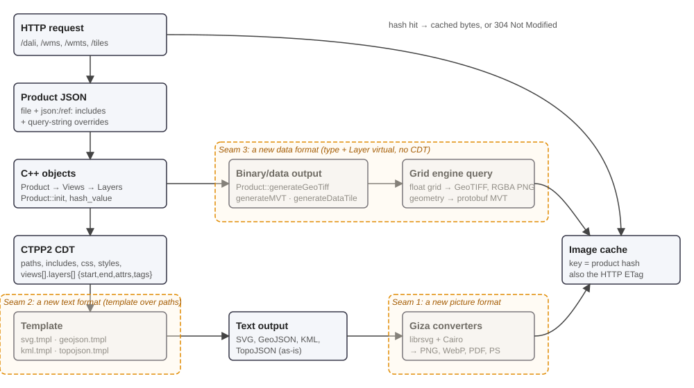

Reading top to bottom on the left: `Plugin::requestHandler` routes by URL path
(`/wms`, `/wmts`, `/tiles`, otherwise Dali) and `Plugin::daliQuery` does the rest. The
product JSON is read and expanded (sections 2 and 3), turned into `Product`, `View` and
`Layer` objects (section 4), and hashed; a hash hit returns cached bytes or a 304 with no
rendering at all. Otherwise the layers fill a CTPP2 data tree (section 5), a template
turns it into text (sections 6 and 10), and Giza converts SVG text into PNG, WebP, PDF
or PostScript when asked (section 9). GeoTIFF, MVT and DataTile requests leave the path
before any data tree exists and query the grid engine directly (section 11).

The three dashed boxes are the places where the plugin has been extended before and
will be extended again; section 14 returns to them.

The WMS, WMTS and OGC API Tiles handlers all end up in the same place: they translate
their own request vocabulary into Dali query-string parameters, load the same kind of
product JSON, and call the same `Product::init` and `Product::generate`. Section 13
covers those differences.

---

## 2. How products are configured in JSON

### 2.1 Directory layout

A product is a JSON file at

```
<root>/customers/<customer>/products/<product>.json
```

where `<root>` comes from the plugin configuration (`root` for Dali, `wms.root` for
WMS/WMTS/Tiles). Reusable fragments live next to it in
`<root>/customers/<customer>/layers/`, and CSS, symbols, markers, patterns, gradients
and filters are resolved by `Plugin::resolveFilePath`: first from the customer's own
directory, then from the root, then from the shared `resources/layers/<kind>/`,
`resources/<kind>/` and `resources/` directories (see `Plugin::searchFilePath` in
`wms/Plugin.cpp`).
The request `customer=test&product=t2m_p` therefore opens
`test/dali/customers/test/products/t2m_p.json` in the test tree.

### 2.2 The three-level structure: product, views, layers

A product is a JSON object. It owns an array of **views**, and each view owns an array
of **layers**. The demo product, abbreviated:

```json
{
    "title": "Demo product",
    "producer": "kap",
    "language": "fi",
    "projection": { "crs": "data", "xsize": 500, "ysize": 500 },
    "defs": {
        "styles": { ".Label": { "font-family": "Roboto", "font-size": 9 } },
        "layers": [ { "tag": "symbol", "attributes": { "id": "rect" },
                      "layers": [ { "tag": "rect", "attributes": { "width": "14", "height": "9" } } ] } ]
    },
    "views": [
        {
            "qid": "v1",
            "attributes": { "id": "view1" },
            "layers": [
                { "qid": "l1", "layer_type": "isoband",
                  "isobands": "json:isobands/temperature.json",
                  "css": "isobands/temperature.css",
                  "parameter": "Temperature",
                  "attributes": { "id": "temperature_isobands" } },
                { "layer_type": "legend", "x": 10, "y": 10, "...": "..." },
                { "tag": "mask", "attributes": { "id": "temperaturelegendmask" }, "layers": [ "..." ] },
                { "tag": "g", "attributes": { "mask": "url(#temperaturelegendmask)" },
                  "layers": [
                      { "qid": "l2", "layer_type": "isoline", "parameter": "Temperature", "...": "..." },
                      { "qid": "l3", "layer_type": "isoline", "parameter": "Pressure", "...": "..." },
                      { "qid": "l4", "layer_type": "map", "map": { "schema": "natural_earth", "table": "admin_0_countries" } },
                      { "layer_type": "time", "timestamp": "validtime", "x": -20, "y": 20 }
                  ] }
            ]
        }
    ]
}
```

Rendered with `type=png`, that JSON produces this 500 by 500 pixel image. Every
element in the picture can be traced to a line in the JSON: the isobands and their
legend, the two isoline sets, the country borders, and the time stamp in the top right
corner.

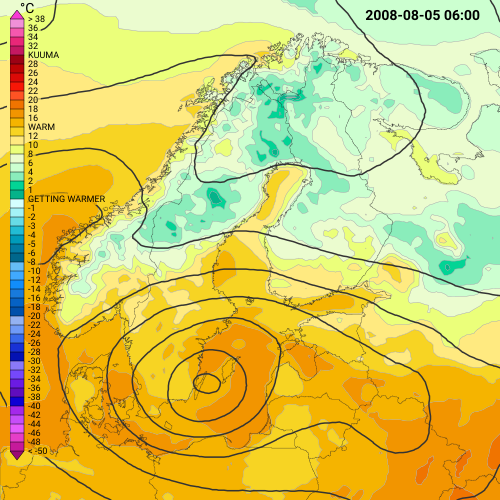

Key ideas visible here:

- **A layer is either a data layer or a tag layer.** A data layer has a `layer_type`
  (`isoband`, `isoline`, `map`, `legend`, `time`, ...). A layer without `layer_type`
  defaults to a *tag layer*, which emits a literal SVG element named by `tag` and can
  nest further layers. That is how `<mask>`, `<g>`, `<symbol>`, `<rect>` and `<text>`
  are written directly into the product. `LayerFactory::create` in `wms/LayerFactory.cpp`
  is the complete list of layer types.
- **Layers nest.** Every layer has an optional `layers` array, so a tag layer can group
  data layers. The `<g mask=...>` above wraps two isoline layers, a map and a time stamp.
- **`defs`** holds SVG resources: `styles` becomes a CSS block, and `layers` are tag
  layers written into `<defs>`, typically `<symbol>` definitions to be reused with
  `<use>`.
- **`attributes`** are SVG attributes copied onto the element the layer emits. The
  plugin validates each name against the `regular_attributes` and
  `presentation_attributes` lists in the configuration; presentation attributes are
  collapsed into a single `style="..."` attribute (see `Attributes::generate` in
  `wms/Attributes.cpp`).
- **`css`** names a stylesheet whose text is pasted into the SVG `<style>` block. The
  isoband classes `Temperature_0_1` and so on are defined there, not in the JSON.
- **`qid`** is a short identifier used for two things: naming generated SVG ids
  (`l1.temperature_0_1`) and addressing the object from the URL (section 3).

### 2.3 Inherited properties

`producer`, `projection`, `time`, `time_offset`, `origintime`, `level`, `tz`,
`interval_start`, `interval_end`, `language` and a few more are **properties**
(`wms/Properties.h`). They may be written at product, view or layer level, and each
level inherits the values of the level above unless it overrides them. That is why the
demo product sets `producer` once at the top and none of the layers repeat it. The
two-view product `t2m_twice.json` uses this to advance only the second view by 24 hours
through `v2.time_offset=1440` in the URL.

### 2.4 Composition: `json:` and `ref:`

Any string value starting with `json:` is replaced by the parsed contents of a file
under `customers/<customer>/layers/` (or under the root, if the path starts with `/`).
`"isobands": "json:isobands/temperature.json"` pulls in a 50-element array of
`{lolimit, hilimit, attributes}` objects. A `json:` string may also be an element of a
`layers` array, which is how whole layer definitions are shared between products.

A string `ref:a.b[2].c` is replaced by the value at that dotted path inside the same
document. The conventional place for shared fragments is a top-level `refs` object,
which is deleted before the product is initialised. `test/wms/customers/test/products/cities.json`
defines its projection once in `refs.myprojection` and refers to it.

Both are implemented in the Spine library, `spine/Json.cpp`, as
`JSON::preprocess` (includes) and `JSON::dereference` (references). The order matters
and is described next.

---

## 3. How the URL modifies the JSON

### 3.1 The five stages

`Plugin::getProductJson` in `wms/Plugin.cpp` turns the file into the final JSON in
five stages. Each stage can be dumped by adding `type=cnf&stage=N` to the request,
which returns the JSON instead of an image.

| Stage | Call | What happens |
|-------|------|--------------|
| 1 | parse | The file is read (through the file cache) and parsed by jsoncpp. |
| 2 | `Spine::JSON::replaceReferences(json, params)` | Query-string parameters whose **value** starts with `json:` or `ref:` are written into the JSON. This lets a URL swap an include: `l1.isobands=json:isobands/precipitation.json`. |
| 3 | `Spine::JSON::preprocess(json, root, layers_root, cache)` | All `json:` includes are expanded, recursively, using the JSON cache. |
| 4 | `Spine::JSON::dereference(json)` | All `ref:` references and `$ref` JSON pointers are resolved. |
| 5 | `Spine::JSON::expand(json, params, "", false)` | Remaining query-string parameters overwrite or add plain values. |

Stage 2 runs before includes so a URL can redirect an include, and stage 5 runs after
so a URL can override a value that an include brought in.

### 3.2 Which parameters are allowed

Not every query-string parameter is written into the JSON. `Plugin::extractValidParameters`
keeps a parameter if either

- its name contains a dot (a `qid`-addressed path, see below), or
- its name is in the `allowed_keys` set near the top of `wms/Plugin.cpp`:
  `animation, attributes, clip, defs, forecastNumber, forecastType, geometryId, height,
  interval_end, interval_start, language, level, levelId, margin, origintime, png,
  producer, projection, source, svg_tmpl, time, time_offset, timestep, title, type,
  tz, views, webp, width, xmargin, ymargin`.

Everything else (`customer`, `product`, `printjson`, `timer`, ...) is consumed by the
plugin itself and never reaches the JSON.

### 3.3 Addressing nested objects with `qid`

`Spine::JSON::expand` first walks the whole document collecting every object that has a
`qid` (`collect_qids`). For a parameter `name=value`, the part of `name` before the
first dot is looked up in that map. If it matches a `qid`, the rest of the name is a
dotted path relative to that object; otherwise the whole name is a path from the root.
Intermediate objects are created on demand.

```
GET /dali?customer=test&product=t2m_p&time=200808050300&l1.parameter=DewPoint
        -> views[0].layers[0].parameter = "DewPoint"     (l1 is that layer's qid)

GET /dali?...&v2.attributes.transform=translate(500,1)+rotate(30)+scale(0.75)
        -> views[1].attributes.transform = "translate(500,1) rotate(30) scale(0.75)"

GET /dali?...&projection.xsize=800
        -> projection.xsize = 800                        (no qid, path from root)
```

The test `t2m_p_display_none` is the simplest visual proof. The request adds
`l3.attributes.display=none`, which sets `display: none` on the pressure isoline layer
whose `qid` is `l3`, so the black pressure contours vanish while everything else stays:

| `product=t2m_p` | `product=t2m_p&l3.attributes.display=none` |
|---|---|
|  | 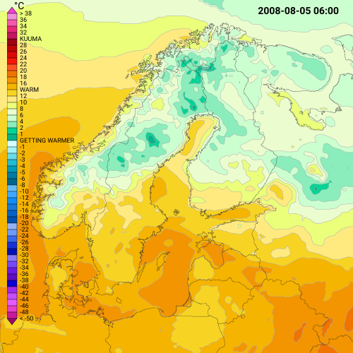 |

`parse_substitutions` tries to parse each value as JSON when it looks like a number,
object, array or quoted string, so `l1.isobands=[{"lolimit":0}]` produces a real array
and `projection.xsize=800` produces an integer. Anything else stays a string. A
parameter name that equals a `qid` exactly is rejected, since that would replace a whole
object with a scalar.

The reference test `test/input/t2m_twice_altered.get` shows the mechanism used for real:

```
GET /dali?customer=test&product=t2m_twice&time=200808050300
    &v2.time_offset=1440
    &v2.attributes.transform=translate(500,1) rotate(30) scale(0.75)
    &v1.attributes.filter=url(#shadow)
    &v2.attributes.filter=url(#shadow)
```

One product file yields a two-panel image, a T+24h second panel, a rotated and scaled
second panel, and drop shadows, with no server-side edits:

| `t2m_twice` with only `v2.time_offset=1440` | the same product with the transform and filter overrides |
|---|---|
| 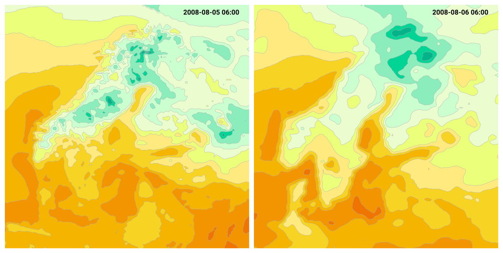 | 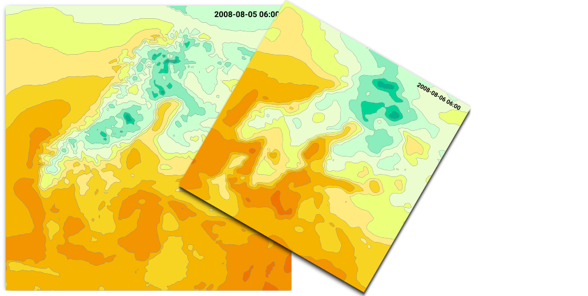 |

### 3.4 How WMS, WMTS and Tiles use the same mechanism

The OGC front ends do not parse product JSON themselves. They rewrite the incoming
request into Dali parameters and let the same expansion run:

- `WMS::GetMap::parseHTTPRequest` (`wms/wms/GetMap.cpp`) validates the WMS keywords and
  then adds `projection.bbox`, `projection.xsize`, `projection.ysize`,
  `projection.crs` (the GDAL definition looked up from the CRS name), `type`
  (de-mimed from `FORMAT`), `customer`, `time` and the optional `interval_*`. So a WMS
  product typically has `"projection": {}` and lets the request fill it.
- `WMTS::Handler::handleGetTile` and `Tiles::Handler::handleGetTile` compute the tile's
  bounding box from the tile matrix and add exactly the same `projection.*` parameters.
- WMS product files may carry a `variants` array (see "WMS layer variants" in
  reference.md). `Handler::wmsPreprocessJSON` selects the variant whose `name` matches
  the requested layer and applies its members through `Spine::JSON::expand`, so a
  variant is just a saved set of `qid.path=value` substitutions.
- WMS `STYLES=name` selects an entry of the product's `styles` array and
  `OGC::useStyle` (`wms/ogc/StyleSelection.cpp`) merges that style's `layers` into the
  matching `qid`s of the product.
- When several WMS layers are requested at once, `merge_layers` in `wms/wms/Handler.cpp`
  appends the views of each product into one, suffixing `qid`s and `id`s with `_1`,
  `_2`, ... to keep them unique. The request
  `LAYERS=test:backgroundmap,test:precipitation_areas,test:cities` therefore renders as
  one product with three views stacked in request order:

  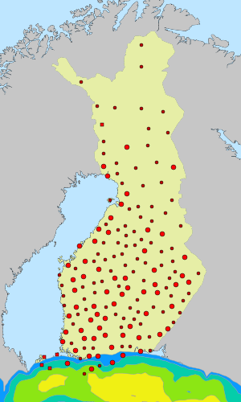

---

## 4. How the JSON becomes C++ objects

### 4.1 The object tree mirrors the JSON tree

```
Product                 wms/Product.h        : Properties
  Defs                  wms/Defs.h           styles, layers (symbols etc.), css files
  Attributes            wms/Attributes.h
  Views                 wms/Views.h
    View                wms/View.h           : Properties
      Attributes
      Layers            wms/Layers.h
        Layer           wms/Layer.h          : Properties  (abstract, ~30 subclasses)
          Attributes
          Layers                              (nested layers)
  Png, Webp, Animation                        output options
```

`Product::init(Json::Value&, State&, Config&)` in `wms/Product.cpp` is the entry point.
It calls `Properties::init` for the inheritable properties, then pulls each member out
of the JSON with the `JsonTools::remove_*` helpers and hands sub-objects to the
corresponding `init` methods. `Views::init` iterates the array creating `View`s;
`View::init` creates its `Layers`; `Layers::init` asks `LayerFactory::create(json)` for
a concrete `Layer` based on `layer_type` (default `"tag"`), then calls the layer's own
`init`, which calls `Layer::init` for the common fields and reads the type-specific
fields itself (`IsobandLayer::init` reads `isobands`, `parameter`, `smoother`, and so on).

### 4.2 Consume-as-you-read: leftover JSON is a configuration error

`JsonTools::remove` is `Json::Value::removeMember` returning the removed value. Every
`init` therefore *consumes* the keys it understands. Whatever is left in the JSON
afterwards is by definition unknown to the code. `Layers::init` prints
`Remaining JSON for layer ...` and `Plugin::daliQuery` prints
`Remaining Dali json for product ...` to stdout when that happens. If you add a new
setting to a layer and forget to `remove` it, you will see it in the log. If a product
author misspells `isobands` as `isoband`, the same log line points at it.

### 4.3 What `init` does and does not do

`init` parses and validates. It does not fetch data. A `Layer` after `init` knows its
parameter, producer, projection settings, isoband limits and attributes, but it has not
touched the querydata, grid or GIS engines. Data access happens in `generate`, so a
product can be initialised cheaply to compute its hash before deciding whether to render
at all.

### 4.4 The hash is the cache key

`Product::hash_value(State)` combines the hashes of everything that can influence the
output: template name, type, size, title, defs, attributes, views, PNG and WebP options.
`Layer::hash_value` adds the layer's own settings, its CSS text (via `hash_css`, which
reads the file), its attributes and nested layers, and `Properties::hash_value` adds the
data-dependent part, including the hash of the model data the layer would read
(`Layer::getModelHashValue`). Concrete layers add their own fields
(`IsobandLayer::hash_value` adds the isoband list, smoother settings and so on).

The result is used as the in-memory image cache key, as the HTTP `ETag`, and to answer
`If-None-Match` with 304 before any rendering. A layer that cannot compute a stable hash
returns `Fmi::bad_hash`, which `Fmi::hash_combine` propagates upwards and which disables
caching for that product. When you add a setting to a layer, add it to `hash_value` as
well, otherwise a changed setting may serve a stale cached image.

---

## 5. How CTPP2 CDT stores the calculated values

### 5.1 What a CDT is

CTPP2 is the template engine. Its data model is the **CDT** (`CTPP::CDT`), a dynamically
typed value that can be a string, number, array (`ARRAY_VAL`) or hash (`HASH_VAL`), much
like a JSON value. `Product::generate(CTPP::CDT& theGlobals, State&)` receives one empty
hash and the whole rendering step consists of layers *filling that hash*. Nothing is
written to the output until the template runs.

### 5.2 The shape of the globals hash

`Product::generate` in `wms/Product.cpp` creates these top-level members:

| Key | Type | Filled by | Rendered where |
|-----|------|-----------|----------------|
| `styles` | hash of hashes | `Styles::generate` from `defs.styles` | `<style>` block as CSS rules |
| `css` | hash: name to text | any layer with a `css` setting, `theGlobals["css"][name] = theState.getStyle(css)` | `<style>` block, pasted verbatim |
| `includes` | hash: iri to SVG text | `State::addAttributes` for filters, markers, patterns, gradients; layers for symbols (`theGlobals["includes"][iri] = theState.getSymbol(iri)`) | inside `<defs>` |
| `paths` | hash: iri to `{iri, data, ...}` | isoband, isoline, map, postgis, wkt layers | `<path id=iri d=data/>` inside `<defs>` |
| `layers` | array | `Defs::generate` (the `defs.layers` tag layers) | inside `<defs>` |
| `views` | array of view hashes | `Views::generate` | the body |
| `start`, `end`, `attributes`, `width`, `height`, `title` | scalars | `Product::generate` | root `<g>` and `<svg>` attributes |

Every view hash has `start` (`"<g"`), `end` (`"</g>"`), `attributes`, and a `layers`
array. Every entry of a `layers` array, whether in defs or in a view, is a **layer CDT**
with this vocabulary:

| Key | Meaning |
|-----|---------|
| `start` | opening tag text without `>` such as `"<g"`, `"<text"`, `"<clipPath"`; empty string means "emit no element of my own" |
| `end` | closing text: `"</g>"`, `"/>"`, `"</text>"` |
| `attributes` | hash of attribute name to value, written as `name="value"` |
| `cdata` | raw text placed inside the element, used for `<text>` content and for pre-built SVG fragments |
| `tags` | array of child elements, each again `{start, end, attributes}` |

This small vocabulary is enough because the template does not know layer types. An
isoband layer and a time layer produce the same kind of CDT; they only differ in which
fields they fill.

### 5.3 A worked example: the isoband layer

`IsobandLayer::generate_qEngine` in `wms/IsobandLayer.cpp` (the grid-engine variant is
structurally identical) does the following after contouring:

```cpp
CTPP::CDT group_cdt(CTPP::CDT::HASH_VAL);
group_cdt["start"] = "<g";
group_cdt["end"] = "</g>";
theState.addAttributes(theGlobals, group_cdt, attributes);   // id="temperature_isobands"

for each isoband geometry:
    std::string iri = qid + "." + isoband.getQid(theState);   // "l1.temperature_0_1"
    theState.addId(iri);                                       // must be unique in the document

    CTPP::CDT isoband_cdt(CTPP::CDT::HASH_VAL);
    isoband_cdt["iri"]       = iri;
    isoband_cdt["time"]      = Fmi::to_iso_extended_string(valid_time);
    isoband_cdt["parameter"] = paraminfo.parameter;
    isoband_cdt["data"]      = Geometry::toString(*geom, theState.getType(), box, crs, precision, ...);
    isoband_cdt["type"]      = Geometry::name(*geom, theState.getType());
    isoband_cdt["layertype"] = "isoband";
    isoband_cdt["lolimit"]   = *isoband.lolimit;   // or "null"
    isoband_cdt["hilimit"]   = *isoband.hilimit;
    theState.addPresentationAttributes(isoband_cdt, css, attributes, isoband.attributes);
    theGlobals["paths"][iri] = isoband_cdt;                    // geometry goes to <defs>

    CTPP::CDT tag_cdt(CTPP::CDT::HASH_VAL);
    tag_cdt["start"] = "<use";
    tag_cdt["end"] = "/>";
    theState.addAttributes(theGlobals, tag_cdt, isoband.attributes);  // class="Temperature_0_1"
    tag_cdt["attributes"]["xlink:href"] = "#" + iri;
    group_cdt["tags"].PushBack(tag_cdt);                       // reference goes to the body

theLayersCdt.PushBack(group_cdt);
```

Two things deserve attention. First, the geometry is stored **once** under `paths` and
referenced from the body with `<use>`. The body stays small and readable, and the same
path can be reused, for example by a legend mask or a clip path. Second, the same CDT
carries fields (`type`, `lolimit`, `hilimit`, `parameter`, `time`) that the SVG
template ignores but the GeoJSON and KML templates use. The layer computes everything
once; the template decides what to show.

### 5.4 Helpers that keep the CDT consistent

- `State::addAttributes(globals, local, attributes)` writes the attribute hash and, as a
  side effect, pulls referenced resources into `globals["includes"]`. If an attribute is
  `"marker-end": "url(#spearhead?fill=#606060)"`, the marker file is loaded, `fill`
  is substituted into it, and it is added to includes under the id `spearhead`, once.
- `State::addId` and `State::requireId` enforce unique SVG ids across the document.
  `State::generateUniqueId` produces fresh ones for clip paths.
- `Layer::addClipRect` pushes a `<clipPath>` layer CDT with a `<rect>` in `cdata` and
  adds `clip-path="url(#id)"` to the layer's attributes when `clip` is true.
- Text-producing layers (`TimeLayer`, `NumberLayer`, `IsolabelLayer`, ...) create a
  `{start:"<text", end:"</text>", attributes, cdata}` CDT.
- `RasterLayer` and `SatelliteLayer` build an `<image href="data:image/png;base64,...">`
  string and store it as `cdata` or as an include, embedding a raster inside the vector
  document.

### 5.5 Debugging the CDT

Add `printhash=1` to a Dali request and `daliQuery` prints `hash.RecursiveDump()` to
stdout. This is the single most useful tool when a template does not produce what you
expect: it shows exactly what the layers handed over.

---

## 6. How CTPP2 templates turn the CDT into SVG

### 6.1 Templates, bytecode and selection

Templates live in `tmpl/*.tmpl`. The Makefile compiles each into CTPP2 bytecode with
`ctpp2c foo.tmpl foo.c2t`, and the installed `.c2t` files are loaded by
`Plugin::getTemplate` through a template cache. Selection order (`Config::defaultTemplate`):

1. `svg_tmpl` in the query string
2. `svg_tmpl` in the product JSON
3. the `templates.<type>` entry in the configuration, for example `templates.geojson = "geojson"`
4. `templates.default`
5. the literal `"svg"`

`test/cnf/wms.conf` maps `geojson`, `topojson` and `kml` to their own templates and
everything else to `svg`. PNG, WebP, PDF and PS requests therefore all run `svg.tmpl`;
the difference is applied afterwards (section 9).

### 6.2 The CTPP2 syntax used in this plugin

```
<TMPL_var name>                   insert a value
<TMPL_if defined(name)> ... </TMPL_if>
<TMPL_if (size(x)>0)> ... <TMPL_else> ... </TMPL_if>
<TMPL_foreach list as item> ... </TMPL_foreach>
   item.__key__  item.__value__   when iterating a hash
   item.__first__                 true on the first iteration
<-TMPL_...>                        the leading "-" swallows the preceding newline
```

Inside a `foreach`, unqualified names resolve against the current item first, which is
why the template can write `<TMPL_foreach layers as layer>` inside a `view` loop and get
`view.layers`.

### 6.3 `svg.tmpl`, annotated

```
<svg width="<TMPL_var width>" height="<TMPL_var height>" xmlns=... xmlns:xlink=...>
<title><TMPL_var title></title>
<defs>
<style type="text/css"><![CDATA[
  <TMPL_foreach styles as style> .Label { font-family:Roboto; ... }   ← defs.styles
  <TMPL_foreach css as inc><TMPL_var inc></TMPL_foreach>               ← css files, verbatim
]]></style>
<TMPL_foreach includes as inc><TMPL_var inc></TMPL_foreach>            ← symbols, filters, markers
<TMPL_foreach paths as path>
  <path id="<TMPL_var path.iri>" d="<TMPL_var path.data>"/>           ← all geometry, once
</TMPL_foreach>
<TMPL_foreach layers as layer>  ...layer block...  </TMPL_foreach>    ← defs.layers (tag layers)
</defs>

<TMPL_var start> attributes... >                                       ← root <g>
 <TMPL_foreach views as view>
 <TMPL_var view.start> view.attributes... >                            ← <g id="view1">
  <TMPL_foreach layers as layer>  ...layer block...  </TMPL_foreach>
 <TMPL_var view.end>
 </TMPL_foreach>
<TMPL_var end>
</svg>
```

The **layer block**, used identically in defs and in views, is:

```
<-TMPL_if (size(layer.start)>0)>
<TMPL_var layer.start><TMPL_foreach layer.attributes as attribute> <TMPL_var attribute.__key__>="<TMPL_var attribute.__value__>"</TMPL_foreach>>
<-/TMPL_if>
<-TMPL_if defined(layer.cdata)><TMPL_var layer.cdata></TMPL_if>
<-TMPL_foreach layer.tags as tag>
 <TMPL_var tag.start><TMPL_foreach tag.attributes as attribute> <TMPL_var attribute.__key__>="<TMPL_var attribute.__value__>"</TMPL_foreach><TMPL_var tag.end>
<-/TMPL_foreach>
<TMPL_var layer.end>
```

Read it against the vocabulary in section 5.2: if `start` is non-empty, open the
element and write its attributes; write `cdata` if present; write each child `tag`;
write `end`. A layer with an empty `start` and `end` and one `tag` produces a single
bare element, which is how a simple `{ "tag": "rect" }` layer avoids an enclosing `<g>`.

Note that the template never mentions isobands, maps or legends. All layer semantics
were resolved into `start`/`end`/`attributes`/`tags`/`cdata` in C++. Adding a layer
type never requires touching the SVG template.

---

## 7. Template structure and the SVG it produces, side by side

Run the demo request and compare with `test/output/t2m_p.get`. The correspondence is
line by line. Keep the rendered picture from section 2 in view while reading; the
legend in its top left corner is the part we will zoom into at the end.

**Header.** `width`/`height` come from `projection.xsize/ysize` because the product
sets no explicit size; `title` is the translated product title.

```xml
<svg width="500" height="500" xmlns="http://www.w3.org/2000/svg" xmlns:xlink="http://www.w3.org/1999/xlink">
<title>Demo product</title>
```

**Style block.** The first line is `defs.styles` rendered by the `styles` loop, the
following lines are the three CSS files pasted from `css`:

```css
 .Label { font-family:Roboto; font-size:9; } .Units { font-family:Roboto; font-size:14; }
.Temperature_inf_50	{ stroke:none; fill: rgb(154,8,117) }
...
.Pressure	{ fill:none; stroke: #333; stroke-width: 1.5px }
.Temperature	{ fill:none; stroke: #999; stroke-width: 0.4px }
```

**Includes.** The legend mask references `url(#alphadilation)`, so
`State::addAttributes` loaded the filter file into `includes`:

```xml
<filter id="alphadilation">
 <feMorphology in="SourceAlpha" operator="dilate" radius="3"/>
 <feComposite in="SourceAlpha"/>
</filter>
```

**Paths.** One `<path>` per isoband, isoline and map geometry, ids built from the layer
`qid` and the isoband `qid`:

```xml
<path id="l1.temperature_0_1" d="M445.6 268.6 447.6 270.6 ..."/>
<path id="l2.temperature_p2" d="..."/>
<path id="l3.pressure_1000" d="..."/>
<path id="l4" d="M245.6 299.7 ..."/>          <!-- the map layer has no sub-ids -->
```

**Defs layers.** The three `defs.layers` tag layers:

```xml
<symbol id="rect">
 <rect height="9" width="14"/>
</symbol>
<symbol id="uptriangle"> ... </symbol>
<symbol id="downtriangle"> ... </symbol>
```

**Body.** Root `<g>`, view `<g id="view1">`, then the layers in product order:

```xml
<g>
 <g id="view1">
  <g id="temperature_isobands">                                  <!-- IsobandLayer group -->
   <use class="Temperature_18_20" xlink:href="#l1.temperature_18_20"/>
   ...
  </g>
  <g class="Label" id="temperaturelegend">                       <!-- LegendLayer -->
   <use class="Temperature_38_inf" style="stroke:black; stroke-width:0.5" x="10" xlink:href="#uptriangle" y="10"/>
  <text x="28" y="22">&#62; 38</text>
   ...
  <text x="28" y="58">KUUMA</text>                               <!-- language "fi" picked the Finnish label -->
   ...
  </g>
  <mask id="temperaturelegendmask">                              <!-- tag layer with children -->
   <rect height="100%" style="fill:white" width="100%"/>
   <use style="filter:url(#alphadilation)" xlink:href="#temperaturelegend"/>
  </mask>
  <g style="mask:url(#temperaturelegendmask)">                   <!-- tag layer <g> wrapping data layers -->
  <g class="Temperature" id="temperature_isolines">
   <use xlink:href="#l2.temperature_0"/>
   ...
  </g>
  <g class="Pressure" id="pressure_isolines"> ... </g>
   <use id="europe_country_lines" style="fill:none; stroke:#222; stroke-width:0.3px" xlink:href="#l4"/>
  <text font-family="Roboto" font-size="14" font-weight="bold" style="text-anchor:end" x="480" y="20">2008-08-05 06:00</text>
  </g>
 </g>
</g>
</svg>
```

Things to notice:

- `fill`, `stroke`, `filter`, `mask` and `text-anchor` ended up inside `style="..."`,
  while `id`, `class`, `x`, `y`, `width` and `font-*` stayed as attributes. That is the
  regular versus presentation attribute split.
- The time layer asked for `x: -20`; negative coordinates are measured from the right
  or bottom edge, hence `x="480"` on a 500 px view. It also asked for
  `Europe/Helsinki`, so 03:00 UTC became 06:00.
- The isolines are visually cut out around the legend by the mask, which is built from
  the legend's own geometry via `<use xlink:href="#temperaturelegend">` plus a dilation
  filter. No pixel operation was needed on the server. The crop below shows the legend
  region rendered from the same SVG with the `mask` attribute removed (left) and as
  produced (right): on the right the isolines stop short of the numbers, because the
  dilated legend shapes were subtracted from the isoline group's paint.

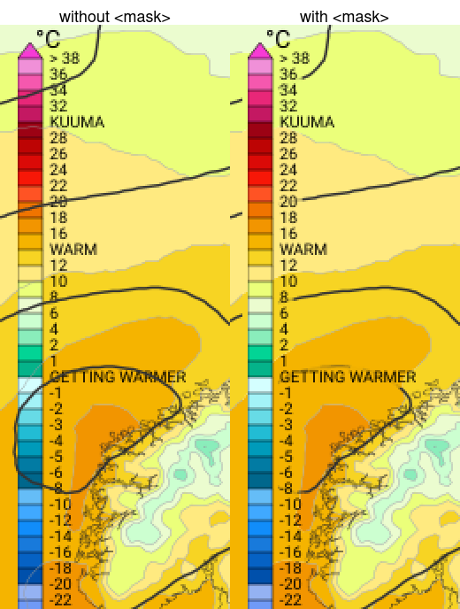

Compile this into a PNG with `type=png` and the picture shown in section 2 is what you
get. The test suite keeps it as `docs/images/dali/t2m_p.png`.

---

## 8. What a retained rendering model buys us

SVG, PDF and PostScript are **retained-mode, declarative scene descriptions**: the
document lists objects with geometry and style, and a renderer decides how to paint
them. The alternative, used by many map servers and by the older FMI tools such as
`qdcontour`, is **immediate-mode drawing**: code calls `fill_polygon(pixels, color)`
on a bitmap in a fixed order, and the pixels are the only result.

Choosing a retained model has concrete consequences for this plugin.

**Resolution independence and multiple outputs for free.** The same CDT and template
produce `svg`, and the same SVG string is rasterised to `png` and `webp` or converted
to `pdf` and `ps`. A print product and a web tile differ only in the last step.

**Styling is separated from geometry.** Colors, widths, fonts and dash patterns live in
CSS classes and attributes. The isoband layer never knows the colour of
`Temperature_0_1`; the stylesheet does. Changing a palette changes one CSS file and
does not require re-contouring anything, and the hash includes the CSS text so caches
stay correct.

**Composition primitives come from the format.** `<defs>` and `<use>` give reuse
without duplication (one path, many references). `<g transform=...>` gives multi-panel
layouts and rotations. `<mask>`, `<clipPath>` and `<filter>` give effects that would
otherwise need per-pixel code: the legend cut-out above, drop shadows, dilation halos
around labels, patterned fills. `<symbol>` and `<marker>` give parametric icons. The
plugin exposes these primitives directly to product authors through tag layers and
attributes rather than reimplementing them.

Two test products show these primitives doing real work. `clip` wraps the map in a
circular `<clipPath>` and adds a shadow filter; `t2m_p_shadow` applies a filter to the
isoline group so the contours appear embossed over the isobands. Both are a handful of
attributes in JSON.

| `clip` | `t2m_p_shadow` |
|---|---|
| 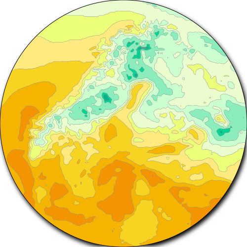 | 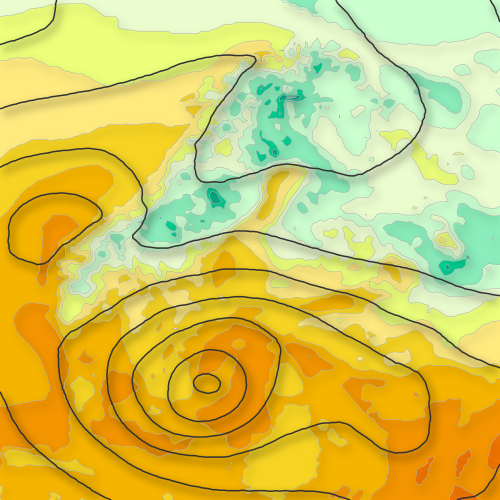 |

**Order is explicit and late-bound.** In immediate mode, draw order is the code path.
Here, the order of layers in the JSON is the paint order, and a URL parameter can wrap
or transform a group after the geometry has been computed.

**Text stays text.** Labels remain `<text>` elements until rasterisation, so they can be
styled with CSS, transformed with the view, and, in SVG output, selected or searched by
the client. PDF output keeps text as text as well.

**Debuggability.** An SVG is readable. When a product is wrong you can open the SVG,
find the element by `id`, and see its attributes and the path it references. The
`printhash` dump and the SVG are two views of the same structure.

**Costs.** The scene must fit in memory as a string before rasterisation, so very dense
products produce large SVGs; the plugin mitigates this with coordinate precision
settings, path simplification, Bezier fitting and `<use>` reuse. Rasterisation
(librsvg + Cairo) is a separate pass and costs CPU. Font rendering depends on the
fonts installed on the server. Finally, some effects, notably heavy filters, are slower
in a general SVG renderer than a hand-written raster routine would be. Section 11
covers the outputs where these costs are not worth paying and the SVG is skipped.

---

## 9. How raster images are made from the SVG

`Plugin::formatResponse` in `wms/Plugin.cpp` receives the template output and the
requested type.

- **Text formats** (`svg`, `xml`, `geojson`, `topojson`, `kml`, `json`, `html`, `cnf`)
  are returned as-is, with an `ETag` header derived from the product hash.
- **Raster and page formats** are converted with the Giza library
  (`smartmet-library-giza`, `giza/Svg.cpp`):

| Type | Call | How |
|------|------|-----|
| `png` | `Giza::Svg::topng(svg, product.png.options)` | librsvg parses the SVG and renders it onto a Cairo ARGB32 image surface; Giza then quantises colours according to the `png` options (palette size, alpha handling) and encodes with libdeflate |
| `webp` | `Giza::Svg::towebp(svg, png.options, webp.options)` | same rendering, encoded with libwebp; `webp.quality` and lossless options apply |
| animated `webp` | `Giza::Svg::towebpanim(frames, durations, loop, ...)` | `injectFrameStyle` inserts a `<style>` rule into the SVG per frame that shows only the elements of that animation bucket; each SVG is rendered separately and the frames are muxed into one animated WebP |
| `pdf` | `Giza::Svg::topdf(svg)` | librsvg renders onto a Cairo PDF surface, so vectors and text stay vectors |
| `ps` | `Giza::Svg::tops(svg)` | Cairo PostScript surface with EPS mode |

The resulting buffer is stored in the plugin's in-memory image cache under the product
hash (`itsImageCache->insert`) and returned with `ETag`. A later request with the same
hash is served from the cache in `daliQuery` before any rendering, and a client sending
`If-None-Match` receives 304 with no body.

The quantisation step matters for tile serving. The two PNGs below are the demo product
with default options and with `png.truecolor=1`. They look the same, but the palette
version is a fraction of the size, and both are a fraction of the SVG they came from.

| default `type=png` (palette, 138 colours) | `type=png&png.truecolor=1` (RGBA) |
|---|---|
|  | 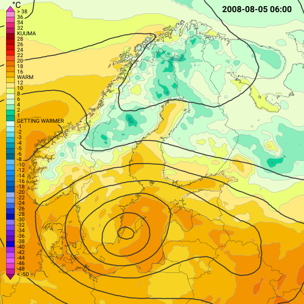 |

| Output | Bytes |
|---|---|
| SVG (`test/output/t2m_p.get`) | 616080 |
| PNG, palette | 54038 |
| PNG, truecolor | 191136 |

The `png` and `webp` blocks of the product JSON, and the `png=` and `webp=` query
parameters, control this stage only. They are part of the product hash so different
quantisation settings produce different cache entries.

Fonts: the server renders text with whatever fonts fontconfig can find. The test suite
compares rasters with a tolerance (see `test/CompareImages.pl`) precisely because font
hinting and anti-aliasing differ between machines.

---

## 10. Non-SVG intermediate formats: GeoJSON, KML, TopoJSON

The plugin does not have separate GeoJSON or KML code paths in the layers. It reuses the
same CDT and swaps two things: the geometry serialisation and the template.

**Geometry serialisation.** `Geometry::toString(geom, type, box, crs, precision, ...)`
in `wms/Geometry.cpp` returns

- an SVG path `d` string in pixel coordinates for anything that is not `geojson`,
  `kml` or `topojson`;
- a GeoJSON coordinates array in WGS84 for `geojson`;
- KML `<MultiGeometry>` / `<Polygon>` markup in WGS84 for `kml`;
- TopoJSON arcs for `topojson`, with shared arcs deduplicated through
  `State::arcHashMap` and `State::insertCounter`.

`Geometry::name` likewise returns `MultiPolygon` for GeoJSON and the WKT name
otherwise. The layer stores the result in `paths[iri].data` and `paths[iri].type`
without caring which it got. Bezier smoothing is disabled for the geographic formats
since curve control points would not be valid coordinates.

**Templates.** `tmpl/geojson.tmpl` iterates only `paths` and emits a
`FeatureCollection`:

```
{ "type": "FeatureCollection", "features": [
<-TMPL_foreach paths as path>
<-TMPL_if !path.__first__>,</TMPL_if>
   { "type": "Feature",
     "geometry": { "type": "<TMPL_var path.type>", "coordinates": <TMPL_var path.data> },
     "properties": { "layertype": "<TMPL_var path.layertype>"
        <-TMPL_if defined(path.lolimit)>, "lolimit": <TMPL_var path.lolimit></TMPL_if>
        <-TMPL_if defined(path.hilimit)>, "hilimit": <TMPL_var path.hilimit></TMPL_if>
        <-TMPL_if defined(path.value)>,   "value": <TMPL_var path.value></TMPL_if>
        ... parameter, time, iri ...
        <-TMPL_foreach path.presentation as presentation>,
        "<TMPL_var presentation.__key__>": "<TMPL_var presentation.__value__>"</TMPL_foreach>
     } }
<-/TMPL_foreach>
] }
```

`tmpl/kml.tmpl` does the same with one `<Placemark>` per path and an `<ExtendedData>`
block. `tmpl/topojson.tmpl` additionally iterates `objects` and `arcs`, which only the
isoband and isoline layers fill. The `raw*` variants omit the presentation attributes.

Everything in the SVG template that has no meaning outside a picture (styles, includes,
views, `<use>` tags, text layers) is simply not iterated. The legend, mask and time
stamp of the demo product vanish from the GeoJSON output, while the isobands keep their
limits and their CSS class name:

```json
"properties": { "layertype": "isoband", "lolimit": 0, "hilimit": 1,
                "parameter": "Temperature", "time": "2008-08-05T03:00:00",
                "iri": "l1.temperature_0_1", "class": "Temperature_0_1",
                "fill": "rgb(5,179,138)", "id": "temperature_isobands", "stroke": "none" }
```

The `fill` comes from `State::addPresentationAttributes`, which resolves the CSS class
against the stylesheet so that a GeoJSON client can colour the feature the way the SVG
would have. The image below was drawn from `test/output/t2m_p_geojson.get` by a short
Python script using only the `fill` and `stroke` properties and an equirectangular
plot of the WGS84 coordinates. It is the same field as the PNG in section 2, now curved
because the data's own projection was unprojected to longitude and latitude, and
without legend, mask or time stamp because those never entered `paths`.

| SVG pipeline, `type=png` | GeoJSON output drawn by an independent client |
|---|---|
|  | 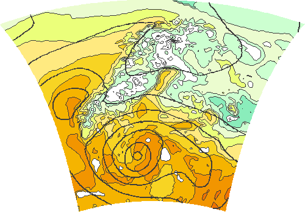 | Coordinate precision is per format in the configuration (`precision.geojson
= 5.0` digits versus `precision.default = 0.3` for pixel paths).

To add a new text-based format you would add a `templates.<type>` entry, write a
template over the same `paths` vocabulary, and, if the geometry encoding differs, add a
branch to `Geometry::toString`. No layer changes are needed.

---

## 11. Pure raster and binary outputs that skip SVG entirely

Three output types never build a CDT: `geotiff`, `mvt` and `datatile`. `daliQuery` (and
`WMTS::Handler::generateTile`, `Tiles::Handler::generateTile`) checks the product type
right after the cache lookup and calls one of

```cpp
product.generateGeoTiff(theState);   // Product.cpp: first layer that returns non-empty bytes
product.generateMVT(theState);       // all layers add features to one MVTTileBuilder
product.generateDataTile(theState);  // first layer that returns non-empty bytes
```

These forward to the `Layer` virtuals `generateGeoTiff`, `addMVTLayer` and
`generateDataTile`, whose base implementations do nothing, so a product mixing a
background map and an isoband layer yields the isoband's data.

**GeoTIFF** (`wms/GridDataGeoTiff.cpp`). `gridDataGeoTiff(layer, parameter,
interpolation, state)` builds a grid-engine query with the layer's producer, parameter,
level, time and projection bounding box, receives a float grid sampled to
`xsize` by `ysize`, and writes a deflate-compressed Float32 GeoTIFF with GDAL. Multi-band
products (wind speed and direction, U and V) use `writeGeoTiffBands`. The client gets
real numbers, not colours, and can do its own analysis.

**Mapbox Vector Tiles** (`wms/MapboxVectorTile.cpp`). `IsobandLayer::addMVTLayer`
performs the same contouring as `generate`, but instead of serialising to a path string
it calls `MVTLayerBuilder::addFeature(geom, {{"lolimit", ...}, {"hilimit", ...}})`.
The builder projects coordinates into the tile's integer extent (4096 by default),
delta- and zigzag-encodes them, interns attribute keys, and `MVTTileBuilder::serialize`
emits the protobuf defined in `wms/vector_tile.proto`. Isolines, numbers and circles
support it too, and a PMTiles-backed layer can return pre-encoded bytes through
`getRawMVTBytes`. The client styles the geometry itself, typically with a Mapbox style
document that the OGC API Tiles handler can also serve (`handleStyle`).

**DataTiles** (`wms/DataTile.cpp`). `gridDataTile` runs the same grid query as GeoTIFF
and then quantises the float grid into the RGBA channels of an ordinary PNG:

- single band: `R,G` = 16-bit value, `A` = 255 valid / 0 missing;
- dual band (wind U and V): `R,G` = band 1, `B,A` = band 2, with 0 reserved for missing.

`min` and `max` per band are written into PNG `tEXt` chunks so the client can decode
`value = (R*256+G)/65535*(max-min)+min` with nothing but an `` and a canvas. A PNG
is the one raster format every browser can decode natively without a library, which is
why this exists alongside GeoTIFF. The demo product `test/wms/customers/grid/products/datatile_temperature.json`
is a plain isoband layer with `"type": "datatile"`; the same product served with
`type=png` gives a coloured picture and with `type=datatile` gives the numbers behind it.

The pictures below make the encoding concrete. The left column is the 64 by 64 pixel
datatile PNG exactly as served, scaled up eight times: to a human it is noise, because
the high byte of the value lands in red and the low byte in green. The right column is
what a client computes from it with the decode formula and the `min`/`max` text chunks:
a temperature field with a colour scale of the client's choosing, and a wind field where
the dual-band tile carried direction in `R,G` and speed in `B,A`, here drawn as speed
colours plus arrows. The transparent corners are grid points outside the model domain,
encoded as all-zero bytes.

| served PNG (`datatile_temperature`) | decoded by the client |
|---|---|
| 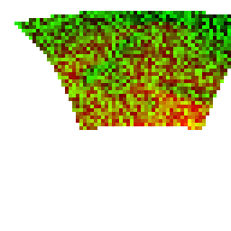 | 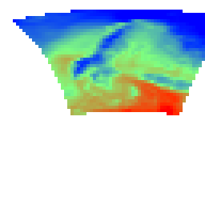 |

| served PNG (`datatile_wind`, two bands) | decoded direction and speed |
|---|---|
| 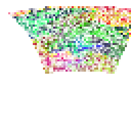 | 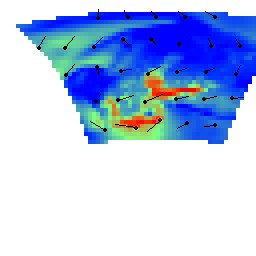 |

**Hybrid: rasters inside the SVG.** `RasterLayer` and `SatelliteLayer` do build a
bitmap in C++ (colour-mapped grid data or satellite imagery), but they then base64-encode
it into an `<image href="data:image/png;base64,...">` element in the CDT. The SVG
pipeline composes it with vector layers, masks and transforms like any other element.
This is the pragmatic middle ground when a field is too dense to contour but the
product still needs vector overlays. The WMS test layer `grid:raster_1` below is such a
product: the colour-mapped temperature is one embedded `<image>`, the coastlines drawn
over it are ordinary vector paths.

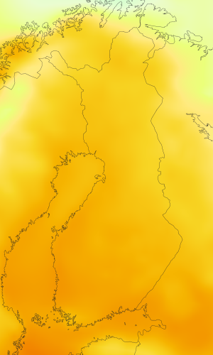

All four binary paths are cached under the same product hash and carry the same
`ETag`, so the HTTP caching story in section 13 applies to them unchanged.

---

## 12. What the SVG model makes possible: worked examples

All examples below are in the test suite and rendered in [examples/dali.md](examples/dali.md).

**Two panels from one product, altered from the URL** (`t2m_twice`). The product places
two 500 px views with `transform: translate(10,10)` and `translate(520,10)` on a
1030 by 520 canvas. The request adds `v2.time_offset=1440` for a T+24h panel, and the
`_altered` variant adds `v2.attributes.transform=translate(500,1) rotate(30) scale(0.75)`
and `filter=url(#shadow)` on both views. Because views are `<g>` elements, rotation,
scaling and a drop shadow are one attribute each. An immediate-mode renderer would need
the rotation to be known before drawing a single pixel. Adding `v1.clip=1&v2.clip=1`
and margins instead (`t2m_twice_margins_clipped`) wraps each view in a `<clipPath>` so
nothing bleeds outside its panel.

| `t2m_twice_altered` | `t2m_twice_margins_clipped` |
|---|---|
|  | 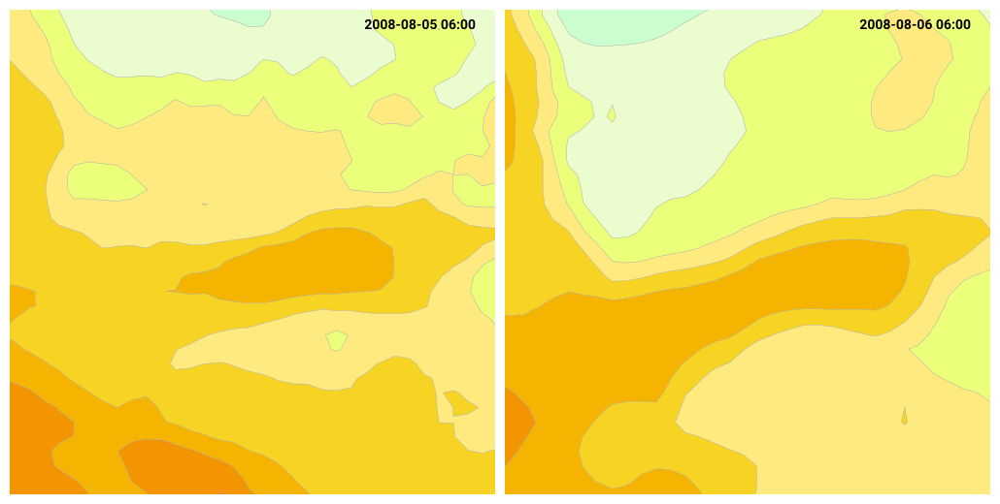 |

**A legend that punches a hole in the isolines** (`t2m_p`). The `<mask>` tag layer
reuses the legend geometry with `<use xlink:href="#temperaturelegend">` and thickens it
with the `alphadilation` filter, then a `<g mask=...>` wraps the isolines and the map.
The legend stays legible over dense contours with zero pixel logic in the plugin. See
the before-and-after crop in section 7.

**Parametric markers and symbols.** `wind_stream_1.json` sets
`"marker-end": "url(#spearhead?fill=#606060)"` on a stream layer. `State::addAttributes`
loads `spearhead` from the customer's markers directory, substitutes `fill`, and adds
it to `includes` once, however many streamlines reference it. Symbol layers do the same
with weather symbols. Symbols must be centred on the origin with `overflow="visible"`
so that `<use x= y=>` placement and tile margins work.

| `grid:wind_stream_1`: streamlines with a parametric `spearhead` marker | `weather`: symbol layer, with a CSS rule injected from the URL (`weather-cssdef`) |
|---|---|
| 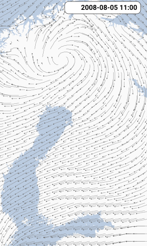 | 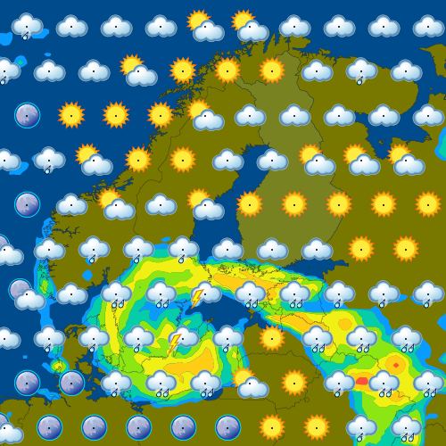 |

**Arbitrary SVG through tag layers.** The `l11` layer in `wind_stream_1.json` is a
rounded `<rect>` with negative `x`, meaning "168 px from the right edge", used as a
backdrop for the time stamp. Product authors can add legends, frames, logos
(`<image>`), north arrows and annotations without a new layer type. `TagLayer` also
converts `longitude`/`latitude` attributes into `x`/`y`, so a tag can be pinned to a
geographic location.

**Clipping to geography with `inside`/`outside`.** Isoband and isoline layers accept a
PostGIS shape (`inside`, `outside`, and `intersections`) and clip geometry with GEOS
before it ever reaches the CDT. Combined with `<clipPath>` for the view rectangle
(`clip: true`, `Layer::addClipRect`), a product can show a parameter only over land, or
only inside Finland, and let the map layer draw the borders on top. Pattern fills come
from the same attribute mechanism: `t2m_pattern` uses an isoband set whose `fill` values
are `url(#warm)` and `url(#cold)`, so `State::addAttributes` pulls those two `<pattern>`
definitions into `<defs>` and the bands are hatched instead of flat.

| `t2m_inside_finland` | `t2m_pattern` |
|---|---|
| 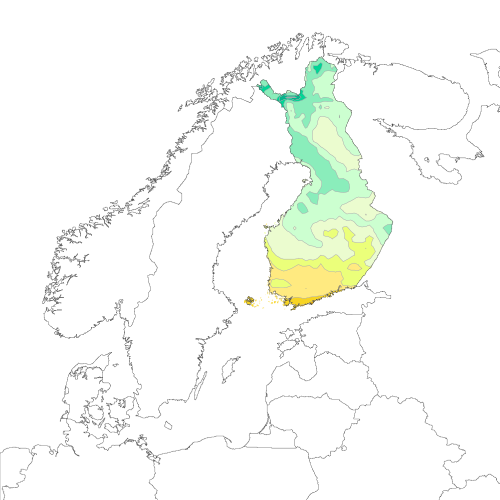 | 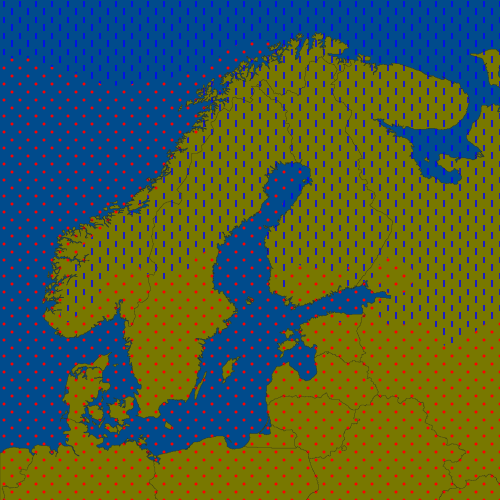 |

**Animation without a video encoder.** The flash symbol products
(`flash_symbols_webp_animation.get`) tag each stroke's `<use>` with a frame class. The
server renders the SVG once, then `injectFrameStyle` inserts a tiny `<style>` block right
after the opening `<svg>` tag per frame (`.flashanim{display:none}` plus
`.flashanim-fN{display:inline}`), and Giza rasterises each variant into an animated
WebP. The geometry work is done once; only rasterisation is repeated. The still
version of the same product, `flash_symbols`, shows all strokes at once:

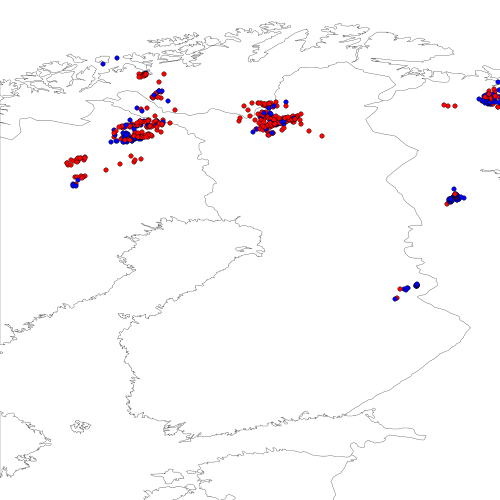

**Layer variants and styles for WMS.** Because the WMS handler only needs a Dali product
plus substitutions, one JSON file can advertise several WMS layers (variants differing
in `producer` and `parameter`) and several WMS styles (each a set of `qid`-addressed
layer overrides). Adding a "same map, different model" layer is a JSON edit, not code.

In all these cases the same eleven-key CDT vocabulary and the same 55-line `svg.tmpl`
are used. The complexity is in the product, where the domain expert can reach it.

---

## 13. WMS, WMTS, OGC API Tiles and DataTiles

### 13.1 What each protocol is

| | WMS 1.3.0 (`/wms`) | WMTS 1.0.0 (`/wmts`) | OGC API Tiles (`/tiles`) |
|---|---|---|---|
| Request | Any `BBOX`, `WIDTH`, `HEIGHT`, `CRS` in a KVP query | A tile from a fixed **TileMatrixSet**: `{layer}/{style}/{dims}/{TMS}/{z}/{row}/{col}.{ext}` | REST: `/tiles/collections/{id}/tiles/{TMS}/{z}/{row}/{col}?f=...&datetime=...` |
| Discovery | `GetCapabilities` XML | `GetCapabilities` XML with `<ResourceURL>` templates | JSON landing page, `/conformance`, `/collections`, `/tileMatrixSets`, per-collection tileset metadata and styles |
| Time and level | `TIME`, `ELEVATION`, `DIM_*` parameters | Extra path segments in capabilities order (`.../Time/Reference_time/Elevation/...`) | Query parameters `datetime`, `elevation`, `reference_time` |
| Formats | MIME type in `FORMAT` | file extension | `f=` parameter or `Accept` header negotiation |
| Handler | `wms/wms/Handler.cpp`, `GetMap.cpp` | `wms/wmts/Handler.cpp`, `TileMatrix.cpp` | `wms/tiles/Handler.cpp` |

The two tile requests below ask for the same 1024 by 1024 pixel tile of the isoband
layer `test:t2m` in the `EPSG:4326` tile matrix set at zoom 5, row 4, column 36, once
through WMTS and once through OGC API Tiles. The pictures are identical, because after
URL parsing the requests are identical.

```
GET /wmts/1.0.0/test:t2m/temperature_one_degrees/EPSG:4326/5/4/36.png?TIME=20080805T030000
GET /tiles/collections/test:t2m/tiles/EPSG:4326/5/4/36?f=png&TIME=20080805T030000
```


In this plugin all three converge on the same `projection.bbox/xsize/ysize/crs`
parameters, the same product tree under `wms.root`, and the same `Product` code. WMTS
and Tiles even share the tile matrix code: `WMTS::Config` builds one TileMatrixSet per
enabled `EPSG:` entry in `wms.supported_references`, with 1024 px tiles by default, and
`Tiles::Handler::handleGetTile` calls `WMTS::computeTileBBox`.

### 13.2 Why WMTS caches better than WMS

A WMS GetMap request is a free-form rectangle. Every client viewport, every pan by a
pixel, every window size, produces a different `BBOX`/`WIDTH`/`HEIGHT` and therefore a
different image and a different URL. The server-side image cache keyed by product hash
helps only when two clients ask for exactly the same thing, and an HTTP cache in front
of the server (a CDN, a browser, a frontend) sees a new URL almost every time.

WMTS removes the free variable. The TileMatrixSet fixes the CRS, the zoom levels, the
tile origin and the tile size. A client at a given zoom over a given area requests the
same finite set of tile URLs as every other client, and those URLs are stable across
sessions and across users. Consequences:

- **Every layer of the HTTP stack can cache.** Browsers, proxies and CDNs cache by URL.
  With WMS they cannot, because they have no way of knowing that two different
  bounding boxes overlap or that a slightly different width is "close enough".
  Mapping frameworks (Leaflet, OpenLayers, MapLibre) implement no caching for WMS at
  all beyond what the browser does per URL; for tiles, the browser cache and the
  framework's tile cache work out of the box.
- **The server cache hits.** The plugin's product hash covers the projection box, so
  identical tile requests hit `itsImageCache` and return in microseconds. With
  free-form WMS the same product may be computed thousands of times for
  near-identical views.
- **Conditional requests work.** Both handlers set `ETag` from the product hash and
  honour `If-None-Match`, but stable URLs are what makes a client actually send
  `If-None-Match`.
- **Pre-generation and edge margins become possible.** Since the tile set is finite you
  can warm it. The `wms.margin` setting exists because symbols near tile edges must be
  rendered in both neighbouring tiles; that is only a well-defined problem when tiles
  are on a fixed grid.

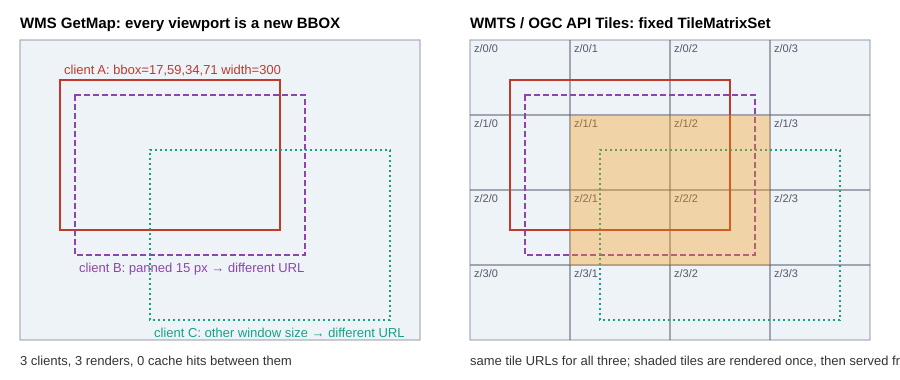

The price is loss of flexibility: an arbitrary projection or rotation needs a full
GetMap, and non-standard products with legends and multiple views make no sense as
tiles. That is why `/wms` and `/dali` remain.

### 13.3 Why OGC API Tiles is replacing both

OGC API Tiles is functionally WMTS with a modern surface, and that surface is the
reason for the migration:

- **REST and JSON instead of KVP and XML.** Discovery is a JSON document a JavaScript
  client can consume directly. Dimensions are ordinary query parameters rather than
  positional path segments whose order must be learned from capabilities.
- **Shared building blocks.** It is part of the OGC API family (Common, Features,
  Maps, Styles, EDR, Coverages), so a collection can expose tiles, features and a
  style document with consistent links. The `/tiles` handler already serves
  Mapbox style documents next to the tiles (`handleStyle`, `handleCollectionStyles`).
- **Format negotiation.** `f=png|webp|svg|tiff|mvt|datatile` or an `Accept` header,
  see `Tiles::Handler::negotiateFormat`. WMTS needed a distinct capabilities entry per
  format.
- **Vector and data tiles are first class.** Tiles was designed with MVT and non-image
  tiles in mind; WMTS was an image service that had them bolted on.
- **The same caching properties as WMTS**, since the TileMatrixSet model is unchanged.

The two are so close that the plugin implements Tiles as a thin router over the WMTS
tile math and the shared rendering path. For a web client the difference is equally
small: Leaflet, OpenLayers and MapLibre all consume a tile URL template, so a client can
read the `/tiles` collection metadata to build that template and fall back to the WMTS
`ResourceURL` only when talking to a server that has no `/tiles` endpoint.

### 13.4 Why there is a separate DataTiles format

Picture tiles solve display. They do not solve **client-side computation**: animated wind
particles, "what is the value under the cursor", client-chosen colour scales, or
blending two forecast steps smoothly in time. For these the client needs the field
values, not a rendering of them.

GeoTIFF carries the values with full precision, but a browser cannot decode a GeoTIFF
without shipping a decoder library and reading the file through `fetch` into typed
arrays. MVT can carry point values but is the wrong shape for a dense grid.

A DataTile is a PNG. Every browser decodes it with `` or `createImageBitmap`, the
decode is hardware-accelerated, it compresses well because neighbouring values are
similar, it moves through every cache and CDN as an image, and the quantised 16-bit
values are more than enough for display purposes. The client reads the `tEXt` chunks
for `min`/`max`, draws the image to a canvas, and reads back RGBA to get a
`Float32Array`. A complete decoder is about a hundred lines of JavaScript with no
dependencies, so it drops into any map framework: a Leaflet `GridLayer` or an
OpenLayers or MapLibre custom layer fetches datatiles instead of picture tiles and
draws whatever it likes on a canvas over the base map. The `test/canvas/` demos and
`WeatherTimeline.js` show what the values enable: hover readouts of the exact value,
client-chosen colour scales, and particle systems whose fields cross-fade between
forecast timesteps while the particles themselves never reset.

DataTiles are served through Dali, WMS (`FORMAT=application/x-datatile+png`), WMTS and
Tiles (`f=datatile`) alike, because they are just another `type` handled before the SVG
pipeline. The dual-band layout for U and V exists so that a single tile request feeds a
vector field; the encoder reserves zero for "missing" so the client can distinguish
nodata from the minimum value.

---

## 14. Looking ahead: 3D and other standards

This is speculation, offered because the architecture makes some directions cheap and
others expensive.

**More OGC API surfaces over the same products.** OGC API Maps is GetMap with the
Tiles-style REST surface and `bbox`/`width`/`height` parameters; it maps onto
`daliQuery` almost one to one. OGC API Styles is already partially present for MVT.

The *data* side of the OGC API family is deliberately not this plugin's job. OGC API
EDR (point, area, corridor and trajectory queries, CoverageJSON output) is implemented
by the EDR plugin (`smartmet-plugin-edr`), and OGC API Coverages (collections,
subsetting, field selection, scaling, CRS) is implemented by the `/coverages`
interface of the Download plugin (`smartmet-plugin-download`). The WMS plugin's
GeoTIFF and DataTile outputs sit
at the boundary: they return numbers, but tiled and quantised for display clients. The
likely evolution is linkage rather than duplication: a Tiles collection advertising the
EDR or Coverages collection that holds the same field in its `links`, so a client can
move from picture to data without guessing producer and parameter names.

**Vector-first delivery.** The trend in web mapping is to move rendering to the client
(MapLibre, deck.gl): the server sends MVT plus a style document and the GPU draws. The
plugin's MVT path and style serving are the beginning of that. The natural next steps
are MVT for more layer types (arrows, symbols as point features with attributes, fronts
as line features with a `type` property) and richer Mapbox style generation from the
existing CSS and isoband definitions, so that the same product JSON yields an SVG for
print and an MVT-plus-style for interactive maps.

**3D.** Weather is inherently 3D and 4D (pressure levels and time), and the relevant
standards are OGC 3D Tiles (Cesium's format, now an OGC community standard) and I3S,
both of which stream glTF geometry in a spatial hierarchy, plus glTF itself for
individual objects. Candidate products: isosurfaces of cloud water or turbulence,
extruded isoband "terrain" of a 2D field, front surfaces, and volumetric rendering fed
by stacked datatiles per level. Architecturally each would be another `type` with a
`Product::generate3DTiles` fanning out to a `Layer::generate3DTiles` virtual, exactly
as MVT and DataTile were added. The contouring library already produces 2D geometry per
level; a marching-cubes step across levels would produce triangle meshes for glTF. The
DataTile approach also extends naturally: a stack of dual-band PNGs per pressure level
is already a volume a WebGL or WebGPU client can sample.

**Time as a first-class dimension.** Animated WebP is a stopgap for clients that can
only show images. Where clients can compute, the DataTile timeline model (fetch two
steps, interpolate) is better and cheaper than server-side video. Standards work on
temporal tile stacks and on OGC API Tiles "datetime" handling is where this is heading,
and the plugin's tile handlers already accept `datetime` and `reference_time`.

**What would be hard.** Anything requiring client-server state (progressive refinement,
streaming updates) does not fit a stateless hash-cached request model. Server-side GPU
rendering would bypass the SVG model entirely and lose its composability. Both are
possible but would be new pipelines rather than new `type`s.

**A practical rule of thumb.** If a new format is a *picture*, add a converter after
`svg.tmpl` (section 9). If it is *text describing geometry*, add a template over the
`paths` CDT (section 10). If it is *data*, add a `type` and a `Layer` virtual before the
CDT is built (section 11). The three seams are deliberate and have held up through
PNG, WebP, PDF, GeoJSON, KML, TopoJSON, GeoTIFF, MVT and DataTiles.

---

## 15. Debugging cheat sheet

| Query parameter | Effect |
|-----------------|--------|
| `type=cnf` (Dali) or `format=cnf` (WMS) | Return the fully expanded product JSON instead of an image |
| `stage=1..4` with the above | Stop after parse, reference substitution, include expansion or dereferencing |
| `printjson=1` | Print the expanded JSON to server stdout |
| `printhash=1` | Print the CTPP2 CDT (`RecursiveDump`) to stdout after `Product::generate` |
| `printparams=1` | Print the grid parameters the product would query |
| `timer=1` | Print CPU and wall time for generate, template processing and format conversion |
| `debug=1` | Return the exception stack trace as HTML on error |
| `optimizesize=0` | Render layers and views that have `display: none` anyway |
| `type=svg` | Read the actual scene before rasterisation; compare ids with `printhash` |

Server log lines to grep for:

- `Remaining JSON for layer` and `Remaining Dali json for product`: a setting was not
  consumed by any `init`, so it is misspelled or unimplemented.
- `Product '...' has the following errors: qid 'x' used N times`: duplicate `qid`s make
  URL overrides ambiguous.
- `Non-unique ID assigned to isoband`: two layers generate the same `iri`; give them
  different `qid`s.

Tests: run a single product with `make test-dali DALI_TESTS="input/t2m_p.get"` from
`test/`, inspect `test/failures/` for the produced output, and accept with
`cp test/failures/t2m_p.get test/output/t2m_p.get` when the change is intended.
